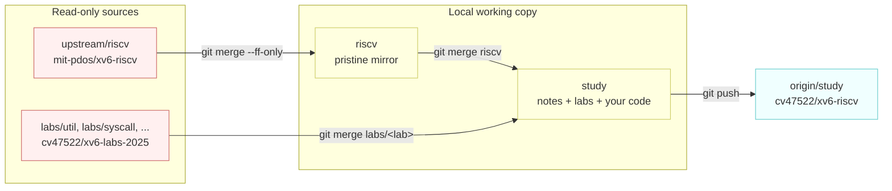

# Repository Workflow

---

[toc]

---

How this repository is wired, and the exact git commands for everyday work: syncing with upstream, pushing, tagging labs, and recovering when something goes wrong.

## The shape of it

There are two GitHub repositories and three remotes, but only **one working copy** — this one.

| Remote       | URL                                         | Role                                                                                                              |
| ------------ | ------------------------------------------- | ----------------------------------------------------------------------------------------------------------------- |
| **origin**   | `git@github.com:cv47522/xv6-riscv.git`      | Your fork. This is where your work is pushed.                                                                     |
| **upstream** | `https://github.com/mit-pdos/xv6-riscv.git` | MIT's public xv6. Read-only — never push here, never open a pull request.                                         |
| **labs**     | `git@github.com:cv47522/xv6-labs-2025.git`  | Your fork of the 6.1810 labs repo. Source of lab starter code and grading scripts. Fetched from, never worked in. |

| Branch    | Role                                                                                                                                                        |
| --------- | ----------------------------------------------------------------------------------------------------------------------------------------------------------- |
| **riscv** | A pristine mirror of `upstream/riscv`. **Never commit here.** It exists so you always have a clean reference to diff against and a safe base to merge from. |
| **study** | Everything you write: these notes, the Makefile comments, the grading harness, and all lab implementations.                                                 |

> [!IMPORTANT]
> All three remotes and both branches share the same root commit — `55e95b16` ("import", 2006-06-12), the original xv6 history. That shared ancestry is what makes merging between them work at all. It is not a coincidence; the labs repo is a fork of xv6-riscv.



## One-time setup

Already done in this checkout, but recorded here in case you clone it fresh on another machine:

```bash
git clone git@github.com:cv47522/xv6-riscv.git
cd xv6-riscv
git remote add upstream https://github.com/mit-pdos/xv6-riscv.git
git remote add labs     git@github.com:cv47522/xv6-labs-2025.git
git fetch upstream
git fetch labs
git config rerere.enabled true
```

> [!TIP]
> `rerere` ("reuse recorded resolution") is not optional here — it is what makes the lab workflow bearable. Every lab branch was cut from the same 2025-08-25 base, so each one you merge re-presents the _same_ conflicts against your ever-growing `study` branch. With `rerere` on, git records how you resolved each hunk the first time and replays it automatically on every later merge.

## Everyday commands

### Sync with upstream xv6

Do this whenever you want MIT's latest fixes. Two steps: fast-forward the mirror, then merge it into your work.

```bash
git fetch upstream
git checkout riscv
git merge --ff-only upstream/riscv      # fails loudly if riscv was ever dirtied
git checkout study
git merge riscv                         # resolve conflicts here, if any
```

`--ff-only` is deliberate. If it ever refuses, it means something was committed to `riscv` by mistake — see [Recovery](#recovery) below.

### Push your work

```bash
git push origin study
git push origin riscv                   # optional, keeps the fork's mirror current
```

The first push of a renamed or new branch needs `-u` to set tracking:

```bash
git push -u origin study
```

> [!WARNING]
> Never `git push upstream`. It is MIT's repository, you have no write access, and the workflow here never requires sending anything back.

### Start a lab

```bash
git fetch labs
git merge labs/util                     # brings starter code + grade-lab-util
echo 'LAB=util' > conf/lab.mk           # usually arrives with the merge already
make clean && make qemu
```

Lab details are in [03-lab-workflow.md](03-lab-workflow.md).

### Tag a finished lab

Tags mark per-lab snapshots without the pain of branch switching. Because all lab work lives on one branch, a tag is how you get back a "this is what the tree looked like when util was done" reference.

```bash
git tag -a lab-util-done -m "util lab complete, 131/131"
git push origin lab-util-done           # tags are NOT pushed by git push alone
```

Useful things to do with them afterwards:

```bash
git diff lab-util-done                          # everything since that lab
git diff lab-util-done lab-syscall-done         # just the syscall lab's changes
git show lab-util-done:user/find.c              # a file as it was then
git tag -l                                      # list all tags
```

To push every tag at once: `git push origin --tags`.

### See what you have changed versus stock xv6

```bash
git diff riscv..study --stat            # summary
git diff riscv..study -- kernel/        # just the kernel
git log riscv..study --oneline          # your commits
```

This is the single most useful command for revision — it shows your work with all of upstream's code filtered out.

## Why merge instead of rebase

You are never sending a pull request upstream, so there is no clean-history requirement to pay for. Rebasing would rewrite your growing `study` history every time upstream moves and force a `--force` push each time. Merging resolves each conflict once, keeps your commit dates, and never needs a force push.

The one place this differs from typical open-source advice is exactly the place it matters: advice to rebase assumes you are preparing commits for someone else to review. Here, nobody reviews them but you.

## Why one branch instead of one per lab

The lab branches are independent siblings, not a chain — `util` is not an ancestor of `syscall`, and all nine share the same merge-base. Keeping a branch per lab would mean carrying your accumulated solutions across nine unrelated branches by hand.

Cumulative work on one branch matches how the labs actually build on each other, and tags give you the per-lab snapshots that branches would have provided.

> [!NOTE]
> One consequence worth expecting: after a later lab changes kernel internals (the lock lab restructures `kalloc` and the buffer cache, cow rewrites page-fault handling), re-running an earlier lab's grader may fail. That is usually a genuine regression signal and worth investigating — but not always, since some labs deliberately change behaviour an earlier grader asserted.

## Recovery

**You committed to `riscv` by accident.** Move the commits to `study` and reset the mirror:

```bash
git checkout study
git cherry-pick <sha>                   # bring the work over
git checkout riscv
git reset --hard upstream/riscv         # discards the stray commit
```

**A merge went badly and you want out.** Before committing, `git merge --abort` restores the pre-merge state exactly. After committing, `git reset --hard HEAD~1` drops the merge commit — safe as long as you have not pushed.

**You want to see a conflict resolution `rerere` applied.** `git rerere diff` shows what it replayed; `git checkout --conflict=merge <file>` restores the conflict markers if you disagree with it.

**You lost a commit.** `git reflog` lists every position HEAD has held, including commits no branch points at any more. Find the sha and `git checkout` or `git cherry-pick` it.

## Network constraints

> [!CAUTION]
> On the Nokia corporate network, `git://` (port 9418) does not work. The proxy accepts the TCP connection and then silently drops the git protocol handshake, so `git clone git://g.csail.mit.edu/xv6-labs-2025` hangs forever rather than failing with an error. `CONNECT` to port 9418 is refused as well, so there is no proxy tunnel workaround.

Practical consequences:

- Use **HTTPS or SSH** remotes only. Both work: HTTPS through the configured proxy (`http.proxy` is already set in your global git config), SSH directly to GitHub.
- MIT publishes the labs **only** over `git://` — there is no official HTTPS endpoint, GitHub mirror, or tarball. This is why the labs live on a GitHub fork instead.
- If you ever need to re-fetch from MIT directly, do it from a network without the proxy (home connection or phone hotspot), then push to your GitHub fork.

## The retired labs clone

`~/personal/xv6-labs-2025` was the working copy used to bootstrap this setup. It is now redundant: its `main` branch was merged into `study`, and all nine lab branches live on the `labs` remote. The local directory can be deleted; the GitHub fork must be kept, since it is the only reachable source of lab starter code.
