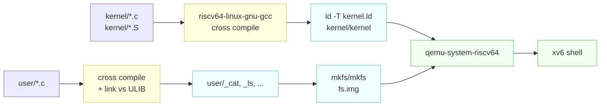

# Building, Booting, and Using xv6

---

[toc]

---

From `make qemu` to a shell prompt, what every line of output means, and how to debug the kernel with gdb. All output below is real, captured from this repository.

## Building and booting

```bash
make qemu
```

That single command compiles the kernel, compiles every user program, builds the filesystem image, and launches QEMU. The [Makefile](../Makefile) is heavily commented if you want the details of any step; the summary is:



## Reading the boot output

```
xv6 kernel is booting

hart 2 starting
hart 1 starting
init: starting sh
$
```

Short, but every line is telling you something:

| Line                        | What just happened                                                                                                                                                                       |
| --------------------------- | ---------------------------------------------------------------------------------------------------------------------------------------------------------------------------------------- |
| **`xv6 kernel is booting`** | Hart 0 reached `main()` in `kernel/main.c` and won the race to be the initialising CPU. Everything before this — `_entry` in `entry.S`, machine-mode setup in `start.c` — runs silently. |
| **`hart 2 starting`**       | The other harts spun waiting for hart 0 to finish initialisation, and are now setting up their own paging and interrupt state.                                                           |
| **`hart 1 starting`**       | Ordering between harts is not deterministic. Seeing 2 before 1 is normal and is your first direct evidence that this is a real multiprocessor.                                           |
| **`init: starting sh`**     | The kernel handed off to user space. `init` is the first user process (`user/init.c`), and it forks the shell.                                                                           |
| **`$`**                     | `user/sh.c` is waiting for input.                                                                                                                                                        |

> [!NOTE]
> There is no bootloader. QEMU is started with `-bios none` and loads `kernel/kernel` directly at `0x80000000`, which is why `kernel/start.c` has to do the machine-mode configuration that firmware would normally handle.

## Using the shell

```
$ ls
.              1 1 1024
..             1 1 1024
README         2 2 2441
findtest.sh    2 3 91
sixfive.txt    2 4 19
cat            2 5 35424
echo           2 6 34336
forktest       2 7 17312
grep           2 8 42784
init           2 9 34800
kill           2 10 34272
ln             2 11 34080
ls             2 12 41552
mkdir          2 13 34328
rm             2 14 34312
sh             2 15 56168
stressfs       2 16 35184
usertests      2 17 196904
grind          2 18 50552
wc             2 19 36368
zombie         2 20 33696
logstress      2 21 36232
forphan        2 22 35080
dorphan        2 23 34520
sync           2 24 33760
memdump        2 25 35664
console        3 26 0
```

The four columns are `name`, `type`, `inode number`, `size in bytes` — see the `printf` in `user/ls.c:49`. The type codes come from `kernel/stat.h`:

| Type  | Meaning                 | Example above   |
| ----- | ----------------------- | --------------- |
| **1** | `T_DIR` — directory     | `.` and `..`    |
| **2** | `T_FILE` — regular file | everything else |
| **3** | `T_DEVICE` — device     | `console`       |

Two things worth noticing. `console` has size 0 because it is a device, not stored data — reads and writes route to `kernel/console.c` instead of the disk. And every one of these files came from `UPROGS` in the Makefile: if a program is not listed there, it never reaches `fs.img`, and the shell reports `exec ... failed` no matter how cleanly it compiled.

`findtest.sh`, `sixfive.txt`, and `memdump` are present because `conf/lab.mk` currently selects `LAB=util`. See [03-lab-workflow.md](03-lab-workflow.md).

## Essential key bindings

| Keys                  | Effect                                                                                                        |
| --------------------- | ------------------------------------------------------------------------------------------------------------- |
| **`Ctrl-a` then `x`** | Quit QEMU. This is the one you need most and the least guessable.                                             |
| **`Ctrl-a` then `c`** | Switch to the QEMU monitor (`info registers`, `info mem`). `Ctrl-a c` again returns to xv6.                   |
| **`Ctrl-p`**          | Print the process table. xv6 has no `ps`; this is the substitute, handled by `procdump()` in `kernel/proc.c`. |
| **`Ctrl-d`**          | End of input — exits the shell.                                                                               |

> [!TIP]
> `Ctrl-a` is a prefix, not a command. Press and release it, then press the second key. If you are inside `tmux` or `screen`, `Ctrl-a` is likely their own prefix and will be swallowed — press it twice, or rebind it.

## Available commands

The full set is what `ls` showed: `cat`, `echo`, `grep`, `kill`, `ln`, `ls`, `mkdir`, `rm`, `sh`, `wc`, plus test programs (`usertests`, `forktest`, `stressfs`, `grind`, `zombie`).

The shell supports pipes, redirection, and background jobs:

```
$ echo hello > greeting
$ cat greeting
$ ls | grep sh
$ wc < README
$ usertests &
```

It does **not** support quoting, globbing, environment variables, `cd` with no argument, or command history. `user/sh.c` is around 500 lines and reading it is a genuinely good use of an hour.

> [!WARNING]
> `make qemu` depends on `newfs.img`, which rotates the existing `fs.img` aside and builds a fresh one. Any file you create inside xv6 is gone on the next `make qemu`. Use `make qemu-fs` to boot the existing image and keep guest files across reboots.

## Debugging with gdb

Two terminals. In the first:

```bash
make qemu-gdb
```

QEMU starts with the CPU halted and a gdb stub listening, printing the port to connect to. In the second terminal, from the repo root:

```bash
gdb-multiarch kernel/kernel
```

The Makefile generates a `.gdbinit` with your personal port already filled in (derived from your uid so multiple users on one machine do not collide), so gdb connects automatically.

> [!NOTE]
> gdb refuses to auto-load `.gdbinit` from a directory it does not trust. If it complains, add this to `~/.gdbinit`:
>
> ```
> add-auto-load-safe-path /home/wahsieh/personal/xv6-riscv/.gdbinit
> ```

Useful starting points:

```gdb
(gdb) b main              # breakpoint on kernel main
(gdb) c                   # continue
(gdb) b syscall           # every system call
(gdb) layout src          # source view
(gdb) info registers      # all RISC-V registers
(gdb) p/x $satp           # the page table base register
(gdb) bt                  # backtrace (works thanks to -fno-omit-frame-pointer)
```

For per-lab debugging, `make CPUS=1 qemu-gdb` makes scheduling deterministic and single-steps far more predictably.

## Running the test suite

Inside xv6:

```
$ usertests
```

This is upstream's own regression suite and takes a few minutes. From the host, this repository also carries `test-xv6.py`, used by its CI workflow.

For grading a lab specifically, see [03-lab-workflow.md](03-lab-workflow.md).

## When things go wrong

| Symptom                                               | Cause and fix                                                                                                                        |
| ----------------------------------------------------- | ------------------------------------------------------------------------------------------------------------------------------------ |
| **`ERROR: Need qemu version >= 7.2`**                 | QEMU too old. Ubuntu 24.04 or newer, or build QEMU from source.                                                                      |
| **`Couldn't find a riscv64 version of GCC/binutils`** | The cross toolchain is not on `PATH`. See [01-environment-setup.md](01-environment-setup.md).                                        |
| **`exec ... failed` for a program you just wrote**    | It is not in `UPROGS` in the Makefile, so it never made it into `fs.img`.                                                            |
| **Build succeeds but changes have no effect**         | A stale object tree, most often after switching `conf/lab.mk`. Run `make clean`.                                                     |
| **Terminal is wrecked after a crash**                 | QEMU left the terminal in raw mode. Run `reset` — it will work even though you cannot see what you are typing.                       |
| **`make clean` fails**                                | Another xv6 instance is still running and holding files. Find it with `ps` and kill it.                                              |
| **Hangs forever with no output**                      | Usually a kernel panic before the console is up, or an infinite loop in early boot. Attach with `make qemu-gdb` and break on `main`. |
