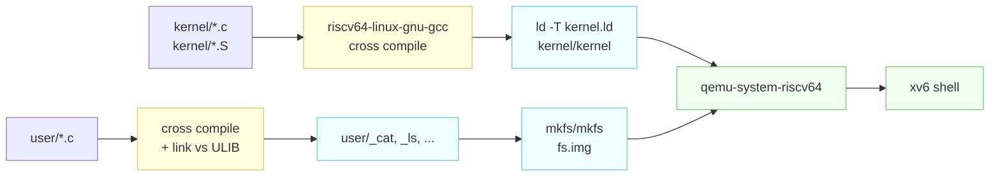

# Building, Booting, and Using xv6

---

[toc]

---

From `make qemu` to a shell prompt, what every line of output means, and how to debug the kernel — gdb, disassembly, backtraces, and the QEMU monitor. All output below is real, captured from this repository.

## Building and booting

```bash
make qemu
```

That single command compiles the kernel, compiles every user program, builds the filesystem image, and launches QEMU. The [Makefile](../Makefile) is heavily commented if you want the details of any step; the summary is:



## Reading the boot output

```
xv6 kernel is booting

hart 2 starting
hart 1 starting
init: starting sh
$
```

Short, but every line is telling you something:

| Line                        | What just happened                                                                                                                                                                       |
| --------------------------- | ---------------------------------------------------------------------------------------------------------------------------------------------------------------------------------------- |
| **`xv6 kernel is booting`** | Hart 0 reached `main()` in `kernel/main.c` and won the race to be the initialising CPU. Everything before this — `_entry` in `entry.S`, machine-mode setup in `start.c` — runs silently. |
| **`hart 2 starting`**       | The other harts spun waiting for hart 0 to finish initialisation, and are now setting up their own paging and interrupt state.                                                           |
| **`hart 1 starting`**       | Ordering between harts is not deterministic. Seeing 2 before 1 is normal and is your first direct evidence that this is a real multiprocessor.                                           |
| **`init: starting sh`**     | The kernel handed off to user space. `init` is the first user process (`user/init.c`), and it forks the shell.                                                                           |
| **`$`**                     | `user/sh.c` is waiting for input.                                                                                                                                                        |

> [!NOTE]
> There is no bootloader. QEMU is started with `-bios none` and loads `kernel/kernel` directly at `0x80000000`, which is why `kernel/start.c` has to do the machine-mode configuration that firmware would normally handle.

## Using the shell

```
$ ls
.              1 1 1024
..             1 1 1024
README         2 2 2441
findtest.sh    2 3 91
sixfive.txt    2 4 19
cat            2 5 35424
echo           2 6 34336
forktest       2 7 17312
grep           2 8 42784
init           2 9 34800
kill           2 10 34272
ln             2 11 34080
ls             2 12 41552
mkdir          2 13 34328
rm             2 14 34312
sh             2 15 56168
stressfs       2 16 35184
usertests      2 17 196904
grind          2 18 50552
wc             2 19 36368
zombie         2 20 33696
logstress      2 21 36232
forphan        2 22 35080
dorphan        2 23 34520
sync           2 24 33760
ex1copy        2 25 34136
memdump        2 26 35664
console        3 27 0
```

The four columns are `name`, `type`, `inode number`, `size in bytes` — see the `printf` in `user/ls.c:49`. The type codes come from `kernel/stat.h`:

| Type  | Meaning                 | Example above   |
| ----- | ----------------------- | --------------- |
| **1** | `T_DIR` — directory     | `.` and `..`    |
| **2** | `T_FILE` — regular file | everything else |
| **3** | `T_DEVICE` — device     | `console`       |

Two things worth noticing. `console` has size 0 because it is a device, not stored data — reads and writes route to `kernel/console.c` instead of the disk. And every one of these files came from `UPROGS` in the Makefile: if a program is not listed there, it never reaches `fs.img`, and the shell reports `exec ... failed` no matter how cleanly it compiled.

`findtest.sh`, `sixfive.txt`, and `memdump` are present because `conf/lab.mk` currently selects `LAB=util`. See [03-lab-workflow.md](03-lab-workflow.md).

## Keyboard controls

The same terminal carries two control layers. xv6 handles console-editing and process keys inside the guest, while QEMU consumes escape sequences before they reach xv6.

### xv6 console keys

| Keys                          | Effect                                                                                                                                                         |
| ----------------------------- | -------------------------------------------------------------------------------------------------------------------------------------------------------------- |
| **`Ctrl-d`**                  | Submit end-of-file (EOF). A program blocked in `read(0, ...)` receives the bytes already typed first; at an empty input position, its next `read()` returns 0. |
| **`Ctrl-u`**                  | Erase the current input line.                                                                                                                                  |
| **`Ctrl-h`** or **Backspace** | Erase the previous input character; xv6 accepts byte `0x08` or `0x7f` for this action.                                                                         |
| **`Ctrl-p`**                  | Print the process table. xv6 has no `ps`; `consoleintr()` calls `procdump()` directly.                                                                         |

`Ctrl-d` does not quit QEMU. At the shell prompt it makes `sh` exit, but `init` immediately starts a replacement shell. Inside a program such as `ex1copy`, it ends standard input so the program can return normally.

### QEMU escape sequences

| Keys                  | Effect                                               |
| --------------------- | ---------------------------------------------------- |
| **`Ctrl-a` then `x`** | Quit the entire QEMU emulator.                       |
| **`Ctrl-a` then `c`** | Switch between the xv6 console and the QEMU monitor. |
| **`Ctrl-a` then `h`** | Print QEMU's escape-key help.                        |

> [!IMPORTANT]
> `Ctrl-a` is a prefix, not a chord. Hold `Ctrl`, press `a`, release both keys, and then press plain `x`, `c`, or `h` without `Ctrl`. The sequence must be typed in the terminal that directly owns the QEMU process.

GNU Screen uses `Ctrl-a` as its default prefix; `Ctrl-a` then `a` sends a literal `Ctrl-a` through to QEMU. tmux normally uses `Ctrl-b`, but a configuration that remaps its prefix to `Ctrl-a` must use its configured `send-prefix` binding. A terminal application can also intercept the key before QEMU sees it; `Ctrl-a` then `h` is the quickest check because QEMU should print help.

To find emulator processes from another host terminal, run:

```bash
pgrep -af qemu-system-riscv64
```

Stop only the stale process you identified:

```bash
kill PID
```

## Available commands

The full set is what `ls` showed: `cat`, `echo`, `ex1copy`, `grep`, `kill`, `ln`, `ls`, `mkdir`, `rm`, `sh`, `wc`, plus test programs (`usertests`, `forktest`, `stressfs`, `grind`, `zombie`).

The shell supports pipes, redirection, and background jobs:

```
$ echo hello > greeting
$ cat greeting
$ ls | grep sh
$ wc < README
$ usertests &
```

It does **not** support quoting, globbing, environment variables, `cd` with no argument, or command history. `user/sh.c` is around 500 lines and reading it is a genuinely good use of an hour.

## Adding and running a user exercise

A C file on the host is not automatically visible inside xv6. `make qemu` builds a fresh `fs.img` from the files named in the Makefile, and the xv6 shell can execute only binaries installed in that image.

Use this checklist for a standalone exercise:

1. Put the source directly under `user/`, for example `user/ex1copy.c`. The current `mkfs` importer strips one leading `user/` component and rejects another slash, so `user/exercises/ex1copy.c` cannot be installed directly.
2. **Keep the guest command name at most 14 bytes**. `DIRSIZ` in `kernel/fs.h` is 14, and `mkfs/mkfs.c` asserts that every imported basename fits. The host binary has a leading underscore, but `mkfs` removes it: `user/_ex1copy` becomes the xv6 command `ex1copy`.
3. Include xv6's headers, usually `kernel/types.h` followed by `user/user.h`. **Do not include the host `<stdio.h>`**: xv6 is freestanding and links against `ULIB`, not the host C library.
4. Use integer file descriptors with xv6 system calls. **By Unix convention, 0 is standard input, 1 is standard output, and 2 is standard error**; they are not C `FILE *` streams such as `stdin` and `stdout`.
5. Add the linked target to `UPROGS` in the Makefile:

    ```makefile
    $U/_ex1copy\
    ```

6. Build a fresh image and start QEMU:

    ```bash
    make qemu
    ```

7. Confirm and run the guest command:

    ```text
    $ ls
    $ ex1copy
    ```

If the shell prints `exec ex1copy failed`, first check that `ls` contains `ex1copy`, then check the spelling in `UPROGS`. If the build reaches `mkfs` and aborts, check for a nested path or a basename longer than 14 bytes. Run `make clean` only when changing `conf/lab.mk` or diagnosing a genuinely stale build; ordinary source and `UPROGS` dependencies rebuild automatically.

For the signature, return value, and failure mode of any call you reach for, see [05-syscall-reference.md](05-syscall-reference.md) — xv6 has no man pages, so that file is the lookup. For the generic model behind system calls and descriptors, see [The Process Abstraction](../../operating-system/The_Process_Abstraction.md#file-descriptors-open-file-descriptions-and-pipes). This guide owns only the xv6 build and console details.

### Why sources and build products stay flat

Adding a tenth or a fiftieth exercise does not justify `user/exercises/`, and the compiled `.o`, `.d`, `.asm`, `.sym`, and `_name` files stay beside their source on purpose. Four separate mechanisms assume that layout, and each one fails differently — quietly, in three of the four cases.

| Mechanism                                   | What it assumes                                                                    | What a nested directory does to it                                                     |
| ------------------------------------------- | ---------------------------------------------------------------------------------- | -------------------------------------------------------------------------------------- |
| **`mkfs/mkfs`**                             | One leading `user/` component and no second slash in each imported path.           | Aborts the build. This is the only failure that announces itself.                      |
| **`-include kernel/*.d user/*.d`**          | Every dependency file sits one level down.                                         | Header edits stop triggering rebuilds, so you debug a binary built from stale sources. |
| **`clean`'s `*/*.o */*.d */*.asm */*.sym`** | The same single level.                                                             | `make clean` leaves the nested objects behind, and the next build silently links them. |
| **The `_%: %.o` rule and its `$*` stem**    | The stem is the source path, which is how `.asm` and `.sym` land next to the `.c`. | Disassembly appears somewhere other than where you look for it.                        |

The artifacts are already invisible where it counts. `.gitignore` covers `_*`, `*.o`, `*.d`, `*.asm`, `*.sym`, `*.img`, and `*.img.bk`, and `git ls-files` returns nothing generated — so the clutter is a file-listing annoyance, never a diff or a commit. Moving it into a `build/` tree would buy a tidier `ls` and cost the four mechanisms above.

> [!IMPORTANT]
> The decisive reason is merge cost. The Makefile carries `ifeq ($(LAB),...)` blocks for all nine labs and is merged from `labs/<lab>` at the start of each one — see [03-lab-workflow.md](03-lab-workflow.md). Restructuring the build turns every future lab merge into a conflict on the single file most likely to have changed upstream, in exchange for cosmetics.

Two of these products are worth keeping close rather than tolerating. `kernel/kernel.asm` and each program's `.asm` are the primary debugging artifacts in the traps and pgtbl labs, and `grep -n '<address>' kernel/kernel.asm` is a one-step operation precisely because the file sits next to the source it disassembles.

### House style for a new user program

The conventions below are enforced by tooling or by the absence of a C library, not by preference, so a program that ignores them either gets rewritten or does not compile.

| Convention                                                | Why it is not a matter of taste                                                                                                                                                                                                                                   |
| --------------------------------------------------------- | ----------------------------------------------------------------------------------------------------------------------------------------------------------------------------------------------------------------------------------------------------------------- |
| **`int` on its own line, then `main(void)`, then `{`**    | `.clang-format` sets `BreakAfterReturnType: TopLevelDefinitions` and `BraceWrapping.AfterFunction: true`, and `make fmt` runs clang-format over `user/*.c`. A hand-written `int main(void) {` is rewritten on the next run and lands in someone's unrelated diff. |
| **`return 0` and `return 1`, or `exit(0)` and `exit(1)`** | Both are correct here. `start()` in `user/ulib.c` is the real entry point and does `exit(main(argc, argv))`, so a returned value reaches the `exit` system call unchanged.                                                                                        |
| **No `EXIT_SUCCESS`, no `<stdlib.h>`**                    | There is no host C library to take them from. The Makefile compiles with `-ffreestanding -nostdlib`, and `user/user.h` is the complete set of functions available.                                                                                                |
| **`return 1` means failure**                              | Non-zero is a failure status by convention and is what `user/sh.c` and the graders read. It is never a stand-in for success.                                                                                                                                      |

> [!NOTE]
> Most programs under `user/` end with `exit(0)` rather than `return 0`, and there is no need to change them — `exit` is declared `__attribute__((noreturn))` in `user/user.h`, which is genuinely useful on error paths. `user/ex1copy.c` uses `return` instead because it is a teaching program and the point is that `main`'s return value _is_ the exit status.

> [!WARNING]
> Do not run `make fmt` to fix one file. It reformats every source in `kernel/`, `user/`, and `mkfs/`, and a whole-tree reformat makes the next lab merge conflict on nearly every file. Match the surrounding style by hand instead.

### `ex1copy`: waiting is part of the interface

The official [MIT 6.1810 Lecture 1 example](https://pdos.csail.mit.edu/6.1810/2026/lec/l-overview/ex1.c) is a filter: it copies every byte from descriptor 0 to descriptor 1 until `read()` returns 0 for EOF. It does not stop after one line, and it adds nothing to the data it copies.

Interactively, type a line, press Enter, and then press `Ctrl-d` at the next empty input position:

```text
$ ex1copy
ex1copy: copying standard input to standard output.
ex1copy: type a line and press Enter. Ctrl-d on an empty line finishes.
hello
hello
$
```

The first `hello` is the console echoing the keys you typed. The second is `ex1copy` writing the bytes returned by `read()`. The program then calls `read()` again; only after the buffered input is consumed does that read sleep because xv6 console input is line-buffered. Pressing `Ctrl-d` makes that read return 0 and restores the shell prompt. The wait is expected input-filter behavior, not a deadlock.

A finite pipeline supplies EOF automatically when its writer exits, and the two hint lines are gone:

```text
$ echo hello | ex1copy
hello
$
```

That difference is the point. A filter must not add bytes to its output, so the hint is bound by two rules that the program enforces itself:

| Rule                                        | Mechanism                                                                                                                                                              |
| ------------------------------------------- | ---------------------------------------------------------------------------------------------------------------------------------------------------------------------- |
| **It never travels with the data**          | The hint is written to descriptor 2, never 1, so `ex1copy > out` and `ex1copy \| wc` see only copied bytes.                                                            |
| **It only appears when a human is waiting** | `fstat(0, &st)` decides: `T_DEVICE` means the console, so print it; `T_FILE` means a redirect, so stay quiet; and a pipe makes `fstat()` fail outright, so stay quiet. |

That last case is not a special case in `ex1copy` — `filestat()` in `kernel/file.c` serves `FD_INODE` and `FD_DEVICE` and returns -1 for `FD_PIPE`, so one `fstat()` call separates all three sources for free.

> [!NOTE]
> Without the hint, an interactive run is visually identical to a hung program: no prompt, no output, no cursor movement. That is the single most common first-encounter confusion with Unix filters, and it is why the troubleshooting table below still carries a row for it — `cat` with no arguments behaves exactly the same way and says nothing at all.

### What lecture 1 uses `ex1copy` to teach

Twenty lines of C carry most of the Unix I/O model. The commentary block at the top of `user/ex1copy.c` is the long form; this is the map from each teaching point to the code in this tree that implements it.

| Teaching point                                                                                                 | Where it lives here                                                                                                                                                                      |
| -------------------------------------------------------------------------------------------------------------- | ---------------------------------------------------------------------------------------------------------------------------------------------------------------------------------------- |
| **`read()` and `write()` look like function calls but jump into the kernel, preserving user/kernel isolation** | `user/usys.S` loads a syscall number into `a7` and executes `ecall`; `kernel/syscall.c` dispatches to `sys_read` and `sys_write` in `kernel/sysfile.c`.                                  |
| **The first argument is a file descriptor, naming an already-open file**                                       | Resolved through `p->ofile[NOFILE]` in `kernel/proc.h`. `NOFILE` is 16, so one process can hold many descriptors.                                                                        |
| **An FD may be a file, a pipe, a device, or the console**                                                      | `struct file` carries a type tag; `kernel/file.c` `fileread()` branches on it, so the caller's code is identical for all four.                                                           |
| **FD 0 is standard input and FD 1 is standard output, by convention**                                          | `user/sh.c` arranges the descriptors before `exec`, and `user/init.c` guarantees 0, 1, and 2 exist at boot.                                                                              |
| **The second and third arguments are a destination address and a maximum byte count**                          | `read()` may return fewer bytes than requested and never more, which is why the program writes `n` and not `sizeof(buf)`.                                                                |
| **The return value is a byte count, `0` for EOF, or `-1` for an error**                                        | All three outcomes appear in the loop: positive drives the copy, zero exits it, negative reaches the `read error` branch.                                                                |
| **Unix I/O is untyped 8-bit bytes**                                                                            | Nothing in `ex1copy` inspects `buf`. Interpreting the bytes as text, a record, or an image is the application's job, never the kernel's.                                                 |
| **A program can still ask what kind of thing a descriptor names**                                              | `fstat(0, &st)` reports `T_DEVICE` for the console and `T_FILE` for a redirect, and fails for a pipe. `ex1copy` uses it for one decision only: whether a human is sitting there waiting. |

The lecture ends on an open question — how do you make a _new_ file descriptor? — and the answer is `open()`, `pipe()`, and `dup()` in `user/user.h`. `user/sh.c` builds every redirection and pipeline out of those three plus `close()`, resting entirely on `fdalloc()`'s lowest-unused-descriptor rule; see [book/ch01](book/ch01-operating-system-interfaces.md#descriptors-two-levels-of-indirection).

> [!WARNING]
> `make qemu` depends on `newfs.img`, which rotates the existing `fs.img` aside and builds a fresh one. Any file you create inside xv6 is gone on the next `make qemu`. Use `make qemu-fs` to boot the existing image and keep guest files across reboots.

## Debugging

Kernel bugs rarely announce themselves clearly, so it is worth building the habit of reaching for the right tool instead of staring at the code. MIT's [lab guidance](https://pdos.csail.mit.edu/6.1810/2026/labs/guidance.html) says learning these is well worth the time, and that matches experience — the tools below turn most "it just hangs" sessions into a five-minute answer.

### Print statements, and keeping the output

If a test fails, do not guess why. Insert `printf` calls until you can see what is actually happening. When that produces more output than fits in a scrollback buffer, run the whole session under `script`, which logs the console to a file you can search:

```bash
script -c "make qemu" xv6.log     # or: script xv6.log, then make qemu, then exit
grep -n 'panic' xv6.log
```

Remember to leave `script` (`exit`, or `Ctrl-d`) — until you do, the log is still being written and may be incomplete.

### Debugging with gdb

Two terminals. In the first:

```bash
make qemu-gdb
```

QEMU starts with the CPU halted and a gdb stub listening, printing the port to connect to. In the second terminal, from the repo root:

```bash
gdb-multiarch kernel/kernel
```

If that binary is not installed, `riscv64-linux-gnu-gdb` or `riscv64-unknown-elf-gdb` works identically — any of the three can debug a RISC-V target.

The Makefile generates a `.gdbinit` with your personal port already filled in (derived from your uid so multiple users on one machine do not collide), so gdb connects automatically.

> [!NOTE]
> gdb refuses to auto-load `.gdbinit` from a directory it does not trust. If it complains, add this to `~/.gdbinit`:
>
> ```
> add-auto-load-safe-path /home/wahsieh/personal/xv6-riscv/.gdbinit
> ```

Useful starting points:

```gdb
(gdb) b main              # breakpoint on kernel main
(gdb) c                   # continue
(gdb) b syscall           # every system call
(gdb) layout src          # source view
(gdb) info registers      # all RISC-V registers
(gdb) p/x $satp           # the page table base register
(gdb) bt                  # backtrace (works thanks to -fno-omit-frame-pointer)
```

For per-lab debugging, `make CPUS=1 qemu-gdb` makes scheduling deterministic and single-steps far more predictably.

### Finding where the kernel crashed

When the kernel takes an unexpected fault — an invalid memory address, most often — it prints an error containing `sepc`, the program counter at the point of the crash. Two ways to turn that number into a location:

```bash
grep -n '80001f2a' kernel/kernel.asm     # the disassembly the Makefile already built
addr2line -e kernel/kernel 0x80001f2a    # file and line directly
```

`kernel/kernel.asm` is produced on every kernel build, and the Makefile emits a `.asm` next to every user program too. It is also the answer to "what assembly did the compiler actually generate for this", which matters more than usual in the traps and pgtbl labs.

### Backtraces: panics and hangs

For a panic, break on `panic` and let the kernel run into it:

```bash
make qemu-gdb                # terminal 1
gdb-multiarch kernel/kernel  # terminal 2
```

```gdb
(gdb) b panic
(gdb) c
(gdb) bt
```

For a **hang** — a deadlock, or a loop that never exits — there is nothing to break on. Continue, wait for it to wedge, then interrupt it and look at where it stopped:

```gdb
(gdb) c
^C
(gdb) bt
```

> [!TIP]
> A backtrace that stops at a lock acquisition is usually a deadlock; one that sits in the same function across several `Ctrl-C` interrupts is usually a live loop. `bt` on every hart (`info threads`, then `thread N`) tells you which core holds what.

### The QEMU monitor

`Ctrl-a` then `c` switches from the xv6 console to QEMU's monitor, which queries the state of the emulated machine directly. `Ctrl-a c` again switches back.

| Command              | What it shows                                            |
| -------------------- | -------------------------------------------------------- |
| **`info mem`**       | The active page table — the pgtbl lab's single best tool |
| **`info registers`** | Every RISC-V register, including the CSRs                |
| **`cpu N`**          | Select which core the other commands report on           |

`info mem` reports on one core, so on a multi-core boot you either pick the core with `cpu` first or sidestep the question entirely:

```bash
make CPUS=1 qemu
```

### Pointer arithmetic

Half of the confusing bugs in these labs are C pointer arithmetic rather than kernel logic. Operating systems cast between pointers and integers constantly, which ordinary C programs almost never do, and the two kinds of addition are not the same:

```c
int *p = (int*)100;
(int)p + 1;      // 101 — integer addition
(int)(p + 1);    // 104 — pointer addition, scaled by sizeof(int)
```

Adding an integer to a pointer implicitly multiplies it by the size of the pointed-to object. Two identities follow from that rule:

| Expression  | Equivalent to | Meaning                                     |
| ----------- | ------------- | ------------------------------------------- |
| **`p[i]`**  | `*(p + i)`    | The i'th object in the memory `p` points to |
| **`&p[i]`** | `p + i`       | The _address_ of that i'th object           |

> [!IMPORTANT]
> Whenever you see an addition involving a memory address, stop and ask whether it is integer addition or pointer addition, and whether the value being added should be scaled. `PGSIZE` added to a `uint64` and `PGSIZE` added to a `pte_t*` are very different offsets.

Kernighan and Ritchie's _The C Programming Language_ (second edition) is the succinct reference if any of this is unfamiliar.

## Running the test suite

Inside xv6:

```
$ usertests
```

This is upstream's own regression suite and takes a few minutes. From the host, this repository also carries `test-xv6.py`, used by its CI workflow.

For grading a lab specifically, see [03-lab-workflow.md](03-lab-workflow.md).

## When things go wrong

| Symptom                                               | Cause and fix                                                                                                                                                                                                                                                                             |
| ----------------------------------------------------- | ----------------------------------------------------------------------------------------------------------------------------------------------------------------------------------------------------------------------------------------------------------------------------------------- |
| **`ERROR: Need qemu version >= 7.2`**                 | QEMU too old. Ubuntu 24.04 or newer, or build QEMU from source.                                                                                                                                                                                                                           |
| **`Couldn't find a riscv64 version of GCC/binutils`** | The cross toolchain is not on `PATH`. See [01-environment-setup.md](01-environment-setup.md).                                                                                                                                                                                             |
| **`exec ... failed` for a program you just wrote**    | The command is absent from `fs.img`, usually because it is missing from `UPROGS`; nested source paths and guest names longer than 14 bytes also cannot be imported by this `mkfs`.                                                                                                        |
| **`ex1copy` copies a line and then appears to hang**  | It is waiting for more standard input, as its two startup lines on descriptor 2 say. Press `Ctrl-d` at an empty input position to send EOF, or feed it finite input through a pipe. Any other filter — `cat` with no arguments, `wc`, `grep` — does the same thing without announcing it. |
| **Build succeeds but changes have no effect**         | A stale object tree, most often after switching `conf/lab.mk`. Run `make clean`.                                                                                                                                                                                                          |
| **Terminal is wrecked after a crash**                 | QEMU left the terminal in raw mode. Run `reset` — it will work even though you cannot see what you are typing.                                                                                                                                                                            |
| **`make clean` fails**                                | Another xv6 instance is still running and holding files. Find it with `ps` and kill it.                                                                                                                                                                                                   |
| **Hangs forever with no output**                      | Usually a kernel panic before the console is up, or an infinite loop in early boot. Attach with `make qemu-gdb` and break on `main`.                                                                                                                                                      |
| **Hangs after booting normally**                      | Likely a deadlock. Attach with gdb, `c`, `Ctrl-C` once it wedges, then `bt` — see [Backtraces](#backtraces-panics-and-hangs).                                                                                                                                                             |
| **A fault message with an `sepc` value**              | Turn the address into a line with `addr2line -e kernel/kernel <sepc>`, or search for it in `kernel/kernel.asm`.                                                                                                                                                                           |
