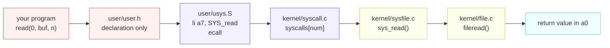

# System Call Reference

---

[toc]

---

Every system call this tree provides, grouped by what you are trying to do. xv6 has no manual pages, so this is the lookup: signature, return value, failure mode, and the file that implements it.

The surface is small and knowable — **22 calls**, all declared in the `// system calls` block of [`../user/user.h`](../user/user.h). If a function is not in that block it is not a system call, however much it looks like one; see [Not system calls](#not-system-calls-but-in-the-same-header) below.

> [!NOTE]
> This file owns xv6's behaviour, not the portable model behind it. For the concepts — what a descriptor is, what `fork` means — read [The Process Abstraction](../../operating-system/The_Process_Abstraction.md) first. Where xv6 and POSIX disagree, and they do in several places, [Divergences from POSIX](#divergences-from-posix) is the authority for this tree.

## What a system call actually is here

Four files stand between the call in your C source and the code that does the work. Knowing which one to open saves most of the searching.



| Layer              | File                                                   | What it contributes                                                                                                                 |
| ------------------ | ------------------------------------------------------ | ----------------------------------------------------------------------------------------------------------------------------------- |
| **Declaration**    | `user/user.h`                                          | The prototype. Nothing else declares these, and `-Wall -Werror` makes an undeclared call a hard build error.                        |
| **Stub**           | `user/usys.S`                                          | Generated by `user/usys.pl`. Loads the call number into register `a7` and executes `ecall`. This is the whole user half.            |
| **Dispatch**       | `kernel/syscall.c`                                     | Reads `a7`, indexes the `syscalls[]` table, and puts the result back in `a0`. Argument fetching is `argint` / `argaddr` / `argstr`. |
| **Implementation** | `kernel/sysfile.c`, `kernel/sysproc.c`, `kernel/log.c` | The `sys_*` function named in each table below.                                                                                     |

> [!IMPORTANT]
> Adding a system call means editing four files, not one: `user/usys.pl`, `user/user.h`, `kernel/syscall.h`, and `kernel/syscall.c`, plus the `sys_*` implementation. Editing `user/usys.S` directly is wasted work — it is generated and `.gitignore`d.

## At a glance

| Call           | Number            | Group       | One line                                                |
| -------------- | ----------------- | ----------- | ------------------------------------------------------- |
| **`fork()`**   | `SYS_fork` = 1    | Process     | Duplicate this process.                                 |
| **`exit()`**   | `SYS_exit` = 2    | Process     | End this process with a status. Never returns.          |
| **`wait()`**   | `SYS_wait` = 3    | Process     | Block until a child exits; collect its status.          |
| **`pipe()`**   | `SYS_pipe` = 4    | Files       | Create a pipe and two descriptors for it.               |
| **`read()`**   | `SYS_read` = 5    | Files       | Read up to n bytes from a descriptor.                   |
| **`kill()`**   | `SYS_kill` = 6    | Process     | Mark a process to die at its next kernel entry or exit. |
| **`exec()`**   | `SYS_exec` = 7    | Process     | Replace this process's image. Returns only on failure.  |
| **`fstat()`**  | `SYS_fstat` = 8   | Files       | Describe the file behind a descriptor.                  |
| **`chdir()`**  | `SYS_chdir` = 9   | Directories | Change the working directory.                           |
| **`dup()`**    | `SYS_dup` = 10    | Files       | Duplicate a descriptor, sharing one offset.             |
| **`getpid()`** | `SYS_getpid` = 11 | Process     | This process's pid.                                     |
| **`sbrk()`**   | `SYS_sbrk` = 12   | Memory      | Grow or shrink the data segment.                        |
| **`pause()`**  | `SYS_pause` = 13  | Time        | Block for n clock ticks. This tree's name for `sleep`.  |
| **`uptime()`** | `SYS_uptime` = 14 | Time        | Clock ticks since boot.                                 |
| **`open()`**   | `SYS_open` = 15   | Files       | Open or create a file; return a descriptor.             |
| **`write()`**  | `SYS_write` = 16  | Files       | Write n bytes to a descriptor.                          |
| **`mknod()`**  | `SYS_mknod` = 17  | Directories | Create a device file.                                   |
| **`unlink()`** | `SYS_unlink` = 18 | Directories | Remove a name; free the inode when the last link goes.  |
| **`link()`**   | `SYS_link` = 19   | Directories | Add a second name for one inode.                        |
| **`mkdir()`**  | `SYS_mkdir` = 20  | Directories | Create a directory.                                     |
| **`close()`**  | `SYS_close` = 21  | Files       | Release a descriptor.                                   |
| **`sync()`**   | `SYS_sync` = 22   | System      | Wait until the log has committed.                       |

## Process

| Call         | Declared as                       | On success                                      | On failure                                                     | Implemented in                    |
| ------------ | --------------------------------- | ----------------------------------------------- | -------------------------------------------------------------- | --------------------------------- |
| **`fork`**   | `int fork(void)`                  | The child's pid in the parent; `0` in the child | `-1` — no free `proc` slot (`NPROC` = 64) or no memory to copy | `kernel/proc.c` `kfork()`         |
| **`exit`**   | `int exit(int)`                   | Does not return                                 | Cannot fail                                                    | `kernel/proc.c` `kexit()`         |
| **`wait`**   | `int wait(int *)`                 | The pid of one exited child                     | `-1` — the caller has no children, or was killed while waiting | `kernel/proc.c` `kwait()`         |
| **`kill`**   | `int kill(int)`                   | `0` — a process with that pid was found         | `-1` — no such pid                                             | `kernel/proc.c` `kkill()`         |
| **`exec`**   | `int exec(const char *, char **)` | Does not return                                 | `-1` — bad path, bad ELF, too many arguments, or out of memory | `kernel/exec.c` `kexec()`         |
| **`getpid`** | `int getpid(void)`                | This process's pid                              | Cannot fail                                                    | `kernel/sysproc.c` `sys_getpid()` |

Four behaviours are easy to get wrong:

- **`fork` returns twice, from one call site.** The child's saved `a0` is overwritten with zero in `kfork()`; there is no second return path in the code, only two saved register sets.
- **`wait` accepts a null pointer.** `kwait()` tests `addr != 0` before copying, so `wait(0)` is legal when you do not want the status. Otherwise pass the address of an `int`, which receives what the child passed to `exit()`.
- **`kill` does not kill.** It sets `p->killed` and makes the target runnable if it was sleeping. The process actually dies the next time it enters or leaves the kernel, so a `kill` followed immediately by an assumption of death is a race.
- **`exec` returning is always an error.** `user/sh.c` prints `exec %s failed` on the line _after_ the call for exactly this reason. `argv` must be null-terminated and hold at most `MAXARG` (32) entries.

> [!NOTE]
> The kernel-side names carry a `k` prefix — `kfork`, `kexec`, `kwait`, `kexit` — where the book and OSTEP use the bare POSIX names. See [the naming table](book/00-ostep-concordance.md#system-call-naming).

## Files and descriptors

| Call        | Declared as                         | On success                                             | On failure                                                                                     | Implemented in                   |
| ----------- | ----------------------------------- | ------------------------------------------------------ | ---------------------------------------------------------------------------------------------- | -------------------------------- |
| **`open`**  | `int open(const char *, int)`       | The lowest unused descriptor                           | `-1` — no such file without `O_CREATE`, a directory opened for writing, or the tables are full | `kernel/sysfile.c` `sys_open()`  |
| **`read`**  | `int read(int, void *, int)`        | Bytes read, `1` to `n`; `0` means EOF                  | `-1` — descriptor not open, or not readable                                                    | `kernel/sysfile.c` `sys_read()`  |
| **`write`** | `int write(int, const void *, int)` | `n` — always the full count                            | `-1` — not open, not writable, or the write could not complete                                 | `kernel/sysfile.c` `sys_write()` |
| **`close`** | `int close(int)`                    | `0`                                                    | `-1` — that descriptor is not open                                                             | `kernel/sysfile.c` `sys_close()` |
| **`dup`**   | `int dup(int)`                      | A new descriptor onto the same `struct file`           | `-1` — bad descriptor, or all `NOFILE` (16) slots are used                                     | `kernel/sysfile.c` `sys_dup()`   |
| **`pipe`**  | `int pipe(int *)`                   | `0`, with `p[0]` the read end and `p[1]` the write end | `-1` — no free `struct file`, fewer than two free descriptors, or the copy out failed          | `kernel/sysfile.c` `sys_pipe()`  |
| **`fstat`** | `int fstat(int fd, struct stat *)`  | `0`, with `st` filled in                               | `-1` — bad descriptor, **or the descriptor is a pipe**                                         | `kernel/sysfile.c` `sys_fstat()` |

- **A short `write` is reported as failure, not as a count.** `filewrite()` in `kernel/file.c` ends with `ret = (i == n ? n : -1)`, so a partially completed write returns `-1` and the bytes already written are gone from your accounting. Compare `read`, which legitimately returns fewer bytes than requested.
- **`dup` shares the offset.** Both descriptors point at one `struct file`, and `off` lives in that shared object — so a read through either advances both. Two separate `open()` calls on the same path do _not_ share an offset.
- **`fstat` failing is how you detect a pipe.** `filestat()` serves `FD_INODE` and `FD_DEVICE` and returns `-1` for `FD_PIPE`, so one call separates console (`T_DEVICE`), file (`T_FILE`), and pipe (failure). `user/ex1copy.c` uses exactly this to decide whether a human is waiting.
- **There is no `lseek`.** An offset moves only by reading and writing, or resets by opening the file again.

`struct stat` and its type codes come from `kernel/stat.h`:

| Field   | Type     | Meaning                                                   |
| ------- | -------- | --------------------------------------------------------- |
| `dev`   | `int`    | Disk device the file lives on                             |
| `ino`   | `uint`   | Inode number — the second-to-last column in `ls`          |
| `type`  | `short`  | `T_DIR` = 1, `T_FILE` = 2, `T_DEVICE` = 3                 |
| `nlink` | `short`  | Names pointing at this inode; `link` and `unlink` move it |
| `size`  | `uint64` | Bytes; always `0` for a device                            |

## Directories and paths

| Call         | Declared as                             | On success | On failure                                                            | Implemented in                    |
| ------------ | --------------------------------------- | ---------- | --------------------------------------------------------------------- | --------------------------------- |
| **`mkdir`**  | `int mkdir(const char *)`               | `0`        | `-1` — the name exists, or a path component is missing                | `kernel/sysfile.c` `sys_mkdir()`  |
| **`unlink`** | `int unlink(const char *)`              | `0`        | `-1` — no such name, or a non-empty directory                         | `kernel/sysfile.c` `sys_unlink()` |
| **`link`**   | `int link(const char *, const char *)`  | `0`        | `-1` — the old name is missing or a directory, or the new name exists | `kernel/sysfile.c` `sys_link()`   |
| **`chdir`**  | `int chdir(const char *)`               | `0`        | `-1` — no such path, or it is not a directory                         | `kernel/sysfile.c` `sys_chdir()`  |
| **`mknod`**  | `int mknod(const char *, short, short)` | `0`        | `-1` — the name exists, or a path component is missing                | `kernel/sysfile.c` `sys_mknod()`  |

- Paths are capped at `MAXPATH` (128) bytes and each name component at `DIRSIZ` (14) — `kernel/param.h` and `kernel/fs.h`. The 14-byte limit is why a user program's guest name must be short.
- **`link` makes a hard link, and there are no symbolic links.** Both names index one inode, and `nlink` counts them; `unlink` frees the inode only when the count reaches zero and nothing has it open.
- **`mknod` is how `console` exists.** `user/init.c` calls `mknod("console", CONSOLE, 0)` at boot, which is why `ls` shows it as type 3 with size 0.
- **`cd` is not here.** `chdir` changes the calling process's `p->cwd`, so a shell that forked first would change only the child's directory and then lose it. `user/sh.c` special-cases `cd` in `main()` before forking.

## Memory

| Call           | Declared as                | On success                         | On failure                           | Implemented in                  |
| -------------- | -------------------------- | ---------------------------------- | ------------------------------------ | ------------------------------- |
| **`sbrk`**     | `char *sbrk(int)`          | The **previous** program break     | `SBRK_ERROR`, that is `((char *)-1)` | `user/ulib.c` → `sys_sbrk()`    |
| **`sbrklazy`** | `char *sbrklazy(int)`      | The previous break, nothing mapped | `SBRK_ERROR`                         | `user/ulib.c` → `sys_sbrk()`    |
| **`sys_sbrk`** | `char *sys_sbrk(int, int)` | The previous break                 | `SBRK_ERROR`                         | `kernel/sysproc.c` `sys_sbrk()` |

The raw call takes **two** arguments in this tree: the byte delta, and a mode from `kernel/vm.h`.

| Mode             | Value | Behaviour                                                                                                    |
| ---------------- | ----- | ------------------------------------------------------------------------------------------------------------ |
| **`SBRK_EAGER`** | 1     | `growproc()` allocates and maps the pages immediately. This is what plain `sbrk()` passes.                   |
| **`SBRK_LAZY`**  | 2     | Only `p->sz` moves. No page is allocated until the process touches the address and `vmfault()` supplies one. |

`sbrk` is the one entry `user/usys.pl` special-cases: it emits the stub under the name `sys_sbrk` rather than `sbrk`, which leaves the plain name free for the `user/ulib.c` wrapper that supplies the mode argument. That is why this is the only system call whose user-facing name and stub name differ.

> [!TIP]
> `sbrk` returns the break _before_ the change, which is what makes `char *p = sbrk(n)` give you the start of the new region. A negative `n` always takes the eager path, so shrinking is immediate. `user/umalloc.c` is the only caller most programs go through, via `malloc()`.

## Time and system

| Call         | Declared as        | On success                     | On failure                                  | Implemented in                    |
| ------------ | ------------------ | ------------------------------ | ------------------------------------------- | --------------------------------- |
| **`pause`**  | `int pause(int)`   | `0` after n clock ticks        | `-1` — the process was killed while waiting | `kernel/sysproc.c` `sys_pause()`  |
| **`uptime`** | `int uptime(void)` | Clock ticks since boot         | Cannot fail                                 | `kernel/sysproc.c` `sys_uptime()` |
| **`sync`**   | `int sync(void)`   | `0` once the log has committed | Cannot fail                                 | `kernel/log.c` `sys_sync()`       |

- **`pause` is this tree's `sleep`.** Upstream names the clock-tick call `sleep`; here that name belongs to the kernel's sleep/wakeup primitive, so the system call is `pause`. The `util` lab's `sleep` is a _user program_ built on top of it — which is why `grade-lab-util` breaks on `sys_pause`, not `sys_sleep`.
- A negative argument to `pause` is clamped to zero rather than rejected.
- **`sync` lives in `kernel/log.c`**, not with the other file calls, because what it waits for is the log's commit machinery. See [ch11](book/ch11-logging.md).

## Not system calls, but in the same header

Everything below `// ulib.c` in `user/user.h` runs entirely in user space. It matters because these do not trap, cannot be traced as system calls, and are linked in from `ULIB` rather than dispatched by the kernel.

| Function                                                | Provided by      | Note                                                                                           |
| ------------------------------------------------------- | ---------------- | ---------------------------------------------------------------------------------------------- |
| **`stat`**                                              | `user/ulib.c`    | `open` + `fstat` + `close`. Fails wherever those do.                                           |
| **`gets`**                                              | `user/ulib.c`    | Reads one line from descriptor 0, one `read()` per character.                                  |
| **`strcpy`**, **`strcmp`**, **`strlen`**, **`strchr`**  | `user/ulib.c`    | The whole string library. No `strncpy`, no `strdup`, no `snprintf`.                            |
| **`memset`**, **`memmove`**, **`memcpy`**, **`memcmp`** | `user/ulib.c`    | Compiled with `-fno-builtin-*` so gcc cannot substitute its own.                               |
| **`atoi`**                                              | `user/ulib.c`    | No error reporting; a non-numeric string yields `0`.                                           |
| **`printf`**, **`fprintf`**                             | `user/printf.c`  | `fprintf` takes a descriptor, not a `FILE *`. Both are `__attribute__((format(printf, ...)))`. |
| **`malloc`**, **`free`**                                | `user/umalloc.c` | A free list over `sbrk`. No `calloc`, no `realloc`.                                            |

## Divergences from POSIX

These are the places where habits from Linux produce code that compiles and then misbehaves, or does not compile at all.

**Open flags have different names and different values.** xv6's are in `kernel/fcntl.h`:

| Meaning          | xv6              | Linux `<fcntl.h>` | Same?                   |
| ---------------- | ---------------- | ----------------- | ----------------------- |
| Read only        | `O_RDONLY` 0x000 | `O_RDONLY` 0x0    | Yes                     |
| Write only       | `O_WRONLY` 0x001 | `O_WRONLY` 0x1    | Yes                     |
| Read and write   | `O_RDWR` 0x002   | `O_RDWR` 0x2      | Yes                     |
| Create if absent | `O_CREATE` 0x200 | `O_CREAT` 0x40    | **No** — name and value |
| Truncate         | `O_TRUNC` 0x400  | `O_TRUNC` 0x200   | **No** — value          |

`O_CREATE` carries the trailing E that POSIX drops, so a copied-in Linux idiom fails to compile — which is the good outcome. There is no `O_APPEND`, `O_EXCL`, or `O_NONBLOCK`.

**Other differences worth holding on to:**

| Area                 | xv6                                                        | POSIX / Linux                       |
| -------------------- | ---------------------------------------------------------- | ----------------------------------- |
| **`open` arity**     | Two arguments; no permission bits exist                    | Three, the third being `mode_t`     |
| **Error detail**     | The return value is all there is; no `errno`, no `perror`  | `errno` plus `strerror`             |
| **Seeking**          | No `lseek` at all                                          | `lseek`, `pread`, `pwrite`          |
| **Timed sleep**      | `pause(ticks)` — clock ticks, not seconds                  | `sleep`, `nanosleep`                |
| **Breaking memory**  | `sbrk(n, mode)` under the hood, with an explicit lazy mode | `brk` / `sbrk`, plus `mmap`         |
| **Descriptor limit** | `NOFILE` = 16 per process, `NFILE` = 100 system-wide       | Thousands, tunable with `ulimit`    |
| **Path limits**      | `MAXPATH` = 128, `DIRSIZ` = 14 per component               | `PATH_MAX` = 4096, `NAME_MAX` = 255 |
| **Links**            | Hard links only                                            | Hard and symbolic                   |

> [!WARNING]
> `exit` is declared `int exit(int)` but is `__attribute__((noreturn))`, so the compiler will treat any code after it as unreachable. Its argument is genuinely delivered: the parent's `wait(&status)` receives it.

Reaching for `<unistd.h>` to get the POSIX spelling of any of these is a trap worth knowing about in detail: the header is present in the cross toolchain's sysroot, it compiles, and some of its declarations then bind silently to xv6's stubs. See [Why you cannot use the host's headers](06-build-artifacts.md#why-you-cannot-use-the-hosts-headers).

## Verifying this file

[`book/check-notes.sh`](book/check-notes.sh) checks this reference against the tree on every run, in both directions: every `entry("...")` in `user/usys.pl` must appear here, and every `SYS_*` number quoted here must match `kernel/syscall.h`. A call added to the tree without a row here fails the check, and so does a stale number.

```bash
docs/book/check-notes.sh
```
