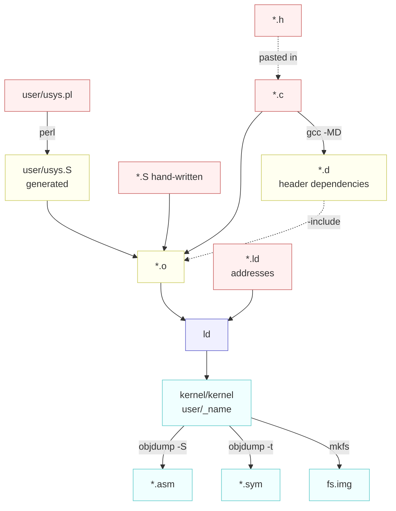
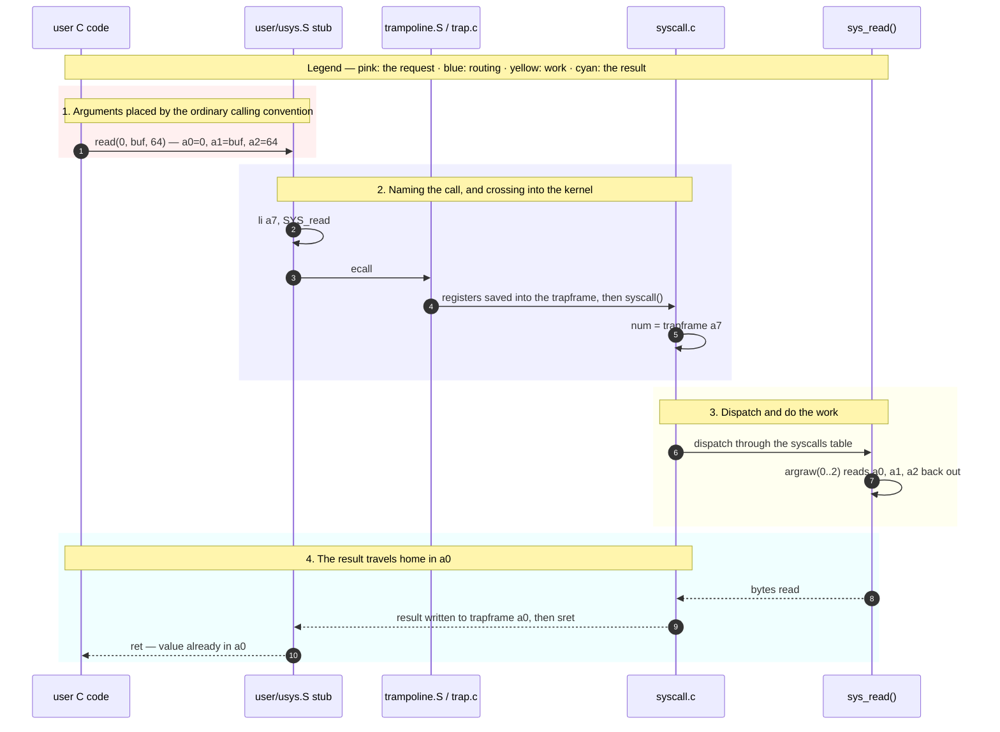
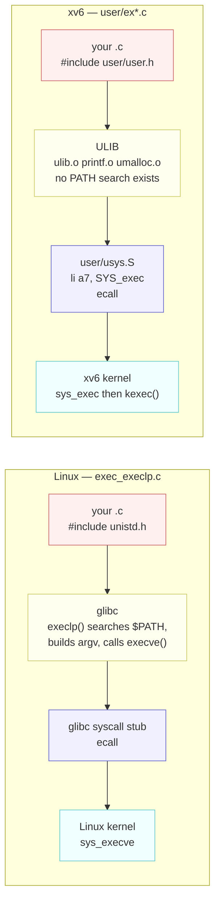

# Source and Build File Types

---

[toc]

---

What every file extension in this tree is, who produces it, and why an operating system needs four kinds of file that an ordinary C program never does.

> [!NOTE]
> The generic four-stage pipeline — preprocess, compile, assemble, link — is already covered in [C_Project_Build_Tool.md](../../c-programming/C_Project_Build_Tool.md), along with `.o` files, `.d` files, and Makefile mechanics. This page does not re-explain any of it. It covers what is different here, and why.

## Quick lookup

| Extension   | Kind       | What it holds                                                   | Produced by          | In git |
| ----------- | ---------- | --------------------------------------------------------------- | -------------------- | ------ |
| **`.c`**    | authored   | C source; one translation unit                                  | you                  | yes    |
| **`.h`**    | authored   | Declarations, macros, and struct layouts, pasted into a `.c`    | you                  | yes    |
| **`.S`**    | authored\* | Assembly, run through the C preprocessor first                  | you                  | yes    |
| **`.pl`**   | authored   | A Perl generator — here, the one that writes `user/usys.S`      | you                  | yes    |
| **`.ld`**   | authored   | A linker script: load address, section order, exported symbols  | you                  | yes    |
| **`.mk`**   | authored   | A Makefile fragment; `conf/lab.mk` selects the active lab       | you                  | yes    |
| **`.o`**    | generated  | One object file per `.c` or `.S` — machine code, not yet placed | `gcc -c`             | no     |
| **`.d`**    | generated  | A make rule listing every header that `.o` actually read        | `gcc -MD`            | no     |
| **`.asm`**  | generated  | Disassembly, interleaved with the source lines it came from     | `objdump -S`         | no     |
| **`.sym`**  | generated  | Address-to-symbol table, one symbol per line                    | `objdump -t`         | no     |
| **`_name`** | generated  | A linked user program, ready for `mkfs`                         | `ld -T user/user.ld` | no     |
| **`.img`**  | generated  | The filesystem image QEMU attaches as a disk                    | `mkfs/mkfs`          | no     |

\* `.S` is the one extension that appears on both sides. `kernel/entry.S`, `swtch.S`, `trampoline.S`, and `kernelvec.S` are written by hand; `user/usys.S` is generated by `user/usys.pl` and is `.gitignore`d like any other output.

Supporting files that are not part of the compile at all:

| File                                               | Role                                                                |
| -------------------------------------------------- | ------------------------------------------------------------------- |
| `gradelib.py`, `test-xv6.py`                       | MIT's grading harness and this repo's CI driver; run on the host    |
| `grade-lab-*`, `grade-exercises`                   | Python test scripts, extensionless because they are run as commands |
| `user/findtest.sh`, `sixfive.txt`, `sf-*`          | Lab fixtures copied into `fs.img` as data, never compiled           |
| `.github/workflows/test.yml`                       | CI definition                                                       |
| `.clang-format`, `.editorconfig`, `.dir-locals.el` | Editor and formatter configuration                                  |

## Where each one appears



## Why a header cannot do these jobs

A `.h` file does exactly one thing: it is text pasted into a `.c` before compilation. Everything else follows from that. It can _declare_ — promise that a symbol exists somewhere — but it cannot define machine code that C has no syntax for, it cannot say where anything lands in memory, and it cannot record a fact discovered while the build ran.

| The job                                                         | Why a `.h` cannot do it                                                                                                                    | What does it here                    |
| --------------------------------------------------------------- | ------------------------------------------------------------------------------------------------------------------------------------------ | ------------------------------------ |
| **Save 14 registers and switch stacks mid-function**            | The compiler owns register allocation and writes its own prologue and epilogue. C has no way to say "swap `sp` and return somewhere else". | `kernel/swtch.S`                     |
| **Execute `ecall`, `sret`, or write the `satp` register**       | No C construct emits these. They are the instructions that change privilege level and address space.                                       | `kernel/trampoline.S`, `user/usys.S` |
| **Run before a stack exists**                                   | C code needs `sp` already valid. `_entry` is the code that makes it valid.                                                                 | `kernel/entry.S`                     |
| **Define 22 near-identical trap stubs**                         | `user/user.h` can _declare_ all 22 — and does. It cannot define them, because the definition is four machine instructions.                 | `user/usys.pl` → `user/usys.S`       |
| **Put the kernel at `0x80000000` and export `etext` and `end`** | Addresses are the linker's business. No C declaration names a load address.                                                                | `kernel/kernel.ld`, `user/user.ld`   |
| **Record which headers each `.o` really used**                  | That is a fact about a compile that already happened, not something you could write in advance.                                            | `gcc -MD` → `.d`                     |
| **Show what the compiler actually generated**                   | It is output, not input.                                                                                                                   | `objdump -S` → `.asm`                |

> [!IMPORTANT]
> The header and the assembly file are partners, not alternatives. `kernel/defs.h` declares `void swtch(struct context*, struct context*);` and `kernel/swtch.S` defines it; `user/user.h` declares `int fork(void);` and `user/usys.S` defines it. The header is how C code _calls_ the thing. The `.S` file _is_ the thing.

### `.S` versus `.s`: the capital letter matters

A capital `.S` tells gcc to run the C preprocessor over the file before assembling it. That is the whole reason `user/usys.S` can open with

```asm
#include "kernel/syscall.h"
.global fork
fork:
 li a7, SYS_fork
 ecall
 ret
```

and write `SYS_fork` rather than the literal `1`. With a lower-case `.s` the preprocessor never runs, `#include` is meaningless, and every call number would have to be hand-copied — free to drift the moment someone renumbers `kernel/syscall.h`.

### Why generate `usys.S` instead of writing it

Twenty-two stubs, four lines each, differing only in one name. Three ways to get them:

| Approach                               | Cost                                                                                                    |
| -------------------------------------- | ------------------------------------------------------------------------------------------------------- |
| **Hand-written assembly**              | 88 lines to keep in sync with `kernel/syscall.h` by hand, forever.                                      |
| **A C macro emitting inline assembly** | Compiles, but the macro is harder to read than the assembly it hides, and the ABI details leak into it. |
| **A 20-line generator**                | Adding a system call is one `entry("name");` line. This is what the tree does.                          |

The generator also earns its keep by holding the one exception in a single `if`: `entry("sbrk")` emits the stub named `sys_sbrk`, leaving the plain `sbrk` name free for the `user/ulib.c` wrapper that supplies the eager/lazy mode. A hand-written file would hide that irregularity among 87 other lines.

> [!WARNING]
> Never edit `user/usys.S`. It opens with `# generated by usys.pl - do not edit`, it is deleted by `make clean`, and it is `.gitignore`d — your changes disappear at the next build with no error. Edit `user/usys.pl`.

## Reading the assembly files

Five `.S` files exist in this tree — `kernel/entry.S`, `kernel/swtch.S`, `kernel/kernelvec.S`, `kernel/trampoline.S`, and the generated `user/usys.S` — and between them they use **seventeen distinct instructions**. That is the entire vocabulary. The tables below cover every mnemonic, register, directive, and preprocessor symbol that appears in any of them, so nothing in those files has to stay opaque.

### The four-line stub, decoded

Take the `fork` stub from `user/usys.S` again, this time annotated:

```asm
.global fork      # export the name `fork` so ld can resolve calls to it
fork:             # a label: the address that the name `fork` refers to
 li a7, SYS_fork  # load immediate — put the constant 1 into register a7
 ecall            # environment call — trap into the kernel
 ret              # return to whoever called fork()
```

What is _absent_ matters as much as what is present: the stub never touches `a0` through `a5`. The C caller already left the arguments there, following the calling convention, and `ecall` does not disturb them — so the kernel finds them exactly where it expects. The stub's only job is to say _which_ system call this is.

### Instructions

| Instruction      | Reads as                                                        | What it does                                                                                           | Seen at                                    |
| ---------------- | --------------------------------------------------------------- | ------------------------------------------------------------------------------------------------------ | ------------------------------------------ |
| **`li`**         | **l**oad **i**mmediate                                          | Put a constant into a register                                                                         | `li a7, SYS_fork` — `user/usys.S`          |
| **`la`**         | **l**oad **a**ddress                                            | Put the address of a symbol into a register                                                            | `la sp, stack0` — `kernel/entry.S`         |
| **`ld`**         | **l**oa**d** doubleword                                         | Read 8 bytes from memory into a register                                                               | `ld ra, 0(a1)` — `kernel/swtch.S`          |
| **`sd`**         | **s**tore **d**oubleword                                        | Write a register's 8 bytes out to memory                                                               | `sd ra, 0(a0)` — `kernel/swtch.S`          |
| **`add`**        | add                                                             | Sum of two registers                                                                                   | `add sp, sp, a0` — `kernel/entry.S`        |
| **`addi`**       | **add i**mmediate                                               | Register plus a constant. Allocating a stack frame is `addi sp, sp, -256`                              | `addi sp, sp, -256` — `kernel/kernelvec.S` |
| **`mul`**        | multiply                                                        | Product of two registers                                                                               | `mul a0, a0, a1` — `kernel/entry.S`        |
| **`ecall`**      | **e**nvironment **call**                                        | Trap to the next privilege level up. The one instruction that enters the kernel                        | `user/usys.S`, 22 times                    |
| **`ret`**        | return                                                          | Jump to the address held in `ra`                                                                       | end of every `usys.S` stub, end of `swtch` |
| **`sret`**       | **s**upervisor **ret**urn                                       | Leave S-mode for the mode and PC recorded in `sstatus` and `sepc` — how the kernel re-enters user code | `userret` — `kernel/trampoline.S`          |
| **`call`**       | call                                                            | Jump to a label, leaving the return address in `ra`                                                    | `call start` — `kernel/entry.S`            |
| **`jalr`**       | **j**ump **a**nd **l**ink **r**egister                          | Same, but to an address held in a register rather than a label                                         | `jalr t0` — `kernel/trampoline.S`          |
| **`j`**          | **j**ump                                                        | Unconditional jump, keeping no return address                                                          | `j spin` — `kernel/entry.S`                |
| **`csrr`**       | **CSR** **r**ead                                                | Copy a control and status register into a general register                                             | `csrr a1, mhartid` — `kernel/entry.S`      |
| **`csrw`**       | **CSR** **w**rite                                               | Copy a general register into a CSR. `csrw satp, t1` switches address space                             | `kernel/trampoline.S`                      |
| **`sfence.vma`** | **s**upervisor **fence**, **v**irtual **m**emory **a**ddressing | Flush the TLB, so stale translations are not used after a page-table change                            | `kernel/trampoline.S`                      |
| **`fence.i`**    | **fence**, **i**nstruction                                      | Flush the instruction cache, so newly written code is actually fetched                                 | `userret` — `kernel/trampoline.S`          |

> [!NOTE]
> `li`, `la`, `call`, `j`, and `ret` are **pseudo-instructions** — convenient spellings the assembler expands into one or two real instructions (`ret` becomes `jalr x0, 0(ra)`, for example). This is why `kernel/kernel.asm` sometimes shows an instruction you never wrote. `sd`/`ld` also come in narrower widths in compiled code: `sw`/`lw` for 4 bytes, `sh`/`lh` for 2, `sb`/`lb` for 1, which is why the disassembly of `ex1copy.c` reading a `short` shows `lh`.

### Registers

RISC-V has 32 integer registers, architecturally named `x0` through `x31`. Nobody writes those names. The ABI assigns each one a role and a mnemonic, and every `.S` file here uses the mnemonic.

| Register       | Name from              | Role                                                                                                                 | Preserved across a call by |
| -------------- | ---------------------- | -------------------------------------------------------------------------------------------------------------------- | -------------------------- |
| **`zero`**     | zero                   | Hardwired to 0. Writes are discarded; `sfence.vma zero, zero` means "flush everything"                               | n/a                        |
| **`ra`**       | **r**eturn **a**ddress | Where `ret` jumps to. `call` writes it. Overwriting `ra` is precisely how `swtch` returns into a _different_ process | the caller                 |
| **`sp`**       | **s**tack **p**ointer  | Top of the current stack. `kernel/entry.S` exists to give it a valid value before any C runs                         | the callee                 |
| **`gp`**       | **g**lobal **p**ointer | Fast base for globals. xv6 barely uses it, but saves it on traps anyway                                              | n/a                        |
| **`tp`**       | **t**hread **p**ointer | xv6 keeps the hartid here, which is why `kernelvec.S` deliberately does _not_ restore it after a possible CPU move   | the callee                 |
| **`t0`–`t6`**  | **t**emporary          | Scratch. A callee may clobber them freely                                                                            | the caller                 |
| **`a0`–`a7`**  | **a**rgument           | The first eight function arguments. `a0` and `a1` also carry return values                                           | the caller                 |
| **`s0`–`s11`** | **s**aved              | Long-lived values. `s0` doubles as the frame pointer                                                                 | the callee                 |

`kernel/swtch.S` saves exactly `ra`, `sp`, and `s0`–`s11` — fourteen registers, and not one of the `a*` or `t*`. That is not an oversight. `swtch` is called from C, so the compiler has already spilled anything it cared about in the caller-saved set; only the callee-saved registers have to survive. `kernel/trampoline.S`, by contrast, saves all 31, because a trap can strike between any two instructions and no compiler agreed to anything.

### Directives, labels, and preprocessor symbols

Not everything in a `.S` file is an instruction. These are the rest:

| Token                       | Kind                | Meaning                                                                                                                                                         |
| --------------------------- | ------------------- | --------------------------------------------------------------------------------------------------------------------------------------------------------------- |
| **`.global`**, **`.globl`** | assembler directive | Two spellings of the same thing: export this symbol so the linker can resolve references from other files. `usys.pl` emits `.global`; `swtch.S` writes `.globl` |
| **`.section .text`**        | assembler directive | Put what follows in the executable-code section                                                                                                                 |
| **`.section trampsec`**     | assembler directive | A section name invented by xv6 so `kernel/kernel.ld` can place the trampoline alone on its own page                                                             |
| **`.align 4`**              | assembler directive | Align to 2⁴ = 16 bytes. `stvec` requires its trap vector be aligned, so `kernelvec` and `uservec` both declare it                                               |
| **`fork:`**                 | label               | Defines a symbol naming the current address. Nothing is emitted                                                                                                 |
| **`#`**                     | comment             | Everything to end of line — and, in a `.S` file, also the preprocessor's sigil, which is why `#include` works                                                   |
| **`SYS_fork`**              | preprocessor macro  | Not assembly at all. A `#define` from `kernel/syscall.h`, substituted before the assembler ever sees the file                                                   |
| **`TRAPFRAME`**             | preprocessor macro  | Likewise, from `kernel/memlayout.h` — the fixed virtual address of the current process's trapframe                                                              |
| **`0(a0)`**, **`120(sp)`**  | addressing mode     | `offset(base)`: the memory address is the register's value plus the constant. `sd ra, 120(sp)` stores `ra` 120 bytes above the stack pointer                    |

### Why the system call number goes in `a7`

Because `a0` through `a5` are already spoken for, and `a7` is the argument register left over.

RISC-V passes the first eight integer arguments in `a0`–`a7` and returns values in `a0`. xv6's kernel reads system call arguments straight out of the saved trapframe, and `argraw()` in [`kernel/syscall.c:35`](../kernel/syscall.c) maps argument 0 through argument 5 onto `a0` through `a5`:

```c
case 0: return p->trapframe->a0;
...
case 5: return p->trapframe->a5;
```

So the six lowest argument registers _are_ the argument channel. A stub that used one of them for the call number would first have to shuffle the caller's arguments out of the way, and `write(1, buf, n)` would stop being three instructions. That leaves `a6` and `a7`; `a7` is the choice, matching what Linux's RISC-V ABI does, so the convention is one thing rather than two.

The dispatch side, in `syscall()` at [`kernel/syscall.c:142`](../kernel/syscall.c), is the mirror image:

```c
num = p->trapframe->a7;
...
p->trapframe->a0 = syscalls[num]();
```

| Register         | Carries                                              | Written by                        | Read by                            |
| ---------------- | ---------------------------------------------------- | --------------------------------- | ---------------------------------- |
| **`a7`**         | The system call number                               | `li a7, SYS_x` in `user/usys.S`   | `syscall()`, to index `syscalls[]` |
| **`a0`–`a5`**    | Arguments 0 through 5                                | The calling C code, by convention | `argraw()`, via the trapframe      |
| **`a0`** (after) | The return value, or `-1` for an unknown call number | `syscall()`                       | The calling C code, by convention  |
| **`a6`**         | Nothing                                              | —                                 | —                                  |

`a7` selects and `a0` returns, which is exactly why the stub needs no `mv` instruction anywhere. Nothing declared in `kernel/syscall.h` takes more than three arguments, so `a3`–`a5` are headroom that a lab exercise can use without touching this design.

The whole path, from a C call to a value back in a variable:



## What ELF is

**ELF** — **E**xecutable and **L**inkable **F**ormat — is the container Unix systems have used since the early 1990s for object files, shared libraries, and executables. Every `.o` in this tree is an ELF file, and so is `kernel/kernel`, and so is every `user/_name`.

The useful mental image is a shipping container with a packing list bolted to the door. The cargo is machine code and initialized data. The packing list — the ELF headers — records where each crate must be unloaded to, how large it is, whether it may be written or executed, and which crate to open first.

`readelf -h kernel/kernel` prints the cover page of that list:

```
ELF Header:
  Magic:   7f 45 4c 46 02 01 01 00 00 00 00 00 00 00 00 00
  Class:                             ELF64
  Data:                              2's complement, little endian
  Type:                              EXEC (Executable file)
  Machine:                           RISC-V
  Entry point address:               0x80000000
  Number of program headers:         3
```

Four of those fields carry the story:

| Field           | Value here                         | Why it is that                                                                                                                                           |
| --------------- | ---------------------------------- | -------------------------------------------------------------------------------------------------------------------------------------------------------- |
| **Magic**       | `7f 45 4c 46` = `\x7F` `E` `L` `F` | The four bytes every ELF file starts with. `kernel/elf.h` calls this `ELF_MAGIC` and `kernel/exec.c` rejects anything else                               |
| **Type**        | `EXEC`                             | A fixed-address executable, not a `DYN`/PIE one. Nothing relocates it at load time because there is no dynamic loader — hence `-fno-pie` in the Makefile |
| **Machine**     | `RISC-V`                           | Output of the cross compiler. Your x86 host cannot execute a byte of it                                                                                  |
| **Entry point** | `0x80000000`                       | The address of `_entry`, put there by `ENTRY( _entry )` in `kernel/kernel.ld`                                                                            |

After the header come the **program headers**, one per segment, and they are the part a loader actually acts on. `readelf -lW kernel/kernel` shows three, of which exactly one is loadable:

```
  Type           Offset   VirtAddr           FileSiz  MemSiz   Flg Align
  RISCV_ATTRIBUT 0x00b200 0x0000000000000000 0x000057 0x000000 R   0x1
  LOAD           0x001000 0x0000000080000000 0x00a200 0x023550 RWE 0x1000
  GNU_STACK      0x000000 0x0000000000000000 0x000000 0x000000 RW  0x10
```

`FileSiz` is smaller than `MemSiz` because `.bss` occupies memory but stores nothing in the file — the loader zeroes the difference. That single fact is why an ELF file is a packing list and not just a memory dump.

### Why xv6 parses ELF itself

`kernel/elf.h` re-declares the format in about 40 lines, and `kexec()` in `kernel/exec.c` walks it by hand. This is not gratuitous duplication of the host's `<elf.h>`: `exec()` runs inside the kernel, reading a file out of `fs.img`, on a machine with no library and no loader beneath it. Anything it needs, it must contain.

The loop is short enough to follow in one read:

| Step in `kexec()`                         | What it does                                                                              |
| ----------------------------------------- | ----------------------------------------------------------------------------------------- |
| `readi(ip, 0, &elf, 0, sizeof(elf))`      | Read the ELF header out of the file's inode                                               |
| `if (elf.magic != ELF_MAGIC)`             | Refuse anything that is not an ELF file                                                   |
| loop `i < elf.phnum`, `off += sizeof(ph)` | Walk each program header                                                                  |
| `if (ph.type != ELF_PROG_LOAD) continue;` | Skip the two non-loadable segments above                                                  |
| `uvmalloc` + `loadseg` at `ph.vaddr`      | Allocate pages in the new page table and copy the segment in                              |
| `p->trapframe->epc = elf.entry`           | Set the initial PC, so `sret` lands on `start()` in `user/ulib.c` rather than on `main()` |

xv6 uses a fraction of the format and ignores the rest. There is no dynamic linking, no relocation processing, no runtime symbol resolution, and no interpreter — the `.debug_*` and `.symtab` sections that `mkfs` faithfully copies into `fs.img` are simply never looked at by the kernel. They exist for `objdump`, which brings us to the next two files.

### `.asm` versus `.sym`

Both are produced from the same ELF on every link, both are pure output, and they answer different questions. Confusing them wastes time in exactly the moment — a panic, a wrong address — when you have least of it.

|                       | `kernel/kernel.asm`                                                          | `kernel/kernel.sym`                                                                                         |
| --------------------- | ---------------------------------------------------------------------------- | ----------------------------------------------------------------------------------------------------------- |
| **Produced by**       | `objdump -S`                                                                 | `objdump -t`, piped through `sed` to strip the header                                                       |
| **Contents**          | Every instruction, interleaved with the C source line it came from           | One line per symbol: address, then name                                                                     |
| **Size**              | 12,975 lines for the kernel; 1,548 for `user/_ex1copy`                       | 266 lines for the kernel; 66 for `user/_ex1copy`                                                            |
| **Ordered by**        | Address, grouped into functions                                              | Link order, not address — so sort it before searching                                                       |
| **Answers**           | "What does the code at this address actually do, and which line of C is it?" | "Which function contains this address?"                                                                     |
| **Reach for it when** | You have narrowed a fault to one function and need the instruction           | You have a raw [PC](04-terminology.md#risc-v-architecture) off a crashed kernel and no idea where it landed |

### What a panic is, and what it prints

**`panic()`** is the kernel's assert. It is what the kernel calls when it detects a condition it has no defined way to continue from — a buffer cache with no free buffers, a log write outside a transaction, a trap it cannot attribute to any device. All of [`kernel/printk.c:138`](../kernel/printk.c):

```c
void
panic(char *s)
{
  panicking = 1;
  printk("panic: ");
  printk("%s\n", s);
  panicked = 1; // freeze uart output from other CPUs
  for (;;)
    ;
}
```

| It does                                                                                                                                                      | It does not                                                                                             |
| ------------------------------------------------------------------------------------------------------------------------------------------------------------ | ------------------------------------------------------------------------------------------------------- |
| Print `panic: ` followed by one fixed message                                                                                                                | Print an address, a register dump, or a backtrace                                                       |
| Set `panicked`, which parks every _other_ hart forever inside `uartputc_sync` ([`kernel/uart.c:108`](../kernel/uart.c)) so nothing can overwrite the message | Reboot, unwind, or return — it is `__attribute__((noreturn))` in `kernel/defs.h` and ends in `for(;;);` |
| Stop the machine dead while leaving QEMU running, so gdb can still attach                                                                                    | Kill only the faulting process. A panic is the entire kernel giving up                                  |

There are 62 `panic()` call sites across 13 files in `kernel/`, and the string is always a short fixed label naming the invariant that broke — `panic("kerneltrap")`, `panic("bget: no buffers")`, `panic("log_write outside of trans")`. Because the string is a literal, grepping it takes you straight to the line that gave up:

```bash
$ grep -rn 'panic("bget: no buffers")' kernel/
kernel/bio.c:87:  panic("bget: no buffers");
```

> [!IMPORTANT]
> `panic()` never prints an address. When a panic on your console _is_ accompanied by one, that line came from the caller immediately before it. The usual source is `kerneltrap()` at [`kernel/trap.c:150`](../kernel/trap.c), which takes a trap it cannot attribute to a device and dumps the trap CSRs before giving up:
>
> ```c
> printk("scause=0x%lx sepc=0x%lx stval=0x%lx\n", scause, r_sepc(), r_stval());
> panic("kerneltrap");
> ```
>
> So the console shows two lines written by two different functions:
>
> ```
> scause=0x000000000000000d sepc=0x0000000080001a70 stval=0x0000000000000058
> panic: kerneltrap
> ```
>
> The first line is the evidence and the second is the verdict. Knowing which is which matters, because only the first one has the address in it.

The three values in that first line are CSRs, read at the moment of the trap:

| Value        | Expansion                                            | What it tells you                                                                                                    |
| ------------ | ---------------------------------------------------- | -------------------------------------------------------------------------------------------------------------------- |
| **`scause`** | **S**upervisor **CAUSE**                             | Why the trap happened. `0xd` is a load page fault, `0xf` a store page fault, `0xc` an instruction page fault         |
| **`sepc`**   | **S**upervisor **E**xception **P**rogram **C**ounter | The [PC](04-terminology.md#risc-v-architecture) of the instruction that faulted. **This is the address you look up** |
| **`stval`**  | **S**upervisor **T**rap **VAL**ue                    | For a page fault, the address the code was trying to reach — usually the bad pointer itself                          |

> [!NOTE]
> The same fault in _user_ space is not a panic. `usertrap()` at [`kernel/trap.c:76`](../kernel/trap.c) prints `usertrap(): unexpected scause ... pid=...`, calls `setkilled(p)`, and the shell prompt comes back. One process dies and the machine lives. Only the kernel faulting on its own behalf stops everything, which is the whole reason a kernel bug is worse than a user-space one.

### Turning that address into a line of C

`.sym` is a coarse index and `.asm` is the detail, so the two are used in that order. Taking the `sepc=0x0000000080001a70` from the two-line panic above, sort the symbol table and find the last symbol at or below it:

```bash
$ sort kernel/kernel.sym | awk '$1 <= "0000000080001a70"' | tail -1
0000000080001a5c usertrap
```

The fault is 0x14 bytes into `usertrap`. Now open `kernel/kernel.asm`, search for that address, and the interleaved source says exactly which line:

```asm
0000000080001a5c <usertrap>:
{
    80001a5c:	1101                	addi	sp,sp,-32
    80001a5e:	ec06                	sd	ra,24(sp)
  asm volatile("csrr %0, sstatus" : "=r"(x));
    80001a68:	100027f3          	csrr	a5,sstatus
  if ((r_sstatus() & SSTATUS_SPP) != 0)
    80001a70:	1007f793          	andi	a5,a5,256
```

> [!TIP]
> Both files are regenerated on every link, so an address you looked up before a rebuild is meaningless after it. If a lookup lands somewhere absurd, check that you did not edit and rebuild in between. Neither file is in git, for the same reason — see [Finding where the kernel crashed](02-build-boot-and-usage.md#finding-where-the-kernel-crashed) for the full debugging loop.

## Why the kernel is linked at `0x80000000`

Not an xv6 decision. It is where RAM begins on QEMU's `virt` board, and `kernel/kernel.ld` simply agrees with the hardware it is going to run on:

```ld
. = 0x80000000;

.text : {
  kernel/entry.o(_entry)
  ...
```

Everything below that address on this board is not memory. QEMU's `virt` machine lays out the low 2 GiB as device space, and `kernel/memlayout.h` copies the map straight out of QEMU's `hw/riscv/virt.c`:

| Physical address | What lives there                               | Named in `memlayout.h` as |
| ---------------- | ---------------------------------------------- | ------------------------- |
| `0x00001000`     | QEMU's boot ROM, the first code to run         | —                         |
| `0x02000000`     | CLINT — timer interrupts                       | `CLINT_BASE`              |
| `0x0C000000`     | PLIC — device interrupt routing                | `PLIC`                    |
| `0x10000000`     | UART registers — your terminal                 | `UART0`                   |
| `0x10001000`     | virtio disk registers                          | `VIRTIO0`                 |
| **`0x80000000`** | **Start of RAM.** The kernel loads here        | `KERNBASE`                |
| `0x88000000`     | End of the RAM xv6 uses (`KERNBASE` + 128 MiB) | `PHYSTOP`                 |

So the address is forced twice over: below `0x80000000` there is nothing to load _into_, and QEMU's `-kernel` option loads the ELF at that address and starts every hart there regardless.

Three places have to agree on it, and a mismatch in any one produces a machine that jumps into empty space and hangs with no output at all:

| Where                    | The statement                                                             | Role                                                   |
| ------------------------ | ------------------------------------------------------------------------- | ------------------------------------------------------ |
| **QEMU**                 | `-machine virt -bios none -kernel $K/kernel` in the Makefile's `QEMUOPTS` | Loads there and jumps there                            |
| **`kernel/kernel.ld`**   | `. = 0x80000000;` followed by `kernel/entry.o(_entry)`                    | Puts `_entry` at exactly that address                  |
| **`kernel/memlayout.h`** | `#define KERNBASE 0x80000000L`                                            | What the C code believes, for `kalloc` and page tables |

Two consequences that look unrelated until you know the address:

- **`-mcmodel=medany`.** The default RISC-V code model, `medlow`, assumes every symbol sits within ±2 GiB of address 0. The kernel's symbols sit _at_ 2 GiB and above, so they are unreachable that way. `medany` emits PC-relative references instead, which work wherever the code is placed. That is the entire reason for the flag in `CFLAGS`.
- **`-m 128M`.** `QEMUOPTS` gives the machine 128 MiB, and `PHYSTOP` is `KERNBASE + 128 * 1024 * 1024`. Raise one without the other and `kalloc` will hand out pages that do not exist.

User programs are a separate story, and the contrast is the clearest illustration of what a page table buys you. `user/user.ld` starts at `. = 0x0;` — every user program is linked at virtual address zero, and they all get it, because each process has its own page table and `kexec()` maps its segments into a fresh empty address space. Only physical addresses have to be unique; virtual ones do not.

## Why you cannot use the host's headers

A natural question when moving between [`../../operating-system/codes/`](../../operating-system/codes/src/main/virtualization/cpu-process-api/exec_family/exec_execlp.c) and `user/`: why does the Linux example open with `<unistd.h>` and `<sys/wait.h>` while every program here opens with `kernel/types.h` and `user/user.h`?

The intuitive answer — "those headers are not installed" — is wrong, and the real answer is more useful.

### What glibc actually is

**glibc** is the **GNU C Library** — the implementation of the C standard library, and of the POSIX layer on top of it, that essentially every Linux distribution ships. It is one piece of software wearing three hats:

| Hat                          | What it supplies                                                                                   | Examples                                                    |
| ---------------------------- | -------------------------------------------------------------------------------------------------- | ----------------------------------------------------------- |
| **ISO C standard library**   | Everything the C language standard says must exist, but that the compiler does not generate itself | `printf`, `malloc`, `strlen`, `memcpy`, `qsort`             |
| **POSIX and Unix interface** | A C function for each kernel system call, plus everything POSIX defines above them                 | `fork`, `open`, `execlp`, `pthread_create`, `getaddrinfo`   |
| **The C runtime**            | The startup code that runs before `main` and the teardown that follows it                          | `crt1.o`'s `_start`, `__libc_start_main`, `atexit` handling |

Only the middle hat is about the kernel, and even there most of it is not. `fork()` in glibc is a thin wrapper around one `ecall`; `execlp()` is a great deal of code that searches `$PATH`, builds an `argv` array, and _then_ makes one system call. This is the same split that `man` encodes with its sections: section 2 is kernel calls, section 3 is library functions, and glibc supplies both.

**ISO C**, **POSIX**, and **GNU** are three different standards bodies and projects rather than three names for one thing, and the distinction is what makes the table above make sense: ISO C governs the language and its library, POSIX governs the operating system beneath it, and GNU is the project that implemented both. All three are expanded in [Standards and organisations](04-terminology.md#standards-and-organisations), along with the hosted-versus-freestanding split that `-ffreestanding` selects.

### Which command installed glibc

Almost certainly not one you typed on purpose. glibc arrives twice in this setup, under two different package names, and both come along as dependencies of something you did ask for:

| Which glibc        | Package                   | Pulled in by                               | What it is for here                                                                 |
| ------------------ | ------------------------- | ------------------------------------------ | ----------------------------------------------------------------------------------- |
| **Host, x86-64**   | `libc6` + `libc6-dev`     | `build-essential`                          | Compiling `mkfs/mkfs`, which runs on your machine and does use the standard library |
| **Target, RISC-V** | `libc6-dev-riscv64-cross` | `gcc-riscv64-linux-gnu`, as a `Recommends` | Nothing xv6 needs. It ships alongside the cross compiler and sits there             |

So the command that installed the RISC-V glibc headers is the same one-liner from [01-environment-setup.md](01-environment-setup.md#the-one-liner):

```bash
sudo apt-get install git build-essential gdb-multiarch qemu-system-misc \
                     gcc-riscv64-linux-gnu binutils-riscv64-linux-gnu
```

`dpkg` will name the culprit for any header you are suspicious of:

```bash
$ dpkg -S /usr/riscv64-linux-gnu/include/unistd.h
libc6-dev-riscv64-cross: /usr/riscv64-linux-gnu/include/unistd.h
```

Installing it deliberately would be `sudo apt-get install libc6-dev-riscv64-cross`, and you will almost never need to: apt honours `Recommends` by default, so the cross compiler brings the sysroot along. Only an install run with `--no-install-recommends` would leave it out. That is not a nuisance either — a cross compiler with no target C library would be useless for every purpose except this one. It is simply the reason the next section is surprising.

### The surprise: it compiles

`riscv64-linux-gnu-gcc` is the Debian cross compiler, and its package ships a full glibc sysroot. So the header **is** found:

```
/usr/riscv64-linux-gnu/include/unistd.h
/usr/riscv64-linux-gnu/include/sys/wait.h
```

Compiling a file that includes both, with this tree's exact flags, succeeds with no diagnostic at all. `-nostdlib` and `-ffreestanding` control _linking_ and what the compiler may assume — neither one hides a header.

### What actually fails: the link

Translating the `exec_execlp.c` example verbatim and linking it against `ULIB` and `user/user.ld` gives:

```
undefined reference to `__printf_chk'
undefined reference to `execlp'
undefined reference to `fflush'
undefined reference to `perror'
undefined reference to `stdout'
```

Those five have no implementation, because glibc is never linked in. But look at what is _missing_ from that list — `fork`, `getpid`, `wait`, and `exit` all resolved. They resolved to xv6's own stubs in `user/usys.S`, reached through **glibc's declarations**.

> [!CAUTION]
> That is the real hazard, and it is worse than a build failure. A program using `#include <stdio.h>` and `int n = printf(...)` — glibc declares `printf` returning `int`, xv6's returns `void` — compiles _and links cleanly_ against `ULIB`, producing a binary that reads a register glibc's prototype promised and xv6's implementation never set. Nothing warns you. The header being absent would be the safe outcome; the header being present and wrong is not.

`NULL` is the same trap in miniature. It is not defined anywhere under `kernel/` or `user/`, so `wait(NULL)` compiles only because a glibc header supplied it. In xv6 you write `wait(0)`.

### `ULIB` versus glibc

`ULIB` is not a library in the `.a`/`.so` sense — no archive is ever built and there is nothing to pass to `-l`. It is a Makefile variable, [`Makefile:348`](../Makefile), naming the four object files every user program links against:

```makefile
ULIB = $U/ulib.o $U/usys.o $U/printf.o $U/umalloc.o
```

That is the whole of xv6's user-space C library, and the scale gap is the point:

|                        | glibc                                                                                                | `ULIB`                                                                                        |
| ---------------------- | ---------------------------------------------------------------------------------------------------- | --------------------------------------------------------------------------------------------- |
| **What it is**         | One shared library, `libc.so.6`, 1.5 MB compiled                                                     | Four object files, 499 lines of source in total                                               |
| **Functions exported** | 2,851 dynamic symbols                                                                                | 41, of which 22 are the generated system call stubs                                           |
| **Headers**            | 1,428 under `/usr/riscv64-linux-gnu/include`                                                         | 18, all of them in `kernel/` and `user/`                                                      |
| **Standards met**      | ISO C, POSIX, and a pile of GNU extensions                                                           | None, deliberately                                                                            |
| **Linked**             | Dynamically, by default, at program start                                                            | Statically, under `-nostdlib`, at build time                                                  |
| **Before `main`**      | `crt1.o`'s `_start` → `__libc_start_main` → argument marshalling → `main`                            | `start()` in `user/ulib.c`, eight lines: call `main`, then `exit()` with whatever it returned |
| **`printf`**           | Buffered `FILE*` streams, `fflush`, locales, `%n$` positional arguments                              | 135 lines; `putc()` is `write(fd, &c, 1)`, so **one system call per character**               |
| **`malloc`**           | Arenas, size bins, `mmap` for large blocks, thread caches                                            | 90 lines: one circular free list, growing via `sbrk`                                          |
| **Errors**             | `errno`, `strerror`, `perror`                                                                        | A return of `-1`, and no way to ask why                                                       |
| **`exec`**             | Six variants — `execl`, `execlp`, `execle`, `execv`, `execvp`, `execve` — plus `$PATH` and `environ` | One: `exec(path, argv)`                                                                       |
| **System call stubs**  | Generated at glibc build time, wrapped, and hidden from you                                          | `user/usys.S`, four visible lines each                                                        |

Broken out by object file, so a link error points somewhere:

| Object          | Built from       | Provides                                                                                                                             |
| --------------- | ---------------- | ------------------------------------------------------------------------------------------------------------------------------------ |
| **`ulib.o`**    | `user/ulib.c`    | `start`, `strcpy`, `strcmp`, `strlen`, `memset`, `memmove`, `memcmp`, `memcpy`, `strchr`, `gets`, `stat`, `atoi`, `sbrk`, `sbrklazy` |
| **`usys.o`**    | `user/usys.S`    | The 22 system call stubs, one per `entry()` line in `user/usys.pl`                                                                   |
| **`printf.o`**  | `user/printf.c`  | `printf`, `fprintf`, `vprintf`                                                                                                       |
| **`umalloc.o`** | `user/umalloc.c` | `malloc`, `free`                                                                                                                     |

The list grows by exactly one file, `statistics.o`, and only when `LAB=lock` is selected in `conf/lab.mk`.

Two things follow from that table. The first is that `ULIB` is small enough to read end to end in an afternoon, which is the whole reason it exists in this form. The second is more practical: **`ULIB` provides no name that glibc does not also provide**, which is precisely why a program written against `<stdio.h>` can link cleanly and still be wrong. The `printf` row is the concrete case — same name, same call, incompatible return type, and no diagnostic.

### The analogy: a restaurant and a kitchen hatch

If the layer diagrams have not landed yet, the shape is easier to see through the kitchen.

**The kernel is the kitchen, and `ecall` is the hatch into it.** Both systems have exactly one hatch, and orders go through it the same way: a numbered slip in the window says which dish, and the modifiers are written alongside. `a7` is the dish number, `a0`–`a5` are the modifiers, and what comes back through the hatch on `a0` is the plate.

Linux gives you a restaurant built around that hatch. xv6 gives you the hatch.

| In the analogy                      | Linux + glibc                                                          | xv6 + `ULIB`                                                              |
| ----------------------------------- | ---------------------------------------------------------------------- | ------------------------------------------------------------------------- |
| **The kitchen**                     | The kernel                                                             | The kernel — same job, smaller                                            |
| **The hatch**                       | `ecall`                                                                | `ecall`, identically                                                      |
| **The numbered order slip**         | System call number in `a7`                                             | System call number in `a7`                                                |
| **Modifiers on the slip**           | Arguments in `a0`–`a5`                                                 | Arguments in `a0`–`a5`                                                    |
| **The plate coming back**           | Return value in `a0`                                                   | Return value in `a0`                                                      |
| **Waiting staff**                   | glibc — takes your order in plain language and writes the slip for you | Nobody. You walk to the hatch and write the slip yourself                 |
| **"Where do I find this dish?"**    | `execlp` reads the menu boards along `$PATH` for you                   | `exec("cat", argv)` — you must already know the exact name in `fs.img`    |
| **Batching a table's orders**       | Buffered stdio: many `printf` calls, one `write`                       | One trip to the hatch **per character**, because `putc` is a bare `write` |
| **"Why did that come back wrong?"** | `errno`, `perror("fork")`, `strerror`                                  | `-1`. That is the entire message                                          |
| **The menu**                        | 2,851 functions                                                        | 41                                                                        |

The point of the comparison is that the kitchen and the hatch are identical. Everything glibc adds is front-of-house. When the earlier link error resolved `fork` and `getpid` but not `execlp` and `perror`, that was the analogy playing out precisely: the dishes exist in both kitchens, and the staff who would have found them for you do not.

> [!NOTE]
> Do not push it further than that. Real kitchens do not have privilege levels, and the trampoline page — mapped at the same address in every address space so the page-table switch does not saw off the branch it is sitting on — has no counterpart in any restaurant. The analogy is good for locating _which layer_ a missing feature belongs to, and for nothing else.

### The same program on both systems



The shape is identical; only the fillings differ. Layer by layer:

| Layer                          | Linux                                                          | xv6                                                                                               |
| ------------------------------ | -------------------------------------------------------------- | ------------------------------------------------------------------------------------------------- |
| **Where the name is declared** | `<unistd.h>`, shipped with glibc                               | `user/user.h`, a file in this repository                                                          |
| **What supplies convenience**  | glibc: `$PATH` search, variadic argument lists, buffered stdio | Nothing. `ULIB` is four objects and adds no convenience layer                                     |
| **The trap stub**              | A glibc wrapper you never see                                  | `user/usys.S`, generated from `user/usys.pl`                                                      |
| **The instruction**            | `ecall` (or `syscall` on x86-64)                               | `ecall`                                                                                           |
| **Kernel entry**               | `sys_execve`                                                   | `sys_exec`, which calls `kexec()` in `kernel/exec.c`                                              |
| **Where the binary is found**  | Your filesystem, via `$PATH`                                   | `fs.img`, by exact name — see [02](02-build-boot-and-usage.md#adding-and-running-a-user-exercise) |

The difference is one layer thick, and it is the _library_ layer, not the kernel layer. Both systems end at `ecall`. glibc is a large body of code that turns convenient C into system calls; `ULIB` deliberately is not.

### Translating that example line by line

| `exec_execlp.c` uses      | Declared in    | xv6 equivalent                                                                                                                |
| ------------------------- | -------------- | ----------------------------------------------------------------------------------------------------------------------------- |
| `fork()`                  | `<unistd.h>`   | `fork()` — identical                                                                                                          |
| `getpid()`                | `<unistd.h>`   | `getpid()` — identical                                                                                                        |
| `wait(NULL)`              | `<sys/wait.h>` | `wait(0)` — `NULL` does not exist here                                                                                        |
| `execlp("ls", "ls", ...)` | `<unistd.h>`   | `exec("ls", argv)` with a null-terminated `char *argv[]`. There is no `exec*l*` family, no `$PATH`, and no environment at all |
| `printf(...)`             | `<stdio.h>`    | `printf(...)` exists in `user/printf.c` but returns `void`                                                                    |
| `fflush(stdout)`          | `<stdio.h>`    | Nothing to call. xv6's `printf` writes straight to descriptor 1, so there is no buffer to flush                               |
| `perror("fork")`          | `<stdio.h>`    | `fprintf(2, "fork failed\n")` — there is no `errno` and no `strerror`                                                         |
| `exit(EXIT_FAILURE)`      | `<stdlib.h>`   | `exit(1)`                                                                                                                     |
| `return EXIT_SUCCESS`     | `<stdlib.h>`   | `return 0`                                                                                                                    |

The pattern: **the system calls transfer unchanged, and everything glibc built on top of them does not.** `$PATH` lookup, variadic `exec` variants, buffered stdio, and `errno` are library conveniences, not kernel features — which is exactly the distinction the `man` section 2 versus section 3 split encodes. [05-syscall-reference.md](05-syscall-reference.md) lists what this tree does provide.

Names that survive the move can still carry different values. The `O_*` open flags are the sharpest case — `O_CREATE` is `0x200` here against `O_CREAT` at `0x40` on Linux, differing in spelling _and_ number — and the full comparison, along with the arity, `errno`, `lseek`, and limit differences, is tabulated in [Divergences from POSIX](05-syscall-reference.md#divergences-from-posix).

## Why this tree needs `.d` files

[C_Project_Build_Tool.md](../../c-programming/C_Project_Build_Tool.md) recommends skipping `.d` files for standalone `.c` files with no custom headers, and that advice is correct for that case. This tree is the opposite case: **18 tracked headers**, shared deeply. `kernel/param.h` alone is included by 22 of the kernel's `.c` files.

A `.d` file is just a make rule. Here is a real one, `user/ex1copy.d`:

```makefile
user/ex1copy.o: user/ex1copy.c kernel/types.h kernel/stat.h user/user.h
```

`CFLAGS += -MD` makes gcc emit one beside every object, and this line near the bottom of the [Makefile](../Makefile) reads them all back in:

```makefile
-include kernel/*.d user/*.d
```

The leading `-` means "silently skip if absent", so a freshly cleaned tree with no `.d` files still builds.

`-include` is one of six Make features this build uses that a simple project never needs; the rest are catalogued in [08-makefile-tour.md](08-makefile-tour.md#make-features-this-file-uses-that-a-simple-one-does-not).

> [!CAUTION]
> Without dependency tracking, editing `kernel/param.h` — where `NPROC`, `NOFILE`, and `USERSTACK` live — would rebuild nothing. `make` would report everything up to date, and you would boot a kernel still compiled with the old constants. That is the worst failure a build system can produce, because it looks exactly like your change having no effect.

## Which files you may edit

| File                                               | Edit?   | Why                                                                    |
| -------------------------------------------------- | ------- | ---------------------------------------------------------------------- |
| `.c`, `.h`, hand-written `.S`, `.pl`, `Makefile`   | **Yes** | These are the sources.                                                 |
| `conf/lab.mk`                                      | **Yes** | One line; run `make clean` after changing it.                          |
| `.ld`                                              | Rarely  | Only with a specific reason. The addresses match `kernel/memlayout.h`. |
| `user/usys.S`                                      | **No**  | Generated. Edit `user/usys.pl`.                                        |
| `.o`, `.d`, `.asm`, `.sym`, `user/_name`, `fs.img` | **No**  | All outputs. Every one is regenerated and none is tracked.             |

The two you will _read_ constantly without ever editing are `.asm` and `.sym`, both regenerated on every link. Turning a fault address into a line of C is what they are for, and the procedure is in [`.asm` versus `.sym`](#asm-versus-sym) above; the debugging loop around it is in [Finding where the kernel crashed](02-build-boot-and-usage.md#finding-where-the-kernel-crashed).

## Where each piece would live on Linux

The repository looks like a small Unix, and the resemblance is real — but the mapping is not one-to-one, and two of the correspondences are actively misleading because the names collide. `kernel/` here is **not** Linux's `kernel/`, and `user/` is **not** `/usr`.

| In this tree    | What it is                           | Nearest Linux counterpart                                   | The catch                                                                                       |
| --------------- | ------------------------------------ | ----------------------------------------------------------- | ----------------------------------------------------------------------------------------------- |
| **`kernel/`**   | Every line of the operating system   | The **entire** Linux source tree                            | Linux's own `kernel/` subdirectory is only the core — scheduler, fork, signals                  |
| **`user/`**     | C source for the userland programs   | The source repos of coreutils, util-linux, and bash         | It is source, not a runtime directory. Nothing here corresponds to `/usr`                       |
| **`user/_ls`**  | A linked binary staged for the image | `/bin/ls`                                                   | It lands in xv6's **root** directory, not a `bin` directory, and the `_` is stripped on the way |
| **`mkfs/mkfs`** | Builds the filesystem and fills it   | `mkfs.ext4` — which does exist, under a per-filesystem name | Linux's makes an _empty_ filesystem; xv6's also populates it                                    |
| **`fs.img`**    | The entire root filesystem, 2 MB     | WSL 2's `ext4.vhdx`; a VM's `.qcow2`; an installer `.iso`   | It is disposable. Yours is regenerated on every `make qemu`                                     |

### `fs.img`, and what the other systems use

`fs.img` is a raw disk image — 2,048,000 bytes, which is exactly `FSSIZE` (2000, in `kernel/param.h`) × `BSIZE` (1024, in `kernel/fs.h`). The Makefile hands it to QEMU as a virtio block device:

```makefile
QEMUOPTS += -drive file=fs.img,if=none,format=raw,id=x0
QEMUOPTS += -device virtio-blk-device,drive=x0,bus=virtio-mmio-bus.0
```

so from inside xv6 it is simply the hard disk. Where the equivalent lives on the systems you are likely to be reading this on:

| System                        | Where the root filesystem actually is                                                                                  | Filesystem                                                                                          |
| ----------------------------- | ---------------------------------------------------------------------------------------------------------------------- | --------------------------------------------------------------------------------------------------- |
| **WSL 2**                     | One file on the Windows side — `%LOCALAPPDATA%\wsl\{GUID}\ext4.vhdx`, a Hyper-V virtual disk handed to a real Linux VM | ext4                                                                                                |
| **Ubuntu on hardware**        | A partition on the physical disk, with no file wrapping it at all                                                      | ext4 by default                                                                                     |
| **Rocky Linux**               | Likewise a partition, conventionally inside an LVM logical volume                                                      | **XFS** by default — the RHEL family's choice, and the most common surprise when moving from Ubuntu |
| **Installer and cloud media** | `.iso` (ISO 9660; live images carry a squashfs inside it), or `.qcow2`/raw `.img` for cloud                            | varies                                                                                              |
| **xv6**                       | `fs.img`, one file in the repo root, rebuilt every boot                                                                | xv6's own                                                                                           |

WSL 2 is the closest structural match, and this machine is the demonstration:

```bash
$ df -hT /
Filesystem     Type  Size  Used Avail Use% Mounted on
/dev/sdc       ext4 1007G  303G  653G  32% /
```

That `/dev/sdc` is the `ext4.vhdx` file, presented to the WSL 2 virtual machine as a block device — precisely the trick QEMU plays on xv6 with `fs.img`, one layer of virtualization further up. The scale is the only dramatic difference: **391 GB against 2 MB**, a factor of about 200,000.

> [!IMPORTANT]
> The difference that matters is not size, it is disposability. `fs.img` is a **build artifact**: git-ignored, rebuilt by `make qemu`, and rotated aside as `fs.img.bk` on every run. Anything you create inside xv6 is gone at the next build unless you arranged for it to be in `UPROGS` or `UEXTRA`. Your Ubuntu root filesystem is the opposite kind of object — the one thing on the machine you are trying not to lose.

### `mkfs`: it does exist on Linux, spelled per filesystem

This is the one where the component is genuinely there and just does not have the name you searched for:

```bash
$ ls -la /sbin/mkfs*
-rwxr-xr-x 1 root root 14720 Mar  6 18:00 /sbin/mkfs
-rwxr-xr-x 1 root root 22912 Mar  6 18:00 /sbin/mkfs.bfs
-rwxr-xr-x 1 root root 35144 Mar  6 18:00 /sbin/mkfs.cramfs
lrwxrwxrwx 1 root root     6 Apr 29  2024 /sbin/mkfs.ext2 -> mke2fs
lrwxrwxrwx 1 root root     6 Apr 29  2024 /sbin/mkfs.ext3 -> mke2fs
lrwxrwxrwx 1 root root     6 Apr 29  2024 /sbin/mkfs.ext4 -> mke2fs
-rwxr-xr-x 1 root root 43408 Mar  6 18:00 /sbin/mkfs.minix
```

`/sbin/mkfs` is a thin dispatcher from util-linux — `mkfs -t ext4 …` just execs `mkfs.ext4`. The real programs ship per filesystem: `e2fsprogs` provides `mkfs.ext4`, `xfsprogs` provides `mkfs.xfs`, `dosfstools` provides `mkfs.vfat`. xv6's is plain `mkfs/mkfs` because xv6 has exactly one filesystem type and never needed the suffix.

The analogy holds for half of what the tool does, and the half that fails is the interesting one:

|                      | Linux `mkfs.ext4`                       | xv6 `mkfs/mkfs`                                             |
| -------------------- | --------------------------------------- | ----------------------------------------------------------- |
| **Arguments**        | A device or file, and optionally a size | An output filename, then every file to place inside         |
| **Produces**         | An **empty** filesystem                 | A filesystem **with the files already in it**               |
| **Getting files in** | A second step — `mount`, then `cp`      | The same step. Nothing is ever mounted                      |
| **Runs on**          | The target system, at install time      | **Your host**, at build time, as an ordinary x86-64 program |
| **Invocation here**  | —                                       | `mkfs/mkfs fs.img README $(UEXTRA) $(UPROGS)`               |

That fourth row is the one to keep. `mkfs/mkfs` is compiled by the **host** compiler rather than the cross compiler, because it has to run on your machine: nothing can run inside xv6 to fill the image before the image exists. It is the one program in this repository that is not RISC-V.

The combined make-and-populate behaviour does exist on Linux, just off the default path — `mkfs.ext4 -d <directory>` (e2fsprogs 1.43 and later, and present in this machine's help output), plus `genext2fs`, `mksquashfs`, and `virt-make-fs`. They exist for exactly xv6's reason: building a filesystem for a system that is not running yet. Embedded firmware, container images, and cloud images are all built this way. xv6 is that same problem in miniature.

### `_name`: they are `/bin`, but xv6 has no `/bin`

The underscore is stripped on the way into the image, and the reason is written in `mkfs/mkfs.c:147`:

```c
// Skip leading _ in name when writing to file system.
// The binaries are named _rm, _cat, etc. to keep the
// build operating system from trying to execute them
// in place of system binaries like rm and cat.
```

So the prefix protects **your host**, not xv6. Without it, `user/rm` and `user/cat` would be RISC-V binaries carrying the names of real commands, sitting in a directory you are about to run shell commands in.

Where they end up is the part that does not match Linux at all:

|                             | Linux                                                               | xv6                                                                                    |
| --------------------------- | ------------------------------------------------------------------- | -------------------------------------------------------------------------------------- |
| **Where binaries live**     | `/bin`, `/usr/bin`, `/sbin` — nowadays all symlinks into `/usr/bin` | The root directory, `/`. There is no `bin` directory                                   |
| **How the shell finds one** | `$PATH` lookup                                                      | No `$PATH` exists. `user/sh.c:79` passes the typed word straight to `exec()` as a path |
| **Configuration**           | `/etc`                                                              | **Nothing.** xv6 has no configuration file of any kind                                 |
| **Device nodes**            | `/dev`, populated by devtmpfs and udev                              | One node, `/console`, created by `user/init.c` calling `mknod("console", CONSOLE, 0)`  |
| **Home directories**        | `/home/you`                                                         | None. There are no users, no login, and no uid                                         |
| **Kernel interfaces**       | `/proc`, `/sys`                                                     | None                                                                                   |
| **Scratch space**           | `/tmp`                                                              | None                                                                                   |
| **Shape**                   | The FHS — dozens of standard directories                            | One flat directory: `.`, `..`, and then every program and data file side by side       |

> [!NOTE]
> The `/etc` and `/usr` question is worth splitting in two, because it mixes build time with run time.
>
> - **`user/` is source code.** Its counterpart is not a runtime directory at all — it is the upstream source of GNU coreutils (`ls`, `cat`, `echo`, `wc`), util-linux (`kill`, `mkdir`), and bash (`sh`).
> - **`/usr` and `/etc` are runtime directories on an installed system.** Their counterpart is the root of `fs.img` — and for `/etc` specifically, the counterpart is nothing at all.

### `kernel/`: the whole Linux tree, not Linux's `kernel/`

The name collision here is the sharpest trap of the five. Linux's source tree has its own `kernel/` subdirectory, and it holds only core process management — `fork.c`, `exit.c`, `signal.c`, `sched/`, `locking/`, `printk/`. Everything else lives in sibling directories. xv6's `kernel/` is all of it, in 6,602 lines:

| xv6 file(s)                                    | Job                                   | Where Linux keeps the same job                 |
| ---------------------------------------------- | ------------------------------------- | ---------------------------------------------- |
| `proc.c`, `swtch.S`                            | Processes, scheduling, context switch | `kernel/sched/`, `kernel/fork.c`               |
| `vm.c`, `kalloc.c`                             | Page tables, physical page allocator  | `mm/`                                          |
| `fs.c`, `file.c`, `bio.c`, `log.c`             | Filesystem, buffer cache, journal     | `fs/`                                          |
| `pipe.c`                                       | Pipes                                 | `fs/pipe.c`                                    |
| `uart.c`, `virtio_disk.c`, `console.c`         | Device drivers                        | `drivers/tty/serial/`, `drivers/block/`        |
| `entry.S`, `start.c`, `trampoline.S`, `trap.c` | Boot, traps, RISC-V specifics         | `arch/riscv/`                                  |
| `syscall.c`, `sysproc.c`, `sysfile.c`          | System call dispatch and handlers     | `kernel/sys.c`, `fs/`, and the arch entry code |
| `spinlock.c`, `sleeplock.c`                    | Locking primitives                    | `kernel/locking/`                              |
| `printk.c`                                     | Kernel logging                        | `kernel/printk/`                               |

Linux's tree runs to tens of millions of lines across those directories. The point of xv6 is that the same nine jobs are all still there, each recognisable, and all of them together fit in a long afternoon's reading.

## The same build, side by side

The direct answer to "why not just the plain workflow": every row below is a place where having no operating system underneath you changes what the build must produce.

| Concern             | Ordinary hosted C project            | xv6                                                                                |
| ------------------- | ------------------------------------ | ---------------------------------------------------------------------------------- |
| **Target**          | The machine you are typing on        | RISC-V, through a cross compiler. Nothing built here runs on your host.            |
| **Startup**         | `crt0` from libc runs before `main`  | You write it: `kernel/entry.S`, then `kernel/start.c`                              |
| **Load address**    | The OS loader chooses                | Fixed at `0x80000000` by `kernel/kernel.ld`; QEMU jumps straight there             |
| **Library**         | libc, linked automatically           | `ULIB` — four objects you compile, under `-nostdlib -ffreestanding`                |
| **System calls**    | libc wrappers you never see          | `user/usys.S`, generated from `user/usys.pl`                                       |
| **Headers**         | System headers plus a few of yours   | 18 shared headers, which is why `.d` files are mandatory here                      |
| **Privileged code** | None; the CPU never leaves user mode | Four hand-written `.S` files for traps, context switch, and boot                   |
| **Debug artifacts** | gdb against the source               | `.asm` and `.sym`, because there is no OS beneath you to ask                       |
| **Final output**    | One executable                       | A kernel ELF, one user ELF per `UPROGS` entry, and a filesystem image holding them |

Everything else is the same four stages that document already describes. The extra file types are not xv6 being unusual for its own sake; each one exists because some job in that table has no C-language expression.

That table names the _differences_; [08-makefile-tour.md](08-makefile-tour.md) shows how the [Makefile](../Makefile) resolves each one — which rule builds what, in what order, and how the same constructs are spelled in an ordinary hosted project's Makefile.
