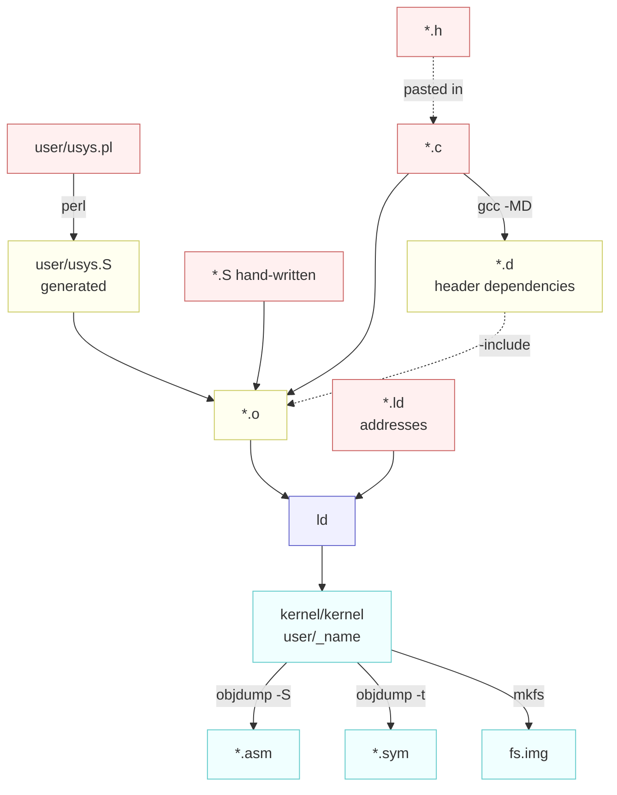
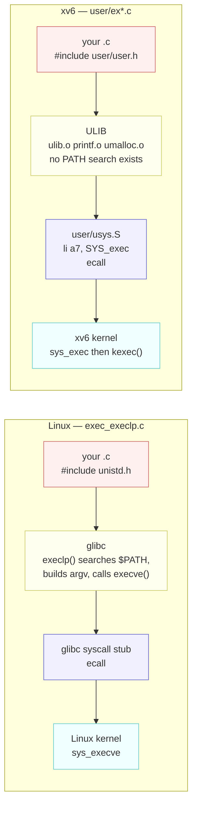

# Source and Build File Types

---

[toc]

---

What every file extension in this tree is, who produces it, and why an operating system needs four kinds of file that an ordinary C program never does.

> [!NOTE]
> The generic four-stage pipeline — preprocess, compile, assemble, link — is already covered in [C_Project_Build_Tool.md](../../c-programming/C_Project_Build_Tool.md), along with `.o` files, `.d` files, and Makefile mechanics. This page does not re-explain any of it. It covers what is different here, and why.

## Quick lookup

| Extension   | Kind       | What it holds                                                   | Produced by          | In git |
| ----------- | ---------- | --------------------------------------------------------------- | -------------------- | ------ |
| **`.c`**    | authored   | C source; one translation unit                                  | you                  | yes    |
| **`.h`**    | authored   | Declarations, macros, and struct layouts, pasted into a `.c`    | you                  | yes    |
| **`.S`**    | authored\* | Assembly, run through the C preprocessor first                  | you                  | yes    |
| **`.pl`**   | authored   | A Perl generator — here, the one that writes `user/usys.S`      | you                  | yes    |
| **`.ld`**   | authored   | A linker script: load address, section order, exported symbols  | you                  | yes    |
| **`.mk`**   | authored   | A Makefile fragment; `conf/lab.mk` selects the active lab       | you                  | yes    |
| **`.o`**    | generated  | One object file per `.c` or `.S` — machine code, not yet placed | `gcc -c`             | no     |
| **`.d`**    | generated  | A make rule listing every header that `.o` actually read        | `gcc -MD`            | no     |
| **`.asm`**  | generated  | Disassembly, interleaved with the source lines it came from     | `objdump -S`         | no     |
| **`.sym`**  | generated  | Address-to-symbol table, one symbol per line                    | `objdump -t`         | no     |
| **`_name`** | generated  | A linked user program, ready for `mkfs`                         | `ld -T user/user.ld` | no     |
| **`.img`**  | generated  | The filesystem image QEMU attaches as a disk                    | `mkfs/mkfs`          | no     |

\* `.S` is the one extension that appears on both sides. `kernel/entry.S`, `swtch.S`, `trampoline.S`, and `kernelvec.S` are written by hand; `user/usys.S` is generated by `user/usys.pl` and is `.gitignore`d like any other output.

Supporting files that are not part of the compile at all:

| File                                               | Role                                                                |
| -------------------------------------------------- | ------------------------------------------------------------------- |
| `gradelib.py`, `test-xv6.py`                       | MIT's grading harness and this repo's CI driver; run on the host    |
| `grade-lab-*`, `grade-ex1copy`                     | Python test scripts, extensionless because they are run as commands |
| `user/findtest.sh`, `sixfive.txt`                  | Lab fixtures copied into `fs.img` as data, never compiled           |
| `.github/workflows/test.yml`                       | CI definition                                                       |
| `.clang-format`, `.editorconfig`, `.dir-locals.el` | Editor and formatter configuration                                  |

## Where each one appears



## Why a header cannot do these jobs

A `.h` file does exactly one thing: it is text pasted into a `.c` before compilation. Everything else follows from that. It can _declare_ — promise that a symbol exists somewhere — but it cannot define machine code that C has no syntax for, it cannot say where anything lands in memory, and it cannot record a fact discovered while the build ran.

| The job                                                         | Why a `.h` cannot do it                                                                                                                    | What does it here                    |
| --------------------------------------------------------------- | ------------------------------------------------------------------------------------------------------------------------------------------ | ------------------------------------ |
| **Save 14 registers and switch stacks mid-function**            | The compiler owns register allocation and writes its own prologue and epilogue. C has no way to say "swap `sp` and return somewhere else". | `kernel/swtch.S`                     |
| **Execute `ecall`, `sret`, or write the `satp` register**       | No C construct emits these. They are the instructions that change privilege level and address space.                                       | `kernel/trampoline.S`, `user/usys.S` |
| **Run before a stack exists**                                   | C code needs `sp` already valid. `_entry` is the code that makes it valid.                                                                 | `kernel/entry.S`                     |
| **Define 22 near-identical trap stubs**                         | `user/user.h` can _declare_ all 22 — and does. It cannot define them, because the definition is four machine instructions.                 | `user/usys.pl` → `user/usys.S`       |
| **Put the kernel at `0x80000000` and export `etext` and `end`** | Addresses are the linker's business. No C declaration names a load address.                                                                | `kernel/kernel.ld`, `user/user.ld`   |
| **Record which headers each `.o` really used**                  | That is a fact about a compile that already happened, not something you could write in advance.                                            | `gcc -MD` → `.d`                     |
| **Show what the compiler actually generated**                   | It is output, not input.                                                                                                                   | `objdump -S` → `.asm`                |

> [!IMPORTANT]
> The header and the assembly file are partners, not alternatives. `kernel/defs.h` declares `void swtch(struct context*, struct context*);` and `kernel/swtch.S` defines it; `user/user.h` declares `int fork(void);` and `user/usys.S` defines it. The header is how C code _calls_ the thing. The `.S` file _is_ the thing.

### `.S` versus `.s`: the capital letter matters

A capital `.S` tells gcc to run the C preprocessor over the file before assembling it. That is the whole reason `user/usys.S` can open with

```asm
#include "kernel/syscall.h"
.global fork
fork:
 li a7, SYS_fork
 ecall
 ret
```

and write `SYS_fork` rather than the literal `1`. With a lower-case `.s` the preprocessor never runs, `#include` is meaningless, and every call number would have to be hand-copied — free to drift the moment someone renumbers `kernel/syscall.h`.

### Why generate `usys.S` instead of writing it

Twenty-two stubs, four lines each, differing only in one name. Three ways to get them:

| Approach                               | Cost                                                                                                    |
| -------------------------------------- | ------------------------------------------------------------------------------------------------------- |
| **Hand-written assembly**              | 88 lines to keep in sync with `kernel/syscall.h` by hand, forever.                                      |
| **A C macro emitting inline assembly** | Compiles, but the macro is harder to read than the assembly it hides, and the ABI details leak into it. |
| **A 20-line generator**                | Adding a system call is one `entry("name");` line. This is what the tree does.                          |

The generator also earns its keep by holding the one exception in a single `if`: `entry("sbrk")` emits the stub named `sys_sbrk`, leaving the plain `sbrk` name free for the `user/ulib.c` wrapper that supplies the eager/lazy mode. A hand-written file would hide that irregularity among 87 other lines.

> [!WARNING]
> Never edit `user/usys.S`. It opens with `# generated by usys.pl - do not edit`, it is deleted by `make clean`, and it is `.gitignore`d — your changes disappear at the next build with no error. Edit `user/usys.pl`.

## Why you cannot use the host's headers

A natural question when moving between [`../../operating-system/codes/`](../../operating-system/codes/src/main/virtualization/cpu-process-api/exec_family/exec_execlp.c) and `user/`: why does the Linux example open with `<unistd.h>` and `<sys/wait.h>` while every program here opens with `kernel/types.h` and `user/user.h`?

The intuitive answer — "those headers are not installed" — is wrong, and the real answer is more useful.

### The surprise: it compiles

`riscv64-linux-gnu-gcc` is the Debian cross compiler, and its package ships a full glibc sysroot. So the header **is** found:

```
/usr/riscv64-linux-gnu/include/unistd.h
/usr/riscv64-linux-gnu/include/sys/wait.h
```

Compiling a file that includes both, with this tree's exact flags, succeeds with no diagnostic at all. `-nostdlib` and `-ffreestanding` control _linking_ and what the compiler may assume — neither one hides a header.

### What actually fails: the link

Translating the `exec_execlp.c` example verbatim and linking it against `ULIB` and `user/user.ld` gives:

```
undefined reference to `__printf_chk'
undefined reference to `execlp'
undefined reference to `fflush'
undefined reference to `perror'
undefined reference to `stdout'
```

Those five have no implementation, because glibc is never linked in. But look at what is _missing_ from that list — `fork`, `getpid`, `wait`, and `exit` all resolved. They resolved to xv6's own stubs in `user/usys.S`, reached through **glibc's declarations**.

> [!CAUTION]
> That is the real hazard, and it is worse than a build failure. A program using `#include <stdio.h>` and `int n = printf(...)` — glibc declares `printf` returning `int`, xv6's returns `void` — compiles _and links cleanly_ against `ULIB`, producing a binary that reads a register glibc's prototype promised and xv6's implementation never set. Nothing warns you. The header being absent would be the safe outcome; the header being present and wrong is not.

`NULL` is the same trap in miniature. It is not defined anywhere under `kernel/` or `user/`, so `wait(NULL)` compiles only because a glibc header supplied it. In xv6 you write `wait(0)`.

### The same program on both systems



The shape is identical; only the fillings differ. Layer by layer:

| Layer                          | Linux                                                          | xv6                                                                                               |
| ------------------------------ | -------------------------------------------------------------- | ------------------------------------------------------------------------------------------------- |
| **Where the name is declared** | `<unistd.h>`, shipped with glibc                               | `user/user.h`, a file in this repository                                                          |
| **What supplies convenience**  | glibc: `$PATH` search, variadic argument lists, buffered stdio | Nothing. `ULIB` is four objects and adds no convenience layer                                     |
| **The trap stub**              | A glibc wrapper you never see                                  | `user/usys.S`, generated from `user/usys.pl`                                                      |
| **The instruction**            | `ecall` (or `syscall` on x86-64)                               | `ecall`                                                                                           |
| **Kernel entry**               | `sys_execve`                                                   | `sys_exec`, which calls `kexec()` in `kernel/exec.c`                                              |
| **Where the binary is found**  | Your filesystem, via `$PATH`                                   | `fs.img`, by exact name — see [02](02-build-boot-and-usage.md#adding-and-running-a-user-exercise) |

The difference is one layer thick, and it is the _library_ layer, not the kernel layer. Both systems end at `ecall`. glibc is a large body of code that turns convenient C into system calls; `ULIB` deliberately is not.

### Translating that example line by line

| `exec_execlp.c` uses      | Declared in    | xv6 equivalent                                                                                                                |
| ------------------------- | -------------- | ----------------------------------------------------------------------------------------------------------------------------- |
| `fork()`                  | `<unistd.h>`   | `fork()` — identical                                                                                                          |
| `getpid()`                | `<unistd.h>`   | `getpid()` — identical                                                                                                        |
| `wait(NULL)`              | `<sys/wait.h>` | `wait(0)` — `NULL` does not exist here                                                                                        |
| `execlp("ls", "ls", ...)` | `<unistd.h>`   | `exec("ls", argv)` with a null-terminated `char *argv[]`. There is no `exec*l*` family, no `$PATH`, and no environment at all |
| `printf(...)`             | `<stdio.h>`    | `printf(...)` exists in `user/printf.c` but returns `void`                                                                    |
| `fflush(stdout)`          | `<stdio.h>`    | Nothing to call. xv6's `printf` writes straight to descriptor 1, so there is no buffer to flush                               |
| `perror("fork")`          | `<stdio.h>`    | `fprintf(2, "fork failed\n")` — there is no `errno` and no `strerror`                                                         |
| `exit(EXIT_FAILURE)`      | `<stdlib.h>`   | `exit(1)`                                                                                                                     |
| `return EXIT_SUCCESS`     | `<stdlib.h>`   | `return 0`                                                                                                                    |

The pattern: **the system calls transfer unchanged, and everything glibc built on top of them does not.** `$PATH` lookup, variadic `exec` variants, buffered stdio, and `errno` are library conveniences, not kernel features — which is exactly the distinction the `man` section 2 versus section 3 split encodes. [05-syscall-reference.md](05-syscall-reference.md) lists what this tree does provide.

Names that survive the move can still carry different values. The `O_*` open flags are the sharpest case — `O_CREATE` is `0x200` here against `O_CREAT` at `0x40` on Linux, differing in spelling _and_ number — and the full comparison, along with the arity, `errno`, `lseek`, and limit differences, is tabulated in [Divergences from POSIX](05-syscall-reference.md#divergences-from-posix).

## Why this tree needs `.d` files

[C_Project_Build_Tool.md](../../c-programming/C_Project_Build_Tool.md) recommends skipping `.d` files for standalone `.c` files with no custom headers, and that advice is correct for that case. This tree is the opposite case: **18 tracked headers**, shared deeply. `kernel/param.h` alone is included by 22 of the kernel's `.c` files.

A `.d` file is just a make rule. Here is a real one, `user/ex1copy.d`:

```makefile
user/ex1copy.o: user/ex1copy.c kernel/types.h kernel/stat.h user/user.h
```

`CFLAGS += -MD` makes gcc emit one beside every object, and this line near the bottom of the [Makefile](../Makefile) reads them all back in:

```makefile
-include kernel/*.d user/*.d
```

The leading `-` means "silently skip if absent", so a freshly cleaned tree with no `.d` files still builds.

> [!CAUTION]
> Without dependency tracking, editing `kernel/param.h` — where `NPROC`, `NOFILE`, and `USERSTACK` live — would rebuild nothing. `make` would report everything up to date, and you would boot a kernel still compiled with the old constants. That is the worst failure a build system can produce, because it looks exactly like your change having no effect.

## Which files you may edit

| File                                               | Edit?   | Why                                                                    |
| -------------------------------------------------- | ------- | ---------------------------------------------------------------------- |
| `.c`, `.h`, hand-written `.S`, `.pl`, `Makefile`   | **Yes** | These are the sources.                                                 |
| `conf/lab.mk`                                      | **Yes** | One line; run `make clean` after changing it.                          |
| `.ld`                                              | Rarely  | Only with a specific reason. The addresses match `kernel/memlayout.h`. |
| `user/usys.S`                                      | **No**  | Generated. Edit `user/usys.pl`.                                        |
| `.o`, `.d`, `.asm`, `.sym`, `user/_name`, `fs.img` | **No**  | All outputs. Every one is regenerated and none is tracked.             |

The two you will _read_ constantly without ever editing are `.asm` and `.sym`. `kernel/kernel.asm` is regenerated on every kernel link and interleaves source with instructions:

```asm
0000000000000000 <main>:
int
main(void)
{
   0:	7119                	addi	sp,sp,-128
   2:	fc86                	sd	ra,120(sp)
```

It is the fastest way to turn a fault address into a line of C — see [Finding where the kernel crashed](02-build-boot-and-usage.md#finding-where-the-kernel-crashed).

## The same build, side by side

The direct answer to "why not just the plain workflow": every row below is a place where having no operating system underneath you changes what the build must produce.

| Concern             | Ordinary hosted C project            | xv6                                                                                |
| ------------------- | ------------------------------------ | ---------------------------------------------------------------------------------- |
| **Target**          | The machine you are typing on        | RISC-V, through a cross compiler. Nothing built here runs on your host.            |
| **Startup**         | `crt0` from libc runs before `main`  | You write it: `kernel/entry.S`, then `kernel/start.c`                              |
| **Load address**    | The OS loader chooses                | Fixed at `0x80000000` by `kernel/kernel.ld`; QEMU jumps straight there             |
| **Library**         | libc, linked automatically           | `ULIB` — four objects you compile, under `-nostdlib -ffreestanding`                |
| **System calls**    | libc wrappers you never see          | `user/usys.S`, generated from `user/usys.pl`                                       |
| **Headers**         | System headers plus a few of yours   | 18 shared headers, which is why `.d` files are mandatory here                      |
| **Privileged code** | None; the CPU never leaves user mode | Four hand-written `.S` files for traps, context switch, and boot                   |
| **Debug artifacts** | gdb against the source               | `.asm` and `.sym`, because there is no OS beneath you to ask                       |
| **Final output**    | One executable                       | A kernel ELF, one user ELF per `UPROGS` entry, and a filesystem image holding them |

Everything else is the same four stages that document already describes. The extra file types are not xv6 being unusual for its own sake; each one exists because some job in that table has no C-language expression.
