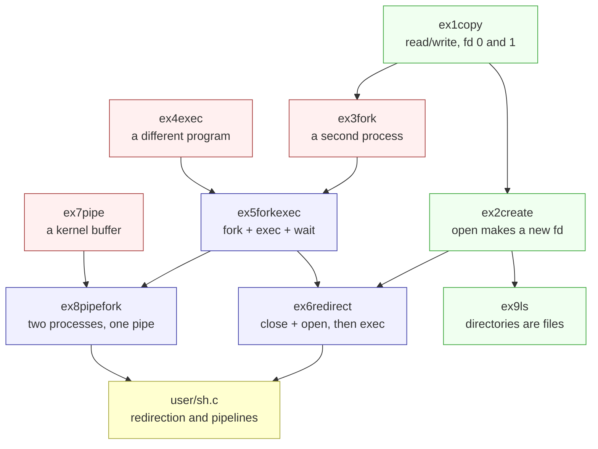
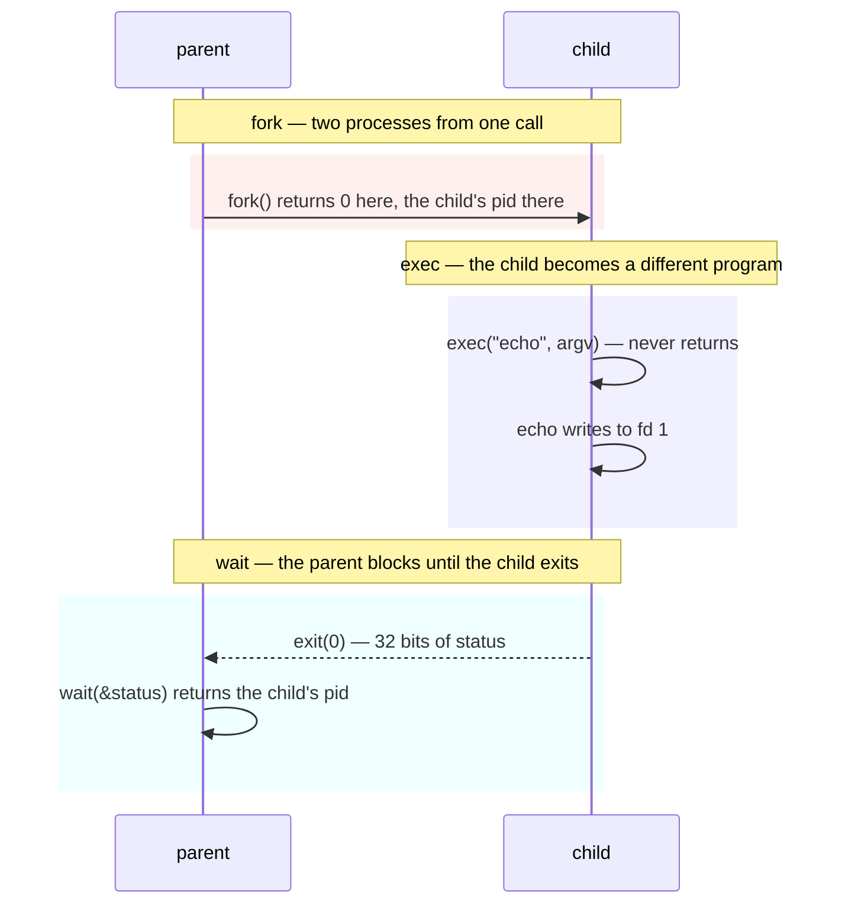

# Lecture Exercises

---

[toc]

---

The small programs the 6.1810 lectures hand out, one section each: what the exercise does, what its observable behaviour is, and where every idea it introduces lives in this tree.

> [!NOTE]
> This file owns the exercises themselves. The mechanics they all share — how a `.c` file under `user/` becomes an xv6 command, why the tree stays flat, and the house style a new program has to match — belong to [02-build-boot-and-usage.md](02-build-boot-and-usage.md#adding-and-running-a-user-exercise), and are not repeated here. To write the next one, use [`prompts/add-lecture-exercise.md`](prompts/add-lecture-exercise.md), which encodes the whole procedure; in Claude Code it is wired up as `/exercise`.

## The set

Lecture 1 ([`l-overview.txt`](lectures/l-overview.txt)) walks through nine example programs. Each is named `ex<N><verb>`, where `N` is the lecture's own numbering and the verb is the lecture's own wording — so `ex5forkexec` is lecture 1's `ex5.c`, described there as "fork() a new process, exec() a program".

| Exercise                                                      | Source               | Lecture                                                                | What it introduces                                                            |
| ------------------------------------------------------------- | -------------------- | ---------------------------------------------------------------------- | ----------------------------------------------------------------------------- |
| **[`ex1copy`](#ex1copy--the-lecture-1-input-filter)**         | `user/ex1copy.c`     | [`ex1.c`](https://pdos.csail.mit.edu/6.1810/2026/lec/l-overview/ex1.c) | `read`, `write`, descriptors 0/1/2, EOF, and what a Unix filter is            |
| **[`ex2create`](#ex2create--making-a-descriptor)**            | `user/ex2create.c`   | [`ex2.c`](https://pdos.csail.mit.edu/6.1810/2026/lec/l-overview/ex2.c) | `open`, the lowest-unused-descriptor rule, per-process descriptor name-spaces |
| **[`ex3fork`](#ex3fork--one-call-two-returns)**               | `user/ex3fork.c`     | [`ex3.c`](https://pdos.csail.mit.edu/6.1810/2026/lec/l-overview/ex3.c) | `fork`, parent/child, separate memory, and unordered output                   |
| **[`ex4exec`](#ex4exec--becoming-another-program)**           | `user/ex4exec.c`     | [`ex4.c`](https://pdos.csail.mit.edu/6.1810/2026/lec/l-overview/ex4.c) | `exec`, the argument array, and what survives an image replacement            |
| **[`ex5forkexec`](#ex5forkexec--the-shells-execution-model)** | `user/ex5forkexec.c` | [`ex5.c`](https://pdos.csail.mit.edu/6.1810/2026/lec/l-overview/ex5.c) | `wait`, exit status, and why `fork` and `exec` are two calls                  |
| **[`ex6redirect`](#ex6redirect--how--is-implemented)**        | `user/ex6redirect.c` | [`ex6.c`](https://pdos.csail.mit.edu/6.1810/2026/lec/l-overview/ex6.c) | `close` + `open` in the fork/exec window; redirection lives only in `sh`      |
| **[`ex7pipe`](#ex7pipe--a-buffer-with-two-descriptors)**      | `user/ex7pipe.c`     | [`ex7.c`](https://pdos.csail.mit.edu/6.1810/2026/lec/l-overview/ex7.c) | `pipe`, the kernel buffer, and why one process alone is a trap                |
| **[`ex8pipefork`](#ex8pipefork--two-processes-one-buffer)**   | `user/ex8pipefork.c` | [`ex8.c`](https://pdos.csail.mit.edu/6.1810/2026/lec/l-overview/ex8.c) | `pipe` + `fork`, and why EOF depends on closing unused ends                   |
| **[`ex9ls`](#ex9ls--a-directory-is-a-file)**                  | `user/ex9ls.c`       | [`ex9.c`](https://pdos.csail.mit.edu/6.1810/2026/lec/l-overview/ex9.c) | `struct dirent`, reading a directory with plain `read`                        |

They are not nine independent programs. Each one answers a question the previous one leaves open, and the last three are the shell's implementation taken apart:



Green is I/O, red is process and buffer creation, blue is the combinations that need both, and yellow is where the whole thing was going. Reading `user/sh.c` after `ex8pipefork` is the intended payoff — every construct in it has appeared by then.

> [!TIP]
> Run them in order in one session. Several depend on files an earlier one wrote: `ex9ls` shows the `ex2.out` and `ex6.out` that `ex2create` and `ex6redirect` leave behind, which is a cheap way to see that they really did touch the file system. `make qemu` rebuilds `fs.img` and discards them; `make qemu-fs` keeps them.

## `ex1copy` — the lecture 1 input filter

The official [Lecture 1 example](https://pdos.csail.mit.edu/6.1810/2026/lec/l-overview/ex1.c) is a filter: it copies every byte from descriptor 0 to descriptor 1 until `read()` returns 0 for EOF. It does not stop after one line, and it adds nothing to the data it copies.

### Waiting is part of the interface

Interactively, type a line, press Enter, and then press `Ctrl-d` at the next empty input position:

```text
$ ex1copy
ex1copy: copying standard input to standard output.
ex1copy: type a line and press Enter. Ctrl-d on an empty line finishes.
hello
hello
$
```

The first `hello` is the console echoing the keys you typed. The second is `ex1copy` writing the bytes returned by `read()`. The program then calls `read()` again, and `consoleread()` in `kernel/console.c` hands back at most one line per call — so once the typed input is drained, that read sleeps in the kernel. Pressing `Ctrl-d` there makes it return 0, which ends the loop and restores the shell prompt. The wait is expected input-filter behaviour, not a deadlock.

A finite pipeline supplies EOF automatically when its writer exits, and the two hint lines are gone:

```text
$ echo hello | ex1copy
hello
$
```

That difference is the point. A filter must not add bytes to its output, so the hint is bound by two rules that the program enforces itself:

| Rule                                        | Mechanism                                                                                                                                                              |
| ------------------------------------------- | ---------------------------------------------------------------------------------------------------------------------------------------------------------------------- |
| **It never travels with the data**          | The hint is written to descriptor 2, never 1, so `ex1copy > out` and `ex1copy \| wc` see only copied bytes.                                                            |
| **It only appears when a human is waiting** | `fstat(0, &st)` decides: `T_DEVICE` means the console, so print it; `T_FILE` means a redirect, so stay quiet; and a pipe makes `fstat()` fail outright, so stay quiet. |

That last case is not a special case in `ex1copy` — `filestat()` in `kernel/file.c` serves `FD_INODE` and `FD_DEVICE` and returns -1 for `FD_PIPE`, so one `fstat()` call separates all three sources for free.

> [!NOTE]
> Without the hint, an interactive run is visually identical to a hung program: no prompt, no output, no cursor movement. That is the single most common first-encounter confusion with Unix filters, and it is why [02's troubleshooting table](02-build-boot-and-usage.md#when-things-go-wrong) still carries a row for it — `cat` with no arguments behaves exactly the same way and says nothing at all.

### What lecture 1 uses it to teach

Twenty lines of C carry most of the Unix I/O model. The commentary block at the top of `user/ex1copy.c` is the long form; this is the map from each teaching point to the code in this tree that implements it.

| Teaching point                                                                                                 | Where it lives here                                                                                                                                                                      |
| -------------------------------------------------------------------------------------------------------------- | ---------------------------------------------------------------------------------------------------------------------------------------------------------------------------------------- |
| **`read()` and `write()` look like function calls but jump into the kernel, preserving user/kernel isolation** | `user/usys.S` loads a syscall number into `a7` and executes `ecall`; `kernel/syscall.c` dispatches to `sys_read` and `sys_write` in `kernel/sysfile.c`.                                  |
| **The first argument is a file descriptor, naming an already-open file**                                       | Resolved through `p->ofile[NOFILE]` in `kernel/proc.h`. `NOFILE` is 16, so one process can hold many descriptors.                                                                        |
| **An FD may be a file, a pipe, a device, or the console**                                                      | `struct file` carries a type tag; `kernel/file.c` `fileread()` branches on it, so the caller's code is identical for all four.                                                           |
| **FD 0 is standard input and FD 1 is standard output, by convention**                                          | `user/sh.c` arranges the descriptors before `exec`, and `user/init.c` guarantees 0, 1, and 2 exist at boot.                                                                              |
| **The second and third arguments are a destination address and a maximum byte count**                          | `read()` may return fewer bytes than requested and never more, which is why the program writes `n` and not `sizeof(buf)`.                                                                |
| **The return value is a byte count, `0` for EOF, or `-1` for an error**                                        | All three outcomes appear in the loop: positive drives the copy, zero exits it, negative reaches the `read error` branch.                                                                |
| **Unix I/O is untyped 8-bit bytes**                                                                            | Nothing in `ex1copy` inspects `buf`. Interpreting the bytes as text, a record, or an image is the application's job, never the kernel's.                                                 |
| **A program can still ask what kind of thing a descriptor names**                                              | `fstat(0, &st)` reports `T_DEVICE` for the console and `T_FILE` for a redirect, and fails for a pipe. `ex1copy` uses it for one decision only: whether a human is sitting there waiting. |

The lecture ends on an open question — how do you make a _new_ file descriptor? — and the answer is `open()`, `pipe()`, and `dup()` in `user/user.h`. `user/sh.c` builds every redirection and pipeline out of those three plus `close()`, resting entirely on `fdalloc()`'s lowest-unused-descriptor rule; see [book/ch01](book/ch01-operating-system-interfaces.md#descriptors-two-levels-of-indirection).

### Questions the source raises

Five things in `user/ex1copy.c` look arbitrary until you follow them into the kernel. The source carries the same answers inline, next to the code each one explains.

#### Why `fstat(0, …)` rather than `fstat(1, …)`?

The hint answers exactly one question — _is a human about to type at me?_ — and that is a property of the input side alone. The two sides come apart in both directions: `ex1copy > out` leaves descriptor 1 on a file while somebody still waits at the keyboard, and `echo hi | ex1copy` leaves descriptor 1 on the console with nobody typing. `fstat()` takes a descriptor rather than a path, so it reports on whatever `sh` wired to 0 before `exec`, which is precisely the thing in doubt.

#### What counts as `T_DEVICE` besides the console? Is the display separate?

In this tree, nothing else, and no. `T_DEVICE` is the inode type that `mknod()` stamps in `sys_mknod()` (`kernel/sysfile.c`), and the only `mknod()` call in the entire source tree is `mknod("console", CONSOLE, 0)` in `user/init.c` — so `console` is the only device file that exists. Keyboard and display are not two devices either: one inode with major number `CONSOLE` covers both directions, because `consoleinit()` registers `devsw[CONSOLE].read = consoleread` and `devsw[CONSOLE].write = consolewrite` over the same UART.

| Symbol         | Defined in       | What it actually bounds                                                         |
| -------------- | ---------------- | ------------------------------------------------------------------------------- |
| **`T_DEVICE`** | `kernel/stat.h`  | inode type `3`, written only by `mknod()`, never by `create()` for a plain file |
| **`CONSOLE`**  | `kernel/file.h`  | major number `1`, the only major number anything claims                         |
| **`NDEV`**     | `kernel/param.h` | size of `devsw[]` — room for ten majors, nine of which stay empty               |

> [!NOTE]
> On Linux the same test would pass for every character device — `/dev/null`, a disk, any tty — which is why portable filters call `isatty()` instead of inspecting the file type. xv6 has no `isatty()`, and with a single device file it does not need one.

#### Why write the hint to descriptor 2 when it is not an error?

Descriptor 2 is better read as the _out-of-band_ descriptor than as the error one: it is what stays pointed at the terminal when `>` moves descriptor 1 somewhere else. Anything _about_ the run rather than _part_ of it belongs there — errors, progress, prompts, and this hint. The filter rule is what forces the choice: `ex1copy > out` and `ex1copy | wc` must see the input bytes and nothing more, and `sh` redirects only the descriptor you name.

#### Why `fprintf(2, …)` rather than `printf(…)`?

`printf()` in `user/printf.c` is `vprintf(1, …)` with descriptor 1 hardwired; `fprintf()` takes the descriptor as its first argument. xv6 has no `FILE`, no `stderr` stream, and no `fdopen()` — `user/user.h` declares exactly these two functions — so `fprintf(2, …)` is the only way to reach descriptor 2 at all.

#### Where is Ctrl-d implemented?

Nowhere in `ex1copy.c`, which never names it: `read()` returns 0 and the `> 0` loop test does the rest. Two functions in `kernel/console.c` produce that zero.

| Function            | What it does with `C('D')`                                                                                                                                                     |
| ------------------- | ------------------------------------------------------------------------------------------------------------------------------------------------------------------------------ |
| **`consoleintr()`** | Accepts byte `0x04` — `C(x)` is `((x) - '@')` — as a line terminator alongside `'\n'`, advancing `cons.w` and waking a sleeping reader even though no newline arrived.         |
| **`consoleread()`** | Pulls that byte back out, `break`s without copying it, and returns `target - n`. At an empty position nothing has been copied yet, `n` is still `target`, and the result is 0. |

That is also the whole content of "on an empty line". Type `abc` and then Ctrl-d, and `consoleread()` takes its `if (n < target) cons.r--` branch, pushing the Ctrl-d back into the buffer so that `read()` returns three bytes and only the _next_ call returns 0 — a partial line needs two presses.

### Regression tests

[`grade-exercises`](../grade-exercises) holds three tests for `ex1copy`, each pinning one of the behaviours above:

| Test                                     | What it asserts                                                                                                                                                        |
| ---------------------------------------- | ---------------------------------------------------------------------------------------------------------------------------------------------------------------------- |
| **`copies finite piped input`**          | A 71-byte payload survives `echo … \| ex1copy` byte for byte. It deliberately exceeds `buf[64]`, so the copy takes two loop iterations rather than one.                |
| **`interactive input ends with Ctrl-d`** | Each typed line appears exactly twice — console echo, then the copy — and `\x04` at an empty position lets the shell go on to run the next command.                    |
| **`reports a closed output pipe`**       | With a reader that exits first, `write()` returns -1 and the program prints `ex1copy: write error` and exits, instead of looping back into `read()` and waiting there. |

```bash
./grade-exercises                          # every exercise, 12 tests
./grade-exercises ex1copy                  # just this one
./grade-exercises "closed output pipe"     # one test, by name
```

Filtering is a substring match against the test title, and every title is prefixed with its exercise name — see [the suite](#regression-suite) below. The harness itself — how it boots QEMU, drives the shell, and pattern-matches the transcript — is described in [03-lab-workflow.md](03-lab-workflow.md#grading).

## `ex2create` — making a descriptor

`ex1copy` ends on the lecture's open question: how do you make a _new_ file descriptor? `open()` is the first of the three answers, and the exercise exists to show the number it hands back.

```text
$ ex2create
ex2create: open() returned fd 3
$ cat ex2.out
Hello
```

### Why the answer is always 3

Nothing in the program chooses 3. `fdalloc()` in `kernel/sysfile.c` scans `p->ofile[]` from index 0 and returns the first empty slot, and slots 0, 1, and 2 were filled before `main()` started — `user/init.c` opens the console and `dup()`s it twice, and `sh` inherits all three through `fork()`.

| Slot  | Holds                    | Put there by                     |
| ----- | ------------------------ | -------------------------------- |
| **0** | the console, for reading | `user/init.c`, inherited by `sh` |
| **1** | the console, for writing | `dup(0)` in `user/init.c`        |
| **2** | the console, for writing | `dup(0)` in `user/init.c`        |
| **3** | _empty_                  | ← `fdalloc()` picks it           |

That rule is not a curiosity. It is load-bearing: `close(1)` frees slot 1, so the next `open()` is _guaranteed_ to land there, which is the entire mechanism behind [`ex6redirect`](#ex6redirect--how--is-implemented).

### Two levels of indirection

`open()` builds a chain, and later exercises depend on knowing where it can be cut:

```text
p->ofile[3]  ──►  struct file  ──►  inode
 (per process)     (holds the        (holds the
                    offset)           data)
```

`fork()` copies the first level and _shares_ the second, which is why a parent and child writing the same descriptor append in turn rather than overwriting each other. `dup()` does the same. Two descriptors share an offset if and only if they came from the same original by `fork()` or `dup()` — never merely by opening the same file twice.

### What xv6 leaves out

| Compared with Linux           | In xv6                                                                                                                                 |
| ----------------------------- | -------------------------------------------------------------------------------------------------------------------------------------- |
| **`open(path, flags, mode)`** | Two arguments only. There are no users, groups, or permission bits, so there is no `mode` to pass.                                     |
| **`O_CREAT`**                 | Spelled `O_CREATE`, in `kernel/fcntl.h`. Five flags exist in total: `O_RDONLY`, `O_WRONLY`, `O_RDWR`, `O_CREATE`, `O_TRUNC`.           |
| **`lseek`**                   | Absent. The book names it as one of the basic calls that make xv6 non-POSIX; an offset only ever moves forward, by reading or writing. |

### Errors, deliberately not ignored

The lecture slide says of its own examples: "these examples ignore errors — don't be this sloppy!" The official `ex2.c` does ignore them; this version does not, because neither failure announces itself where it happens.

| Ignored                 | What you actually see                                                                                                          |
| ----------------------- | ------------------------------------------------------------------------------------------------------------------------------ |
| **`open()` returns -1** | `write(-1, …)` fails silently, the program reports success, and `cat ex2.out` says it cannot open the file — three steps away. |
| **`write()` short**     | A truncated or empty file, and no message at all.                                                                              |

## `ex3fork` — one call, two returns

```text
$ ex3fork
(ex3fork) fork() returned 6  (I am pid 5)
(ex3fork) fork() returned 0  (I am pid 6)
(ex3fork) parent: my child is pid 6
(ex3fork) child: my own pid is 6
```

One `printf()` in the source; two lines on the console. That is the exercise. After `fork()` there are two processes executing the same instructions, and the only thing distinguishing them is the value the call returned.

| Return  | In which process | Means                                                                           |
| ------- | ---------------- | ------------------------------------------------------------------------------- |
| **> 0** | the parent       | the child's pid — the parent is told who its child is, so it can `wait()` later |
| **0**   | the child        | "you are the new one"; 0 is a pid no process can have                           |
| **-1**  | the parent       | no child was created: `NPROC` reached, or out of memory                         |

`fork()` copies instructions, data, stack, the descriptor table, and the current directory. From that moment the two memories are separate — the program sets `x` to different values in each half to make that concrete — while the file _offsets_ behind the copied descriptors stay shared.

### The output is not just reordered, it is interleaved mid-word

A real run looks like this:

```text
(ex3fork) forke(x3for)k returned : fork() retu6r n e(dI  0  (I ama mp
```

> [!IMPORTANT]
> `printf()` in `user/printf.c` is **not atomic**. It formats into a small buffer and calls `write()` as it goes, and the scheduler can switch processes between those writes. With the default `CPUS=3` the two processes are genuinely running at the same instant on different harts, and `uartputc()` takes a lock per _character_ rather than per line — so the granularity of the mixing is a byte.

This is the first appearance of the problem the locking and scheduling chapters exist to solve. `make qemu CPUS=1` usually produces whole lines, which is not a fix — it only makes the race harder to hit.

A third process joins in: `sh` forked this program and is sitting in `wait()`, which returns as soon as _its_ child exits. The child here may still be running then, so the `$` prompt can land in the middle. The prompt is not a promise that everything finished.

This program deliberately omits `wait()` so the raw behaviour is visible. A parent that exits first leaves an **orphan**, which `kexit()` reparents to `init` (pid 1); `init` waits in a loop forever so no exited process stays a zombie.

## `ex4exec` — becoming another program

```text
$ ex4exec
this is echo
```

The program you typed printed nothing. `this is echo` came from `user/echo.c`, running in the very process that started as `ex4exec`. No new process was created — two programs took turns inside one pid.

| Replaced by `exec()` | Preserved across `exec()` |
| -------------------- | ------------------------- |
| instructions         | pid                       |
| data and stack       | the file descriptor table |
| heap                 | the current directory     |
|                      | the parent relationship   |

The preserved column is the one that matters. Because `exec()` keeps the descriptor table, a caller can rearrange descriptors _first_ and then `exec()` a program that knows nothing about the rearrangement — which is exactly how `>` and `|` are implemented.

`kexec()` in `kernel/exec.c` swaps the new page table in as its **last** step, so a failure at any earlier point leaves the original program intact and lets `exec()` return -1 into it.

### Why the argument array ends in `0`

Because nothing else says how long it is. `exec()` takes no count, so the kernel walks the array until it finds a null pointer. From `sys_exec()` in `kernel/sysfile.c`:

```c
for (i = 0;; i++) {
  if (i >= NELEM(argv)) goto bad;                        // MAXARG (32) reached
  if (fetchaddr(uargv + sizeof(uint64) * i, &uarg) < 0) goto bad;
  if (uarg == 0) { argv[i] = 0; break; }                 // the terminator
  ...
}
```

Omit the `0` and the loop keeps fetching whatever follows the array on the stack. It does not run away forever — `MAXARG` stops it after 32 entries — but it either copies garbage as arguments or hits `bad` and returns -1. A missing terminator is therefore an `exec` that mysteriously fails, or a program receiving arguments nobody typed. Same rule as a C string's trailing NUL, one level up: an array of `char` needs a sentinel byte, an array of `char *` needs a sentinel pointer.

`argv[0]` is conventionally the program's own name. Nothing enforces it, and `user/echo.c` ignores it entirely — its loop starts at `argv[1]`, which is why the output above begins at `this`.

> [!NOTE]
> `exec()` does not return on success, so the statement _after_ it is the error path. No `if` is needed there, and adding one would misrepresent the control flow.

### Why this program is useless on its own

`exec()` consumed the caller. A shell cannot work this way: if `sh` called `exec()` directly it would _become_ `echo`, print, exit, and never read a second command. The fix is to `exec()` in a process you can afford to lose — which is the next exercise.

### Why there is no `fork()` here

Because the exercise is about what `exec()` does, and forking first would hide it. `exec()` replaces the program inside _this_ process — same pid, same descriptors, same parent — and the proof is that `this is echo` appears while `ex4exec`'s own error line never runs. Add a `fork()` and you are watching two processes instead of one program becoming another, which is [`ex5forkexec`](#ex5forkexec--the-shells-execution-model).

| Shape                                    | The caller afterwards                                 | Good for                                 |
| ---------------------------------------- | ----------------------------------------------------- | ---------------------------------------- |
| **`exec()` alone**                       | gone — its instructions no longer exist               | the _last_ thing a process ever does     |
| **`fork()`, then `exec()` in the child** | untouched, and holding the child's pid to `wait()` on | a shell, which must print another prompt |

> [!TIP]
> `exec()` is a career change, not a hire. The person keeps their badge, keys, and desk — pid, descriptors, current directory, parent — and forgets every trade they knew. A shopkeeper who does that stops being a shopkeeper, and nobody is left to serve the next customer. `fork()` then `exec()` is hiring instead: a copy of you walks off and becomes the new thing while you stay behind the counter.

`ex4exec` can afford the career change because it has nothing left to do.

## `ex5forkexec` — the shell's execution model

```text
$ ex5forkexec
ex5forkexec: parent waiting for child 9
THIS IS ECHO
ex5forkexec: child 9 exited with status 0
```

Unlike `ex3fork`, the order is fixed after the first line: `wait()` does not return until the child is gone, so the exit message can never precede the child's output. This is the complete shape of what `user/sh.c` does for **every** command you type.



### `wait()` does not order what comes _before_ it

The first line still races, and a real run shows it:

```text
$ ex5forkexec
ex5forkexec: parenTHIS t ISw aECHO
iting for child 8
ex5forkexec: child 8 exited with status 0
```

The `parent waiting` message is printed in the gap between `fork()` and `wait()`, so it competes with the child's `THIS IS ECHO` exactly as the two halves of [`ex3fork`](#ex3fork--one-call-two-returns) compete — same non-atomic `printf()`, same per-character `uartputc()` lock. `wait()` orders everything after the call and nothing before it. Move the message above the `fork()`, or below the `wait()`, and the run comes out clean.

> [!WARNING]
> A run that prints only `exec ex5forkexec failed` is **not** this program. `ex5forkexec` says `ex5forkexec: exec echo failed`; that wording is `user/sh.c:80`, so it is the _shell_ failing to exec the name it read — the exercise never started. `consoleintr()` in `kernel/console.c` drops a character outright when the 128-byte line buffer is full (`if (c != 0 && cons.e - cons.r < INPUT_BUF_SIZE)`) and echoes nothing for it, so typed-ahead or pasted input can hand `sh` a name that is not on disk. Feeding qemu 100 command lines at once reproduces it with the damage visible: `exec ex5forkexx5fokrc failed`. Feeding 120 runs one line per prompt: 120 finished, zero failures.

### `wait()` returns a pid and delivers status through a pointer

One integer cannot carry both the identity of the child and the value it exited with, so the status leaves through an out-parameter.

| Return  | Means                                                                                                                                |
| ------- | ------------------------------------------------------------------------------------------------------------------------------------ |
| **> 0** | the pid of a child that exited. With several children this is how you learn _which_ — `wait()` reaps any, and xv6 has no `waitpid()` |
| **-1**  | the caller has no children at all                                                                                                    |

`wait()` blocks only if no child has exited _yet_. One that finished earlier is already a **zombie** — exited but retained so its status can still be collected — and `wait()` returns from it immediately. `kexit()` sets `p->state = ZOMBIE` and wakes the parent; `kwait()` copies `p->xstate` out and calls `freeproc()`. A parent that never waits is what `user/zombie.c` demonstrates.

Passing `0` instead of an address tells the kernel to skip the store — `kwait()` guards it with `if (addr != 0 && copyout(...) < 0)`. That is the documented way to say "I don't want the status", and it is what [`ex6redirect`](#ex6redirect--how--is-implemented) does.

The exit status is convention, not enforcement: `0` for success, non-zero for failure. It is how a child reports an outcome to a parent that cannot see its memory, and 32 bits is the entire channel.

### Why `fork` and `exec` are not one call

The gap between them is where redirection and pipelines are built. Code running in the child after the `fork` but before the `exec` can change the child's world — and only the child's — without the parent or the exec'd program knowing.

> [!NOTE]
> The xv6 book makes the counterfactual explicit: a combined `forkexec()` would force the shell to modify its own I/O and undo it afterwards, or take redirection instructions as arguments, or (least attractively) teach every program like `cat` to do its own redirection.

`fork()` copies the whole address space and `exec()` discards it instructions later. Real kernels avoid the waste with copy-on-write, which is the `cow` lab.

## `ex6redirect` — how `>` is implemented

```text
$ ex6redirect
ex6redirect: parent waiting for child 11
ex6redirect: child 11 finished; try `cat ex6.out`
$ cat ex6.out
ex6redirect's redirected echo
```

`echo`'s output never reaches the console, and nothing about `echo` changed. The child rewired descriptor 1 before exec'ing it.

```text
child's FD table       close(1)              open("ex6.out", ...)
+--------------+       +--------------+      +--------------------+
| 0 -> console |       | 0 -> console |      | 0 -> console       |
| 1 -> console |  ==>  | 1 <empty>    |  ==> | 1 -> ex6.out       |
| 2 -> console |       | 2 -> console |      | 2 -> console       |
+--------------+       +--------------+      +--------------------+
                              ^                       ^
                slot 1 is now the lowest    fdalloc() must pick it
                free slot in the table      — there is no choice
```

Three properties combine, and removing any one breaks it:

| Step               | What it provides                                           |
| ------------------ | ---------------------------------------------------------- |
| **`fork()`**       | a process whose descriptors can safely be damaged          |
| **`close`+`open`** | puts the file where the program will look for descriptor 1 |
| **`exec()`**       | keeps the table while replacing the program                |

Descriptor 2 is untouched, which is why an error from `echo` would still reach the terminal — `>` redirects only the descriptor you name. That is the same reason `ex1copy` puts its hint on 2.

### Why the parent is unaffected

`close(1)` runs in the child, whose descriptor table is a _copy_ made by `fork()`. Closing a slot marks `p->ofile[1] = 0` in one `struct proc` only. This is precisely why the shell must fork before redirecting: a shell that closed its own descriptor 1 would lose the terminal permanently, and every later prompt would land in whatever file the last command mentioned.

> [!TIP]
> The `(int *)` cast in `wait((int *)0)` is style, not necessity — a bare `0` is a valid null pointer constant and compiles identically. The xv6 book writes the cast to make the argument's type visible; `user/sh.c` writes plain `wait(0)`. Both appear in this tree. The cast is worth keeping where a lone `0` would read like a status _value_.

## `ex7pipe` — a buffer with two descriptors

```text
$ ex7pipe
ex7pipe: pipe() gave read fd 3, write fd 4
xyz
```

One `pipe()` call, two descriptors, one kernel object:

| `fds[]`      | End   | Direction       | Blocks when                                   |
| ------------ | ----- | --------------- | --------------------------------------------- |
| **`fds[0]`** | read  | out of the pipe | the buffer is empty and a writer still exists |
| **`fds[1]`** | write | into the pipe   | the buffer is full and a reader still exists  |

The buffer is `char data[PIPESIZE]` — 512 bytes — in `kernel/pipe.c`. It is not a file, nothing touches the disk, and it has **no name in the file system**, which is why a pipe can only be handed to another process by `fork()`.

Nothing here uses a pipe-specific call. `read()` and `write()` are the same ones from `ex1copy`; `fileread()` and `filewrite()` branch on `f->type` and forward to `piperead()`/`pipewrite()`. That uniformity is the whole abstraction: `ls | grep x` works because `grep` reads descriptor 0 with no idea a pipe is behind it.

> [!WARNING]
> **This one-process version works only by staying under the buffer size.** Write more than `PIPESIZE` with nobody draining the other end and the program hangs on itself — `pipewrite()` sleeps at `pi->nwrite == pi->nread + PIPESIZE` waiting for a reader that is this same, now-sleeping, process. A pipe is a rendezvous between two schedulable things. `Ctrl-p` dumps the process table and shows it stuck in state `sleep`.

A pipe has no EOF marker in the data. `read()` returns 0 only when the buffer is empty **and** every write-end descriptor has been closed. Until then, an empty pipe means "wait", not "finished" — which is the subject of the next exercise.

## `ex8pipefork` — two processes, one buffer

```text
$ ex8pipefork
ex8pipefork: parent read 17 bytes: hello from child
```

The bytes crossed a process boundary. Neither process can see the other's variables, so the pipe is the only channel between them.

### `pipe()` must come before `fork()`

A pipe has no name, so no process can `open()` one somebody else created. The only route is inheritance: make the pipe first, then fork, and the child's copied descriptor table already points at the same kernel buffer. Reversing the order gives each process a private, unconnected pipe.

After the fork there are **four** descriptors on one pipe — two read ends and two write ends. That is one more of each than the design needs, and the extras are not harmless.

### Closing unused ends is protocol, not hygiene

`piperead()` sleeps while `pi->nread == pi->nwrite && pi->writeopen`, and `pipeclose()` clears `writeopen` only when the _last_ writer goes away. So a parent holding its own copy of the write end keeps the pipe open forever, even after the child exits:

```text
parent forgets close(fds[1])
  → child exits, its write end closes
  → writeopen is still 1, because the parent still holds one
  → parent's read() sees an empty buffer and sleeps
  → nothing will ever write, and nothing will ever close
```

The mirror-image rule holds on the other side: if every read end closes while a writer is still writing, `pipewrite()` sets the writer's `p->killed` and `write()` returns -1 — xv6's stand-in for `SIGPIPE`, and what the `reports a closed output pipe` test exercises.

> [!NOTE]
> This program reads a fixed byte count and would survive the mistake. The closes are there anyway, because in a real pipeline the reader always waits for EOF.

### How the shell goes one step further

`ls | grep x` needs something this file does not show. Here the parent reads descriptor 3 knowingly; `grep` must read descriptor 0, because that is all any program knows. The shell bridges the gap with `dup()`:

```c
close(0);          // give up the console
dup(p[0]);         // the pipe's read end lands in slot 0
close(p[0]);       // drop the now-redundant original
close(p[1]);       // and the write end, so EOF can happen
exec("grep", argv);
```

Same lowest-free-descriptor rule as `ex6redirect`, with `dup()` in place of `open()` because the target is an existing descriptor rather than a file. A pipe is one-directional — writing to `fds[0]` fails — so two-way conversation needs two pipes, which is exactly the chapter 1 exercise in the xv6 book.

## `ex9ls` — a directory is a file

```text
$ ex9ls
.
..
README
cat
echo
...
```

There is no `opendir()`, no `readdir()`, and no directory-listing system call. A directory is a file whose contents are a plain array of fixed-size records, and you list it with the same `open()` and `read()` as everything else. From `kernel/fs.h`:

```c
#define DIRSIZ 14

struct dirent {
  ushort inum;                 // which inode, or 0 for a free slot
  char name[DIRSIZ] __attribute__((nonstring));
};
```

Sixteen bytes per entry, so a directory of _n_ entries is exactly 16*n* bytes. The read loop therefore contains no parsing at all: each `read()` of `sizeof(de)` bytes lands one whole record, and the file's length says when to stop.

### Three details the loop must get right

| Detail                                     | Why, and what happens otherwise                                                                                                                                                                                                        |
| ------------------------------------------ | -------------------------------------------------------------------------------------------------------------------------------------------------------------------------------------------------------------------------------------- |
| **Skip entries with `inum == 0`**          | Those are free slots. `unlink()` blanks a `dirent` by zeroing it rather than compacting the directory, so the array is sparse. Printing them yields blank lines and stale names.                                                       |
| **Do not assume `name` is NUL-terminated** | It is marked `__attribute__((nonstring))`: a 14-character name fills the field with no room for a terminator, so `printf("%s")` would run off the end into the next record. Copy into a `DIRSIZ + 1` buffer and terminate it yourself. |
| **Read whole records**                     | `== sizeof(de)` is both the loop condition and the guard — a short read means the directory ended, and a partial record is never processed.                                                                                            |

`ex9ls` also calls `fstat()` first and rejects anything that is not `T_DIR`. Without that check a plain file would be read 16 bytes at a time and its contents printed as names, with the first two bytes of every chunk silently taken for an inode number.

### `.` and `..` are real entries

Not shell syntax, and not special-cased by the program: they are written into every directory when `create()` makes it. `.` links to the directory itself and `..` to its parent, which is how relative path resolution works at all — `namei()` just walks entries by name.

So `open(".", O_RDONLY)` opens the process's current directory, tracked as `p->cwd` and changed with `chdir()`.

> [!IMPORTANT]
> This is why `cd` had to be built **into** the shell rather than shipped as a program. `sh` forks a child for each command, so a `cd` running as its own process would change that child's `p->cwd` and exit, leaving the shell exactly where it was.

### Why the program cannot write the directory back

Reading a directory is allowed; writing one is not. `sys_open()` refuses a directory opened with anything but `O_RDONLY`. Only the kernel edits directory contents, through `create()`, `sys_link()`, and `sys_unlink()`.

The reason is integrity: a directory entry references an inode, and the inode's `nlink` count must stay in step with it. A user program writing raw bytes could produce an entry pointing at a free inode, or a link count nothing agrees on — a corrupt file system with no way back. Early Unix did allow this, and it is one of the places where later designs tightened the interface.

## Regression suite

[`grade-exercises`](../grade-exercises) covers all nine, twelve tests in about twelve seconds. Each test pins a claim this document or a source comment makes as fact — the point is that the prose cannot drift away from the programs without something going red.

| Test              | The claim it pins                                                                                                                                                              |
| ----------------- | ------------------------------------------------------------------------------------------------------------------------------------------------------------------------------ |
| **`ex1copy`** ×3  | Filter semantics: a finite pipe is copied byte for byte, `Ctrl-d` at an empty position ends an interactive run, and a closed reader produces `write error` rather than a hang. |
| **`ex2create`**   | `open()` returns **3**, and `Hello` reaches the disk.                                                                                                                          |
| **`ex3fork`**     | Both branches run, and each writes its **own** `x` — the address spaces are copies, not shared.                                                                                |
| **`ex4exec`**     | `echo`'s output appears and `ex4exec` prints nothing of its own, because the statement after a successful `exec()` never runs.                                                 |
| **`ex5forkexec`** | Every byte the child wrote is out **before** the parent's status line.                                                                                                         |
| **`ex6redirect`** | The redirected text reaches the console **only** via `cat`, never while the program runs.                                                                                      |
| **`ex7pipe`**     | `pipe()` returns descriptors 3 and 4, and the bytes come back.                                                                                                                 |
| **`ex8pipefork`** | All 17 bytes cross the process boundary.                                                                                                                                       |
| **`ex9ls`** ×2    | `.` and `..` are listed, free slots are skipped, and a plain file and a missing path are both rejected with a message rather than garbage.                                     |

Several of these pin _kernel_ invariants rather than program output — `fdalloc()`'s lowest-free rule, `exec()` preserving the descriptor table, `wait()` ordering. **A lab that touches `kernel/proc.c`, `kernel/exec.c`, or `kernel/sysfile.c` should run this suite**; it will tell you within seconds whether you changed a user-visible contract.

> [!IMPORTANT]
> Two of these assertions were **vacuous when first written**, and only mutation testing found it. Deleting `ex9ls`'s `inum == 0` skip did not fail the test, because a freshly built `fs.img` has no free slots to leak and a `.strip()` was deleting the trailing blank lines that would have proved it. Deleting `ex5forkexec`'s `wait()` did not fail it either, because with three harts the child usually wins the race anyway. The suite now creates a hole on purpose and pins that test to `CPUS=1`. **If you add a test here, break the code deliberately and confirm it goes red** — a green test that cannot fail is worse than no test, because it is trusted.

## Adding the next one

The naming rule is `ex<N><verb>`: `N` from the lecture's own numbering, verb from the lecture's own wording, and the whole guest command name at most **14 bytes** because `DIRSIZ` in `kernel/fs.h` bounds every filename in `fs.img`.

The full procedure — the checklist, the comment-block shape, the verification loop — is [`prompts/add-lecture-exercise.md`](prompts/add-lecture-exercise.md), runnable as `/exercise` in Claude Code and copy-pasteable into any other agent. The build-side mechanics it depends on are in [02-build-boot-and-usage.md](02-build-boot-and-usage.md#adding-and-running-a-user-exercise).
