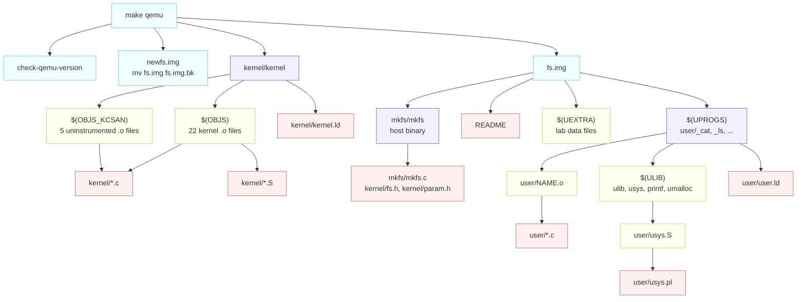
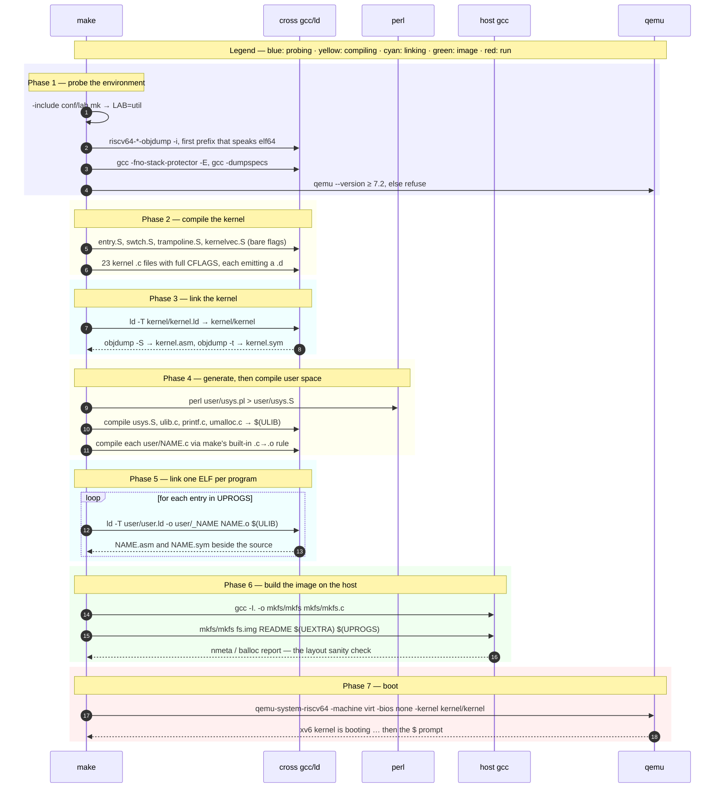

# The Build: A Tour of the Makefile

---

[toc]

---

How [`Makefile`](../Makefile) turns this tree into a bootable machine: where the build starts, which objects exist and why, how the three link steps differ, what each `make` target actually depends on, and where every construct differs from an ordinary C project's Makefile.

> [!NOTE]
> This page assumes the generic material and does not repeat it.
>
> - **Makefile syntax** — targets, prerequisites, `.PHONY`, pattern rules, automatic variables, functions, conditionals — is in [C_Project_Build_Tool.md § Makefile Comprehensive Tutorial](../../c-programming/C_Project_Build_Tool.md#makefile-comprehensive-tutorial).
> - **The four compilation stages** and what a `.o` or `.d` file is are in the same document, [§ Compilation Process Stages](../../c-programming/C_Project_Build_Tool.md#compilation-process-stages).
> - **What each file extension in this tree holds** — `.S`, `.pl`, `.ld`, `.sym`, `.asm`, `_name`, `.img` — is in [06-build-artifacts.md](06-build-artifacts.md).
>
> What follows is only the part that is specific to building an operating system.

## The three outputs

Everything the Makefile does exists to produce exactly three kinds of thing. Keep them separate in your head and the rest of the file reads easily.

| Output          | What it is                                                          | Built by                        | Runs on              |
| --------------- | ------------------------------------------------------------------- | ------------------------------- | -------------------- |
| `kernel/kernel` | One ELF, linked at a fixed physical address                         | cross `gcc` + `ld -T kernel.ld` | The emulated RISC-V  |
| `user/_NAME`    | One standalone ELF per user program, 21 of them plus per-lab extras | cross `gcc` + `ld -T user.ld`   | The emulated RISC-V  |
| `fs.img`        | A 2 MB disk image containing all of the `_NAME` ELFs                | `mkfs/mkfs`, compiled natively  | Nothing — it is data |

`make qemu` then boots the emulator with the first as its kernel and the third as its disk. There is no bootloader and no installer step; QEMU loads the ELF and jumps to it.

> [!IMPORTANT]
> **Cross compilation is the fact that explains almost every unusual flag.** Your host is x86-64; every kernel and user object here is RISC-V. Nothing built for xv6 can run on your machine, and nothing from your host's libc can be linked in. `-ffreestanding`, `-nostdlib`, the fourteen `-fno-builtin-*` flags, and `-mcmodel=medany` all follow from that one sentence. The flags themselves are annotated inline in the [Makefile](../Makefile); the reasoning is in [06-build-artifacts.md § Why you cannot use the host's headers](06-build-artifacts.md#why-you-cannot-use-the-hosts-headers).

## Where the build starts

A Makefile's **default goal** is the target of its first rule, not a target named `all`. This Makefile has no `all`, and its first rule is the kernel link at [`Makefile:316`](../Makefile).

```bash
$ make -p -n | grep -m1 DEFAULT_GOAL
.DEFAULT_GOAL := kernel/kernel
```

So a bare `make` compiles and links the kernel and **stops**. It builds no user programs and no filesystem image, because nothing in the kernel's dependency chain mentions them. That is occasionally what you want — it is the fastest way to check that a kernel edit still compiles — but it is never enough to boot. `make qemu` is the real entry point.

## Every target, and when you type it

| Target                   | Depends on                                   | What it is for                                                                  |
| ------------------------ | -------------------------------------------- | ------------------------------------------------------------------------------- |
| **`kernel/kernel`**      | `$(OBJS) $(OBJS_KCSAN) kernel/kernel.ld`     | The default goal. Compile-check the kernel without booting.                     |
| **`qemu`**               | `check-qemu-version newfs.img kernel fs.img` | The one you type. Rotates `fs.img` aside first, so every boot starts clean.     |
| **`qemu-fs`**            | `check-qemu-version kernel fs.img`           | Same, but keeps the existing image — guest files survive a reboot.              |
| **`qemu-gdb`**           | `kernel .gdbinit fs.img`                     | Boots halted with a gdb stub. Run `gdb` in a second terminal.                   |
| **`fs.img`**             | `mkfs/mkfs README $(UEXTRA) $(UPROGS)`       | Rebuild the image alone, e.g. after adding a program to `UPROGS`.               |
| **`newfs.img`**          | nothing                                      | `mv -f fs.img fs.img.bk`. Never creates a file called `newfs.img` — see below.  |
| **`grade`**              | nothing (runs `make clean` itself)           | Runs `./grade-lab-$(LAB)`. See [03-lab-workflow.md](03-lab-workflow.md).        |
| **`clean`**              | nothing                                      | Deletes every build product, `fs.img` included. Guest files are lost.           |
| **`.gdbinit`**           | `.gdbinit.tmpl-riscv`                        | Substitutes your per-uid gdb port into the template.                            |
| **`print-gdbport`**      | nothing                                      | Prints that port, for attaching gdb by hand.                                    |
| **`check-qemu-version`** | nothing                                      | Refuses to boot on QEMU older than 7.2.                                         |
| **`tags`**               | `$(OBJS)`                                    | `etags` index of the kernel, for Emacs.                                         |
| **`fmt`**                | nothing                                      | `clang-format -i` over the whole tree. Avoid mid-lab — it wrecks future merges. |
| **`submit-check`**       | nothing                                      | Branch and working-tree sanity checks before hand-in.                           |
| **`zipball`**            | `clean submit-check`                         | `git archive` of `HEAD` into `lab.zip`. Uncommitted work is **not** included.   |
| **`ph`, `barrier`**      | `notxv6/*.c`                                 | Only under `LAB=thread`. Host pthread programs, not xv6 programs at all.        |

## The goal graph

What `make qemu` pulls in, from the command down to the sources. Read it bottom-up to see what a given edit invalidates.



Three subtrees, three toolchains: the left branch is cross-compiled and linked at `0x80000000`, the right branch is cross-compiled and linked at `0`, and `mkfs/mkfs` alone is built with your host's `gcc`.

## A cold build, in order

What actually runs on a clean tree, phase by phase. The bands mark phases; the notes name them.



Phases 2 and 4 are where `make` earns its keep on rebuilds: everything is keyed on timestamps plus the `.d` files, so editing one `.c` re-runs one compile and one link, and editing a header re-runs every compile that read it.

## The variables that decide what gets built

| Variable         | Set where                              | What it controls                                                                                                      |
| ---------------- | -------------------------------------- | --------------------------------------------------------------------------------------------------------------------- |
| **`LAB`**        | `conf/lab.mk`, via `-include`          | Which `ifeq ($(LAB),…)` blocks activate, which `-D` flags are set, which grader `make grade` runs                     |
| **`K`, `U`**     | Literal `kernel` and `user`            | Pure readability. `$K/proc.o` is `kernel/proc.o`                                                                      |
| **`OBJS`**       | Explicit list                          | Every kernel object. `entry.o` is first because `kernel.ld` places it at `0x80000000`                                 |
| **`OBJS_KCSAN`** | Explicit list                          | Five objects the race detector must not instrument — they run before the kernel is ready, or _are_ what it depends on |
| **`TOOLPREFIX`** | `$(shell …)` probe                     | The cross-toolchain prefix, e.g. `riscv64-linux-gnu-`. Override on the command line if yours is unusual               |
| **`CFLAGS`**     | Accumulated with `+=` across ~60 lines | The freestanding RISC-V compile. Read the annotated block in the Makefile once, then never again                      |
| **`XCFLAGS`**    | `-DSOL_$(LABUPPER) -DLAB_$(LABUPPER)`  | The subset of flags that host-compiled code (`mkfs`, `notxv6/`) also needs                                            |
| **`LDFLAGS`**    | `-z max-page-size=4096`                | Stops the linker aligning segments to its default, much larger page size                                              |
| **`ULIB`**       | Four objects                           | xv6's entire C library. Linked into every user program                                                                |
| **`UPROGS`**     | Explicit list + per-lab additions      | Which programs get built _and_ copied into `fs.img`                                                                   |
| **`UEXTRA`**     | Per-lab only                           | Non-executable files that still belong in the image (`findtest.sh` and the `sixfive` fixtures)                        |
| **`CPUS`**       | `3`, or `1` under `LAB=fs`             | Emulated harts. `make CPUS=1 qemu` makes scheduling deterministic while debugging                                     |
| **`GDBPORT`**    | `id -u % 5000 + 25000`                 | A per-user gdb stub port, so shared machines do not collide                                                           |
| **`QEMUOPTS`**   | Accumulated with `+=`                  | The machine definition: RAM at `0x80000000`, no firmware, `fs.img` as a virtio disk                                   |

## Three link steps, three flag sets

The single most instructive comparison inside this Makefile is against itself. The same source tree is linked three different ways, and each difference is forced by where the code will run.

|                  | **Kernel**                         | **User program**             | **`mkfs`**                     |
| ---------------- | ---------------------------------- | ---------------------------- | ------------------------------ |
| **Rule**         | `$K/kernel:`                       | `_%: %.o …`                  | `mkfs/mkfs:`                   |
| **Compiler**     | `$(TOOLPREFIX)gcc`                 | `$(TOOLPREFIX)gcc`           | host `gcc`                     |
| **Linker**       | `$(TOOLPREFIX)ld` explicitly       | `$(TOOLPREFIX)ld` explicitly | the `gcc` driver               |
| **Script**       | `-T kernel/kernel.ld`              | `-T user/user.ld`            | none                           |
| **Load address** | `0x80000000`, physical             | `0x0`, virtual               | wherever Linux puts it         |
| **Entry**        | `_entry` in `entry.S`              | `main`                       | `main`, after glibc's `crt0`   |
| **Library**      | none — the kernel _is_ the library | `$(ULIB)`                    | full glibc                     |
| **Flags**        | `$(CFLAGS)` + `$(LDFLAGS)`         | same                         | `$(XCFLAGS) -Wall -Werror -I.` |
| **By-products**  | `kernel.asm`, `kernel.sym`         | `NAME.asm`, `NAME.sym`       | none                           |

> [!TIP]
> `mkfs` is compiled with `$(XCFLAGS)` and includes `kernel/fs.h` and `kernel/param.h` as _prerequisites_, not merely as headers. That is deliberate: the tool writes an on-disk layout the kernel will parse, so changing `FSSIZE` or the inode constants must force `mkfs` to be rebuilt or the image and the kernel silently disagree.

## The rules, one at a time

### Kernel objects: two pattern rules, one deliberate asymmetry

```makefile
$K/%.o: $K/%.c
	$(CC) $(CFLAGS) $(EXTRAFLAG) -c -o $@ $<

$K/%.o: $K/%.S
	$(CC) -march=rv64gc -g -c -o $@ $<
```

The `.S` rule passes **no `$(CFLAGS)`** — no optimiser, no sanitiser, no `-MD`. `entry.S`, `swtch.S`, `trampoline.S`, and `kernelvec.S` set up stacks, switch contexts, and run with no valid C environment; instrumenting or optimising them would be meaningless at best. The `.c` rule adds `$(EXTRAFLAG)`, which is empty unless you built with `KCSAN=1`.

### User objects: there is no rule at all

Nothing in the Makefile says how to turn `user/ex1copy.c` into `user/ex1copy.o`. Make's **built-in** implicit rule does it, and because the Makefile has already assigned `CC` and `CFLAGS`, the built-in rule silently picks up the cross compiler and every freestanding flag:

```bash
$ make -n user/_ex1copy | head -1
riscv64-linux-gnu-gcc -Wall -Werror … -I. -fno-stack-protector -fno-pie -no-pie   -c -o user/ex1copy.o user/ex1copy.c
```

The give-away is the double space, where the built-in rule's empty `$(CPPFLAGS)` and `$(TARGET_ARCH)` expand. This is why a new file dropped into `user/` compiles correctly with no Makefile edit at all — and why the _only_ edit an exercise needs is its `UPROGS` line.

### `_%`: one rule for every user program

```makefile
_%: %.o $(ULIB) $U/user.ld
	$(LD) $(LDFLAGS) -T $U/user.ld -o $@ $< $(ULIB)
	$(OBJDUMP) -S $@ > $*.asm
	$(OBJDUMP) -t $@ | sed '1,/SYMBOL TABLE/d; s/ .* / /; /^$$/d' > $*.sym
```

Three things worth reading twice:

- The `%` matches a **path**, not a bare name. Building `user/_cat` sets the stem `$*` to `user/cat`, which is why `cat.asm` and `cat.sym` land beside `cat.c` rather than in the repo root.
- The leading underscore keeps the linked ELF from colliding with the `.o` that `make` also keeps. `mkfs` strips it on import, so `user/_cat` becomes the guest command `cat`.
- `$$` in the `sed` script is an escaped `$`. In a recipe, a single `$` is Make's; the shell only sees what survives expansion.

`$U/_forktest` overrides this rule with a hand-written one, because it must link _without_ `printf.o` and `umalloc.o` to stay small enough to exhaust the process table before it exhausts memory.

### Generated source: `usys.pl` → `usys.S` → `usys.o`

```makefile
$U/usys.S : $U/usys.pl
	perl $U/usys.pl > $U/usys.S
```

`usys.S` is the user side of the system call interface: four instructions per call, loading the syscall number into `a7` and executing `ecall`. It is generated, `.gitignore`d, and deleted by `make clean`. **Edit `usys.pl`, never `usys.S`** — the reasoning is in [06-build-artifacts.md § Why generate `usys.S` instead of writing it](06-build-artifacts.md#why-generate-usyss-instead-of-writing-it).

### `fs.img`

```makefile
fs.img: mkfs/mkfs README $(UEXTRA) $(UPROGS)
	mkfs/mkfs fs.img README $(UEXTRA) $(UPROGS)
```

The prerequisite list and the argument list are the same list. That is the whole reason a program missing from `UPROGS` still compiles and still fails at runtime with `exec … failed`: it was never an argument, so it was never imported.

## Make features this file uses that a simple one does not

| Feature                                | Where                                                              | Why it is needed here                                                                                                                                            |
| -------------------------------------- | ------------------------------------------------------------------ | ---------------------------------------------------------------------------------------------------------------------------------------------------------------- |
| **Target-specific variable**           | `$(OBJS): EXTRAFLAG := $(KCSANFLAG)`                               | Applies the sanitiser to 22 objects and exempts 5, without a second pattern rule                                                                                 |
| **`-include` for optional config**     | `-include conf/lab.mk`                                             | Plain xv6 with no lab still builds; the `-` suppresses the missing-file error                                                                                    |
| **`-include` for generated rules**     | `-include kernel/*.d user/*.d`                                     | Header dependency tracking. 18 shared headers make this mandatory — see [06 § Why this tree needs `.d` files](06-build-artifacts.md#why-this-tree-needs-d-files) |
| **`$(shell …)` as a capability probe** | `TOOLPREFIX`, `-fno-stack-protector`, `-dumpspecs`, `QEMU_VERSION` | The build adapts to whichever toolchain and emulator you happen to have, instead of failing obscurely                                                            |
| **`-` recipe prefix**                  | `-mv -f fs.img fs.img.bk`                                          | "Ignore failure": there may be no `fs.img` yet                                                                                                                   |
| **`.PRECIOUS: %.o`**                   | near the user rules                                                | Without it Make treats `cat.o` as an intermediate of `_cat` and deletes it after the first build, so every rebuild recompiles everything                         |
| **`ifeq ($(LAB),…)` blocks**           | twenty of them, across eleven labs                                 | One Makefile serves every lab. Nothing switches on unless `conf/lab.mk` says so                                                                                  |
| **Recursive `$(MAKE)`**                | inside `grade`                                                     | Forces a `clean` before grading, since graders rebuild with lab-specific `-D` flags                                                                              |

### `newfs.img`: a target that never creates its file

```makefile
newfs.img:
	-mv -f fs.img fs.img.bk
```

Nothing named `newfs.img` is ever produced, so the target is permanently out of date and its recipe runs on every `make qemu`. It is a phony target in behaviour without being declared one — which is why each `make qemu` boots a freshly built filesystem and your previous session's guest files are in `fs.img.bk`.

> [!WARNING]
> This works because `make` builds prerequisites left to right: `newfs.img` moves the image aside _before_ `make` considers the `fs.img` prerequisite that follows it. Under `make -j` the two can be considered concurrently, and you may boot the old image. Build `make qemu` serially.

### `.PHONY`, and the targets missing from it

```makefile
.PHONY: zipball clean grade submit-check check-qemu-version
.PHONY: fmt
```

`qemu`, `qemu-fs`, `qemu-gdb`, `newfs.img`, and `tags` are **not** declared phony. They work only because no file of those names happens to exist in the repo root. Create a file called `qemu` and `make qemu` reports it up to date and does nothing. [C_Project_Build_Tool.md § What is .PHONY?](../../c-programming/C_Project_Build_Tool.md#what-is-phony) covers the mechanism; this Makefile is a live example of the gap, and worth remembering before you name a scratch file after a target.

## Side by side with a simple project Makefile

The comparison below is against [`operating-system/codes/Makefile`](../../operating-system/codes/Makefile) — a multi-program, hosted, auto-discovering build, and a good example of the shape most C projects should have. Its constructs are explained in [C_Project_Build_Tool.md](../../c-programming/C_Project_Build_Tool.md).

### At a glance

| Aspect                    | `operating-system/codes/Makefile`           | `xv6-riscv/Makefile`                                                                                                  |
| ------------------------- | ------------------------------------------- | --------------------------------------------------------------------------------------------------------------------- |
| **Length**                | ~180 lines                                  | ~730 lines                                                                                                            |
| **Compiler**              | `CC = gcc`                                  | `CC = $(TOOLPREFIX)gcc`, prefix probed at run time                                                                    |
| **Target machine**        | The one you are typing on                   | Emulated RISC-V; nothing built runs on the host                                                                       |
| **`CFLAGS`**              | `-g -Wall -Wextra -std=c11 -pedantic`       | ~30 flags, most of them removing a hosted assumption                                                                  |
| **C library**             | glibc, linked automatically                 | `$(ULIB)`: four objects you compile yourself                                                                          |
| **Default goal**          | `all`, which prints a usage message         | `kernel/kernel`, which links the kernel                                                                               |
| **Source discovery**      | `wildcard` and `find`                       | Explicit `OBJS` and `UPROGS` lists                                                                                    |
| **`.c` → `.o`**           | Explicit pattern rule into `obj/`           | Kernel: explicit rule. User: Make's **built-in** rule                                                                 |
| **Compile and link**      | One `gcc` command per program               | Always two steps, and `ld` is invoked directly                                                                        |
| **Linker script**         | None                                        | Two, `kernel.ld` and `user.ld`, plus a third spelling for `_forktest`                                                 |
| **Build products**        | Out of tree, in `obj/` and `bin/`           | Flat, beside each source — [and deliberately so](02-build-boot-and-usage.md#why-sources-and-build-products-stay-flat) |
| **Header tracking**       | None                                        | `-MD` plus `-include */*.d`, mandatory here                                                                           |
| **Intermediates kept by** | `.SECONDARY`                                | `.PRECIOUS`                                                                                                           |
| **Configuration**         | Command-line variables (`FILE=…`)           | A tracked file, `conf/lab.mk`                                                                                         |
| **Conditional content**   | `ifndef FILE` guards only                   | Twenty `ifeq ($(LAB),…)` blocks, one set per lab, adding objects, programs, and flags                                 |
| **Toolchain assumptions** | glibc ≥ 2.34 noted in a comment             | Probed: prefix, `-fno-stack-protector`, PIE spelling, QEMU version                                                    |
| **Ergonomics**            | `help`, `list`, `print-%`, colourised echo  | None. Read the comments instead                                                                                       |
| **Run target**            | `make run FILE=prog` runs a host binary     | `make qemu` boots an emulator                                                                                         |
| **Test target**           | `make test` — unit tests plus shell scripts | `make grade` — boots QEMU and matches console output                                                                  |
| **`clean`**               | `rm -rf obj bin`                            | An eleven-pattern list, because products are flat                                                                     |
| **Final output**          | N host executables                          | One kernel ELF, N user ELFs, and a filesystem image                                                                   |

### Same idea, different spelling

Several constructs are the _same_ Make feature solving the same problem, which makes them the fastest way to read the unfamiliar file.

| The problem                                            | Simple Makefile                                  | xv6 Makefile                                               |
| ------------------------------------------------------ | ------------------------------------------------ | ---------------------------------------------------------- |
| **Link a program against a shared library of helpers** | `$(BIN_DIR)/%: $(SRC_DIR)/main/%.c $(UTIL_OBJS)` | `_%: %.o $(ULIB) $U/user.ld`                               |
| **Give some targets an extra flag**                    | `$(THREADED): LDLIBS += -pthread`                | `$(OBJS): EXTRAFLAG := $(KCSANFLAG)`                       |
| **Stop Make deleting intermediates**                   | `.SECONDARY: $(EXES) $(UTIL_OBJS)`               | `.PRECIOUS: %.o`                                           |
| **Discover facts about the environment**               | `$(shell grep -rl 'pthread\.h' …)`               | `$(shell riscv64-*-objdump -i \| grep elf64-big)`          |
| **Compile a helper once, reuse everywhere**            | `UTIL_OBJS` from `src/utils/*.c`                 | `ULIB` from four hand-listed sources                       |
| **Name the thing to run**                              | `make run FILE=memory/memory_placement`          | `make qemu`, then type the command at the guest `$` prompt |
| **Select a build variant**                             | `make CFLAGS=… ` on the command line             | Edit `conf/lab.mk`, then `make clean`                      |

The two `$(shell …)` uses are the sharpest contrast. In the simple Makefile it discovers _your source tree_; in xv6 it discovers _your machine_. That difference — a build that adapts to whatever cross toolchain is installed — is most of why the file is four times longer.

### Why xv6 cannot just `wildcard`

The simple Makefile finds its programs with `find src/main -type f -name '*.c'`, and adding a program means adding a file. xv6 lists all 27 kernel objects and all 21 base user programs by hand. Three reasons, and none of them is inertia:

1. **Link order matters.** `$K/entry.o` is first in `OBJS` because `kernel.ld` places the first object's `_entry` at `0x80000000`, exactly where QEMU jumps. A glob would sort alphabetically and boot into `bio.o`.
2. **`user/` is not all programs.** `ulib.c`, `printf.c`, and `umalloc.c` are library sources with no `main`; `usys.pl` is a generator. A glob would try to link each of them as a standalone ELF.
3. **The lists are also the per-lab switch.** `ifeq ($(LAB),cow)` appends `$U/_cowtest`, and `LAB=fs` appends `$U/_bigfile`. Membership is a decision, not a fact about the directory.

> [!NOTE]
> The cost is one line of Makefile per new program, and the benefit is that `exec … failed` is the _only_ failure mode — a program is either in the image or it is not. There is no partially-installed state. The checklist for adding one is in [02-build-boot-and-usage.md § Adding and running a user exercise](02-build-boot-and-usage.md#adding-and-running-a-user-exercise).

## Recipes

### Add a user program

One line, in the base `UPROGS` list, with a **tab** indent and a trailing backslash like its neighbours:

```makefile
	$U/_ex1copy\
	$U/_ex2\
```

Nothing else. The built-in `.c` → `.o` rule and the `_%` link rule cover the rest. Then `make qemu`. The full checklist — the 14-byte name limit, the flat-layout requirement, which headers to include — is in [02-build-boot-and-usage.md](02-build-boot-and-usage.md#adding-and-running-a-user-exercise).

### Add a kernel source file

Add `$K/newfile.o` to `OBJS`. Put it in `OBJS_KCSAN` instead only if it must run before the kernel is initialised or is itself part of the locking or printing machinery. Position matters only for `entry.o`.

### Add a system call

Five files, none of which is the generated one:

| File                                | Edit                                                                     |
| ----------------------------------- | ------------------------------------------------------------------------ |
| `kernel/syscall.h`                  | `#define SYS_mycall <next number>`                                       |
| `kernel/syscall.c`                  | `extern uint64 sys_mycall(void);` and its slot in the `syscalls[]` table |
| `kernel/sysproc.c` (or `sysfile.c`) | The implementation                                                       |
| `user/usys.pl`                      | `entry("mycall");` — **not** `user/usys.S`                               |
| `user/user.h`                       | The declaration user programs will call                                  |

See [05-syscall-reference.md](05-syscall-reference.md) for the existing 22 as worked examples.

### Switch labs

```bash
$ echo 'LAB=pgtbl' > conf/lab.mk
$ make clean
$ make qemu
```

The `make clean` is not optional: `LAB` changes `-DLAB_*`, which changes struct layouts and constants in the kernel headers, and stale objects would link silently against the old ones. [03-lab-workflow.md](03-lab-workflow.md) covers the rest.

### Inspect what Make is thinking

```bash
make -n qemu                       # print the commands without running them
make -n user/_ex1copy | head -1    # see the exact flags one file is compiled with
make -p -n | grep DEFAULT_GOAL     # confirm the default target
make -d kernel/kernel 2>&1 | less  # why Make decided something was out of date
```

`make -n` is the single most useful of these when a build does something you did not expect. The simple Makefile offers `make print-CFLAGS` for the same purpose; xv6 has no such helper, so `make -n` is the substitute.

## When the build misbehaves

| Symptom                                                  | Cause                                                      | Fix                                                                                                                 |
| -------------------------------------------------------- | ---------------------------------------------------------- | ------------------------------------------------------------------------------------------------------------------- |
| `exec ex2 failed` at the guest prompt                    | Program not in `UPROGS`, so never imported into `fs.img`   | Add the `$U/_ex2\` line, rebuild                                                                                    |
| Build reaches `mkfs` and aborts on an assertion          | Nested source path, or a guest name longer than 14 bytes   | Flatten into `user/`, shorten the name                                                                              |
| Kernel behaves as though your header edit never happened | `.d` files missing or stale, usually after a partial clean | `make clean && make qemu`                                                                                           |
| `Couldn't find a riscv64 version of GCC/binutils`        | No cross toolchain on `PATH`                               | [01-environment-setup.md](01-environment-setup.md), or set `TOOLPREFIX=` by hand                                    |
| `ERROR: Need qemu version >= 7.2`                        | QEMU predates non-legacy virtio-mmio                       | Upgrade; older builds hang confusingly instead of failing                                                           |
| `make clean` fails, hinting about a running instance     | A previous QEMU still holds `fs.img`                       | Quit it with `Ctrl-a x`, or kill it                                                                                 |
| Guest files vanished after a reboot                      | `make qemu` rotates the image every time                   | Use `make qemu-fs`; the previous image is in `fs.img.bk`                                                            |
| `*** missing separator`                                  | Spaces where a recipe needs a tab                          | [C_Project_Build_Tool.md § Tab vs Spaces](../../c-programming/C_Project_Build_Tool.md#issue-makefile-tab-vs-spaces) |
| A whole-tree diff after touching one file                | `make fmt` ran                                             | Avoid it during lab work; it makes every future lab merge conflict                                                  |

`fs.img.bk` is worth knowing about: `clean` does not remove it, so a stale 2 MB file can sit in the repo indefinitely. It is `.gitignore`d, and deleting it by hand is safe.

## Cross references

| For                                                           | See                                                                                                                                      |
| ------------------------------------------------------------- | ---------------------------------------------------------------------------------------------------------------------------------------- |
| Makefile syntax, `.PHONY`, pattern rules, automatic variables | [C_Project_Build_Tool.md § Makefile Comprehensive Tutorial](../../c-programming/C_Project_Build_Tool.md#makefile-comprehensive-tutorial) |
| The four compilation stages, `.o` and `.d` files in general   | [C_Project_Build_Tool.md § Compilation Process Stages](../../c-programming/C_Project_Build_Tool.md#compilation-process-stages)           |
| What each extension in this tree holds, ELF, why `0x80000000` | [06-build-artifacts.md](06-build-artifacts.md)                                                                                           |
| Booting, the shell, gdb, reading `kernel.asm`                 | [02-build-boot-and-usage.md](02-build-boot-and-usage.md)                                                                                 |
| `conf/lab.mk`, `make grade`, merging lab branches             | [03-lab-workflow.md](03-lab-workflow.md)                                                                                                 |
| Installing the toolchain each of these commands needs         | [01-environment-setup.md](01-environment-setup.md)                                                                                       |
| Freestanding, hosted, ISO C, cross compilation as terms       | [04-terminology.md](04-terminology.md)                                                                                                   |
