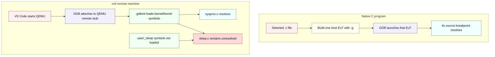

# Debugging xv6: symbols, address spaces, and harts

---

[toc]

---

This guide explains why the checked-in VS Code session can stop in `kernel/sysproc.c` but leaves a breakpoint in `user/sleep.c` unresolved, why the native programs under `/home/wahsieh/personal/c-programming/notes` behave differently, how to load one xv6 user program's symbols manually, and when a single emulated hart makes debugging easier. Use [04-terminology.md](04-terminology.md) for term lookup and [02-build-boot-and-usage.md](02-build-boot-and-usage.md#debugging) for the basic kernel-debugger workflow.

## The short answer

VS Code is not accepting one C directory and rejecting another. A source breakpoint becomes usable only when GDB has debug information that maps that source line to an address in a loaded symbol file. The native notes build and launch one selected ELF, so that ELF supplies the current file's symbols. The xv6 session attaches to a whole emulated machine and loads only `kernel/kernel`; `kernel/sysproc.c` belongs to that ELF, while `user/sleep.c` belongs to the separate `user/_sleep` ELF.

> [!IMPORTANT]
> The `program` value in this repository's `.vscode/launch.json` names `kernel/kernel` for symbols. The configuration does not ask the host operating system to execute that RISC-V file: `.gdbinit` attaches to QEMU's already-running remote target, and `launchCompleteCommand: "None"` prevents a host-style `run` command.

## Two debugger launch models

The colors label request, processing, routing, data, successful resolution, and unresolved state; every node also states its meaning so the diagram remains readable in monochrome.

| Layer | Native C notes | This xv6 session |
| --- | --- | --- |
| **Host process being controlled** | The selected compiled program. | QEMU, through its remote debugging stub. |
| **Machine executing the C code** | The host machine. | QEMU's emulated RISC-V machine. |
| **Initial symbol file** | The selected program's ELF. | `kernel/kernel`. |
| **Source covered initially** | Sources linked into the selected ELF. | Sources linked into the kernel ELF. |
| **Other executable code** | Usually outside the exercise's process. | Separate user ELFs such as `user/_sleep`, loaded later from `fs.img`. |

## What the screenshots show

*The filled red breakpoint in `kernel/sysproc.c` has an address from `kernel/kernel`; the gray `user/sleep.c` entry has no address in the currently loaded symbols.*

*After `argint(0, &n)` executes, the debugger can show `n = 10`. The stack remains `sys_pause` → `syscall` → `usertrap`, so this is kernel-side evidence about the request rather than a stop in `sleep.c:main`.*

## Why one breakpoint resolves and the other does not

`kernel/kernel` and `user/_sleep` are two independent RISC-V ELF files. Both contain DWARF source mappings because the Makefile compiles with `-ggdb`, but GDB reads mappings only from symbol files it has loaded. The generated `.gdbinit` contains `symbol-file kernel/kernel` and no `add-symbol-file user/_sleep`, so the initial session can translate a `sysproc.c` line into a kernel virtual address but has no translation for a `sleep.c` line.

`fs.img` does not solve that symbol problem. It stores the linked `sleep` executable for xv6 to load with `exec`; it is not a GDB symbol container, and QEMU's remote stub does not understand the xv6 filesystem or process table. The stub reports machine state—registers, memory, and emulated CPUs—while GDB relies on the ELF files supplied by the human or debugger configuration to label that state.
