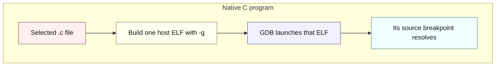
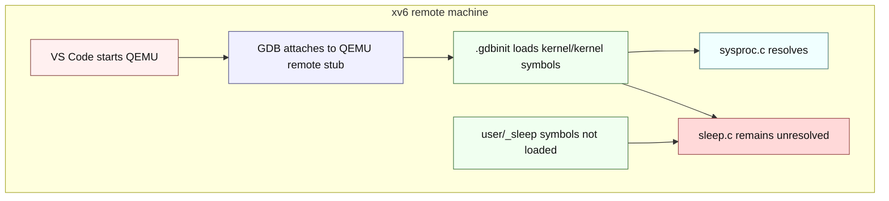

# Debugging xv6: symbols, address spaces, and harts

---

[toc]

---

This guide explains why the checked-in VS Code session can stop in `kernel/sysproc.c` but leaves a breakpoint in `user/sleep.c` unresolved, why the native programs under `/home/wahsieh/personal/c-programming/notes` behave differently, how to load one xv6 user program's symbols manually, and when a single emulated hart makes debugging easier. Use [04-terminology.md](04-terminology.md) for term lookup and [02-build-boot-and-usage.md](02-build-boot-and-usage.md#debugging) for the basic kernel-debugger workflow.

## The short answer

VS Code is not accepting one C directory and rejecting another. A source breakpoint becomes usable only when GDB has debug information that maps that source line to an address in a loaded symbol file. The native notes build and launch one selected ELF, so that ELF supplies the current file's symbols. The xv6 session attaches to a whole emulated machine and loads only `kernel/kernel`; `kernel/sysproc.c` belongs to that ELF, while `user/sleep.c` belongs to the separate `user/_sleep` ELF.

> [!IMPORTANT]
> The `program` value in this repository's `.vscode/launch.json` names `kernel/kernel` for symbols. The configuration does not ask the host operating system to execute that RISC-V file: `.gdbinit` attaches to QEMU's already-running remote target, and `launchCompleteCommand: "None"` prevents a host-style `run` command.

## Two debugger launch models





The colors label request, processing, routing, data, successful resolution, and unresolved state; every node also states its meaning so the diagram remains readable in monochrome.

| Layer                            | Native C notes                          | This xv6 session                                                                       |
| -------------------------------- | --------------------------------------- | -------------------------------------------------------------------------------------- |
| **Debug target**                 | The selected host process.              | QEMU's emulated RISC-V machine, exposed through the remote debugging stub.             |
| **Host-side process**            | The selected compiled program itself.   | QEMU; GDB controls its emulated CPUs rather than debugging QEMU's host implementation. |
| **Machine executing the C code** | The host machine.                       | QEMU's emulated RISC-V machine.                                                        |
| **Initial symbol file**          | The selected program's ELF.             | `kernel/kernel`.                                                                       |
| **Source covered initially**     | Sources linked into the selected ELF.   | Sources linked into the kernel ELF.                                                    |
| **Other executable code**        | Usually outside the exercise's process. | Separate user ELFs such as `user/_sleep`, loaded later from `fs.img`.                  |

## What the screenshots show


_VS Code paused on the verified `sys_pause` breakpoint while the `sleep.c` breakpoint remains gray. The filled red breakpoint in `kernel/sysproc.c` has an address from `kernel/kernel`; the gray `user/sleep.c` entry has no address in the currently loaded symbols._


_After `argint(0, &n)` executes, the debugger can show `n = 10`. The stack remains `sys_pause` → `syscall` → `usertrap`, so this is kernel-side evidence about the request rather than a stop in `sleep.c:main`._

## Why one breakpoint resolves and the other does not

`kernel/kernel` and `user/_sleep` are two independent RISC-V ELF files. Both contain DWARF source mappings because the Makefile compiles with `-ggdb`, but GDB reads mappings only from symbol files it has loaded. The generated `.gdbinit` contains `symbol-file kernel/kernel` and no `add-symbol-file user/_sleep`, so the initial session can translate a `sysproc.c` line into a kernel virtual address but has no translation for a `sleep.c` line.

`fs.img` does not solve that symbol problem. It stores the linked `sleep` executable for xv6 to load with `exec`; it is not a GDB symbol container, and QEMU's remote stub does not understand the xv6 filesystem or process table. The stub reports machine state—registers, memory, and emulated CPUs—while GDB relies on the ELF files supplied by the human or debugger configuration to label that state.

## Manually debugging an xv6 user program

The following recipe adds `user/_sleep` to the existing kernel-debugging session without changing `.vscode`. It is deliberately manual because the symbol file is meaningful only while the intended xv6 process occupies that user address space.

1. Start the normal one-hart QEMU debug target in terminal 1:

    ```bash
    make CPUS=1 qemu-gdb
    ```

2. Attach from terminal 2 and continue through boot:

    ```bash
    gdb-multiarch -q -x .gdbinit kernel/kernel
    ```

    ```gdb
    (gdb) continue
    ```

    GDB prints `Continuing.` and then shows no further `(gdb)` prompt; that is expected, because the target is running and GDB only prompts again once it stops.

3. Wait for the `$ ` prompt in terminal 1, then press `Ctrl-C` in terminal 2. Stopping after the shell is ready matters because every xv6 user ELF is linked at virtual address zero; installing an address-zero breakpoint during boot could stop in `init` or `sh` before `sleep` runs.

4. Load the user ELF's symbols, set a source-qualified hardware breakpoint, and continue:

    ```gdb
    (gdb) add-symbol-file user/_sleep 0
    add symbol table from file "user/_sleep" at
        .text_addr = 0x0
    (gdb) hbreak -source sleep.c -function main
    Hardware assisted breakpoint 1 at 0x0: file user/sleep.c, line 7.
    (gdb) info breakpoints
    (gdb) continue
    ```

5. Enter the command in terminal 1:

    ```text
    $ sleep 10
    ```

6. Confirm that GDB stopped in the user program and inspect its arguments:

    ```gdb
    Breakpoint 1, main (argc=2, argv=0x4fc0) at user/sleep.c:7
    (gdb) info source
    Current source file is user/sleep.c
    (gdb) print argc
    $1 = 2
    (gdb) x/s argv[1]
    0x4fe0: "10"
    ```

    Stack and string addresses vary after a rebuild, but the source file, argument count, and argument text should agree. A user backtrace is reliable through `main` and `start`; do not interpret frames beyond the saved entry context as kernel callers because the user-to-kernel transition happens only when the program executes a system-call stub.

7. Remove the temporary breakpoint and user symbols before returning to kernel-only debugging:

    ```gdb
    (gdb) delete 1
    (gdb) remove-symbol-file -a 0
    (gdb) detach
    (gdb) quit
    ```

> [!WARNING]
> `add-symbol-file` teaches GDB how to label addresses; it does not teach GDB which xv6 process owns the current page table. xv6 links user programs at the same virtual addresses, so `user/_sleep` labels become wrong when another user program runs. Load them for a focused stop, then remove them.

The hardware breakpoint is purposeful. It asks QEMU to stop when a hart executes the address instead of having GDB patch a breakpoint instruction into a guest text page. The repository's VS Code configuration likewise requires hardware breakpoints.

## Why use `CPUS=1`

There is no automatic host-CPU selection here. The Makefile sets `CPUS := 3` by default, passes that value to QEMU's `-smp` option, and accepts a command-line override; the `fs` lab is the one branch that forces `CPUS := 1`. In this QEMU machine, each virtual CPU is a RISC-V hart.

| Setting              | What becomes easier or harder                                                                                                                                                       | When to use it                                                                                                     |
| -------------------- | ----------------------------------------------------------------------------------------------------------------------------------------------------------------------------------- | ------------------------------------------------------------------------------------------------------------------ |
| **`CPUS=1`**         | Removes cross-hart execution, lock contention, and many interleavings. Timer interrupts and xv6 process scheduling still occur, so the run is simpler but not fully deterministic.  | Trace one causal path, single-step, inspect one call stack, or use the QEMU monitor without first choosing a hart. |
| **Default `CPUS=3`** | Exercises concurrent kernel paths and can expose races, deadlocks, and ordering assumptions that one hart hides. Console order and the currently stopped hart are less predictable. | Reproduce multicore failures and perform final correctness checks after the focused trace.                         |

QEMU exposes the emulated harts to GDB as debugger threads. Those entries are execution contexts of virtual CPUs, not xv6 processes and not user-level software threads. `info threads` answers “which hart did QEMU report?”, while `myproc()` and `p->state` in xv6 answer “which process is this hart running?”

> [!IMPORTANT]
> `CPUS=1` is a debugging lens, not a fix. A change is not concurrency-safe until it also survives the repository's normal multi-hart tests.

## Troubleshooting

| Observation                                                               | Likely cause                                                                                                                 | Check or correction                                                                                                                                  |
| ------------------------------------------------------------------------- | ---------------------------------------------------------------------------------------------------------------------------- | ---------------------------------------------------------------------------------------------------------------------------------------------------- |
| **A breakpoint is gray or hollow**                                        | No loaded symbol file maps that source line to an address.                                                                   | Run `info sources` and `info files`; load the correct ELF rather than moving the breakpoint randomly.                                                |
| **`continue` prints `Continuing.` and no further `(gdb)` prompt appears** | The target is running; GDB does not prompt again until it stops.                                                             | Watch terminal 1 for the `$ ` prompt, then press `Ctrl-C` in terminal 2 to regain the `(gdb)` prompt, as in step 3 of the recipe above.              |
| **`sleep.c` resolves but execution stops in another user program**        | Several xv6 user ELFs reuse virtual address zero, and the breakpoint was installed before `sleep` owned the user page table. | Continue to the shell first, interrupt GDB, then add the symbols and hardware breakpoint immediately before running `sleep`.                         |
| **GDB cannot insert the breakpoint**                                      | The requested breakpoint type or address is unavailable in the current target state.                                         | Confirm the QEMU remote connection, use `hbreak`, and check `info breakpoints`; do not replace it with a software breakpoint in read-only user text. |
| **A local is `<optimized out>` or nonsensical**                           | The compiler optimized it or the stop is before its initialization.                                                          | Check the highlighted source line and step past the assignment before printing the value.                                                            |
| **The GDB port is already in use**                                        | A previous QEMU instance still owns the per-user port.                                                                       | Run `pgrep -af qemu-system-riscv64`, identify the stale instance, and terminate only that process.                                                   |
| **`exec sleep failed` appears**                                           | The running guest's `fs.img` does not contain the linked user program.                                                       | Quit QEMU, rebuild the image, boot again, and confirm the xv6 shell's `ls` output includes `sleep` before debugging source behavior.                 |
| **The bug disappears with `CPUS=1`**                                      | The failure depends on cross-hart concurrency.                                                                               | Treat the single-hart trace as partial evidence and reproduce with the default three harts.                                                          |

## Related references

- [Build, boot, and basic GDB usage](02-build-boot-and-usage.md#debugging)
- [Terminology lookup](04-terminology.md)
- [ELF and build artifacts](06-build-artifacts.md#what-elf-is)
- [The util `sleep` exercise](labs/util-sleep.md)
