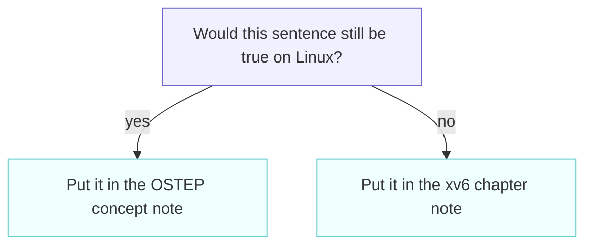

# Book Notes

---

[toc]

---

Chapter notes from [xv6: a simple, Unix-like teaching operating system](https://mit-pdos.github.io/xv6-riscv-book/), added as each chapter is read.

## Chapters

Tick these off as you go, and link each to its notes file once written.

| #      | Chapter                       | Mostly about                           | Case     | Notes                                         |
| ------ | ----------------------------- | -------------------------------------- | -------- | --------------------------------------------- |
| **1**  | Operating system interfaces   | Processes, files, pipes, the shell     | linked   | [ch01](ch01-operating-system-interfaces.md)   |
| **2**  | Operating system organization | Kernel/user split, machine modes, boot | mixed    | [ch02](ch02-operating-system-organization.md) |
| **3**  | Page tables                   | Sv39, address spaces, `kernel/vm.c`    | linked   | [ch03](ch03-page-tables.md)                   |
| **4**  | Traps and system calls        | `ecall`, trampoline, trapframe         | mixed    | [ch04](ch04-traps-and-system-calls.md)        |
| **5**  | Page faults                   | COW, lazy allocation, demand paging    | loan     | [ch05](ch05-page-faults.md)                   |
| **6**  | Interrupts and device drivers | UART, PLIC, virtio disk                | loan     | [ch06](ch06-interrupts-and-device-drivers.md) |
| **7**  | Locking                       | Spinlocks, races, deadlock             | loan     | [ch07](ch07-locking.md)                       |
| **8**  | Scheduling                    | Context switching, `swtch.S`           | linked   | [ch08](ch08-scheduling.md)                    |
| **9**  | Sleep and Wakeup              | Sleep/wakeup, condition variables      | loan     | [ch09](ch09-sleep-and-wakeup.md)              |
| **10** | File system                   | Inodes, the buffer cache               | loan     | [ch10](ch10-file-system.md)                   |
| **11** | Logging                       | Journaling, crash consistency          | loan     | [ch11](ch11-logging.md)                       |
| **12** | Concurrency revisited         | Memory ordering, fences, lock-free     | loan     | [ch12](ch12-concurrency-revisited.md)         |
| **13** | Summary                       | —                                      | xv6-only | [ch13](ch13-summary.md)                       |

## Naming

One file per chapter, numbered so they sort correctly:

```
ch01-operating-system-interfaces.md
ch05-page-faults.md
ch13-summary.md
```

## How a chapter note is written

The rule that keeps these notes short is ownership: **`../operating-system/` owns portable concepts; this directory owns xv6's realization of them.** When placement is unclear, apply one test:

Diagram colors used throughout these notes: blue marks decisions or routing, green marks data movement, yellow marks processing, cyan marks commits or stored results, and red marks stalls or failures. Labels always carry the same meaning without color.



A chapter note that explains what `fork` _is_ has violated the rule; it should explain how this xv6 tree realizes `fork` instead.

That rule assumes the concept note exists, and for most chapters it does not yet. So every concept falls into one of three cases, recorded in [00-ostep-concordance.md](00-ostep-concordance.md):

| Case         | When                                   | Where the explanation goes                                             |
| ------------ | -------------------------------------- | ---------------------------------------------------------------------- |
| **linked**   | The OSTEP counterpart is written       | Link to it; define nothing here.                                       |
| **loan**     | The OSTEP counterpart is a placeholder | Write a short `## Concept on loan` block here, naming its destination. |
| **xv6-only** | No OSTEP counterpart exists            | This note owns it permanently.                                         |

A loan is a debt, not a home. Its lifecycle is explicit:


`grep -rn '^## Concept on loan' docs/book/` lists every outstanding loan.

### Shape

```markdown
# Chapter N: Title

> **Theory:** [OSTEP — …][ostep-x]. Read that first; this note does not re-explain it.

## What xv6 actually does

## Concept on loan: <topic> <- only while the OSTEP note is a placeholder

## Divergences

## Code walked through

## Questions I had

## Lab connection

[ostep-x]: ../../../operating-system/<Note>.md#<anchor>
```

`What xv6 actually does` is the only mandatory section.

The opening blockquote has one variant per case, and picking the wrong one sends the reader somewhere useless — a `linked` blockquote on a `loan` chapter points at a file that says only `Placeholder — not yet written`:

| Case         | Opening blockquote                                                                                                                                                                                                                                             |
| ------------ | -------------------------------------------------------------------------------------------------------------------------------------------------------------------------------------------------------------------------------------------------------------- |
| **linked**   | `> **Theory:** [OSTEP — …][ostep]. Read that first; this note does not re-explain it.`                                                                                                                                                                         |
| **loan**     | `> **Theory on loan.** [OSTEP — …][ostep] is not written yet, so this note holds the concept itself for now. When that note is written, move the material there and replace this with a theory link — see [00-ostep-concordance.md](00-ostep-concordance.md).` |
| **xv6-only** | `> **No OSTEP counterpart.** This chapter is xv6-only, so this note stands alone by design and owns its material permanently.`                                                                                                                                 |

A `loan` chapter still carries its `[ostep]:` definition at the bottom because the destination is known even while the note behind it is empty. That definition makes repaying the debt a two-line edit rather than a search.

> [!NOTE]
> For a `mixed` chapter — some concepts linked, some on loan or xv6-only — use the opening variant that fits the dominant concept, and let the per-concept rows in the concordance carry the detail.

`Divergences` covers three kinds, each of which would otherwise look like somebody's mistake:

- **Naming** — this tree's `kfork`/`kexec`/`kwait`/`kexit` against `fork`/`exec`/`wait` in both the book prose and OSTEP.
- **Architecture** — RISC-V `ra`/`sp`/`s0`–`s11` against the x86 `eip`/`esp`/`ebx`/`ebp` in OSTEP's figures.
- **Vintage** — OSTEP's xv6 material predates the 2019 RISC-V port and describes `xv6-public`, the older x86 tree.

Only chapters that actually diverge carry the section, and it links the concordance appendix rather than restating the correspondence table.

## Cross-repo links

Links into the OSTEP notes are **relative and editor-only**: `../../../operating-system/…` from this directory, which sits two levels below the repository root. They are ctrl-clickable in an editor and survive renames.

> [!IMPORTANT]
> These links 404 on GitHub, by design. The two repositories live on different hosts, so no relative path can render on both. Do not "fix" them into absolute URLs. They assume both repositories sit side by side under `~/personal/`.

Every OSTEP note that has an xv6 counterpart carries a backlink to it, so the pairing is navigable from either side. One is still missing: `../../../operating-system/Paging.md` has no backlink to [ch03](ch03-page-tables.md), because it was left alone while it held uncommitted in-progress edits. Add the single backlink line once those edits are committed; that is the only outstanding gap in the reverse direction, and `check_backlinks` in [check-notes.sh](check-notes.sh) guards the ones that do exist.

Run [check-notes.sh](check-notes.sh) after editing to confirm every link still resolves.

> [!TIP]
> Add new vocabulary to [../04-terminology.md](../04-terminology.md) rather than defining it inline. That keeps one authoritative definition and lets chapter notes stay short.

File paths written as `kernel/vm.c:57` are clickable in most editors, which makes them far more useful than prose descriptions of where something lives.
