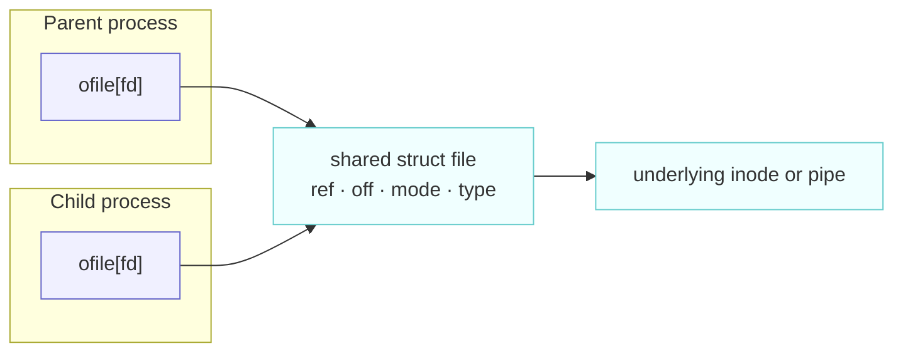
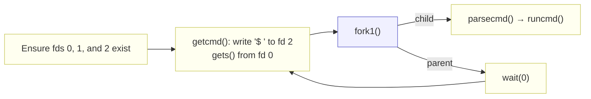
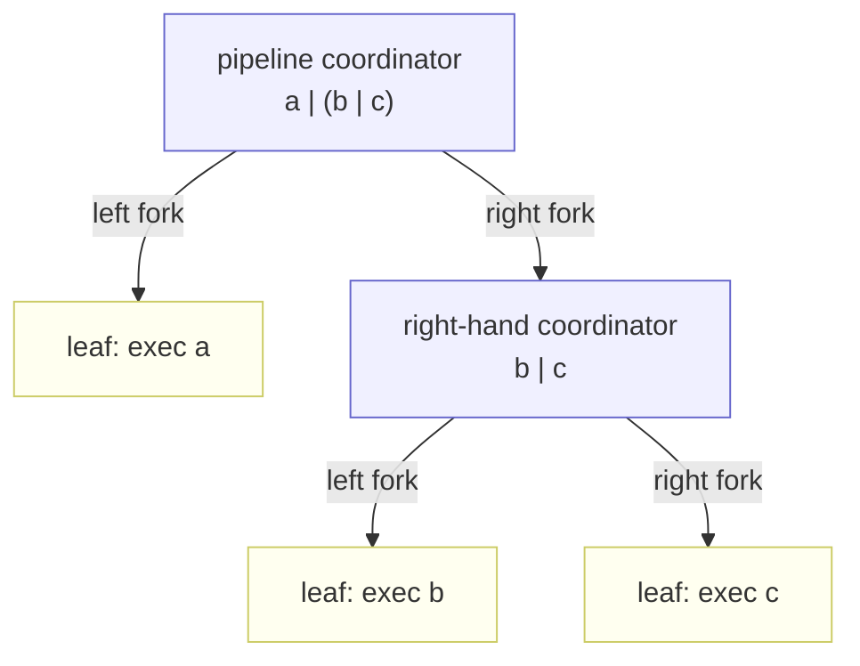

# Chapter 1: Operating system interfaces

---

[toc]

---

> **Theory:** [OSTEP — The Process Abstraction][ostep]. Read that first; this note does not re-explain it.

## What xv6 actually does

The book chapter is a tour of the interface. This note is a tour of the code sitting behind it, in roughly the order the shell exercises it: make a process, replace its image, rewire its descriptors, wire two of them together. Every claim below is anchored to a symbol you can jump to.

### Creating a process: `kfork()`

`kfork()` in `kernel/proc.c` is about forty-five lines, and every one of them is doing one of five jobs.

1. **Claim a slot with `allocproc()`.**
    - **Selection:** Linear-scan the fixed `proc[NPROC]` array for an `UNUSED` entry and return it with `p->lock` still held.
    - **Setup:** Assign a fresh pid, `kalloc()` the trapframe page, build an empty user page table with `proc_pagetable()`, and point `p->context.ra` at `forkret`.
    - **Mapping invariant:** The new page table initially maps only the trampoline and trapframe pages, both without `PTE_U`.
    - **Lifetime invariant:** `procinit()` gives every slot a permanent `KSTACK(i)` at boot, so the kernel stack is not allocated here and outlives the processes that pass through the slot.
2. **Duplicate the memory with `uvmcopy()`.**
    - **Copy:** Step through the parent's address space one `PGSIZE` at a time, `walk()` the parent PTE, `kalloc()` a fresh physical page, `memmove()` 4096 bytes, and `mappages()` the page into the child at the same virtual address with the same flag bits.
    - **Policy:** The copy is eager and byte-for-byte; the base tree has no copy-on-write, which is exactly the gap the `cow` lab fills ([ch05](ch05-page-faults.md)).
    - **Sparse mappings:** `continue` past PTEs that are absent or lack `PTE_V` rather than treating them as errors.
    - **Failure invariant:** Unwind a partial copy with `uvmunmap(new, 0, i / PGSIZE, 1)`, so the child never survives with a partial address space.
3. **Duplicate the register state.**
    - **Copy:** `*(np->trapframe) = *(p->trapframe)` copies the saved user registers wholesale.
    - **Return split:** `np->trapframe->a0 = 0` overwrites the child's return-value register. There is no second return anywhere, only two saved register sets: the child finds zero in `a0`, while the parent finds the new pid.
    - **Restore:** Neither process returns until the trap path restores its own trapframe.
4. **Duplicate the descriptor table.** A loop over `NOFILE` entries calls `filedup()` on each non-null `p->ofile[i]`, and `idup()` on `p->cwd`. Both operations bump reference counts rather than copying the underlying objects.
5. **Publish the child.** Set the parent link under the global `wait_lock`, not `np->lock`, and flip the state to `RUNNABLE` last, so the scheduler cannot select an incomplete child.

### Replacing the image: `kexec()`

`kexec()` in `kernel/exec.c` treats image replacement as a transaction: build a complete replacement away from the live process, then commit once it is safe.

Until the commit, `p->pagetable` is untouched: the ELF header, program segments, and stack all live in a second page table from `proc_pagetable(p)`. At the `commit to the user image` comment, `kexec()` swaps `p->pagetable`, `p->sz`, `p->trapframe->epc`, and `p->trapframe->sp`, then frees the old table. Any earlier failure jumps to `bad:`, frees the half-built table, and returns -1 into the undisturbed image. That is why a failed `exec` can return and why `user/sh.c` can print `exec %s failed` on the line after the call.

Three details are specific to this tree:

- The stack is `USERSTACK + 1` pages allocated above the program image, and `uvmclear()` strips `PTE_U` from the lowest of them to make a guard page. `USERSTACK` is 1 normally and **2** under `LAB_UTIL` (`kernel/param.h`), so the active lab silently changes the shape of every process's stack.
- Argument strings are `copyout()` onto the new stack one at a time, and alignment precedes each copy rather than following it: `kexec()` (`kernel/exec.c:102-106`) does `sp -= strlen(argv[argc]) + 1` then `sp -= sp % 16` to round the new bottom down to a 16-byte boundary, checks it against `stackbase`, and only then `copyout()`s the string — so every string lands already aligned, as the RISC-V ABI requires. The `ustack[]` array of pointers to them is pushed afterwards and its address left in `a1`.
- `kexec()` returns `argc`, not 0. `sys_exec()` passes that straight through, and the trap return puts it in `a0` — which is the first argument to the new program's `main`. The kernel function genuinely returns; what makes `exec` "not return" is that the code it returns into is a different program.

What `kexec()` deliberately does **not** touch is `p->ofile` and `p->cwd`. That omission is a feature, and the next section is what it buys.

### Descriptors: two levels of indirection

There are two tables, not one, and the split is where all the interesting behaviour lives.

| Level       | Where                                                                          | Contents                                                                                  |
| ----------- | ------------------------------------------------------------------------------ | ----------------------------------------------------------------------------------------- |
| **Per-process** | `struct file *ofile[NOFILE]` in `struct proc` (`kernel/proc.h`), `NOFILE` = 16 | pointers, indexed by the descriptor number itself                                         |
| **System-wide** | `ftable.file[NFILE]` in `kernel/file.c`, `NFILE` = 100                         | the `struct file` objects, each with `ref`, `readable`, `writable`, a type tag, and `off` |

`fdalloc()` in `kernel/sysfile.c` scans `ofile` from index 0 and takes the first null slot. The "lowest unused descriptor" rule the book leans on so heavily is that four-line loop; nothing else enforces it. `filealloc()` takes `ftable.lock` and returns the first entry whose `ref` is zero, which is why a process can exhaust the _system's_ 100 open files without exhausting its own 16.

The consequences fall out of where `off` lives: in the shared `struct file`, not in the per-process slot.

| Operation                                        | Result                                                                                                                          |
| ------------------------------------------------ | ------------------------------------------------------------------------------------------------------------------------------- |
| `filedup()` or `kfork()`                         | Increment `f->ref` under `ftable.lock` and leave both descriptor slots pointing at one `struct file`, so they share one offset. |
| Two independent `open()` calls for the same path | Allocate two `struct file` entries, so the descriptors have independent offsets.                                                |
| `kexit()` and `fileclose()`                      | Walk `ofile`, drop references, and tear down the underlying pipe or inode when the last reference reaches zero.                 |

Put `kfork()`, `kexec()`, and `fdalloc()` together, and shell redirection needs no dedicated kernel operation:

1. The child starts with pointer-identical `ofile` entries inherited from the parent.
2. `close()` nulls the descriptor slot selected for redirection.
3. The following `open()` calls `fdalloc()`, which reclaims that index because it is now the lowest free slot.
4. `kexec()` replaces the address space while preserving `ofile` exactly as the child arranged it.

No kernel path knows that a redirection happened.

### Pipes

`struct pipe` in `kernel/pipe.c` occupies one `kalloc()`ed page.

| Field                   | Role                                                                                                                            |
| ----------------------- | ------------------------------------------------------------------------------------------------------------------------------- |
| `data[PIPESIZE]`        | The 512-byte circular buffer.                                                                                                   |
| `lock`                  | The spinlock protecting the pipe state.                                                                                         |
| `nread`, `nwrite`       | Monotonically increasing counters; indexing uses `counter % PIPESIZE`, so the counters themselves never wrap around the buffer. |
| `readopen`, `writeopen` | Whether any references to the corresponding endpoint remain.                                                                    |

The buffer is empty when `nread == nwrite` and full when `nwrite == nread + PIPESIZE`.

`pipealloc()` takes two `struct file` from `filealloc()` and points both at the same `struct pipe`, tagging one `FD_PIPE` with `readable = 1` and the other with `writable = 1`. So one buffer becomes two independently reference-counted objects, and `sys_pipe()` merely `fdalloc()`s both and `copyout()`s the pair of integers into the user's `int p[2]`.

That structure makes blocking, end-of-file, and deallocation distinct outcomes:

| Condition                       | Reader or kernel action | Meaning                                                                    |
| ------------------------------- | ----------------------- | -------------------------------------------------------------------------- |
| `nread < nwrite`                | Read available bytes.   | Buffered data exists.                                                      |
| `nread == nwrite && writeopen`  | Sleep.                  | The pipe is empty, but at least one writer reference remains.              |
| `nread == nwrite && !writeopen` | Return `0`.             | The last writable `struct file` reference is gone, so the reader sees EOF. |
| `!readopen && !writeopen`       | Free the pipe page.     | No endpoint references remain.                                             |

`pipeclose()` clears an endpoint flag only when that endpoint's last `struct file` reference goes away. Every process holding a copy of the write descriptor therefore keeps `writeopen` set and the empty reader asleep, which is why the shell closes pipeline descriptors so aggressively.

> [!NOTE]
> This tree splits the classic blocking primitive into `sleep_prepare(&pi->nread)`, a lock release, and then `sleep()`; the reasoning belongs to [ch09](ch09-sleep-and-wakeup.md).

### The shell is just another program

`user/sh.c` compiles into `_sh`, lands in `fs.img` beside `_cat` and `_ls`, and links against `user/ulib.c` like any other user program. It holds no privilege and gets no special treatment; `user/init.c` starts it with the same `exec` any program would use.

`main()` first opens `"console"` until the returned descriptor is 3 or higher, then closes that one. This guarantees that descriptors 0, 1, and 2 exist without assuming which were already open.

> [!NOTE]
> Reading commands from fd 0 matters for the `util` lab, where the grader runs `sh < findtest.sh` and fd 0 is a file rather than the console.

`cd` is handled in `main()` before the fork, and the comment says why: `chdir` in a child would replace that child's `p->cwd` inode pointer and then die with it. Nothing about `cd` requires kernel involvement; it requires only _not forking_.

`runcmd()` is declared `__attribute__((noreturn))` and every arm ends by falling through to `exit(0)`, so calling it consumes the current process. Each command type is a handful of lines:

- **EXEC** — `exec(ecmd->argv[0], ecmd->argv)`, then an error message that only executes if the call came back.
- **REDIR** — `close(rcmd->fd)`, `open(rcmd->file, rcmd->mode)`, then recurse into the wrapped command. Three lines, resting entirely on `fdalloc()`'s lowest-free rule.
- **PIPE** — `pipe(p)` and two `fork1()`s; the left child does `close(1); dup(p[1])`, the right does `close(0); dup(p[0])`, and both close the raw `p[0]` and `p[1]`. The parent closes both descriptors and waits twice.
- **LIST** — fork the left side, wait, then recurse into the right side in the current process.
- **BACK** — fork and do not wait.

Because each pipeline child recurses into `runcmd()`, `a | b | c` nests through the right-hand child. Every non-leaf process exists only to coordinate descriptors and wait:

The parser (`parsecmd()` and its helpers) is the larger half of the file and is entirely user-space; the kernel has no notion of the shell's grammar, of `|`, or of `>`.

## Divergences

- **Naming.** The kernel-side implementations here are `kfork()`, `kexec()`, `kwait()`, and `kexit()`; the names user programs call come from `user/user.h` and are unprefixed. See [the naming table](00-ostep-concordance.md#system-call-naming).
- **Architecture and vintage.** OSTEP's Figure 4.5 `struct proc` and Figure 6.4 `swtch` come from the x86 `xv6-public` tree, which predates the 2019 RISC-V port; see [the register table](00-ostep-concordance.md#context-switch-registers).
- **Signatures.** This revision's `copyout()` takes the process size as an extra second argument, so call sites read `copyout(p->pagetable, p->sz, ...)` where the published book shows four arguments. Expect the same offset when comparing any code fragment in the book against `kernel/vm.c`.

## Code walked through

| File               | Symbol                       | What it does                                                                                          |
| ------------------ | ---------------------------- | ----------------------------------------------------------------------------------------------------- |
| `kernel/proc.c`    | `allocproc()`                | Claims an `UNUSED` slot, allocates the trapframe page and page table, arms `context.ra` for `forkret` |
| `kernel/proc.c`    | `kfork()`                    | Copies memory, trapframe, descriptors, and cwd; zeroes the child's `a0`; publishes as `RUNNABLE`      |
| `kernel/proc.c`    | `kexit()`                    | `fileclose()`s every `ofile` entry, reparents children to init, becomes a `ZOMBIE`                    |
| `kernel/vm.c`      | `uvmcopy()`                  | Page-by-page eager copy of the parent address space into the child's page table                       |
| `kernel/vm.c`      | `uvmclear()`                 | Drops `PTE_U` on the stack guard page during exec                                                     |
| `kernel/exec.c`    | `kexec()`                    | Builds the new image in a spare page table, then swaps it in as one commit                            |
| `kernel/exec.c`    | `loadseg()`                  | Reads one ELF program-header segment from the inode into the new page table                           |
| `kernel/file.c`    | `filealloc()`                | Hands out one of the 100 system-wide `struct file` entries                                            |
| `kernel/file.c`    | `filedup()` / `fileclose()`  | Bump and drop `f->ref`; the drop to zero releases the pipe or inode                                   |
| `kernel/sysfile.c` | `fdalloc()`                  | The lowest-unused-descriptor rule, as a scan of `p->ofile`                                            |
| `kernel/sysfile.c` | `sys_pipe()`                 | Allocates two descriptors for `pipealloc()`'s pair and copies them out                                |
| `kernel/pipe.c`    | `pipealloc()`                | One page of buffer exposed as two oppositely-permissioned `struct file`                               |
| `kernel/pipe.c`    | `piperead()` / `pipeclose()` | Blocking on empty, and turning the last write-end close into EOF                                      |
| `user/sh.c`        | `main()`                     | Guarantees fds 0–2, reads a line, forks, waits; special-cases `cd`                                    |
| `user/sh.c`        | `runcmd()`                   | One arm per command type; never returns                                                               |

## Questions I had

- **Why does `uvmcopy()` skip unmapped pages instead of panicking?** The upstream version panics on a missing PTE. Skipping is what lets a process with holes in its address space — which is what lazy allocation and demand paging produce — be forked at all, so the `continue` looks like preparation for [ch05](ch05-page-faults.md) rather than mere tolerance.
- **Why is the parent pointer protected by a global `wait_lock` rather than by `np->lock`?** `kexit()` has to wake a parent it can only reach through that pointer, and `kwait()` has to scan for children, so the link is read by processes that hold neither end's lock. A single global lock sidesteps the ordering problem; [ch07](ch07-locking.md) is where that reasoning belongs.
- **What happens if `fdalloc()` succeeds for the read end of a pipe and fails for the write end?** `sys_pipe()` nulls `p->ofile[fd0]` by hand before closing both files, rather than calling the ordinary close path — worth remembering as the shape of xv6's unwind code generally.
- **Is `NOFILE` = 16 ever actually limiting?** A deep pipeline forks per stage rather than accumulating descriptors in one process, so the shell never approaches it. It would bite a program that opened many files itself.

## Lab connection

`conf/lab.mk` currently reads `LAB=util`, so this chapter is the one directly under the fingertips — see [../03-lab-workflow.md](../03-lab-workflow.md) for the merge and grading mechanics.

- `USERSTACK` becomes 2 pages under `-DLAB_UTIL`, so `kexec()`'s stack arithmetic is already running in its lab configuration.
- `grade-lab-util`'s `sleep` tests break on the `sys_pause` breakpoint, not `sys_sleep`: the clock-tick call is named `pause` in this tree, and `sleep` is the user program you write on top of it.
- The two `find ... -exec` tests are a `fork`/`exec`/`wait` exercise in user space — `find` has to do per-match what `runcmd()`'s `EXEC` arm does per command.
- `sh < findtest.sh` is the descriptor argument above, graded: the shell reads its commands from fd 0 without a single line of code that knows it is not the console.

[ostep]: ../../../operating-system/The_Process_Abstraction.md
