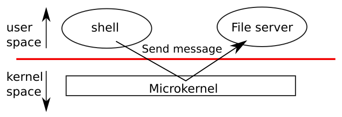
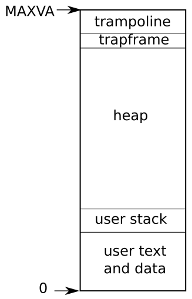

# Chapter 2: Operating system organization

---

[toc]

---

> **Theory:** [OSTEP — Introduction to Operating Systems][ostep]. Read that first; this note does not re-explain it.

> **Placeholder — not yet written.** Chapter source: `../../../xv6-riscv-book/first.tex`. Write it with the shape in [README.md](README.md#how-a-chapter-note-is-written), after checking [00-ostep-concordance.md](00-ostep-concordance.md) for what is already covered.

## Figures

_“A microkernel with a file-system server” — [book figure](fig/README.md), `first.tex` `fig:mkernel`. Two ellipses above the red line, `shell` and `File server`, joined by lines that dip through a thin `Microkernel` box below it and meet at a label reading **Send message**. Read it against [ch01's figure](ch01-operating-system-interfaces.md#figures): same red line, but the file system has moved above it into user space, so what was a system call becomes a message between two user processes. Xv6 is the monolithic alternative — every file in `kernel/` sits inside that one box._

_“Layout of a process's virtual address space” — [book figure](fig/README.md), `first.tex` `fig:as`. Bottom to top from 0: **user text and data**, **user stack**, a large **heap**, and then two thin bands immediately under `MAXVA` — **trapframe** and **trampoline**. Those two slivers are the ones to remember: they are mapped without `PTE_U`, so user code cannot touch them, and they are what makes the trap path in [ch04](ch04-traps-and-system-calls.md) possible at all._

## What xv6 actually does

## Divergences

## Code walked through

## Questions I had

## Lab connection

[ostep]: ../../../operating-system/Introduction_to_Operating_Systems.md
