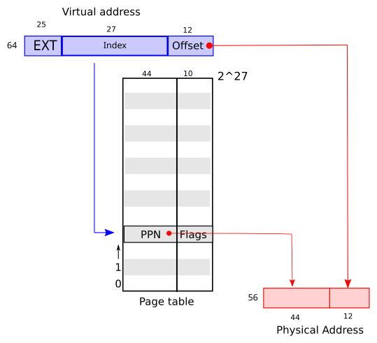
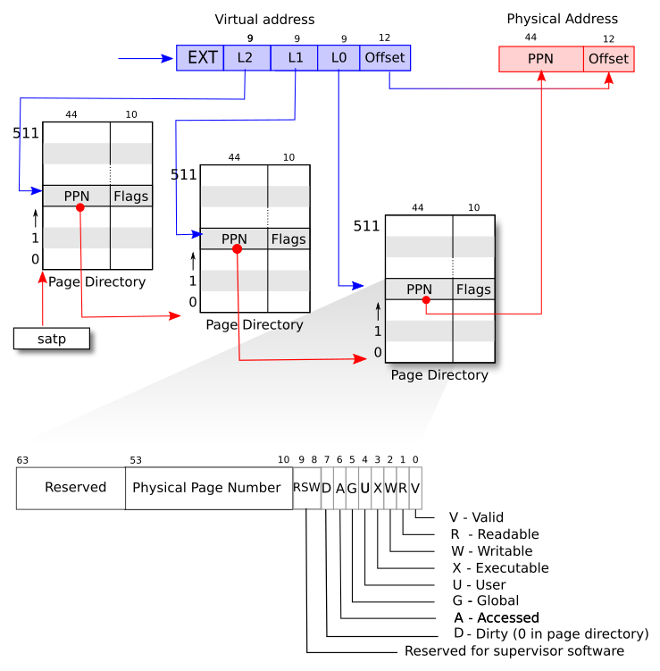
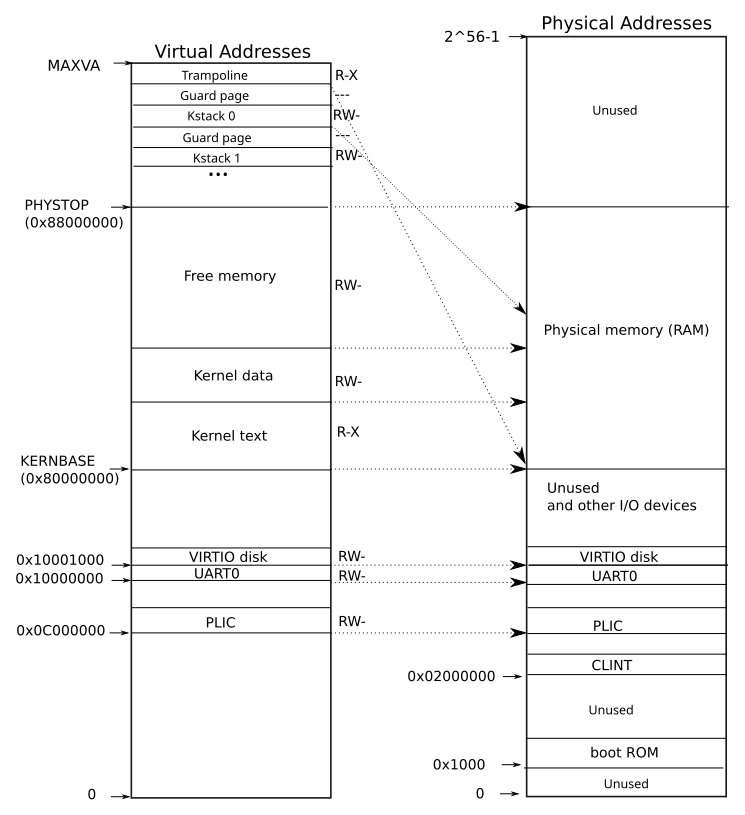
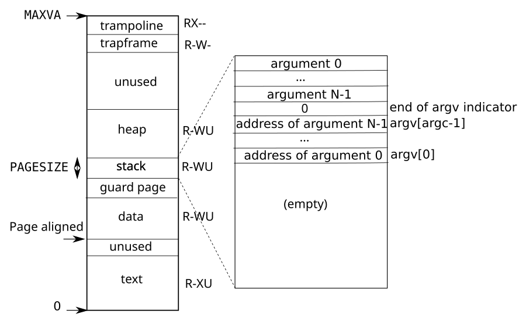

# Chapter 3: Page tables

---

[toc]

---

> **Theory:** [OSTEP — Paging][ostep]. Read that first; this note does not re-explain it.

> **Placeholder — not yet written.** Chapter source: `../../../xv6-riscv-book/mem.tex`. Write it with the shape in [README.md](README.md#how-a-chapter-note-is-written), after checking [00-ostep-concordance.md](00-ostep-concordance.md) for what is already covered.

## Figures

_“An abstract view of a flat page table mapping virtual to physical addresses.” — [book figure](fig/README.md), `mem.tex` `fig:riscv_address`. The 64-bit virtual address splits into a 25-bit **EXT**, a 27-bit **Index**, and a 12-bit **Offset**. The index selects one of 2^27 entries, each holding a 44-bit **PPN** and 10 **Flags**; that PPN concatenated with the untouched offset forms the 56-bit physical address. This is the lie the next figure corrects: 2^27 entries of 8 bytes is a gigabyte of page table per process, which is why no real machine uses this shape._

_“RISC-V address translation details.” — [book figure](fig/README.md), `mem.tex` `fig:riscv_pagetable`. Sv39: the same address, now split into **EXT** plus three 9-bit indices **L2**, **L1**, and **L0** and the 12-bit offset, walking three chained 512-entry page directories rooted at `satp`. Underneath, the 64-bit PTE laid out bit by bit — reserved bits at the top, the **PPN** in bits 53–10, then `RSW`, `D`, `A`, `G`, `U`, `X`, `W`, `R`, `V` in the low ten. Keep it open while reading `walk()` in `kernel/vm.c`: that function is the three red arrows, its `alloc` argument decides what happens when a level's `PTE_V` is clear, and those low ten bits are the flag constants in `kernel/riscv.h`._

_“On the left, xv6's kernel virtual address space; on the right, the RISC-V physical address space that xv6 expects to see.” — [book figure](fig/README.md), `mem.tex` `fig:xv6_layout`. The left column, bottom to top: `PLIC` at 0x0C000000, `UART0` at 0x10000000, `VIRTIO disk` at 0x10001000, then `KERNBASE` (0x80000000) opening kernel text (R-X), kernel data, and free memory up to `PHYSTOP` (0x88000000) — and at the very top, under the trampoline at `MAXVA`, a stack of per-process kernel stacks each separated by a guard page. Every range carries its R, W, and X bits. Dotted lines to the right column show what each one maps to. Almost every one is an identity map, which is what makes `kvminit()` short; the exceptions are the interesting ones — the trampoline and those guard-page-separated kernel stacks._

_“A process's user address space, with its initial stack.” — [book figure](fig/README.md), `mem.tex` `fig:processlayout`. The column runs 0 to `MAXVA`: **text** (R-XU), a page-aligned gap, **data**, a **guard page**, the **stack**, the **heap** (all R-WU), unused space, then **trapframe** (R-W-) and **trampoline** (RX--) at the top. The exploded panel opens the stack from the top down — the argument strings, a zero that is the **end of argv indicator**, the pointer array from `argv[argc-1]` down to `argv[0]`, and empty space below. That panel is what `kexec()` builds, in the order [ch01 walks through](ch01-operating-system-interfaces.md#replacing-the-image-kexec) — and `USERSTACK` is 2 rather than 1 under `LAB_UTIL`, so the stack in this tree can be a page taller than the one drawn._

## What xv6 actually does

## Divergences

## Code walked through

## Questions I had

## Lab connection

[ostep]: ../../../operating-system/Paging.md
