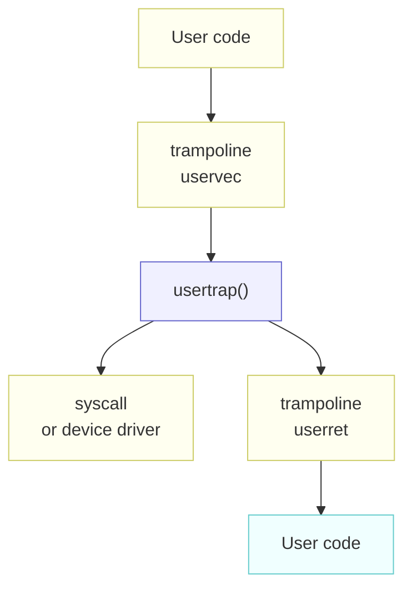

# Chapter 4: Traps and system calls

---

[toc]

---

> **Theory:** [OSTEP — The Process Abstraction §8][ostep]. Read that first; this note does not re-explain it.

> **Placeholder — not yet written.** Chapter source: `../../../xv6-riscv-book/trap.tex`. Write it with the shape in [README.md](README.md#how-a-chapter-note-is-written), after checking [00-ostep-concordance.md](00-ostep-concordance.md) for what is already covered.

## Figures

The book draws this one in TikZ, so it is redrawn here rather than copied; see [fig/README.md](fig/README.md#the-figures-that-are-redrawn-instead).

_“Outline of how a trap from user code is handled.” — redrawn from `trap.tex` `fig:usertrap`. The single node worth staring at is `usertrap()`: it is the fork in the road, and `kernel/trap.c` decides there whether `scause` means a system call, a device interrupt, or a fault. Everything above it runs on the trampoline page mapped into every address space; everything below it runs on the kernel stack._

## What xv6 actually does

## Divergences

## Code walked through

## Questions I had

## Lab connection

[ostep]: ../../../operating-system/The_Process_Abstraction.md
