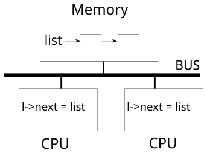
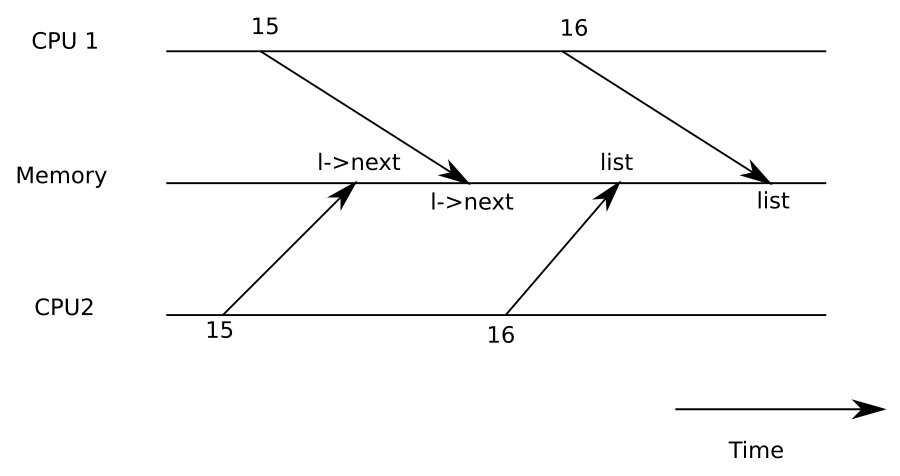

# Chapter 7: Locking

---

[toc]

---

> **Theory on loan.** [OSTEP — Concurrency: Threads and Locks][ostep] is not written yet, so this note holds the concept itself for now. When that note is written, move the material there and replace this with a theory link — see [00-ostep-concordance.md](00-ostep-concordance.md).

> **Placeholder — not yet written.** Chapter source: `../../../xv6-riscv-book/lock.tex`. Write it with the shape in [README.md](README.md#how-a-chapter-note-is-written), after checking [00-ostep-concordance.md](00-ostep-concordance.md) for what is already covered.

## Figures



_“Simplified SMP architecture” — [book figure](fig/README.md), `lock.tex` `fig:smp`. A `Memory` box holding a two-element linked list, a thick line marked **BUS**, and two `CPU` boxes below it — each running the same statement, `l->next = list`. One list, one bus, two CPUs, and nothing in the picture that serialises them. That is the entire argument for the next figure._



_“Example race” — [book figure](fig/README.md), `lock.tex` `fig:race`. Three timelines with time running left to right: `CPU 1` on top, `Memory` in the middle, `CPU2` at the bottom. At time 15 and again at 16, `CPU2` reads while `CPU 1` writes `l->next` and then `list` — and the arrows cross. Both CPUs read the same `list` before either writes it, so one of the two freed pages is lost. This is `kfree()` in `kernel/kalloc.c` without `kmem.lock`._

The book's third figure here is TikZ, so it is redrawn rather than copied ([fig/README.md](fig/README.md#the-figures-that-are-redrawn-instead)). Two CPUs, two locks, opposite orders:

```c
// CPU C1              // CPU C2
acquire(&A);           acquire(&B);
acquire(&B);           acquire(&A);
...                    ...
release(&B);           release(&A);
release(&A);           release(&B);
```

_Redrawn from `order.tex`. Each column is correct when read alone; the deadlock lives only in the pair, which is why the rule xv6 follows has to be global — every path that takes both locks takes them in one agreed order. Nothing in the tree enforces that mechanically. `kernel/fs.c` `iput()` notes only that a reference count of 1 is what makes its `acquiresleep()` safe from deadlock, and `kernel/spinlock.c` `acquire()` disables interrupts for the same reason; the ordering itself lives in the reader's head._

## What xv6 actually does

## Divergences

## Code walked through

## Questions I had

## Lab connection

[ostep]: ../../../operating-system/Concurrency_Threads_And_Locks.md
