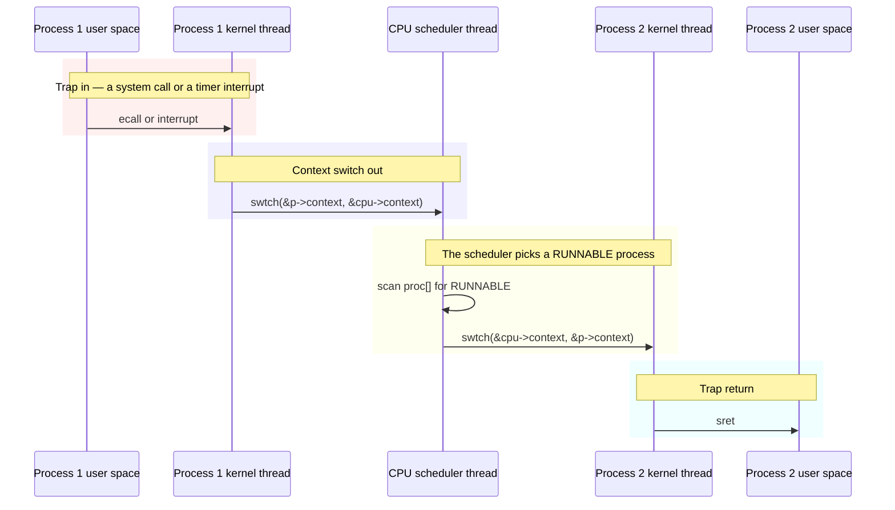
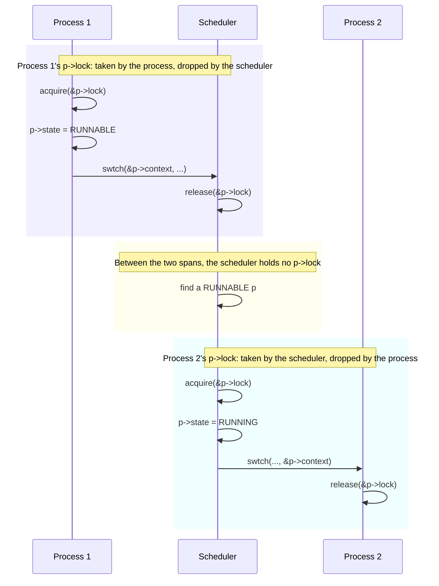

# Chapter 8: Scheduling

---

[toc]

---

> **Theory:** [OSTEP — CPU Scheduling][ostep]. Read that first; this note does not re-explain it.

> **Placeholder — not yet written.** Chapter source: `../../../xv6-riscv-book/sched.tex`. Write it with the shape in [README.md](README.md#how-a-chapter-note-is-written), after checking [00-ostep-concordance.md](00-ostep-concordance.md) for what is already covered.

## Figures

Both of this chapter's figures are redrawn rather than copied — one is TikZ, the other ships only as a PDF; see [fig/README.md](fig/README.md#the-figures-that-are-redrawn-instead). Band colours follow the legend in [README.md](README.md#how-a-chapter-note-is-written).

_“Switching from one user process to another. In this example, xv6 runs with one CPU (and thus one scheduler thread).” — redrawn from `sched.tex` `fig:switch`. Four steps, and the one that surprises people is that there is no direct edge from `K1` to `K2`: xv6 never context-switches one process's kernel thread straight to another's. The scheduler thread is always in the middle, which is what makes the next figure's invariant statable at all._

_“`swtch()` always has the scheduler thread as either source or destination, and the relevant `p->lock` is always held.” — redrawn from `sched.tex` `fig:inout`. Every `acquire` here is paired with a `release` in a **different thread**, which is why the lock cannot be held across the switch by the usual acquire-and-release-in-one-function discipline, and why `p->lock` is the one lock in the tree that discipline does not describe._

## What xv6 actually does

## Divergences

## Code walked through

## Questions I had

## Lab connection

[ostep]: ../../../operating-system/CPU_Scheduling.md
