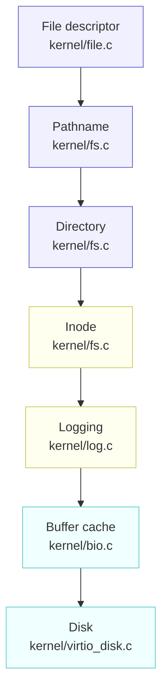
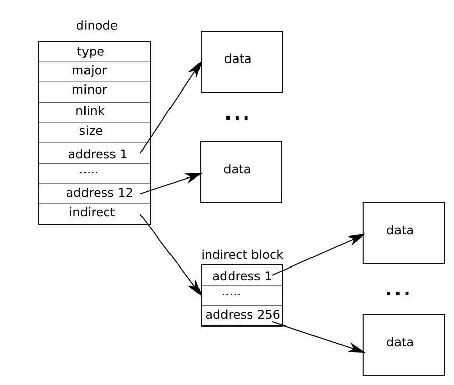

# Chapter 10: File system

---

[toc]

---

> **Theory on loan.** [OSTEP — File Systems][ostep] is not written yet, so this note holds the concept itself for now. When that note is written, move the material there and replace this with a theory link — see [00-ostep-concordance.md](00-ostep-concordance.md).

> **Placeholder — not yet written.** Chapter source: `../../../xv6-riscv-book/fs.tex`. Write it with the shape in [README.md](README.md#how-a-chapter-note-is-written), after checking [00-ostep-concordance.md](00-ostep-concordance.md) for what is already covered.

## Figures

Two of this chapter's three figures are TikZ, so they are redrawn ([fig/README.md](fig/README.md#the-figures-that-are-redrawn-instead)). The seven layers, top to bottom, with the file each one lives in:

_“Layers of the xv6 file system.” — redrawn from `fs.tex` `fig:fslayer`. Each layer calls only the one below it, which is why the chapter can be read bottom-up and why a lab that changes one layer rarely disturbs another._

And the same disk, seen as blocks rather than layers:

| Block   | 0    | 1     | 2   | 3   | 4      | 5      | 6      | 7       | 8       | 9    | …   | n    |
| ------- | ---- | ----- | --- | --- | ------ | ------ | ------ | ------- | ------- | ---- | --- | ---- |
| Section | boot | super | log | log | inodes | inodes | inodes | bit map | bit map | data | …   | data |

_“Structure of the xv6 file system.” — redrawn from `fs.tex` `fig:fslayout`. The block counts are the figure's, not this tree's: `mkfs/mkfs.c` computes the real ones from `kernel/param.h` and writes them into the superblock, which is what block 1 is for._

_“The representation of a file on disk.” — [book figure](fig/README.md), `fs.tex` `fig:inode`. The `dinode` column holds `type`, `major`, `minor`, `nlink`, `size`, then `address 1` through `address 12` pointing straight at **data** blocks, and finally `indirect` — pointing at an **indirect block** whose own `address 1` through `address 256` point at further data blocks. Twelve direct addresses plus one indirect block is the entire file-size story: `NDIRECT` and `NINDIRECT` in `kernel/fs.h` set the ceiling, and raising it is what the `fs` lab asks for, by adding a doubly-indirect level to this picture._

## What xv6 actually does

## Divergences

## Code walked through

## Questions I had

## Lab connection

[ostep]: ../../../operating-system/File_Systems.md
