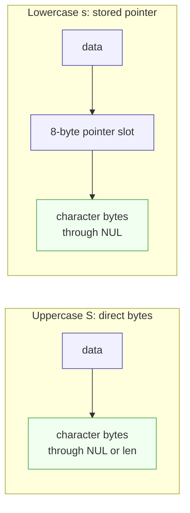
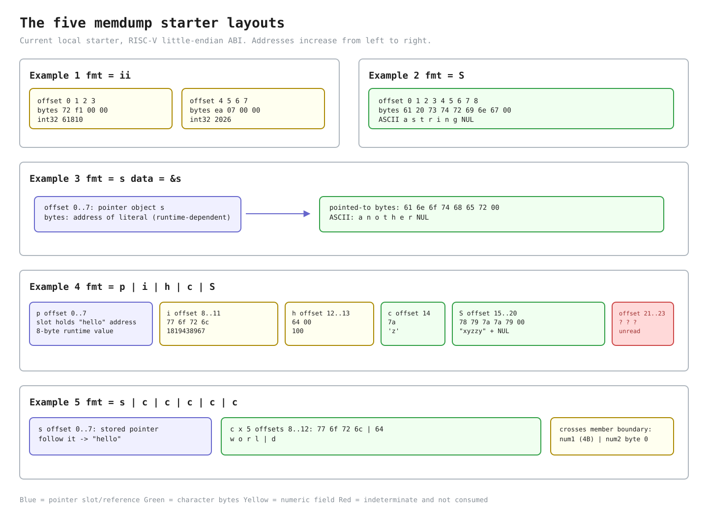

# Lab util: Deriving `memdump`

---

[toc]

---

MIT's easy [`memdump` exercise](https://pdos.csail.mit.edu/6.1810/2026/labs/util.html) asks a user-space formatter to walk raw memory according to a compact type description. The exercise is about the difference between an address, the bytes stored at that address, and a pointer value stored inside those bytes. This note derives those distinctions and leaves the target [`user/memdump.c`](../../user/memdump.c) unimplemented.

> [!IMPORTANT]
> This note contains no solution or pseudocode. It records the target contract, the current grader's observations, existing non-target code, source-backed decisions, and common traps.

## What the exercise asks for

The 2026 handout specifies `memdump(char *fmt, char *data, int len)`. `data` identifies the first valid byte, `len` limits the readable region, and each character in the NUL-terminated `fmt` string describes the next item in that region. The format is its own small language; its characters are not `printf` conversions and do not begin with `%`.

| Format  | Data item described by the 2026 handout                 | Printed interpretation                                             | Fixed-width bytes needed before access |
| ------- | ------------------------------------------------------- | ------------------------------------------------------------------ | -------------------------------------- |
| **`i`** | The next 4 bytes                                        | A 32-bit integer in decimal                                        | 4                                      |
| **`p`** | The next 8 bytes                                        | A 64-bit integer in hexadecimal                                    | 8                                      |
| **`h`** | The next 2 bytes                                        | A 16-bit integer in decimal                                        | 2                                      |
| **`c`** | The next byte                                           | One 8-bit ASCII character                                          | 1                                      |
| **`s`** | The next 8 bytes, which contain a pointer to a C string | The string reached through that stored pointer                     | 8                                      |
| **`S`** | The remaining valid bytes beginning at the cursor       | Bytes through the first NUL or through the end of the valid region | Variable                               |

For every fixed-width item, too few remaining bytes must produce `memdump: not enough data for 'X'` and stop, where `X` is the current format character. `S` is deliberately different: absence of a NUL within the valid region is not permission to read farther, so it prints only the bytes still covered by `len`.

### What the local grader checks

The two relevant tests in [`grade-lab-util`](../../grade-lab-util) are worth 20 points:

| Test                                       | Commands                                                                   | Exact positive assertions                                                                                                                                                     | Negative assertions and limits                                                                                                                                                                                                                       |
| ------------------------------------------ | -------------------------------------------------------------------------- | ----------------------------------------------------------------------------------------------------------------------------------------------------------------------------- | ---------------------------------------------------------------------------------------------------------------------------------------------------------------------------------------------------------------------------------------------------- |
| **`memdump, examples` (10 points)**        | `memdump`                                                                  | Requires some transcript lines beginning with `61810`, `2025`, `a string`, `another`, `1819438967`, `100`, `z`, `xyzzy`, `hello`, `w`, and `d`.                               | Has no negative regexes. It does not require the example headings, the pointer value, the `o`, `r`, or `l` lines from Example 5, exact lines, adjacency, or the handout's order; unrelated and trailing output can pass.                             |
| **`memdump, format ii, S, p` (10 points)** | Runs three commands over `abcdefgh12345678\n`: formats `ii`, `S`, and `p`. | Requires some transcript lines beginning with `1684234849`, `1751606885`, `abcdefgh12345678`, and `64636261`. The two decimals are the first two little-endian 4-byte groups. | Does not isolate output by command, reject extra output, exercise `h`, `c`, or `s` directly, check cursor advancement after `p`, or check any short-input failure. Its `p` prefix is the old low-32-bit observation, not the 2026 eight-byte result. |

`Runner.match()` delegates to `assert_lines_match()`, which walks every transcript line and removes every regular expression that matches somewhere. Because each expression begins with `^` but has no `$`, only the start of a line is constrained. The expressions need not match exact output lines or appear in the order passed to `r.match()`. The two Python tests share the name `test_memdump_examples`, but both decorators register their wrapper before the second definition replaces that module variable; [`util-sleep.md`](util-sleep.md#why-two-tests-can-have-the-same-python-function-name) explains that grader mechanism and its transcript-name side effect.

> [!WARNING]
> Passing this local grader is not evidence that the 2026 bounds contract is satisfied. The grader contains no short-input assertion, and its `p` expectation conflicts with the current handout.

## Prerequisites

| When                                     | Read                                                                                                                                            | Why it matters here                                                                                                                |
| ---------------------------------------- | ----------------------------------------------------------------------------------------------------------------------------------------------- | ---------------------------------------------------------------------------------------------------------------------------------- |
| **Read first**                           | [`C_Pointers.md`](../../../c-programming/C_Pointers.md#type-casting-byte-level-access)                                                          | Establishes addresses, dereference, byte-level casts, and why a `void *` needs a typed view before access.                         |
| **Read first**                           | [`C_Pointer_Arithmetic.md`](../../../c-programming/C_Pointer_Arithmetic.md#byte-level-access-use-char)                                          | Shows that pointer movement scales by the pointed-to type and that `char *` advances one byte.                                     |
| **Read first**                           | [`C_Custom_Data_Types.md`](../../../c-programming/C_Custom_Data_Types.md#memory-placement-and-portability)                                      | Owns structure member order, alignment, padding, and the portability boundary around object layout.                                |
| **Use when reading memory helpers**      | [`C_Standard_Library.md`](../../../c-programming/C_Standard_Library.md#memory-blocks---stringh-and-stdlibh)                                     | Contrasts byte-counted `memset`, `memcpy`, `memmove`, and `memcmp` with NUL-terminated string operations.                          |
| **Use when checking arrays and strings** | [`C_Array.md`](../../../c-programming/C_Array.md#arrays-in-function-calls) and [`C_String.md`](../../../c-programming/C_String.md#core-concept) | Reviews array decay, separate lengths, embedded character arrays, string pointers, and NUL termination.                            |
| **Worked comparison**                    | [`byte_memory_functions.c`](../../../c-programming/notes/src/main/memory/byte_memory_functions.c)                                               | Demonstrates exact byte counts, overlap, comparison, and byte inspection in hosted C; its headers and `printf()` are not xv6 APIs. |

## 2025 starter versus 2026 handout

This checkout came from the 2025 lab branch: `labs/util:user/memdump.c` matches the two-argument target introduced by commit `a41453e`, and the current working file still has that interface. The linked 2026 handout has evolved while its boot instructions still name `xv6-labs-2025`.

| Surface                     | This tree and local grader                                                                                            | 2026 handout                                                                                                                                                       |
| --------------------------- | --------------------------------------------------------------------------------------------------------------------- | ------------------------------------------------------------------------------------------------------------------------------------------------------------------ |
| **Function contract**       | `memdump(char *fmt, char *data)` has no valid-byte count.                                                             | `memdump(char *fmt, char *data, int len)` must never read beyond `len`.                                                                                            |
| **Built-in integer**        | The starter stores 2025, and the grader requires a line beginning with `2025`.                                        | The example stores and prints 2026.                                                                                                                                |
| **`p` over standard input** | The grader requires a line beginning with `64636261` for input beginning `abcd`, observing only the first four bytes. | With `deadc0de\n` as input and `p` as the format, the program prints `6564306364616564`, the full first eight bytes interpreted as one little-endian 64-bit value. |
| **Too little input**        | Neither starter interface nor grader communicates how many bytes `read()` supplied.                                   | With `a\n` as input and `i` as the format, the program must report that two input bytes cannot satisfy a four-byte item.                                           |

The note uses the 2026 behavior as the intended contract because that is the exercise requested. Before implementation, the starter declaration, every call site, and the focused grader need to be reconciled as one change; changing only `memdump()` cannot make the old calls supply information they do not have. No such change is made here.

## The code to read first

| Source                                                                         | Contributes                                                                                                                          | Deliberately does not contribute                                           |
| ------------------------------------------------------------------------------ | ------------------------------------------------------------------------------------------------------------------------------------ | -------------------------------------------------------------------------- |
| **[2026 util handout](https://pdos.csail.mit.edu/6.1810/2026/labs/util.html)** | The six format characters, widths, `len` boundary, diagnostic, and examples.                                                         | A policy for unknown format characters or signed negative values.          |
| **[`grade-lab-util`](../../grade-lab-util)**                                   | The current public commands, points, regex assertions, and observable blind spots.                                                   | The 2026 bounds checks or full-width `p` result.                           |
| **[`kernel/types.h`](../../kernel/types.h)**                                   | This tree's exact 8-, 16-, 32-, and 64-bit unsigned aliases.                                                                         | Structure offsets, byte order, or a generic formatting routine.            |
| **[`user/ulib.c`](../../user/ulib.c)**                                         | `memmove()` demonstrates the local `void *` interface followed by byte-pointer traversal.                                            | Typed decoding or formatted output.                                        |
| **[`user/printf.c`](../../user/printf.c)**                                     | The formatter actually available in xv6, including `%d`, `%c`, `%s`, `%x`, and `%lx`, plus its exact variadic argument expectations. | Memory bounds or the exercise's `i`, `p`, `h`, `c`, `s`, and `S` language. |
| **[`user/cat.c`](../../user/cat.c)** and **[`user/wc.c`](../../user/wc.c)**    | The established 512-byte buffer size and the rule that only the byte count returned by `read()` is fresh input.                      | A reason that 512 is semantically required.                                |

[`02-build-boot-and-usage.md`](../02-build-boot-and-usage.md#adding-and-running-a-user-exercise) owns user-program layout and `UPROGS`, [`03-lab-workflow.md`](../03-lab-workflow.md#grading) owns grading and failed transcripts, [`05-syscall-reference.md`](../05-syscall-reference.md#files-and-descriptors) owns the `read()` return contract, and [`07-exercises.md`](../07-exercises.md#ex1copy--the-lecture-1-input-filter) owns the reusable byte-stream explanation. No kernel mechanism is part of `memdump()` itself: the built-in examples inspect the process's own objects, and the argument form performs its one input syscall before the target function runs.

[`book/ch02-operating-system-organization.md`](../book/ch02-operating-system-organization.md) and [`book/ch03-page-tables.md`](../book/ch03-page-tables.md) own the wider xv6 address-space story, but both are placeholders. This note temporarily states only the narrow fact needed here: all addresses in the examples are user virtual addresses within this process. C object representation, pointer arithmetic, and structure padding instead belong to the sibling C notes linked below.

## `memmove()` as the existing byte walker

The complete `memmove()` in [`user/ulib.c`](../../user/ulib.c) is a useful non-target comparison:

```c
void *
memmove(void *vdst, const void *vsrc, int n)
{
  char *dst;
  const char *src;

  dst = vdst;
  src = vsrc;
  if (src > dst) {
    while (n-- > 0)
      *dst++ = *src++;
  } else {
    dst += n;
    src += n;
    while (n-- > 0)
      *--dst = *--src;
  }
  return vdst;
}
```

| Existing detail                            | Consequence for this exercise                                                                                                                                                       |
| ------------------------------------------ | ----------------------------------------------------------------------------------------------------------------------------------------------------------------------------------- |
| **Public parameters are `void *`**         | Callers can pass pointers to any object type without explicit casts.                                                                                                                |
| **Local cursors are `char *`**             | Standard C does not define dereferencing or arithmetic on `void *`; converting once gives a complete one-byte element type.                                                         |
| **`dst++` and `src++` move one byte**      | Pointer arithmetic is scaled by the pointed-to type, and `sizeof(char)` is exactly one. An `int *` cursor would move four bytes per increment in this ABI.                          |
| **The function receives `n` separately**   | A pointer carries an address and type but not the size of the object or input region it came from. Bounds must travel as separate data after an array argument decays to a pointer. |
| **Traversal direction depends on overlap** | That branch is specific to copying. `memdump` only observes bytes, so the overlap problem and write cursor are not part of its contract.                                            |

The sibling [`pointer_generic_void.c`](../../../c-programming/notes/src/main/pointers/pointer_generic_void.c) demonstrates why a `void *` cannot be dereferenced or advanced, [`pointer_type_casting.c`](../../../c-programming/notes/src/main/pointers/pointer_type_casting.c) compares `int *` and `char *` views of one object, and [`array_memory.c`](../../../c-programming/notes/src/main/arrays/array_memory.c) shows byte-counting pointer subtraction and contiguous array elements. Those are hosted examples, so their standard-library headers and output functions are not xv6 APIs.

## The concept underneath

| Question                              | Fast answer                                                                                         |
| ------------------------------------- | --------------------------------------------------------------------------------------------------- |
| **What does the cursor name?**        | The next byte in one bounded region, not a typed object chosen by the compiler.                     |
| **What does the format choose?**      | The width and interpretation imposed on the bytes beginning at that cursor.                         |
| **Why use a character pointer?**      | A character type may inspect any object's representation, and `+ 1` advances exactly one byte.      |
| **Why carry `len` separately?**       | A pointer contains no capacity or valid-content length, so the address alone cannot justify a load. |
| **What is the crucial string split?** | `s` reads a stored pointer and follows it; `S` reads characters directly from the bounded region.   |

### Why `char *data`

In the call `memdump("ii", (char *)a)`, the expression `a` first decays from an array of two `int` objects to an `int *` pointing at `a[0]`. The cast changes only the pointer type; it preserves the address and does not convert either integer. Standard C permits a character pointer to inspect the byte representation of any object, and arithmetic on `char *` advances one byte at a time. This is exactly the view a mixed-width memory walker needs.

Changing the parameter to `void *` would make conversions from object pointers implicit at the call boundary, but it would not remove the need for a character pointer inside the function: `void` is incomplete, so standard C provides neither `*data` nor `data + n` for a `void *`. The existing `memmove()` makes the same trade-off in two stages. Because `memdump` does not modify the bytes, `const` would express its read-only intent, but the supplied target does not use it.

### Values, representations, and byte order

[`kernel/types.h`](../../kernel/types.h) defines `uint8`, `uint16`, `uint32`, and `uint64` from C types whose widths are confirmed by the RISC-V compiler selected by this Makefile: `char` is one byte, `short` is two, `int` is four, and pointers and `long` are eight. The target is little-endian, so the lowest-address byte contributes the least-significant eight bits of a multi-byte integer.

| Source value | 32-bit hexadecimal | Bytes at increasing addresses on this target |
| ------------ | ------------------ | -------------------------------------------- |
| **61810**    | `0x0000f172`       | `72 f1 00 00`                                |
| **2025**     | `0x000007e9`       | `e9 07 00 00`                                |

The source-level integer values are portable, but these byte sequences depend on the target widths and little-endian byte order. [`pointer_little_endian.c`](../../../c-programming/notes/src/main/pointers/pointer_little_endian.c) demonstrates the same one-object, multiple-width view in the sibling C notes.

### Why `s` needs `&s`



_Blue marks address routing or pointer storage, green marks character data, and every arrow is one pointer relationship. The later layout figure adds yellow for numeric fields and red for bytes the examples do not consume._

In Example 3, `s` is a pointer variable whose value is the address of the literal `"another"`. Passing `s` would make `data` point directly at the character bytes `61 6e 6f 74 68 65 72 00`. The `s` format does not describe direct string bytes; it describes an eight-byte pointer value stored in the data region. Passing `&s` therefore makes the next eight bytes be the representation of that pointer variable, and the stored address leads to the literal.

If `s` itself were passed for the lowercase format, the first eight letters would be reinterpreted as an address and then followed. That invented address is not the address of `"another"` and may be unmapped. Uppercase `S` is the direct-byte format for the region that begins with the first character.

Conceptually, the lowercase case has two levels: `data` points to a pointer slot, and the value in that slot points to the string. The sibling [`pointer_to_pointer_lifecycle.c`](../../../c-programming/notes/src/main/strings/pointer_to_pointer_lifecycle.c) visualizes the same distinction between storage for a pointer and the row of characters it reaches.

### Structure layout

The RISC-V compiler lays out the starter's `struct sss` in declaration order with the offsets below. The five members are naturally aligned without internal padding; the complete object has one trailing padding byte so that its 24-byte size remains a multiple of the structure's eight-byte alignment.

| Offset    | Width | Declared member | Bytes or meaning in this example                                                                                                                        |
| --------- | ----- | --------------- | ------------------------------------------------------------------------------------------------------------------------------------------------------- |
| **0-7**   | 8     | `ptr`           | A pointer value leading to `"hello"`. Its bytes vary with the linked image.                                                                             |
| **8-11**  | 4     | `num1`          | `1819438967 == 0x6c726f77`, stored as `77 6f 72 6c`, the ASCII bytes `w o r l`.                                                                         |
| **12-13** | 2     | `num2`          | `100 == 0x0064`, stored as `64 00`; its first byte is ASCII `d`.                                                                                        |
| **14**    | 1     | `byte`          | `7a`, ASCII `z`.                                                                                                                                        |
| **15-22** | 8     | `bytes`         | `strcpy` writes `78 79 7a 7a 79 00` for `xyzzy` and its NUL; the final two array bytes remain indeterminate because `example` was not zero-initialized. |
| **23**    | 1     | Tail padding    | An indeterminate padding byte, not a declared member.                                                                                                   |

The declaration-to-offset mapping is implementation-defined, not a universal serialization format. [`structure_size_padding_bytes.c`](../../../c-programming/notes/src/main/structures/structure_size_padding_bytes.c) owns the longer alignment and padding explanation.

### Array initialization

| Form                                            | Valid? | Reason                                                                                                 |
| ----------------------------------------------- | ------ | ------------------------------------------------------------------------------------------------------ |
| **Initializer inside the structure type body**  | No     | The body defines a reusable type and member layout; it does not create one particular `bytes` object.  |
| **`example.bytes = "xyzzy"` after declaration** | No     | An array is not a modifiable assignment target.                                                        |
| **Copy into `example.bytes`**                   | Yes    | `strcpy` writes the literal's six bytes, including its NUL, into the already allocated embedded array. |
| **Aggregate initialization of `example`**       | Yes    | The object declaration may initialize its pointer, integers, character, and embedded array together.   |

Aggregate initialization is an alternative way to set up the starter example, not part of the `memdump` contract. It would also zero the two array elements after the string's NUL, whereas the current declaration followed by `strcpy` leaves those two elements indeterminate. The sibling [`array_basic.c`](../../../c-programming/notes/src/main/arrays/array_basic.c) shows character-array initialization at declaration, and [`student.c`](../../../c-programming/notes/src/main/structures/student.c) explains why structures can be assigned while arrays cannot.

### The five starter layouts



_Addresses increase from left to right. In addition to the pointer and character colors defined above, yellow marks typed numeric fields, and red marks indeterminate bytes that the examples do not consume. The pointer bytes are symbolic because their numeric address depends on the linked image. [Edit the Excalidraw source.](fig/util-memdump-layouts.excalidraw)_

Examples 4 and 5 pass the same structure address but impose different views. `pihcS` follows the declared member widths: 8, 4, 2, 1, then direct string bytes. `sccccc` treats the first eight bytes as a stored string pointer, then treats the next five bytes as characters. Those five characters cross a C member boundary: four come from `num1`, and the fifth is the low byte of `num2`. The format describes the bytes to consume; it does not ask the compiler for member names or types.

### Why 512 bytes

| Quantity                       | What it means                                                                                                | What it does not prove                                                                  |
| ------------------------------ | ------------------------------------------------------------------------------------------------------------ | --------------------------------------------------------------------------------------- |
| **`sizeof(data) == 512`**      | The automatic array can hold at most 512 bytes without allocation.                                           | That 512 bytes were read, that the input is a string, or that one byte remains for NUL. |
| **`n` after the read loop**    | The number of input bytes actually obtained and therefore the valid extent to pass to the bounded formatter. | That a NUL occurs inside those bytes.                                                   |
| **Filesystem block size 1024** | The disk block constant in [`kernel/fs.h`](../../kernel/fs.h).                                               | A required buffer size for `read()` or for this exercise.                               |

The 512-byte capacity matches the established local buffers in `user/cat.c` and `user/wc.c`, but it is a convention rather than a filesystem or syscall requirement. `read()` accepts any nonnegative requested count that fits its interface.

Capacity is not content length. After the read loop, `n` is the number of bytes actually obtained, while 512 remains only the maximum. Zero-filling the old starter makes short text appear safely NUL-terminated, but it loses the distinction between input bytes and unused capacity if only the pointer is passed. It also provides no spare terminator when input fills all 512 bytes. The explicit `len` in the 2026 contract carries the fact the target function needs.

## Deriving it

### Contract

| Concern             | Contract to preserve                                                                                                                                        |
| ------------------- | ----------------------------------------------------------------------------------------------------------------------------------------------------------- |
| **Inputs**          | A NUL-terminated format string, the first address of a byte region, and, for the 2026 exercise, the count of valid bytes in that region.                    |
| **Format state**    | Each recognized character describes the item beginning at the current data position; format traversal ends at the format string's NUL.                      |
| **Data state**      | Fixed-width items consume their documented widths. The current position and remaining valid length must continue to describe the same suffix of the region. |
| **Bounds**          | No load, string scan, or print may inspect a byte outside the valid region. A short fixed-width item prints the exact diagnostic and ends the dump.         |
| **Indirect string** | `s` consumes one stored 64-bit pointer and prints the C string reached through it; the handout does not define validation of the pointed-to string itself.  |
| **Direct string**   | `S` reads from the current region directly and stops at its NUL or the valid-region boundary, whichever occurs first.                                       |
| **Output**          | Each described value appears in the representation required by its format character. Pointer addresses are runtime-dependent.                               |
| **Environment**     | Only declarations in `user/user.h` and local integer aliases are available; there is no host C library.                                                     |

### Decisions and evidence

1. **Which contract is being implemented?** Reconcile the two-argument local starter and old grader with the three-argument 2026 handout before coding. Where will each built-in call obtain its exact valid-byte count, and where will the standard-input path pass `n` rather than capacity?
2. **What does one unit of cursor movement mean?** Compare the parameter and local cursor types in `memmove()` with the pointer-arithmetic examples linked above. How many bytes would `char *`, `short *`, `int *`, and `uint64 *` each advance for `+ 1`?
3. **Which integer types match the contract widths?** Verify the aliases in `kernel/types.h`, then compare them with the variadic types consumed for `%d`, `%x`, and `%lx` in `user/printf.c`. Which conversions require default integer promotion, and which require a full 64-bit argument?
4. **How will the data position and remaining length stay consistent?** For every fixed-width format row, state the invariant relating bytes consumed, current address, and remaining valid bytes. Which check must be true before any access is attempted?
5. **What distinguishes `s` from `S`?** Draw the number of pointer hops in Examples 2 and 3. Which format consumes a pointer-sized slot, and which begins with a character byte?
6. **What ends a direct string?** Compare the 2026 handout's bounded `S` rule with `strlen()` and `%s` in local sources. Which existing functions assume they can keep reading until NUL, and why is that assumption insufficient for a non-NUL-terminated valid region?
7. **How should an unknown format character behave?** The handout lists supported characters but specifies no diagnostic, cursor movement, or return status for any other byte, and the grader does not test one. Choose and document a conservative policy rather than inventing accidental behavior.
8. **Which `p` observation is authoritative?** Compare the local `64636261` regex with the 2026 `6564306364616564` example and with `%x` versus `%lx` in `user/printf.c`. Update the grader contract before using a green result as evidence for the requested exercise.

### Traps

| Trap                                                                      | Why it fails                                                                                                                                                                                                        | Source that exposes it                          |
| ------------------------------------------------------------------------- | ------------------------------------------------------------------------------------------------------------------------------------------------------------------------------------------------------------------- | ----------------------------------------------- |
| **Treating `fmt` as a `printf` format string**                            | The lab language uses bare `i`, `p`, `h`, `c`, `s`, and `S`; local `printf` expects `%` conversions and reads variadic arguments rather than the memory region.                                                     | Handout, `user/printf.c`                        |
| **Passing `s` instead of `&s` for lowercase `s`**                         | The data region then begins with character bytes, not a stored pointer, so those letters become a fabricated address.                                                                                               | `user/memdump.c`, layout figure                 |
| **Treating lowercase `s` and uppercase `S` alike**                        | One requires an indirect pointer hop and consumes a fixed pointer slot; the other scans direct bytes under the remaining bound.                                                                                     | 2026 handout                                    |
| **Using `void *` as the active cursor**                                   | Standard C defines neither dereference nor arithmetic for an incomplete `void` element type.                                                                                                                        | `user/ulib.c`, sibling `pointer_generic_void.c` |
| **Using one typed cursor for every format**                               | Pointer increments scale by that type, so mixed widths skip or overlap bytes.                                                                                                                                       | Sibling `pointer_arithmetic.c`                  |
| **Checking bounds after a typed access**                                  | The invalid read has already happened before the diagnostic can run.                                                                                                                                                | 2026 short-input requirement                    |
| **Calling `strlen()` or printing `%s` before establishing a bounded NUL** | Both local routines continue until a NUL, which may lie beyond `len`.                                                                                                                                               | `user/ulib.c`, `user/printf.c`                  |
| **Passing 512 instead of `n` as valid input length**                      | Unread capacity is not input, and a full buffer has no extra byte reserved for a terminator.                                                                                                                        | `read()` contract, starter loop                 |
| **Assuming a `char` array is aligned and typed for every wider load**     | Character storage has one-byte alignment, while converted wider pointers carry stronger alignment and object-type assumptions. The lab examples are ABI-specific; arbitrary formats can create unaligned positions. | C portability boundary, Makefile target ABI     |
| **Skipping structure padding by summing source member sizes**             | The compiler's offsets and tail padding determine memory layout; source declarations do not promise a packed byte stream.                                                                                           | Sibling `structure_size_padding_bytes.c`        |
| **Expecting a stable printed pointer**                                    | Link layout and runtime placement can change the address while every pointer relation remains correct.                                                                                                              | Handout's Example 4 caveat                      |
| **Trusting the current `p` grader prefix as a 64-bit check**              | It accepts the old low-32-bit prefix and does not verify eight-byte output or cursor advancement.                                                                                                                   | `grade-lab-util`, 2026 handout                  |

## Verifying it

Before implementation, the untouched placeholder can still be compiled to verify the starter and build registration:

```bash
make user/_memdump
```

After the starter, implementation, and grader agree on the 2026 interface, boot xv6 and exercise every format family plus both bounds outcomes:

```text
$ memdump
$ echo deadc0de | memdump hhcccc
$ echo deadc0de | memdump p
$ echo a | memdump i
```

The first command covers the built-in direct and indirect strings, structure fields, and cross-field character view. The next two expose little-endian integer widths. The last must take the specified not-enough-data path because `echo` supplies `a` plus newline, only two valid bytes. Add a direct-string case whose valid region has no NUL so the `len` boundary, not a convenient zero-filled byte, is what stops it.

Exit QEMU with `Ctrl-a` then `x`, then run the focused grader:

```bash
./grade-lab-util memdump
```

Read `xv6.out.memdump_examples` after a failure, but remember that both same-named tests save to that path and the later failure can overwrite the earlier transcript. No kernel gdb recipe is useful here because the behavior being derived is user-space object traversal; inspect the generated `user/memdump.asm` only if a target-specific load width or alignment question remains.

## Questions

1. **Why does casting `a` to `char *` preserve its address while changing the meaning of `+ 1`?** Compare array decay in sibling `array_basic.c` with the typed pointer increments in `pointer_type_casting.c`.
2. **Why is `&s` one pointer level different from `s`, and which eight bytes does lowercase `s` initially consume?** Use Example 3 in the layout figure and the pointer-slot discussion above.
3. **Why can Example 5 print `world` even though the structure has no character array containing that word?** Convert `num1` and `num2` to little-endian bytes and follow the five `c` directives through offset 12.
4. **Why does `struct sss` occupy 24 bytes when its declared members total 23?** Check the compiler-verified offsets against the alignment rule in sibling `structure_size_padding_bytes.c`.
5. **What failure occurs if `echo a | memdump i` performs the four-byte access before comparing the required width with `len`?** Distinguish the invalid memory observation from the diagnostic required afterward.
6. **What failure occurs if `S` delegates directly to `%s` when the valid region contains no NUL?** Trace the loop for `%s` in `user/printf.c` and identify what tells it to stop.
7. **Why is a 512-byte array not evidence that 512 bytes were read, and what happens to the old zero-fill argument when all 512 positions contain input?** Follow `n`, `nn`, and the requested count in the starter's read loop.
8. **Why can the current grader pass a `p` line that is not the 2026 eight-byte value?** Compare the unanchored end of `^64636261`, `assert_lines_match()`, and the full-width handout example.
