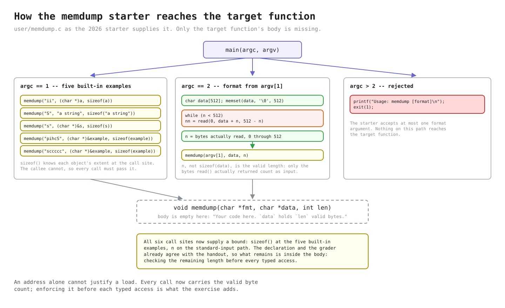
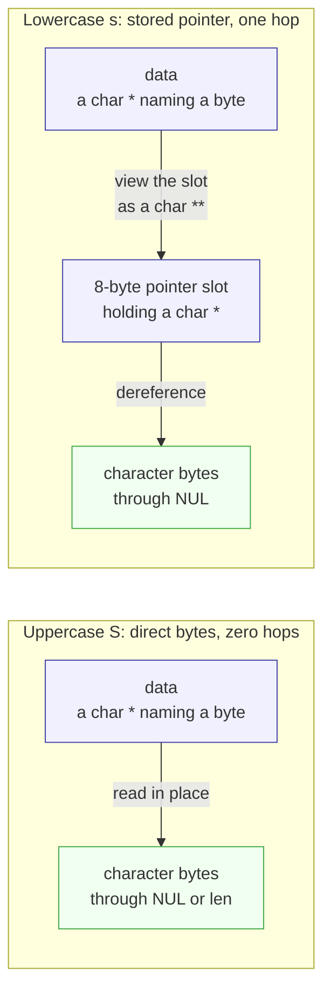

# Lab util: Deriving `memdump`

---

[toc]

---

MIT's easy [`memdump` exercise](https://pdos.csail.mit.edu/6.1810/2026/labs/util.html) asks a user-space formatter to walk raw memory according to a compact type description. The exercise is about the difference between an address, the bytes stored at that address, and a pointer value stored inside those bytes. This note derives those distinctions and stops where writing [`user/memdump.c`](../../user/memdump.c) begins.

> [!IMPORTANT]
> This note contains no solution or pseudocode, and it does not acquire one now that the exercise is graded. It records the target contract, the current grader's observations, existing non-target code, source-backed decisions, and common traps. The finished body and the two policy choices the handout leaves open are recorded in the banner comment of [`user/memdump.c`](../../user/memdump.c) itself.

## What the exercise asks for

The 2026 handout specifies `memdump(char *fmt, char *data, int len)`. `data` identifies the first valid byte, `len` limits the readable region, and each character in the NUL-terminated `fmt` string describes the next item in that region. The format is its own small language; its characters are not `printf` conversions and do not begin with `%`.

| Format  | Data item described by the 2026 handout                 | Printed interpretation                                             | Fixed-width bytes needed before access |
| ------- | ------------------------------------------------------- | ------------------------------------------------------------------ | -------------------------------------- |
| **`i`** | The next 4 bytes                                        | A 32-bit integer in decimal                                        | 4                                      |
| **`p`** | The next 8 bytes                                        | A 64-bit integer in hexadecimal                                    | 8                                      |
| **`h`** | The next 2 bytes                                        | A 16-bit integer in decimal                                        | 2                                      |
| **`c`** | The next byte                                           | One 8-bit ASCII character                                          | 1                                      |
| **`s`** | The next 8 bytes, which contain a pointer to a C string | The string reached through that stored pointer                     | 8                                      |
| **`S`** | The remaining valid bytes beginning at the cursor       | Bytes through the first NUL or through the end of the valid region | Variable                               |

For every fixed-width item, too few remaining bytes must produce `memdump: not enough data for 'X'` and stop, where `X` is the current format character. `S` is deliberately different: absence of a NUL within the valid region is not permission to read farther, so it prints only the bytes still covered by `len`.

### What the local grader checks

The three relevant tests in [`grade-lab-util`](../../grade-lab-util) are worth 25 points. Their matcher has three consequences:

| Matcher behavior                     | Consequence                                                                                                                                                                 |
| ------------------------------------ | --------------------------------------------------------------------------------------------------------------------------------------------------------------------------- |
| **Searches one combined transcript** | Each required expression is removed after its first match, so a line cannot be attributed to one command when a test runs several.                                          |
| **Uses several anchoring strengths** | The first two tests use start-only patterns; the corner test uses exact value patterns, a diagnostic substring, a start-only usage pattern, and one exact negative pattern. |
| **Checks no ordering**               | Matching output need not follow the handout's sequence, and unrelated output can appear between or after required lines.                                                    |

| Exact test                                                    | Commands                                                                                                                     | Assertions                                                                                                                                                                                              | Limits                                                                                                                                        |
| ------------------------------------------------------------- | ---------------------------------------------------------------------------------------------------------------------------- | ------------------------------------------------------------------------------------------------------------------------------------------------------------------------------------------------------- | --------------------------------------------------------------------------------------------------------------------------------------------- |
| **`memdump, examples` (10 points)**                           | `memdump`                                                                                                                    | Positive prefixes `^61810`, `^2026`, `^a string`, `^another`, `^1819438967`, `^100`, `^z`, `^xyzzy`, `^hello`, `^w`, and `^d`; no negative expressions.                                                 | Does not require headings, pointer output, `o`, `r`, or `l` from Example 5, exact line endings, adjacency, order, or absence of extra output. |
| **`memdump, format ii, S, p` (10 points)**                    | Three commands over `abcdefgh12345678\n`, using `ii`, `S`, and `p`.                                                          | Positive prefixes `^1684234849`, `^1751606885`, `^abcdefgh12345678`, and `^6867666564636261`; no negative expressions. The numbers cover two little-endian 4-byte groups and one complete 8-byte group. | Does not isolate commands, reject extra output, exercise lowercase `s`, or check advancement after `p`.                                       |
| **`memdump, formats h c, bounds checking, usage` (5 points)** | `echo abcdefgh \| memdump h`, the same input with `c`, `echo a \| memdump i`, `echo abc \| memdump ii`, and `memdump a b c`. | Exact positives `^25185$`, `^a$`, and `^174285409$`; diagnostic substring `memdump: not enough data`; usage prefix `^Usage: memdump`; exact negative `^2657$`.                                          | Does not check the format character in the diagnostic, bounds on `p`, `s`, or `S`, or which short-input command produced the diagnostic.      |

Both example tests are named `test_memdump_examples`; their decorators register both wrappers before the second definition rebinds the Python name, so both run, but a later failure may overwrite `xv6.out.memdump_examples`. [`util-sleep.md`](util-sleep.md#why-two-tests-can-have-the-same-python-function-name) owns that mechanism.

> [!NOTE]
> The 2026 grader closed two gaps in the 2025 script: it asserts the full eight-byte `p` value and requires the not-enough-data diagnostic. It still cannot prove that the diagnostic names the _right_ format character or that `S` respects `len`, because the starter's zero fill places a convenient NUL immediately beyond the non-NUL-terminated input region.

## Prerequisites

| When                                     | Read                                                                                                                                            | Why it matters here                                                                                                                                         |
| ---------------------------------------- | ----------------------------------------------------------------------------------------------------------------------------------------------- | ----------------------------------------------------------------------------------------------------------------------------------------------------------- |
| **Read first**                           | [`C_Pointers.md`](../../../c-programming/C_Pointers.md#type-casting-byte-level-access)                                                          | Establishes addresses, dereference, byte-level casts, and why a `void *` needs a typed view before access.                                                  |
| **Read first**                           | [`C_Pointer_Arithmetic.md`](../../../c-programming/C_Pointer_Arithmetic.md#byte-level-access-use-char)                                          | Shows that pointer movement scales by the pointed-to type and that `char *` advances one byte.                                                              |
| **Read first**                           | [`C_Custom_Data_Types.md`](../../../c-programming/C_Custom_Data_Types.md#memory-placement-and-portability)                                      | Owns structure member order, alignment, padding, and the portability boundary around object layout.                                                         |
| **Use when reading memory helpers**      | [`C_Standard_Library.md`](../../../c-programming/C_Standard_Library.md#memory-blocks---stringh-and-stdlibh)                                     | Contrasts byte-counted `memset`, `memcpy`, `memmove`, and `memcmp` with NUL-terminated string operations.                                                   |
| **Use when checking arrays and strings** | [`C_Array.md`](../../../c-programming/C_Array.md#arrays-in-function-calls) and [`C_String.md`](../../../c-programming/C_String.md#core-concept) | Reviews array decay, separate lengths, embedded character arrays, string pointers, and NUL termination.                                                     |
| **Worked comparison**                    | [`byte_memory_functions.c`](../../../c-programming/notes/src/main/memory/byte_memory_functions.c)                                               | Demonstrates exact byte counts, overlap, comparison, and byte inspection in hosted C; its headers and `printf()` are not xv6 APIs.                          |
| **Worked comparison**                    | [`pointer_cast_print_width.c`](../../../c-programming/notes/src/main/pointers/pointer_cast_print_width.c)                                       | Runs this exercise's six read widths against one region in hosted C, including the `char **` hop and counted output; `%.*s` and `fwrite` do not exist here. |

## How the starter reaches the target



_The figure shows the starter as the 2026 lab supplies it, before the body exists. Blue routes the `argc` dispatch, yellow marks a call into the target, pink marks the one input syscall, green marks the buffer holding its bytes, and red marks the failure path. [Edit the Excalidraw source.](fig/util-memdump-entry-paths.excalidraw)_

> [!IMPORTANT]
> Each caller supplies the valid extent while it still knows the original object: the five examples pass `sizeof(object)`, standard input passes the accumulated byte count `n`, and the `argc > 2` usage path never calls `memdump()`.

Inside `memdump()`, `sizeof(data)` would measure only the pointer. The extent must therefore cross the call boundary as `len`, remain paired with the cursor, and justify each access before it occurs.

## The code to read first

| Source                                                                         | Contributes                                                                                                                          | Deliberately does not contribute                                           |
| ------------------------------------------------------------------------------ | ------------------------------------------------------------------------------------------------------------------------------------ | -------------------------------------------------------------------------- |
| **[2026 util handout](https://pdos.csail.mit.edu/6.1810/2026/labs/util.html)** | The six format characters, widths, `len` boundary, diagnostic, and examples.                                                         | A policy for unknown format characters or signed negative values.          |
| **[`grade-lab-util`](../../grade-lab-util)**                                   | The current public commands, points, regex assertions, the required diagnostic text, and observable blind spots.                     | Which format character the diagnostic must name, or a bounded `S` case.    |
| **[`kernel/types.h`](../../kernel/types.h)**                                   | This tree's exact 8-, 16-, 32-, and 64-bit unsigned aliases.                                                                         | Structure offsets, byte order, or a generic formatting routine.            |
| **[`user/ulib.c`](../../user/ulib.c)**                                         | `memmove()` demonstrates the local `void *` interface followed by byte-pointer traversal.                                            | Typed decoding or formatted output.                                        |
| **[`user/printf.c`](../../user/printf.c)**                                     | The formatter actually available in xv6, including `%d`, `%c`, `%s`, `%x`, and `%lx`, plus its exact variadic argument expectations. | Memory bounds or the exercise's `i`, `p`, `h`, `c`, `s`, and `S` language. |
| **[`user/cat.c`](../../user/cat.c)** and **[`user/wc.c`](../../user/wc.c)**    | The established 512-byte buffer size and the rule that only the byte count returned by `read()` is fresh input.                      | A reason that 512 is semantically required.                                |

Everything else this exercise touches is owned elsewhere and is deliberately not restated here:

| Topic                                            | Owner                                                                                                     |
| ------------------------------------------------ | --------------------------------------------------------------------------------------------------------- |
| **Program layout and `UPROGS`**                  | [`02-build-boot-and-usage.md`](../02-build-boot-and-usage.md#adding-and-running-a-user-exercise)          |
| **Grading and failed transcripts**               | [`03-lab-workflow.md`](../03-lab-workflow.md#grading)                                                     |
| **The `read()` return contract**                 | [`05-syscall-reference.md`](../05-syscall-reference.md#files-and-descriptors)                             |
| **What `printf` can and cannot format**          | [`05-syscall-reference.md`](../05-syscall-reference.md#printf-conversions-and-the-missing-bounded-string) |
| **The reusable byte-stream explanation**         | [`07-exercises.md`](../07-exercises.md#ex1copy--the-lecture-1-input-filter)                               |
| **Address spaces and user virtual addresses**    | [`book/ch02`](../book/ch02-operating-system-organization.md), [`book/ch03`](../book/ch03-page-tables.md)  |
| **Object representation, pointers, and padding** | The sibling C notes listed under [Prerequisites](#prerequisites)                                          |

> [!NOTE]
> `memdump()` traverses user-space objects; the argument form finishes all input reads before the target runs. Because the linked book chapters remain placeholders, this note holds one fact on loan: every example address is a user virtual address in this process.

## `memmove()` as the existing byte walker

The complete `memmove()` in [`user/ulib.c`](../../user/ulib.c) is a useful non-target comparison:

```c
void *
memmove(void *vdst, const void *vsrc, int n)
{
  char *dst;
  const char *src;

  dst = vdst;
  src = vsrc;
  if (src > dst) {
    while (n-- > 0)
      *dst++ = *src++;
  } else {
    dst += n;
    src += n;
    while (n-- > 0)
      *--dst = *--src;
  }
  return vdst;
}
```

| Existing detail                            | Consequence for this exercise                                                                                                                                                       |
| ------------------------------------------ | ----------------------------------------------------------------------------------------------------------------------------------------------------------------------------------- |
| **Public parameters are `void *`**         | Callers can pass pointers to any object type without explicit casts.                                                                                                                |
| **Local cursors are `char *`**             | Standard C does not define dereferencing or arithmetic on `void *`; converting once gives a complete one-byte element type.                                                         |
| **`dst++` and `src++` move one byte**      | Pointer arithmetic is scaled by the pointed-to type, and `sizeof(char)` is exactly one. An `int *` cursor would move four bytes per increment in this ABI.                          |
| **The function receives `n` separately**   | A pointer carries an address and type but not the size of the object or input region it came from. Bounds must travel as separate data after an array argument decays to a pointer. |
| **Traversal direction depends on overlap** | That branch is specific to copying. `memdump` only observes bytes, so the overlap problem and write cursor are not part of its contract.                                            |

Hosted sibling examples cover the same facts: [`pointer_generic_void.c`](../../../c-programming/notes/src/main/pointers/pointer_generic_void.c) tests `void *`, [`pointer_type_casting.c`](../../../c-programming/notes/src/main/pointers/pointer_type_casting.c) compares typed views, and [`array_memory.c`](../../../c-programming/notes/src/main/arrays/array_memory.c) shows contiguous bytes. Their headers and output functions are not xv6 APIs.

## The concept underneath

| Question                              | Fast answer                                                                                         |
| ------------------------------------- | --------------------------------------------------------------------------------------------------- |
| **What does the cursor name?**        | The next byte in one bounded region, not a typed object chosen by the compiler.                     |
| **What does the format choose?**      | The width and interpretation imposed on the bytes beginning at that cursor.                         |
| **Why use a character pointer?**      | A character type may inspect any object's representation, and `+ 1` advances exactly one byte.      |
| **Why carry `len` separately?**       | A pointer contains no capacity or valid-content length, so the address alone cannot justify a load. |
| **What is the crucial string split?** | `s` reads a stored pointer and follows it; `S` reads characters directly from the bounded region.   |

### Why `char *data`

`memdump("ii", (char *)a)` crosses three type views without changing the object:

| Stage           | Pointer view                          | Consequence                                                                                    |
| --------------- | ------------------------------------- | ---------------------------------------------------------------------------------------------- |
| **Array decay** | `a` becomes an `int *` naming `a[0]`. | The pointer has an address and element type, but no array length.                              |
| **Cast**        | `(char *)` preserves that address.    | Neither integer nor any stored byte is converted.                                              |
| **Byte cursor** | The target receives a `char *`.       | A character type may inspect any object's representation, and `+ 1` advances exactly one byte. |

A mixed-width walker therefore uses the same one-byte unit that the format widths and `len` count. `memmove()` takes `void *` publicly for convenient calls, then obtains the required character cursor internally; the supplied `memdump()` interface exposes that cursor directly.

### Values, representations, and byte order

[`kernel/types.h`](../../kernel/types.h) defines `uint8`, `uint16`, `uint32`, and `uint64` on top of the widths the RISC-V compiler selected by this Makefile actually uses:

| C type                  | Width on this target | Alias in `kernel/types.h` | Format character that consumes it |
| ----------------------- | -------------------- | ------------------------- | --------------------------------- |
| **`char`**              | 1 byte               | `uint8`                   | `c`                               |
| **`short`**             | 2 bytes              | `uint16`                  | `h`                               |
| **`int`**               | 4 bytes              | `uint32`                  | `i`                               |
| **`long` and pointers** | 8 bytes              | `uint64`                  | `p`, and the slot `s` consumes    |

The target is little-endian, so the lowest-address byte contributes the least-significant eight bits of a multi-byte integer:

| Source value | 32-bit hexadecimal | Bytes at increasing addresses on this target |
| ------------ | ------------------ | -------------------------------------------- |
| **61810**    | `0x0000f172`       | `72 f1 00 00`                                |
| **2026**     | `0x000007ea`       | `ea 07 00 00`                                |

The source-level integer values are portable, but these byte sequences depend on the target widths and little-endian byte order. [`pointer_little_endian.c`](../../../c-programming/notes/src/main/pointers/pointer_little_endian.c) demonstrates the same one-object, multiple-width view in the sibling C notes.

### Why `s` needs `&s`



_Blue marks address routing or pointer storage, green marks character data, and every arrow is one pointer relationship. The later layout figure adds yellow for numeric fields and red for bytes the examples do not consume._

Because `data` has type `char *`, dereferencing it directly yields one `char`. To describe a slot that instead contains a `char *`, the same address needs the type "pointer to `char *`": `char **`. One dereference then loads the stored address, and the next reaches a character.

> [!IMPORTANT]
> A cast changes the compiler's interpretation of an address, not the bytes in memory. The same eight bytes can therefore be one stored pointer under `s` or eight character items under `cccccccc`.

| Format and argument | What `data` initially names                            | Interpretation and outcome                                                                                               |
| ------------------- | ------------------------------------------------------ | ------------------------------------------------------------------------------------------------------------------------ |
| **`S` with `s`**    | The direct bytes `61 6e 6f 74 68 65 72 00`.            | Reads characters in place through NUL or `len`.                                                                          |
| **`s` with `&s`**   | An eight-byte slot holding the address of `"another"`. | Viewing that slot as `char **` and dereferencing once produces the stored `char *`; following it reaches the characters. |
| **`s` with `s`**    | The first eight characters of `"another"`.             | Reinterprets those letters as a fabricated address, which may be unmapped.                                               |

Lowercase `s` thus consumes a pointer-sized slot and follows one stored address; uppercase `S` starts at a character byte and follows no pointer. [`pointer_to_pointer_lifecycle.c`](../../../c-programming/notes/src/main/strings/pointer_to_pointer_lifecycle.c) visualizes the same separation between pointer storage and the character row it reaches.

### Structure layout

The RISC-V compiler lays out the starter's `struct sss` in declaration order with the offsets below. The five members are naturally aligned without internal padding; the complete object has one trailing padding byte so that its 24-byte size remains a multiple of the structure's eight-byte alignment.

| Offset    | Width | Declared member | Bytes or meaning in this example                                                                                                                        |
| --------- | ----- | --------------- | ------------------------------------------------------------------------------------------------------------------------------------------------------- |
| **0-7**   | 8     | `ptr`           | A pointer value leading to `"hello"`. Its bytes vary with the linked image.                                                                             |
| **8-11**  | 4     | `num1`          | `1819438967 == 0x6c726f77`, stored as `77 6f 72 6c`, the ASCII bytes `w o r l`.                                                                         |
| **12-13** | 2     | `num2`          | `100 == 0x0064`, stored as `64 00`; its first byte is ASCII `d`.                                                                                        |
| **14**    | 1     | `byte`          | `7a`, ASCII `z`.                                                                                                                                        |
| **15-22** | 8     | `bytes`         | `strcpy` writes `78 79 7a 7a 79 00` for `xyzzy` and its NUL; the final two array bytes remain indeterminate because `example` was not zero-initialized. |
| **23**    | 1     | Tail padding    | An indeterminate padding byte, not a declared member.                                                                                                   |

The declaration-to-offset mapping is implementation-defined, not a universal serialization format. [`structure_size_padding_bytes.c`](../../../c-programming/notes/src/main/structures/structure_size_padding_bytes.c) owns the longer alignment and padding explanation.

### Array initialization

| Form                                            | Valid? | Effect                                                                                  |
| ----------------------------------------------- | ------ | --------------------------------------------------------------------------------------- |
| **Initializer inside the structure type body**  | No     | A type body defines layout, not an object to initialize.                                |
| **`example.bytes = "xyzzy"` after declaration** | No     | An array is not a modifiable assignment target.                                         |
| **`strcpy(example.bytes, "xyzzy")`**            | Yes    | Writes six bytes, including NUL, but leaves the final two array elements indeterminate. |
| **Aggregate initialization**                    | Yes    | Initializes the whole object and zeroes those two trailing array elements.              |

Initialization is starter context, not part of the `memdump` contract. [`array_basic.c`](../../../c-programming/notes/src/main/arrays/array_basic.c) and [`student.c`](../../../c-programming/notes/src/main/structures/student.c) own the general array and structure rules.

### The five starter layouts


_Addresses increase from left to right. In addition to the pointer and character colors defined above, yellow marks typed numeric fields, and red marks indeterminate bytes that the examples do not consume. The pointer bytes are symbolic because their numeric address depends on the linked image. [Edit the Excalidraw source.](fig/util-memdump-layouts.excalidraw)_

Examples 4 and 5 pass the _same_ structure address and get different answers, because the format string — not the declaration — decides how the bytes are grouped:

| Format       | Bytes consumed, in order | Relationship to the declared members                                          |
| ------------ | ------------------------ | ----------------------------------------------------------------------------- |
| **`pihcS`**  | 8, 4, 2, 1, then to NUL  | Follows the members exactly: `ptr`, `num1`, `num2`, `byte`, then `bytes`.     |
| **`sccccc`** | 8, then 1, 1, 1, 1, 1    | Follows `ptr` as a string pointer, then reads five bytes that ignore members. |

Those five `c` items cross a member boundary: four come from `num1` (`w`, `o`, `r`, `l`) and the fifth is the low byte of `num2` (`d`). That is the point of the example — the format describes bytes to consume, and never asks the compiler for member names or types.

### Why 512 bytes

| Quantity                    | What it establishes                        | What remains unknown                                                                 |
| --------------------------- | ------------------------------------------ | ------------------------------------------------------------------------------------ |
| **`sizeof(data) == 512`**   | Maximum buffer capacity.                   | How many bytes were read, whether they form a string, or whether a spare NUL exists. |
| **`n` after the read loop** | Valid input extent to pass to `memdump()`. | Whether a NUL occurs within that extent.                                             |

The 512-byte capacity follows `user/cat.c` and `user/wc.c`; it is a convention, not a `read()` or 1024-byte filesystem-block requirement from [`kernel/fs.h`](../../kernel/fs.h).

> [!WARNING]
> Zero fill cannot replace `len`: short input gains plausible padding that hides overreads, while a full 512-byte input leaves no spare terminator. For `a\n`, ignoring `n == 2` reads two padded zeros and prints the grader's forbidden `2657` (`0x00000a61`) instead of refusing.

## Deriving it

### Contract

| Concern                    | Contract to preserve                                                                                                                                                                                              |
| -------------------------- | ----------------------------------------------------------------------------------------------------------------------------------------------------------------------------------------------------------------- |
| **Inputs**                 | A NUL-terminated format, the first byte of a region, and its valid byte count.                                                                                                                                    |
| **State**                  | Each recognized format character describes the current cursor. Fixed-width items advance the cursor and reduce the remaining length by the same width; continuation after `S` finds NUL needs an explicit policy. |
| **Bounds**                 | No access that decodes an item from the region may inspect beyond it. A short fixed-width item prints the exact diagnostic and ends the dump.                                                                     |
| **`s`**                    | Bounds-checks and consumes one stored 64-bit pointer, then follows it; the handout neither validates that address nor bounds the separate string it names.                                                        |
| **`S`**                    | Reads the current region directly through its first NUL or the valid boundary, whichever comes first.                                                                                                             |
| **Output and environment** | Values use the required representations, runtime pointer values may vary, and only `user/user.h` plus local integer aliases are available.                                                                        |

### Decisions and evidence

| Decision to derive           | Evidence to consult                                                                                                                                                                                                                                                                                                                                                          |
| ---------------------------- | ---------------------------------------------------------------------------------------------------------------------------------------------------------------------------------------------------------------------------------------------------------------------------------------------------------------------------------------------------------------------------- |
| **What each `len` counts**   | Classify the five `sizeof()` arguments and variable `n` as declared object bytes, string bytes including NUL, or bytes returned by `read()`.                                                                                                                                                                                                                                 |
| **Cursor unit**              | Compare `char *`, `short *`, `int *`, and `uint64 *` increments with `memmove()` and the pointer-arithmetic examples.                                                                                                                                                                                                                                                        |
| **Load and variadic types**  | Match `kernel/types.h` widths to `%d`, `%x`, and `%lx` consumption in `user/printf.c`, including default promotions.                                                                                                                                                                                                                                                         |
| **Signed decimal policy**    | The handout fixes the widths of `i` and `h` but not how negative bit patterns are interpreted; compare the choice recorded in `user/memdump.c` with the unsigned aliases.                                                                                                                                                                                                    |
| **State invariant**          | For each fixed width, relate bytes consumed, cursor movement, remaining length, and the check required before access.                                                                                                                                                                                                                                                        |
| **String path and boundary** | Contrast the pointer hop for `s` with direct bounded `S`; verify why local `strlen()` and `%s` cannot enforce `len`, then search `user/user.h` and `user/printf.c` for an output primitive with an explicit byte count. [`05-syscall-reference.md`](../05-syscall-reference.md#printf-conversions-and-the-missing-bounded-string) records the missing hosted-C alternatives. |
| **`S` continuation policy**  | The handout calls `S` "the rest," and the grader never follows an in-region NUL with another directive; decide whether continuation is meaningful and, if so, whether the NUL is consumed.                                                                                                                                                                                   |
| **Unknown format policy**    | The handout and grader specify no diagnostic, movement, or status; choose and record a conservative behavior.                                                                                                                                                                                                                                                                |
| **Complete `p` output**      | Compare `%x` with `%lx` in `user/printf.c`; derive which conversion preserves the required `6867666564636261` and what the truncated line would be.                                                                                                                                                                                                                          |

### Traps

| Trap                                             | Failure                                                                                                                                    | Evidence                                                                   |
| ------------------------------------------------ | ------------------------------------------------------------------------------------------------------------------------------------------ | -------------------------------------------------------------------------- |
| **Using `fmt` as a `printf` format**             | Bare lab directives describe memory; `%` conversions consume variadic arguments.                                                           | 2026 handout, `user/printf.c`                                              |
| **Confusing `s`, `&s`, and `S`**                 | Passing direct characters to lowercase `s` fabricates an address; treating `S` as indirect adds a pointer hop that is not there.           | `user/memdump.c`, layout figure, 2026 handout                              |
| **Using `void *` or one wider cursor**           | `void *` cannot be dereferenced or advanced in standard C, while wider increments skip bytes in mixed layouts.                             | `user/ulib.c`, sibling `pointer_generic_void.c` and `pointer_arithmetic.c` |
| **Checking bounds after access**                 | The invalid observation occurs before the diagnostic.                                                                                      | 2026 handout's short-input rule                                            |
| **Delegating bounded `S` to `strlen()` or `%s`** | Both scan past `len` until NUL, and local `vprintf()` implements no `%.*s` precision.                                                      | `user/ulib.c`, `user/printf.c`, `docs/05-syscall-reference.md`             |
| **Passing capacity or trusting zero fill**       | Unread bytes are not input; padding hides short overreads, and a full buffer has no spare NUL.                                             | `user/memdump.c`, `docs/05-syscall-reference.md`, `grade-lab-util`         |
| **Assuming every wider view is portable**        | Character storage may be unaligned for wider types; arbitrary formats can create unaligned positions even though the target examples work. | `C_Pointers.md`, Makefile target ABI                                       |
| **Ignoring structure padding**                   | Compiler offsets and tail padding, not summed member widths, determine the object representation.                                          | Sibling `structure_size_padding_bytes.c`                                   |
| **Expecting a stable pointer value**             | Link layout and runtime placement may change the address without changing its relationships.                                               | 2026 handout's Example 4 caveat                                            |
| **Using `%x` for `p`**                           | The output truncates to `64636261` instead of the required `6867666564636261`.                                                             | `user/printf.c`, `grade-lab-util`                                          |

## Verifying it

One build covers the starter, the build registration, and the body once it exists:

```bash
make user/_memdump
```

Boot xv6 and exercise every format family, both bounds outcomes, and the handout's unspecified format case:

```text
$ memdump
$ echo deadc0de | memdump hhcccc
$ echo deadc0de | memdump p
$ echo a | memdump i
$ echo abcdefgh | memdump Sc
$ echo abcdefgh | memdump z
```

| Command                             | Evidence it supplies                                                                                                          |
| ----------------------------------- | ----------------------------------------------------------------------------------------------------------------------------- |
| **`memdump`**                       | Built-in direct and indirect strings, structure fields, and cross-field characters.                                           |
| **`deadc0de` cases**                | Little-endian mixed widths and the complete 8-byte `p` value.                                                                 |
| **`echo a \| memdump i`**           | A two-byte input reaches the required short-item diagnostic.                                                                  |
| **`echo abcdefgh \| memdump Sc`**   | No NUL lies within the nine valid bytes, so `len` must stop `S`; the following `c` must then report a shortage.               |
| **`echo abcdefgh \| memdump z`**    | The chosen unknown-format policy matches the one recorded in the source.                                                      |
| **In-region NUL, then a directive** | No starter or grader case covers this path; use a temporary harness only if the source records a continuation policy for `S`. |

Exit QEMU with `Ctrl-a` then `x`, then run the focused grader:

```bash
./grade-lab-util memdump
```

Read `xv6.out.memdump_examples` after a failure, but remember that both same-named tests save to that path and the later failure can overwrite the earlier transcript; the bounds test writes `xv6.out.memdump_corner` instead. No kernel gdb recipe is useful here because the behavior being derived is user-space object traversal; inspect the generated `user/memdump.asm` only if a target-specific load width or alignment question remains.

## Questions

1. **Why does casting `a` to `char *` preserve its address but change `+ 1`?** Compare array decay in `array_basic.c` with typed increments in `pointer_type_casting.c`.
2. **Why does lowercase `s` need `&s`, and which eight bytes does it consume first?** Use Example 3 in the layout figure.
3. **How can Example 5 produce `world` without a character array containing it?** Follow the little-endian fields through offset 12.
4. **Why is `struct sss` 24 rather than 23 bytes?** Check the compiler offsets against the alignment rule in `structure_size_padding_bytes.c`.
5. **What fails if a fixed-width access occurs before its `len` check?** Separate the invalid observation from the later diagnostic.
6. **What fails if `S` delegates to `%s` without finding a bounded NUL first?** Trace the loop in `user/printf.c` and identify its only stopping condition.
7. **Why does the grader forbid `2657` for `a\n`, and why would full 512-byte input defeat the same zero-fill assumption?** Follow `n`, the padded bytes, and the lack of a spare terminator.
