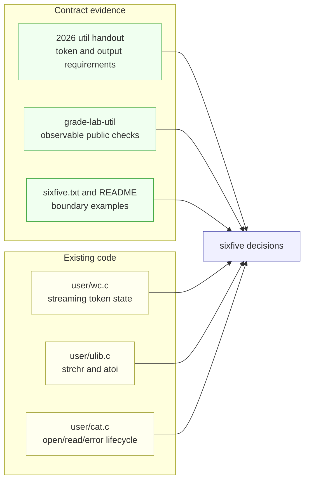
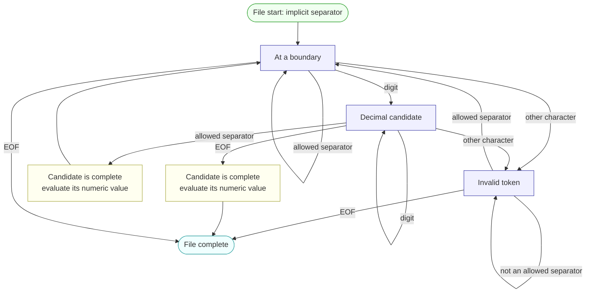

# Lab util: Deriving `sixfive`

---

[toc]

---

MIT's moderate [`sixfive` exercise](https://pdos.csail.mit.edu/6.1810/2026/labs/util.html) is a small text parser built from `open`, `read`, `strchr`, integer arithmetic, and ordinary user-space state. The difficult part is not divisibility; it is preserving the distinction between a decimal number such as `/6,` and a digit embedded in a non-number such as `xv6`. This note derives that distinction and leaves the target [`user/sixfive.c`](../../user/sixfive.c) as the exercise.

> [!IMPORTANT]
> This note contains no solution or pseudocode. It records existing code, the target contract, a source-backed token model, implementation decisions, and common traps.

## What the exercise asks for

The handout defines a number as a sequence of decimal digits separated by characters from the exact string `" -\r\t\n./,"`. File start and EOF count as separators even though neither is a byte in that string. For every input file, `sixfive` prints each number divisible by 5 or 6 on its own line.

| Requirement                   | What it fixes                                                                                                                                    |
| ----------------------------- | ------------------------------------------------------------------------------------------------------------------------------------------------ |
| **One or more input paths**   | “For each input file” requires processing every path after `argv[0]`, not only the first.                                                        |
| **Exact separator set**       | Space, hyphen, carriage return, tab, newline, period, slash, and comma form token boundaries; other nondigits do not silently become separators. |
| **Whole decimal tokens**      | `/6,` contains the number 6, while `xv6` is one non-number token and contributes nothing.                                                        |
| **Implicit boundaries**       | A number may begin at byte zero or end at EOF without a separator byte in the file.                                                              |
| **Either divisor**            | A number qualifies when divisible by 5, by 6, or by both; a common multiple is printed once.                                                     |
| **Numeric output**            | The fixture contains `06`, while the required output contains `6`, so leading zeros are not preserved.                                           |
| **Character-at-a-time input** | The handout explicitly suggests one byte per `read`, keeping the parsing problem independent of buffer boundaries.                               |

The three relevant tests in [`grade-lab-util`](../../grade-lab-util) remain worth 30 points, but each now isolates command output from the QEMU transcript and compares the complete ordered line list:

| Test                             | Runs                                                                                                                      | Exact checks                                                                                                                                                                                 | What those checks do not prove                                                           |
| -------------------------------- | ------------------------------------------------------------------------------------------------------------------------- | -------------------------------------------------------------------------------------------------------------------------------------------------------------------------------------------- | ---------------------------------------------------------------------------------------- |
| **`sixfive_test` (10 points)**   | The supplied fixture plus `sf-edge`, `sf-seps`, and `sf-empty`                                                            | Requires the complete expected output for ordinary values and all separator classes, rejects invalid suffixes and embedded digits, and requires no output for empty or separator-only files. | Behavior for values outside the `int` range or an actual `read()` failure.               |
| **`sixfive_readme` (10 points)** | `sixfive README`                                                                                                          | Requires exactly `6`, `6`, `1810`, `6`, and `1810` in that order, with no extra output.                                                                                                      | General behavior beyond the token shapes present in `README`.                            |
| **`sixfive_all` (10 points)**    | Both supplied files, qualifying and nonqualifying EOF fixtures, three files with an empty middle file, and a missing path | Requires exact combined output, commits a qualifying number at EOF, rejects a nonqualifying number at EOF, preserves file order across an empty file, and reports the expected open failure. | An actual `read()` failure after a file was opened, or a policy for arithmetic overflow. |

`assert_command_output()` removes console carriage returns, locates one command and its following marker command, and compares every intervening output line with `assert_equal()`. Extra, missing, reordered, or prefix-only lines now fail. The duplicate Python function name used by the last two tests does not prevent either from running: their decorators register separate wrappers before the second definition replaces the module variable, the same mechanism explained for the [`sleep` tests](util-sleep.md#why-two-tests-can-have-the-same-python-function-name).

The checked fixture [`user/sixfive.txt`](../../user/sixfive.txt) makes several boundaries observable:

| Input text         | Intended result     | Reason                                                                                                     |
| ------------------ | ------------------- | ---------------------------------------------------------------------------------------------------------- |
| **`5`**            | Print 5.            | File start and newline delimit a qualifying number.                                                        |
| **`3`**            | Print nothing.      | It is a number but has no zero remainder for either divisor.                                               |
| **`xv6`**          | Print nothing.      | No allowed separator occurs before the digit, so the complete token is not decimal.                        |
| **`127`**          | Print nothing.      | It is decimal but not divisible by 5 or 6.                                                                 |
| **`100`**          | Print 100.          | It is divisible by 5.                                                                                      |
| **`18-4`**         | Print 18 only.      | Hyphen separates two decimal numbers; 18 qualifies and 4 does not.                                         |
| **`06`**           | Print 6.            | Leading zeros are normalized because output uses the numeric value.                                        |
| **`0-00-30`**      | Print 0, 0, and 30. | Zero is divisible by both divisors, leading zeros do not change its value, and each hyphen ends one token. |
| **`abc15`**        | Print nothing.      | Digits cannot repair a token that letters already made nondecimal.                                         |
| **`a5,a6,a0,a30`** | Print nothing.      | After a letter invalidates each token, qualifying digit suffixes must not restore numeric state.           |
| **`5a6b30`**       | Print nothing.      | Repeated alternation between letters and digits remains one invalid token until the next separator.        |

The five intended README results are `6`, `6`, `1810`, `6`, and `1810`: the standalone 6 in “Version 6,” the `/6.1810/` URL components, and the final “MIT's 6.1810.” Text such as `xv6`, `v6`, `6th`, and `x653` remains part of nondecimal tokens because the adjacent letters are not separators.

## Setup in this tree

The Makefile already lists `$U/_sixfive` in `UPROGS`, so the linked program is installed in `fs.img` as the guest command `sixfive`. Under `LAB=util`, `UEXTRA` copies [`user/sixfive.txt`](../../user/sixfive.txt) plus the `sf-empty`, `sf-seps`, `sf-edge`, `sf-good-eof`, and `sf-bad-eof` grader fixtures into the image. [`02-build-boot-and-usage.md`](../02-build-boot-and-usage.md#adding-and-running-a-user-exercise) owns those build and program-layout mechanics.

This note treats the target file as the exercise and neither quotes nor explains it. All code below comes from existing non-target sources.

## The code to read first



_Across both diagrams, green supplies data, yellow marks processing, blue marks decisions or state, and cyan marks completion._

| Source                                                                        | Contributes                                                                                                                               | Deliberately does not contribute                                            |
| ----------------------------------------------------------------------------- | ----------------------------------------------------------------------------------------------------------------------------------------- | --------------------------------------------------------------------------- |
| **[`grade-lab-util`](../../grade-lab-util)**                                  | Commands, points, exact expected output, edge fixtures, and remaining observable limits.                                                  | A range policy or a way to force a post-open read failure.                  |
| **[`user/sixfive.txt`](../../user/sixfive.txt) and [`README`](../../README)** | Concrete tokens, invalid lookalikes, leading zeros, repeated values, and EOF behavior.                                                    | Error-path requirements.                                                    |
| **[`user/wc.c`](../../user/wc.c)**                                            | A read loop, state that survives characters and buffer fills, `strchr()` as set membership, multiple input files, and read/open failures. | Decimal validation, numeric accumulation, or divisibility.                  |
| **[`user/ulib.c`](../../user/ulib.c)**                                        | The exact `strchr()` and `atoi()` implementations available to an xv6 user program.                                                       | Host `strtok`, `strtol`, `isdigit`, streams, or conversion error reporting. |
| **[`user/cat.c`](../../user/cat.c)**                                          | The smallest open/read/close lifecycle and the distinction among positive byte counts, EOF, and read failure.                             | Token state.                                                                |
| **[`user/user.h`](../../user/user.h)**                                        | The complete callable interface in this freestanding user environment.                                                                    | Any function from the host C library that is not declared there.            |

[`05-syscall-reference.md`](../05-syscall-reference.md#files-and-descriptors) owns the exact `open`, `read`, and `close` contracts. [`book/ch01-operating-system-interfaces.md`](../book/ch01-operating-system-interfaces.md#descriptors-two-levels-of-indirection) owns the kernel-backed descriptor model, [`07-exercises.md`](../07-exercises.md#ex1copy--the-lecture-1-input-filter) owns the reusable byte-stream and EOF explanation, and [`03-lab-workflow.md`](../03-lab-workflow.md#grading) owns grader operation and transcripts.

> [!NOTE]
> Three sibling-repository examples are useful comparisons when working in this personal workspace. [`count_words.c`](../../../c-programming/notes/src/main/io_streams/file_streams/text_mode/count_words.c) demonstrates persistent token state and an explicit EOF commit; [`search_functions.c`](../../../c-programming/notes/src/main/strings/search_functions.c) distinguishes `strchr`'s single-character search from delimiter-set tokenization; and [`redirect_vs_read.c`](../../../operating-system/codes/src/main/virtualization/cpu-process-api/redirect_family/redirect_vs_read.c) demonstrates one `open()` followed by repeated `read()` calls and a final zero for EOF. They are host programs, not xv6 templates: their `FILE`, `fgetc`, `<ctype.h>`, `strtok`, `perror`, `ssize_t`, and POSIX flags are unavailable here.

## `wc()` as the existing scanner

The closest existing function is this complete `wc()` from [`user/wc.c`](../../user/wc.c). Its global `char buf[512]` is declared immediately above the function.

```c
void
wc(int fd, char *name)
{
  int i, n;
  int l, w, c, inword;

  l = w = c = 0;
  inword = 0;
  while ((n = read(fd, buf, sizeof(buf))) > 0) {
    for (i = 0; i < n; i++) {
      c++;
      if (buf[i] == '\n')
        l++;
      if (strchr(" \r\t\n\v", buf[i]))
        inword = 0;
      else if (!inword) {
        w++;
        inword = 1;
      }
    }
  }
  if (n < 0) {
    printf("wc: read error\n");
    exit(1);
  }
  printf("%d %d %d %s\n", l, w, c, name);
}
```

| Existing line or state                | Consequence for the derivation                                                                                                                                     |
| ------------------------------------- | ------------------------------------------------------------------------------------------------------------------------------------------------------------------ |
| **`inword` lives outside both loops** | Token state survives every character and every `read()` call. Changing buffer size cannot change where a logical token begins or ends.                             |
| **The assignment is parenthesized**   | `n` receives the byte count from `read()`, after which `> 0` tests it. Without the inner parentheses, C assigns the comparison result instead.                     |
| **The inner loop stops at `i < n`**   | Only bytes written by the current `read()` are valid. `sizeof(buf)` is capacity, not the number of fresh bytes.                                                    |
| **`strchr(" \r\t\n\v", buf[i])`**     | The first argument is one NUL-terminated set string, and the second is one character being classified. A non-null return means membership.                         |
| **Separator clears `inword`**         | `wc` remembers only whether the current token has begun. `sixfive` needs enough state to remember whether every character in the current token is a decimal digit. |
| **`n < 0` is checked after the loop** | Zero means normal EOF; a negative result is a read failure and must not be mistaken for an empty file.                                                             |

`wc()` reads blocks for efficiency, while the handout asks `sixfive` to read one character at a time. That changes how many bytes each successful call can return, not the token-state principle. The `main()` below `wc()` supplies the other half of the existing pattern: iterate from `argv[1]`, open each path, call the worker, and close the descriptor.

## The concept underneath

### Separators define tokens; nondigits do not

There are three character classes, not two:

| Class                 | Examples                                    | Meaning                                                                           |
| --------------------- | ------------------------------------------- | --------------------------------------------------------------------------------- |
| **Decimal digit**     | `0` through `9`                             | May extend a decimal candidate.                                                   |
| **Allowed separator** | Space, `-`, `\r`, `\t`, `\n`, `.`, `/`, `,` | Ends the current token and permits a new one to begin.                            |
| **Other character**   | Letters, `:`, `;`, `(`, `)`                 | Makes the surrounding token nondecimal until an allowed separator or EOF ends it. |

Treating every nondigit as a boundary collapses the last two rows and incorrectly extracts 6 from `xv6`, `6th`, or `:6`. The handout's separator string is therefore a grammar rule, not merely a list of convenient punctuation.

### The minimum token model

The state model below describes token recognition, not a sequence of C statements. “Decimal candidate” means every character seen since the last boundary has been a digit; “invalid token” means at least one other character has appeared in that same token.



_The model distinguishes an implicit boundary, token state, candidate evaluation, and file completion without prescribing C statement order._

Consecutive separators leave the scanner at a boundary and create no number. EOF completes a decimal candidate exactly as a separator would, but it then ends the file instead of returning to the boundary state. Each new file has its own implicit start boundary; a token cannot continue from the end of one argument into the next.

Reading the diagram one complete token at a time makes the persistent state easier to see:

| Input fragment  | State trace                                                                                                           | Outcome at the boundary or EOF                                  |
| --------------- | --------------------------------------------------------------------------------------------------------------------- | --------------------------------------------------------------- |
| **`xv6.`**      | `x` enters invalid-token state; `v` and `6` remain there because neither is a separator; `.` reaches a boundary.      | Discard the whole token rather than extracting its final digit. |
| **`/06,`**      | `/` establishes a boundary; `0` and `6` form one decimal candidate; `,` reaches the next boundary.                    | Evaluate the numeric value 6, not the original spelling `06`.   |
| **`6th 12`**    | `6` begins a candidate; `t` invalidates it; `h` remains invalid; space resets the state; `12` is a new candidate.     | Discard `6th`; evaluate 12 if the file ends there.              |
| **`30` at EOF** | File start supplies the first boundary; both digits belong to one candidate; EOF supplies the otherwise-missing edge. | Evaluate 30 once, even though no separator byte was read.       |

The important persistence rule is that only an allowed separator resets invalid-token state. A later digit cannot repair a token that an earlier nondigit already invalidated.

### Text representation versus numeric value

`atoi()` in [`user/ulib.c`](../../user/ulib.c) accepts a pointer to a NUL-terminated character sequence. It accumulates while the pointed-to bytes are decimal digits and returns the resulting `int`; it reports neither invalid trailing text nor overflow. A single `char` is a byte value, not a string pointer, and a buffer returned by `read()` is not automatically NUL-terminated.

Those facts leave a design choice:

| Representation                   | What it requires                                                                                              | Tradeoff                                                                                                                                |
| -------------------------------- | ------------------------------------------------------------------------------------------------------------- | --------------------------------------------------------------------------------------------------------------------------------------- |
| **Buffered token text**          | Storage bound, length tracking, a NUL terminator, and a policy for an overlong token before calling `atoi()`. | Keeps the original digits available, but introduces memory and termination cases unrelated to the handout's main lesson.                |
| **Numeric state while scanning** | A numeric value that is extended as each digit arrives, plus separate token-validity state.                   | Avoids token storage and naturally normalizes `06` to 6, but needs an explicit assumption or policy for values outside the `int` range. |

The handout and grader fixtures provide only small values and specify no overflow behavior. That is evidence about the exercise's intended scale, not a general guarantee about parsing arbitrary text files.

### One byte is not a string

The hardest type errors in this exercise come from treating bytes, strings, and read buffers as interchangeable. Their representations and contracts are different:

| Value or operation             | C shape                                  | Consequence for this exercise                                                                                                                   |
| ------------------------------ | ---------------------------------------- | ----------------------------------------------------------------------------------------------------------------------------------------------- |
| **One input byte**             | `char`                                   | It can be compared with digit bounds or passed as `strchr()`'s second argument; it is not a pointer that `atoi()` can follow.                   |
| **The separator set**          | One NUL-terminated sequence of `char`    | `strchr()` searches one string for one byte. Comma-separated string literals do not concatenate and produce excess elements for a `char` array. |
| **A raw multi-byte read area** | Array storage plus a separate byte count | Only the returned byte count is initialized, and no NUL terminator is added automatically, so string functions cannot search it safely.         |
| **Text accepted by `atoi()`**  | Pointer to a NUL-terminated digit string | Buffering this form requires capacity, length, termination, and overlong-token decisions that direct numeric state does not require.            |

The return from `strchr()` is either a pointer into its first string or null. For membership testing, the pointer's exact address is irrelevant; only null versus non-null matters. The return from `read()` is instead a count, so it must remain an integer whose positive, zero, and negative values retain their distinct meanings.

### Divisible by 5 or 6

Divisibility means the remainder is zero. The word “or” is inclusive: a value divisible by either divisor qualifies, and a value such as 30 that is divisible by both still represents one input number and therefore produces one output line. Zero is mathematically divisible by both 5 and 6; the expanded fixture exercises both `0` and `00`.

## Deriving `user/sixfive.c`

### Contract

| Aspect                | Fixed requirement or source-backed convention                                                                                                                                                                                |
| --------------------- | ---------------------------------------------------------------------------------------------------------------------------------------------------------------------------------------------------------------------------- |
| **Arguments**         | Process every path in `argv[1]` through `argv[argc - 1]`. The handout does not specify the no-path diagnostic.                                                                                                               |
| **File lifecycle**    | Open each path read-only, consume it to EOF, detect a negative `read()` result, and close it. `user/cat.c` and `user/wc.c` provide the local convention.                                                                     |
| **Character source**  | Follow the handout's one-character-at-a-time hint, using the returned byte count to distinguish data, EOF, and failure.                                                                                                      |
| **Token grammar**     | Only the eight bytes in `" -\r\t\n./,"`, plus file start and EOF, are separators. Every byte inside a decimal token must be `0` through `9`.                                                                                 |
| **Qualification**     | Print a completed decimal value when divisible by 5 or 6, once even if both tests hold.                                                                                                                                      |
| **Output**            | Print the numeric value on its own line. Do not add filenames, labels, or diagnostics to descriptor 1.                                                                                                                       |
| **Available APIs**    | Only declarations in `user/user.h`; there is no host C library.                                                                                                                                                              |
| **Unspecified cases** | No-path behavior, integer overflow, post-open read failures, and whether processing continues after one file fails are not fixed by the handout. Match a deliberate local convention rather than assuming a test proved one. |

### Decisions and evidence

1. **Which argument indices are input paths?** Read `main()` in `user/wc.c` and compare the `argc`/`argv` construction in [`02-build-boot-and-usage.md`](../02-build-boot-and-usage.md#how-command-words-reach-main-via-argcargv). What does `argv[0]` contain, and which grader test requires a second path?
2. **What are the three possible `read()` outcomes?** Use the files-and-descriptors table in [`05-syscall-reference.md`](../05-syscall-reference.md#files-and-descriptors). Which result contains a byte, which represents EOF, and which represents failure?
3. **How will one input byte be classified?** Verify the argument order and return contract of `strchr()` in `user/ulib.c`, and keep the exact handout separator string as one string rather than as an array of strings.
4. **What state distinguishes `6`, `xv6`, and `6th` before their boundary arrives?** Map each byte through the three-class table and the token model above. A digit alone does not prove that the enclosing token is decimal.
5. **How will the numeric value be represented?** Compare the two representation rows with `atoi()` in `user/ulib.c`. How will the chosen representation turn the fixture's `06` into the printed value 6, and what assumption does it make about range?
6. **At what events is a candidate complete?** Check the handout's implicit-boundary hint against `sf-good-eof` and the final invalid token in `user/sixfive.txt`. File start initializes state, while a separator or EOF may end a candidate.
7. **How is a completed candidate selected exactly once?** Translate inclusive “multiple of 5 or 6” into remainder questions without printing a common multiple twice.
8. **Where do failures and cleanup live?** Compare `cat()` and `wc()` plus the multi-file loop in `user/wc.c`. Decide whether one bad path stops all processing or merely reports and advances; the grader does not choose for you.

### Traps

| Trap                                                                  | Why it fails                                                                                                                                                                                 | Source that exposes it                   |
| --------------------------------------------------------------------- | -------------------------------------------------------------------------------------------------------------------------------------------------------------------------------------------- | ---------------------------------------- |
| **Requiring exactly one path**                                        | Passes the two one-file tests but cannot satisfy the handout's “for each input file” contract; `sixfive_all` is intended to expose this.                                                     | `grade-lab-util`, `user/wc.c`            |
| **Treating every nondigit as a separator**                            | Extracts false numbers from `xv6`, `6th`, or `:6`; only the eight allowed bytes are boundaries.                                                                                              | Handout, `README`                        |
| **Declaring separators as separate strings**                          | `strchr()` expects one NUL-terminated search string and one character, not an array of string pointers.                                                                                      | `user/ulib.c`, `user/user.h`             |
| **Calling `strchr()` on raw read data**                               | A read buffer is not NUL-terminated, so string search can continue into stale or unrelated bytes. Use `strchr()` on the fixed separator string, with the input byte as the search character. | `user/cat.c`, `user/ulib.c`              |
| **Writing `n = read(...) > 0`**                                       | Relational `>` binds before assignment, so `n` receives 0 or 1 instead of the byte count.                                                                                                    | Parenthesized loop in `user/wc.c`        |
| **Iterating to buffer capacity**                                      | Only the first `n` bytes were written by the current call; the rest may contain stale data.                                                                                                  | Inner loop in `user/wc.c`                |
| **Passing one `char` to `atoi()`**                                    | `atoi()` expects a pointer to a NUL-terminated sequence, not a character value.                                                                                                              | `user/ulib.c`, `user/user.h`             |
| **Buffering without a terminator or bound**                           | `atoi()` reads until a nondigit, while string functions require NUL-terminated storage; an overlong token can also overwrite adjacent state.                                                 | `atoi()` in `user/ulib.c`                |
| **Forgetting invalid-token state**                                    | Once a letter shares a token with digits, later digits stay invalid until a real separator; resetting early prints the 6 from `xv6`.                                                         | Handout example, token model above       |
| **Treating EOF only as loop termination**                             | Drops the qualifying value in `sf-good-eof` because no separator byte arrives to complete it.                                                                                                | `sf-good-eof`, handout hint              |
| **Printing the original digit spelling**                              | Produces `06`, while the handout's fixture output requires numeric `6`.                                                                                                                      | `user/sixfive.txt`, handout example      |
| **Requiring both divisibility tests or using two independent prints** | The first drops values divisible by only one divisor; the second prints common multiples twice.                                                                                              | Handout's inclusive “5 or 6” requirement |
| **Ignoring negative `read()` or failed `open()`**                     | Turns an I/O failure into apparent EOF or sends an invalid descriptor into the scanner.                                                                                                      | `user/cat.c`, `user/wc.c`, `docs/05`     |

## Verifying it

Build the program and a fresh filesystem image from the host:

```bash
make user/_sixfive
make qemu
```

Inside xv6, exercise the supplied files and then create focused boundary cases:

```text
$ sixfive sixfive.txt
$ sixfive README
$ sixfive sixfive.txt README
$ echo xv6 /6, 06 30 7 > sf-boundary
$ sixfive sf-boundary
$ echo x6 :6 6th > sf-invalid
$ sixfive sf-invalid
```

The supplied fixture should agree with the handout's `5`, `100`, `18`, and `6` example. The boundary file should produce the numeric values from `/6,`, `06`, and `30`, while the invalid-token file should produce no values. These are contract checks, not a predicted shell transcript; run them against the implementation and inspect its actual output.

Exit QEMU with `Ctrl-a` then `x`, then run the focused grader:

```bash
./grade-lab-util sixfive
```

Use `SIXFIVE_PROGRAM=sixfive2 ./grade-lab-util sixfive` to run the same contract against an alternate guest binary. Read any failed `xv6.out.*` transcript; a green result establishes the exact cases listed above but still does not define overflow behavior or manufacture a post-open `read()` failure. No kernel debugger recipe is needed because the meaningful state is entirely inside the user program.

## Questions

1. **Why does `strchr(" -\r\t\n./,", c)` answer a membership question even though its name means “string character”?** Trace the loop and return values in `user/ulib.c`.
2. **Why is `xv6` one invalid token rather than the token `xv` followed by the number 6?** Identify which character classes the letters belong to and whether any allowed separator occurs.
3. **Why must invalid-token state survive later digits?** Walk `xv6.30` through the state model and identify the first real boundary.
4. **Why can EOF require work even though `read()` returned no byte?** Compare `sf-good-eof` with the explicit EOF commit in the sibling [`count_words.c`](../../../c-programming/notes/src/main/io_streams/file_streams/text_mode/count_words.c).
5. **What failure appears if a successful one-byte `read()` is tested correctly but its byte is passed directly to `atoi()`?** Compare the `char` value's type with the function declaration in `user/user.h`.
6. **What failure appears if a larger buffer is searched with `strchr()` without adding a NUL terminator?** Compare `read()`'s byte-count contract with `strchr()`'s stopping condition in `user/ulib.c`.
7. **Why does the grader remove carriage returns before comparing output?** Trace the console transcript format and the complete-line comparison in `assert_command_output()`.
8. **Which behavior should a robust implementation choose after one of several files cannot be opened?** Compare `user/cat.c` and `user/wc.c`, then distinguish repository convention from anything the handout or grader actually requires.
