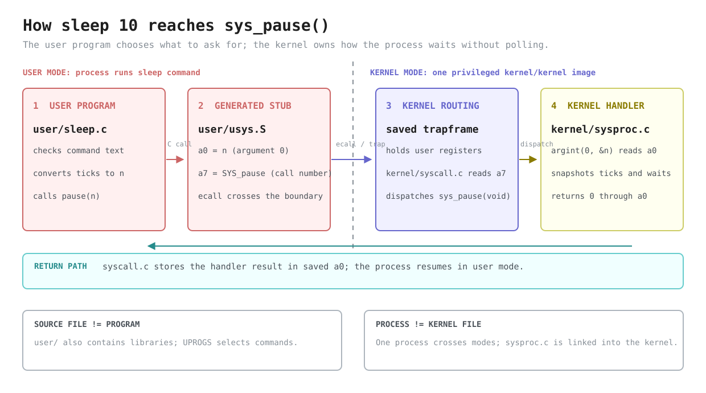
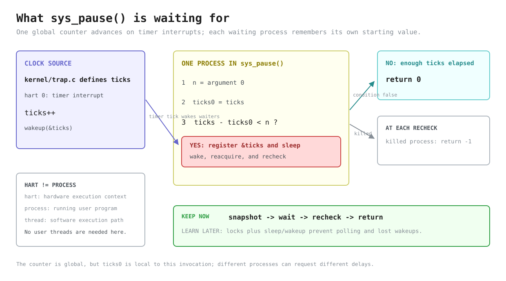

# Lab util: Deriving `sleep`

---

[toc]

---

The first exercise of MIT's [util lab](https://pdos.csail.mit.edu/6.1810/2026/labs/util.html) produces a small user program, but deriving it crosses four existing files: `user/user.h`, generated `user/usys.S`, `kernel/syscall.c`, and `kernel/sysproc.c`. This note explains that path and leaves the target `user/sleep.c` as the exercise.

> [!IMPORTANT]
> This note contains no solution or pseudocode. It records existing code, the target contract, source-backed decisions, and common traps.

## What the exercise asks for

| Requirement                           | What it fixes                                                                                          |
| ------------------------------------- | ------------------------------------------------------------------------------------------------------ |
| **Program `sleep` in `user/sleep.c`** | The host build product is `user/_sleep`; `mkfs` imports it into `fs.img` as the guest command `sleep`. |
| **One decimal argument in ticks**     | The interface unit is kernel ticks, not seconds.                                                       |
| **Wait through the kernel**           | Pass the requested count to `pause`; do not poll or count in user space.                               |
| **No argument prints an error**       | The missing-argument path must be visible and must return control to the shell.                        |
| **Add `$U/_sleep` to `UPROGS`**       | The Makefile already contains this entry in this tree.                                                 |

The three relevant tests in [`grade-lab-util`](../../grade-lab-util) are worth 20 points:

| Test                       | Runs                         | Exact observation                                                                                                                                                                                                                                                                                                                                                  |
| -------------------------- | ---------------------------- | ------------------------------------------------------------------------------------------------------------------------------------------------------------------------------------------------------------------------------------------------------------------------------------------------------------------------------------------------------------------ |
| **`sleep, no arguments`**  | `sleep`                      | Supplies no required regex and forbids `exec .* failed` plus `$ sleep\n$`. `no=` means “must not match,” not expected output, so `Usage: sleep ticks` is allowed. The second forbidden regex is also ineffective: `assert_lines_match()` splits the transcript into lines, and its unescaped dollar signs are regex end anchors rather than literal shell prompts. |
| **`sleep, returns`**       | `sleep`, then `echo OK`      | Requires a line matching `^OK$`, proving that the no-argument invocation returned control to the shell so it could execute the next command. It also applies the same two negative regexes.                                                                                                                                                                        |
| **`sleep, makes syscall`** | `sleep 10`, then `echo FAIL` | Stops at a gdb breakpoint on `sys_pause`, then requires the echoed command line `$ sleep 10` and rejects `FAIL`. Reaching the breakpoint before the shell can run `echo FAIL` proves that the program made the required syscall; the test stops at handler entry, so it neither verifies the argument value nor waits for the requested interval.                  |

The leading `make: 'kernel/kernel' is up to date.` is a build-status message, not a test result. `run_tests()` calls `gradelib.make()` before it applies the `sleep` title filter; that helper runs plain `make`, whose default target in this Makefile is `kernel/kernel`. GNU Make finds every kernel prerequisite older than the existing target and therefore runs no recipe. Each selected test subsequently starts the `qemu-gdb` target through quiet `make -s --no-print-directory`, which still updates dependencies such as `fs.img` when necessary. “Up to date” therefore means only that the preflight kernel link needed no work; it does not skip QEMU, reuse a prior test result, or compare `user/sleep.c` output.

### Why two tests can have the same Python function name

The duplicate `def test_sleep_no_args():` declarations are legal because a Python function name is only a module variable. Each `@test(...)` decorator runs as its `def` is evaluated: `test()` constructs `register_test`, `register_test(original_function)` constructs a separate `run_test` wrapper, `TESTS.append(run_test)` preserves that wrapper in registration order, and the returned wrapper is assigned to the module name `test_sleep_no_args`. The second declaration replaces that name, but it does not remove the first wrapper already stored in `TESTS`; `run_tests()` iterates the list, so both wrappers execute with the distinct titles captured from their decorators.

The repeated name is still misleading. `register_test()` copies the original function's `__name__` onto each wrapper, and `save()` derives a failed test's path from that name, so both failures use `xv6.out.sleep_no_args`; if both fail in one run, the later transcript can overwrite the earlier one.

### How `stop_breakpoint('sys_pause')` ends the test

The breakpoint monitor is a deliberately small remote-GDB client, not a subprocess running the interactive `gdb` command:

1. `Runner.run_qemu()` turns its default target base `qemu` into `qemu-gdb`, whose Makefile recipe starts QEMU halted with `-S` and exposes its GDB stub. `GDBClient` connects to the port returned by `make print-gdbport`.
2. `shell_script()` watches QEMU output for each `$ ` prompt. It sends `sleep 10` at the first prompt; it can send `echo FAIL` only if another prompt appears.
3. `stop_breakpoint('sys_pause')` scans `kernel/kernel.sym`, parses the address on the line whose symbol equals `sys_pause`, and passes that address to `GDBClient.breakpoint()`.
4. `breakpoint()` sends remote-protocol packet `Z1,<address>,1`, requesting a hardware breakpoint, and `cont()` later sends `c` to continue the halted machine.
5. When execution reaches `sys_pause`, QEMU sends a stop-reply packet beginning with `T05`, where signal 5 is the remote protocol's trap stop. `GDBClient.handle_read()` responds by raising `TerminateTest`, and `Runner.__react()` catches that private control-flow exception and ends its event loop.
6. `Runner.run_qemu()` terminates QEMU in its `finally` block. Only then does the test call `r.match('\\$ sleep 10', no=['FAIL'])` against the captured console transcript.

> [!IMPORTANT]
> The breakpoint hit is the intended stopping event, not a grader failure. `FAIL` is absent because QEMU stops at handler entry and is then destroyed before `sys_pause()` returns, so the shell never receives the next prompt and never runs `echo FAIL`. The grader does not wait ten ticks and would accept a call that reached `sys_pause` with the wrong integer.

## Prerequisites

| When                            | Read                                                                                                      | Why it matters here                                                                                  |
| ------------------------------- | --------------------------------------------------------------------------------------------------------- | ---------------------------------------------------------------------------------------------------- |
| **Read first**                  | [`02-build-boot-and-usage.md`](../02-build-boot-and-usage.md#adding-and-running-a-user-exercise)          | Establishes the xv6 user-program shape, `argc`/`argv`, available headers, and `UPROGS` registration. |
| **Read first**                  | [`C_Command_Line_Arguments.md`](../../../c-programming/C_Command_Line_Arguments.md#reading-the-arguments) | Reviews how `argc` bounds valid `argv` indices before the missing-argument path uses them.           |
| **Use when tracing the call**   | [`06-build-artifacts.md`](../06-build-artifacts.md#the-four-line-stub-decoded)                            | Owns the generated stub, `a7`, `ecall`, dispatch, and return path shown in the first diagram.        |
| **Use when checking semantics** | [`05-syscall-reference.md`](../05-syscall-reference.md#time-and-system)                                   | Records this tree's `pause(int)` name, tick unit, return behavior, and divergence from upstream xv6. |

> [!NOTE]
> The sibling C note is hosted-C background, not an API list for xv6. In this repository, [`user/user.h`](../../user/user.h) remains the complete callable user interface.

## Why the call is named `pause`

Upstream xv6 calls this system call `sleep`. This tree reserves `sleep()` for the kernel's sleep/wakeup primitive in [`kernel/proc.c`](../../kernel/proc.c), so the user-facing system call is `pause`, number 13 in [`kernel/syscall.h`](../../kernel/syscall.h). The program remains named `sleep`, while the grader breakpoints `sys_pause`; [`05-syscall-reference.md`](../05-syscall-reference.md#divergences-from-posix) records the divergence.

## The four existing layers



_Pink forms the user request, blue crosses and routes the system-call boundary, yellow performs the kernel work, and cyan returns the result. [Edit the Excalidraw source.](fig/util-sleep-syscall-boundary.excalidraw)_

| File               | Contributes                                                                                          | Does not contribute                                   |
| ------------------ | ---------------------------------------------------------------------------------------------------- | ----------------------------------------------------- |
| `user/user.h`      | Declares `int pause(int)` and the user helpers available without a host C library.                   | No implementation or argument validation.             |
| `user/usys.S`      | Loads `SYS_pause`, executes `ecall`, and returns; it is generated from `user/usys.pl`.               | No policy and no reason to edit it for this exercise. |
| `kernel/syscall.c` | Dispatches call number 13 (`kernel/syscall.h`) and transfers the return value through the trapframe. | No knowledge of the argument's meaning.               |
| `kernel/sysproc.c` | Fetches the tick count and implements the wait in `sys_pause()`.                                     | No parsing of command-line text.                      |

[`06-build-artifacts.md`](../06-build-artifacts.md#the-four-line-stub-decoded) owns the `ecall`, `a7`, and generated-stub mechanics. [`02-build-boot-and-usage.md`](../02-build-boot-and-usage.md#adding-and-running-a-user-exercise) owns user-program layout, headers, formatting, and `UPROGS`.

### Names before mechanisms

| Term                    | Meaning in this exercise                                                                                                                                                                                                                                                                                                                                                          |
| ----------------------- | --------------------------------------------------------------------------------------------------------------------------------------------------------------------------------------------------------------------------------------------------------------------------------------------------------------------------------------------------------------------------------- |
| **User program**        | An executable that runs outside the kernel, such as the future `sleep` command. The `user/` directory also contains library sources such as `ulib.c`, `printf.c`, and `umalloc.c`, so a `.c` file under `user/` is not automatically a separate program. An entry such as `user/_sleep` in `UPROGS` builds a host file with that name; `mkfs` installs it in `fs.img` as `sleep`. |
| **Process**             | One running instance of a user program. Its saved `struct trapframe` holds the user registers while the kernel handles its system call.                                                                                                                                                                                                                                           |
| **Kernel**              | The privileged `kernel/kernel` image built from the files under `kernel/`. `kernel/sysproc.c` contributes handlers to that image; it is not an independently run program.                                                                                                                                                                                                         |
| **System-call handler** | Kernel code that performs a user request. `pause(int)` is the user-facing function, while `sys_pause(void)` is its dispatcher-compatible kernel handler.                                                                                                                                                                                                                          |
| **Hart**                | A RISC-V hardware execution context. QEMU presents each configured xv6 CPU as a hart, so this tree often uses “CPU” and “hart” for the same hardware role. A hart is not a process and is not a user-level software thread.                                                                                                                                                       |
| **Tick**                | One increment of the global `ticks` counter by `clockintr()` on hart 0. Other harts can run processes, but they do not each maintain a separate counter.                                                                                                                                                                                                                          |

> [!NOTE]
> For `user/sleep.c`, the important boundary is simple: the user program validates text, converts it to an integer, and asks `pause` to wait that many ticks. The kernel owns how waiting stops consuming CPU. The lock and wakeup protocol explains how that ownership is implemented safely, but it is not part of the user-program design.

## `sys_pause()` line by line

The waiting logic is this complete function from [`kernel/sysproc.c`](../../kernel/sysproc.c):

```c
uint64
sys_pause(void)
{
  int n;
  uint ticks0;

  argint(0, &n);
  if (n < 0)
    n = 0;
  acquire(&tickslock);
  ticks0 = ticks;
  while (ticks - ticks0 < n) {
    if (killed(myproc())) {
      release(&tickslock);
      return -1;
    }
    sleep_prepare(&ticks);
    release(&tickslock);
    sleep();
    acquire(&tickslock);
  }
  release(&tickslock);
  return 0;
}
```

| Code                             | Meaning                                                                                                                                                                                                                                                                                                                   |
| -------------------------------- | ------------------------------------------------------------------------------------------------------------------------------------------------------------------------------------------------------------------------------------------------------------------------------------------------------------------------- |
| **`argint(0, &n)`**              | Fetches system-call argument index 0 from the saved trapframe. `argraw()` in `kernel/syscall.c` maps indices 0 through 5 to `a0` through `a5`, so index 0 means `a0`; `a7` is separate because it holds the system-call number. Every handler has the dispatcher-compatible form `uint64 f(void)`.                        |
| **Negative clamp**               | Converts negative counts to zero. This prevents the later unsigned comparison from turning `-1` into a multi-year wait.                                                                                                                                                                                                   |
| **`tickslock` and `ticks0`**     | `ticks` and `tickslock` are defined in `kernel/trap.c` and declared for other kernel files in `kernel/defs.h`. The lock protects the shared global counter, while local variable `ticks0` snapshots this caller's starting tick.                                                                                          |
| **`while (ticks - ticks0 < n)`** | Rechecks the caller's own deadline because every tick wakes every waiter on `&ticks`. Unsigned subtraction remains correct across counter wraparound.                                                                                                                                                                     |
| **Killed check**                 | Allows the handler to return `-1`. A sleeping victim is made runnable by `kkill()` in `kernel/proc.c`; after the handler returns, `usertrap()` in `kernel/trap.c` sees the kill flag and calls `kexit(-1)` before returning to user mode. User code therefore cannot observe or recover from this `-1` path in this tree. |
| **Prepare, release, sleep**      | Registers the wait channel before releasing `tickslock`, preventing a lost wakeup. `sleep()` does not block if a wakeup already cleared the channel.                                                                                                                                                                      |
| **Reacquire and return**         | Rechecks under the lock, then returns zero after enough ticks.                                                                                                                                                                                                                                                            |

[`docs/book/ch09-sleep-and-wakeup.md`](../book/ch09-sleep-and-wakeup.md) owns the general lost-wakeup mechanism and this tree's prepare/sleep split.



_The main loop is “snapshot, wait, recheck.” The red wait state does not mean failure; it marks where the process is deliberately not runnable until a wakeup. [Edit the Excalidraw source.](fig/util-sleep-tick-wait.excalidraw)_

## What a tick means

| Fact                 | Source-backed meaning                                                                                                                                               |
| -------------------- | ------------------------------------------------------------------------------------------------------------------------------------------------------------------- |
| **Counter owner**    | Only hart 0 increments the global `ticks` counter in `clockintr()` in [`kernel/trap.c`](../../kernel/trap.c); the other harts do not maintain per-hart tick counts. |
| **Wakeup event**     | The same interrupt path calls `wakeup(&ticks)`, making waiters eligible to recheck their own elapsed-tick condition.                                                |
| **Current interval** | The next interrupt is scheduled `1000000` RISC-V `time`-register timebase units later, which the source comment describes as about one tenth of a second.           |
| **API contract**     | `pause(n)` accepts ticks, not seconds; the approximate wall-clock conversion is an observation about the current machine configuration.                             |

| Call        | Approximate nominal interval |
| ----------- | ---------------------------- |
| `pause(1)`  | 0.1 s                        |
| `pause(10)` | 1 s                          |
| `pause(20)` | 2 s                          |

> [!CAUTION]
> Ticks, not seconds, are the interface. The conversion is an observation about the current timer constant, not a guarantee for user programs to encode.

| Boundary                 | Earliest source-level conclusion                                                                                                       |
| ------------------------ | -------------------------------------------------------------------------------------------------------------------------------------- |
| **`n == 0`**             | The loop condition is false immediately, so no tick wakeup is required.                                                                |
| **`n > 0`**              | The condition becomes false after between `n - 1` and `n` timer intervals because `ticks0` may be sampled anywhere within an interval. |
| **After the final tick** | The process is eligible to run, but scheduler delay can make the observed return later than the nominal interval.                      |

This timing range follows from sampling a discrete counter rather than starting a new timer at the instant of the call. The kernel guarantees an elapsed-tick condition, not exact wall-clock latency.

## Deriving `user/sleep.c`

### Contract

| Aspect               | Fixed requirement                                                                                                           |
| -------------------- | --------------------------------------------------------------------------------------------------------------------------- |
| **Input**            | One command-line argument containing a decimal tick count.                                                                  |
| **Available APIs**   | Only declarations in `user/user.h`; there is no host C library.                                                             |
| **Waiting**          | Pass the tick count to `pause`; do not implement a user-space timer.                                                        |
| **Missing argument** | Print a diagnostic and finish so the shell can continue.                                                                    |
| **Exit status**      | A nonzero error status and zero success status are this repository's convention; the grader does not inspect them directly. |

### Decisions and evidence

1. **How should `main` receive arguments?** Compare an argument-taking program such as `user/echo.c`; [`02-build-boot-and-usage.md`](../02-build-boot-and-usage.md#how-command-words-reach-main-via-argcargv) traces how the shell and kernel construct `argc` and `argv`, while its [house-style section](../02-build-boot-and-usage.md#house-style-for-a-new-user-program) records the required top-level function layout.
2. **Which `argc` value represents exactly one supplied argument?** Account for `argv[0]`, the program name.
3. **How is text converted to an integer?** Read `atoi()` in `user/ulib.c`. It converts only the initial run of decimal digits and returns zero when the first character is not a digit, without reporting whether conversion succeeded, so decide whether the exercise requires validation beyond that helper's contract.
4. **How is a diagnostic written to file descriptor 2?** Find the descriptor-taking formatted-output function in `user/user.h`; `user/ex2create.c` demonstrates the repository's error style.
5. **What does the grader require from the missing-argument path?** Compare both no-argument test bodies in `grade-lab-util`; distinguish their output and return checks from local exit-status convention.

> [!NOTE]
> The exercise and grader require a missing-argument diagnostic but define no malformed-input policy. This tree's `atoi()` cannot distinguish valid zero from failed conversion and accepts a decimal prefix such as `3x`, so checking only whether its result equals zero is not validation. A stricter command would need a separate parser that checks every character and detects integer overflow; that is useful production behavior but additional scope for this exercise.

### Traps

| Trap                                    | Result                                                                                                                                                                                                    | Reason                                                             |
| --------------------------------------- | --------------------------------------------------------------------------------------------------------------------------------------------------------------------------------------------------------- | ------------------------------------------------------------------ |
| **Continuing after a missing argument** | `argv[1]` is the null terminator of the argument vector, so `atoi(argv[1])` dereferences a null pointer and the process faults. The later `echo OK` may still run, but the required diagnostic is absent. | A diagnostic must be paired with leaving the error path.           |
| **Using `printf` for a diagnostic**     | The message goes to standard output.                                                                                                                                                                      | Descriptor 2 keeps diagnostics separate from normal output.        |
| **Treating a zero result as invalid**   | A valid `0` and a string with no initial digits become indistinguishable.                                                                                                                                 | This tree's `atoi()` reports only the converted value.             |
| **Converting ticks to seconds**         | The requested wait is scaled incorrectly.                                                                                                                                                                 | The syscall already accepts ticks.                                 |
| **Polling `uptime()`**                  | The syscall breakpoint is never reached, and the process remains runnable.                                                                                                                                | The exercise requires kernel-managed waiting.                      |
| **Omitting `UPROGS`**                   | The shell reports `exec sleep failed`.                                                                                                                                                                    | Only named programs enter `fs.img`; this entry is already present. |
| **Using host-library APIs**             | Compilation fails under `-ffreestanding -nostdlib`.                                                                                                                                                       | `user/user.h` is the complete user API.                            |

## When the grader and shell disagree

The focused grader and an interactive shell can report different results because they may be running different QEMU instances against different moments in the build. The grader boots a new guest for each test; it does not inspect or update a shell that was already running before the latest `user/sleep.c` build.

| Observation                                 | What it means                                                                                                                                                                                                                                                                                                                   |
| ------------------------------------------- | ------------------------------------------------------------------------------------------------------------------------------------------------------------------------------------------------------------------------------------------------------------------------------------------------------------------------------- |
| **`./grade-lab-util sleep` passes**         | The no-argument invocation returned so the second test could observe `OK`, and `sleep 10` reached `sys_pause`. The grader does not require a particular diagnostic, its attempted silent-transcript rejection is ineffective, and the breakpoint test neither verifies that the handler received 10 nor measures elapsed ticks. |
| **`sleep 3` appears to return immediately** | The argument is three ticks, not three seconds. With the current timer interval, that is nominally about 0.3 seconds.                                                                                                                                                                                                           |
| **`exec sleep failed` appears**             | `exec()` failed before `user/sleep.c:main()` ran. The shell prints this message in `user/sh.c` when it cannot load the guest executable, commonly because the active `fs.img` does not contain `sleep`.                                                                                                                         |

The strongest deterministic improvement to the grader is to inspect the syscall argument at `sys_pause` and require 10. Because `sys_pause()` is existing kernel code rather than part of this exercise, the correct argument already establishes the intended wait without depending on host scheduling. If an end-to-end duration assertion is wanted, a guest-side helper can compare `uptime()` before and after the command in kernel ticks; host wall-clock timing should be only a coarse secondary check because QEMU startup and scheduling introduce unrelated delay.

> [!WARNING]
> Do not run the grader while an interactive QEMU instance is still using `fs.img`. A dependency rebuild can rewrite that image before the grader's second QEMU process discovers the write lock, leaving the running guest with a disk that changed underneath it. Quit QEMU with `Ctrl-a x`, confirm that `pgrep -af qemu-system-riscv64` finds no old instance, then rebuild or grade.

`make qemu` rotates the old image to `fs.img.bk` and constructs a fresh `fs.img` from `UPROGS`. After boot, `ls | grep sleep` distinguishes an image problem from behavior inside the program: no matching row means the command is absent from that guest. [`02-build-boot-and-usage.md`](../02-build-boot-and-usage.md#adding-and-running-a-user-exercise) owns the general build and image mechanics.

## Verifying it

Build and exercise both paths in the guest:

```bash
make qemu
```

```text
$ sleep
$ sleep 10
$ echo OK
```

Run the focused grader:

```bash
./grade-lab-util sleep
```

Failures leave transcripts in `xv6.out.sleep` and `xv6.out.sleep_no_args`; because the first two wrappers share their Python name, two simultaneous failures can write the same `xv6.out.sleep_no_args` path. [`03-lab-workflow.md`](../03-lab-workflow.md#grading) explains how to read grader transcripts generally.

To reproduce the syscall test interactively, use two terminals:

1. Start QEMU halted with one hart in terminal 1:

    ```bash
    make CPUS=1 qemu-gdb
    ```

2. Connect in terminal 2, set the same symbolic breakpoint as the grader, and continue through boot:

    ```bash
    gdb-multiarch -x .gdbinit kernel/kernel
    ```

    ```gdb
    (gdb) break sys_pause
    (gdb) continue
    ```

3. When terminal 1 shows the xv6 prompt, enter the grader's command:

    ```text
    $ sleep 10
    ```

4. GDB stops at `kernel/sysproc.c:90`, the opening brace. Advance to the `argint` call, execute it, then inspect both the decoded local and the saved user registers:

    ```gdb
    (gdb) next
    94        argint(0, &n);
    (gdb) next
    95        if (n < 0)
    (gdb) print n
    $1 = 10
    (gdb) info registers a0 a7
    a0             0xa        10
    a7             0xd        13
    (gdb) backtrace
    ```

The exact addresses in the backtrace change after a rebuild, but its named kernel frames should include `sys_pause`, `syscall`, and `usertrap`. Hitting the breakpoint confirms that `sleep 10` reached the handler, and observing `n == 10` adds the argument check missing from `grade-lab-util`; neither observation alone measures elapsed ticks or proves that no other implementation path consumed CPU. The reusable [console setup and VS Code workflow](../02-build-boot-and-usage.md#debugging-with-vs-code) explain debugger startup, controls, and cleanup; [manually debugging an xv6 user program](../09-debugging-xv6.md#manually-debugging-an-xv6-user-program) explains why the existing `sleep.c` breakpoint is unresolved and how to stop at `sleep.c:main` without changing `.vscode`.

## Questions

1. Why does `sys_pause(void)` receive no C parameter when `pause(int)` does, and where is the integer stored across the trap?
2. What failure occurs if the program reads `argv[1]` when only `argv[0]` exists?
3. Why must the wait condition be a `while` rather than an `if` when two processes request different delays?
4. How does registering `&ticks` before releasing `tickslock` prevent a lost wakeup?
5. What happens from `kkill()` through `usertrap()` when the target is already sleeping in `sys_pause()`?
6. Why does unsigned subtraction handle tick-counter wraparound while a comparison against `ticks0 + n` may not?
