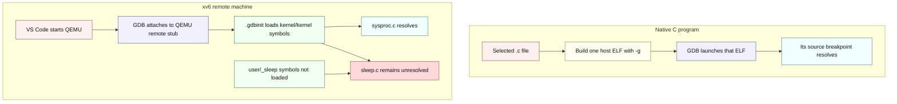

# xv6 Debugger Symbols and Execution Terminology Implementation Plan

> **For agentic workers:** REQUIRED SUB-SKILL: Use superpowers:subagent-driven-development (recommended) or superpowers:executing-plans to implement this plan task-by-task. Steps use checkbox (`- [ ]`) syntax for tracking.

**Goal:** Add a focused, evidence-backed guide explaining xv6 kernel and user-program breakpoints, a verified manual `sleep` debugging recipe, the `CPUS=1` trade-off, and precise lookup terms.

**Architecture:** `docs/09-debugging-xv6.md` owns the reusable explanation and embeds the renamed screenshots. `docs/04-terminology.md` remains the single definition hub, while `docs/README.md`, `docs/02-build-boot-and-usage.md`, and `docs/labs/util-sleep.md` receive only concise navigation and scope corrections.

**Tech Stack:** Markdown, Mermaid, PNG screenshots, QEMU system emulation, GDB remote protocol, RISC-V ELF/DWARF symbols, shell verification, and repository note checks.

---

## File map

- Create `docs/09-debugging-xv6.md`: own the native-versus-remote debugger model, screenshot interpretation, manual user-symbol recipe, `CPUS` guidance, and troubleshooting.
- Rename `docs/images/Code_s8L29GY56y.png` to `docs/images/vscode-kernel-breakpoint-hit.png`: show the verified kernel breakpoint and unresolved user breakpoint.
- Rename `docs/images/Code_nHXikydY3p.png` to `docs/images/vscode-sys-pause-argument-loaded.png`: show the decoded syscall argument and kernel call stack.
- Modify `docs/04-terminology.md`: refine `hart` and add canonical execution and debugger terms without creating a second glossary.
- Modify `docs/02-build-boot-and-usage.md`: correct the determinism claim and link to the focused guide.
- Modify `docs/labs/util-sleep.md`: add one focused cross-link while preserving the user's existing table edits.
- Modify `docs/README.md`: register the new guide in reading order.

### Task 1: Rename and interpret the debugger screenshots

**Files:**

- Create: `docs/09-debugging-xv6.md`
- Rename: `docs/images/Code_s8L29GY56y.png` to `docs/images/vscode-kernel-breakpoint-hit.png`
- Rename: `docs/images/Code_nHXikydY3p.png` to `docs/images/vscode-sys-pause-argument-loaded.png`

- [x] **Step 1: Record the source image identities before renaming**

Run:

```bash
file docs/images/Code_s8L29GY56y.png docs/images/Code_nHXikydY3p.png
sha256sum docs/images/Code_s8L29GY56y.png docs/images/Code_nHXikydY3p.png
```

Expected: both files report `PNG image data, 1915 x 1185`; keep the two hashes in the terminal output for comparison after the rename.

- [x] **Step 2: Rename both opaque image paths without changing their bytes**

Run:

```bash
mv docs/images/Code_s8L29GY56y.png docs/images/vscode-kernel-breakpoint-hit.png
mv docs/images/Code_nHXikydY3p.png docs/images/vscode-sys-pause-argument-loaded.png
```

Expected: the two `Code_*.png` paths no longer exist, and the descriptive paths contain the same respective hashes recorded in Step 1.

- [x] **Step 3: Create the focused guide through the screenshot evidence section**

Create `docs/09-debugging-xv6.md` with the following structure and claims. Write each prose paragraph as one continuous line, and use the repository's light-theme Mermaid palette exactly as shown:

````markdown
# Debugging xv6: symbols, address spaces, and harts

---

[toc]

---

This guide explains why the checked-in VS Code session can stop in `kernel/sysproc.c` but leaves a breakpoint in `user/sleep.c` unresolved, why the native programs under `/home/wahsieh/personal/c-programming/notes` behave differently, how to load one xv6 user program's symbols manually, and when a single emulated hart makes debugging easier. Use [04-terminology.md](04-terminology.md) for term lookup and [02-build-boot-and-usage.md](02-build-boot-and-usage.md#debugging) for the basic kernel-debugger workflow.

## The short answer

VS Code is not accepting one C directory and rejecting another. A source breakpoint becomes usable only when GDB has debug information that maps that source line to an address in a loaded symbol file. The native notes build and launch one selected ELF, so that ELF supplies the current file's symbols. The xv6 session attaches to a whole emulated machine and loads only `kernel/kernel`; `kernel/sysproc.c` belongs to that ELF, while `user/sleep.c` belongs to the separate `user/_sleep` ELF.

> [!IMPORTANT]
> The `program` value in this repository's `.vscode/launch.json` names `kernel/kernel` for symbols. The configuration does not ask the host operating system to execute that RISC-V file: `.gdbinit` attaches to QEMU's already-running remote target, and `launchCompleteCommand: "None"` prevents a host-style `run` command.

## Two debugger launch models



The colors label request, processing, routing, data, successful resolution, and unresolved state; every node also states its meaning so the diagram remains readable in monochrome.

| Layer | Native C notes | This xv6 session |
| --- | --- | --- |
| **Host process being controlled** | The selected compiled program. | QEMU, through its remote debugging stub. |
| **Machine executing the C code** | The host machine. | QEMU's emulated RISC-V machine. |
| **Initial symbol file** | The selected program's ELF. | `kernel/kernel`. |
| **Source covered initially** | Sources linked into the selected ELF. | Sources linked into the kernel ELF. |
| **Other executable code** | Usually outside the exercise's process. | Separate user ELFs such as `user/_sleep`, loaded later from `fs.img`. |

## What the screenshots show


*The filled red breakpoint in `kernel/sysproc.c` has an address from `kernel/kernel`; the gray `user/sleep.c` entry has no address in the currently loaded symbols.*


*After `argint(0, &n)` executes, the debugger can show `n = 10`. The stack remains `sys_pause` → `syscall` → `usertrap`, so this is kernel-side evidence about the request rather than a stop in `sleep.c:main`.*

## Why one breakpoint resolves and the other does not

`kernel/kernel` and `user/_sleep` are two independent RISC-V ELF files. Both contain DWARF source mappings because the Makefile compiles with `-ggdb`, but GDB reads mappings only from symbol files it has loaded. The generated `.gdbinit` contains `symbol-file kernel/kernel` and no `add-symbol-file user/_sleep`, so the initial session can translate a `sysproc.c` line into a kernel virtual address but has no translation for a `sleep.c` line.

`fs.img` does not solve that symbol problem. It stores the linked `sleep` executable for xv6 to load with `exec`; it is not a GDB symbol container, and QEMU's remote stub does not understand the xv6 filesystem or process table. The stub reports machine state—registers, memory, and emulated CPUs—while GDB relies on the ELF files supplied by the human or debugger configuration to label that state.
````

- [x] **Step 4: Verify the guide's image paths and Mermaid labels**

Run:

```bash
python3 - <<'PY'
from pathlib import Path

guide = Path('docs/09-debugging-xv6.md').read_text()
for image in [
    'docs/images/vscode-kernel-breakpoint-hit.png',
    'docs/images/vscode-sys-pause-argument-loaded.png',
]:
    assert Path(image).is_file(), image
assert 'images/vscode-kernel-breakpoint-hit.png' in guide
assert 'images/vscode-sys-pause-argument-loaded.png' in guide
for label in ['Native C program', 'xv6 remote machine', 'sleep.c remains unresolved']:
    assert label in guide, label
print('Debugger images and diagram: OK')
PY
```

Expected: `Debugger images and diagram: OK`.

- [x] **Step 5: Commit the renamed evidence and the guide foundation**

Run:

```bash
git add docs/09-debugging-xv6.md docs/images/vscode-kernel-breakpoint-hit.png docs/images/vscode-sys-pause-argument-loaded.png
git commit --only docs/09-debugging-xv6.md docs/images/vscode-kernel-breakpoint-hit.png docs/images/vscode-sys-pause-argument-loaded.png -m "docs(debugging): explain xv6 breakpoint symbols" -m "- Renamed both VS Code screenshots so their evidence is discoverable.

- Compared native process debugging with the xv6 remote-machine model.

- Connected breakpoint resolution to the ELF symbols GDB actually loads.

Cursor(%CUR): Yes
Effort: 1 SP"
```

Expected: one commit containing the new guide and the two image renames, with no `.vscode`, source, or pre-existing `util-sleep` table changes.

### Task 2: Add the verified user-program recipe and single-hart guidance

**Files:**

- Modify: `docs/09-debugging-xv6.md`

- [x] **Step 1: Append the manual user-program debugging recipe**

Append the following content after “Why one breakpoint resolves and the other does not”:

````markdown
## Manually debugging an xv6 user program

The following recipe adds `user/_sleep` to the existing kernel-debugging session without changing `.vscode`. It is deliberately manual because the symbol file is meaningful only while the intended xv6 process occupies that user address space.

1. Start the normal one-hart QEMU debug target in terminal 1:

    ```bash
    make CPUS=1 qemu-gdb
    ```

2. Attach from terminal 2 and continue through boot:

    ```bash
    gdb-multiarch -q -x .gdbinit kernel/kernel
    ```

    ```gdb
    (gdb) continue
    ```

3. Wait for the `$ ` prompt in terminal 1, then press `Ctrl-C` in terminal 2. Stopping after the shell is ready matters because every xv6 user ELF is linked at virtual address zero; installing an address-zero breakpoint during boot could stop in `init` or `sh` before `sleep` runs.

4. Load the user ELF's symbols, set a source-qualified hardware breakpoint, and continue:

    ```gdb
    (gdb) add-symbol-file user/_sleep 0
    add symbol table from file "user/_sleep" at
        .text_addr = 0x0
    (gdb) hbreak -source sleep.c -function main
    Hardware assisted breakpoint 1 at 0x0: file user/sleep.c, line 7.
    (gdb) info breakpoints
    (gdb) continue
    ```

5. Enter the command in terminal 1:

    ```text
    $ sleep 10
    ```

6. Confirm that GDB stopped in the user program and inspect its arguments:

    ```gdb
    Breakpoint 1, main (argc=2, argv=0x4fc0) at user/sleep.c:7
    (gdb) info source
    Current source file is user/sleep.c
    (gdb) print argc
    $1 = 2
    (gdb) x/s argv[1]
    0x4fe0: "10"
    ```

    Stack and string addresses vary after a rebuild, but the source file, argument count, and argument text should agree. A user backtrace is reliable through `main` and `start`; do not interpret frames beyond the saved entry context as kernel callers because the user-to-kernel transition happens only when the program executes a system-call stub.

7. Remove the temporary breakpoint and user symbols before returning to kernel-only debugging:

    ```gdb
    (gdb) delete 1
    (gdb) remove-symbol-file -a 0
    (gdb) detach
    (gdb) quit
    ```

> [!WARNING]
> `add-symbol-file` teaches GDB how to label addresses; it does not teach GDB which xv6 process owns the current page table. xv6 links user programs at the same virtual addresses, so `user/_sleep` labels become wrong when another user program runs. Load them for a focused stop, then remove them.

The hardware breakpoint is purposeful. It asks QEMU to stop when a hart executes the address instead of having GDB patch a breakpoint instruction into a guest text page. The repository's VS Code configuration likewise requires hardware breakpoints.
````

- [x] **Step 2: Append the `CPUS` explanation and trade-off table**

Append:

```markdown
## Why use `CPUS=1`

There is no automatic host-CPU selection here. The Makefile sets `CPUS := 3` by default, passes that value to QEMU's `-smp` option, and accepts a command-line override; the `fs` lab is the one branch that forces `CPUS := 1`. In this QEMU machine, each virtual CPU is a RISC-V hart.

| Setting | What becomes easier or harder | When to use it |
| --- | --- | --- |
| **`CPUS=1`** | Removes cross-hart execution, lock contention, and many interleavings. Timer interrupts and xv6 process scheduling still occur, so the run is simpler but not fully deterministic. | Trace one causal path, single-step, inspect one call stack, or use the QEMU monitor without first choosing a hart. |
| **Default `CPUS=3`** | Exercises concurrent kernel paths and can expose races, deadlocks, and ordering assumptions that one hart hides. Console order and the currently stopped hart are less predictable. | Reproduce multicore failures and perform final correctness checks after the focused trace. |

QEMU exposes the emulated harts to GDB as debugger threads. Those entries are execution contexts of virtual CPUs, not xv6 processes and not user-level software threads. `info threads` answers “which hart did QEMU report?”, while `myproc()` and `p->state` in xv6 answer “which process is this hart running?”

> [!IMPORTANT]
> `CPUS=1` is a debugging lens, not a fix. A change is not concurrency-safe until it also survives the repository's normal multi-hart tests.
```

- [x] **Step 3: Append the troubleshooting table**

Append:

```markdown
## Troubleshooting

| Observation | Likely cause | Check or correction |
| --- | --- | --- |
| **A breakpoint is gray or hollow** | No loaded symbol file maps that source line to an address. | Run `info sources` and `info files`; load the correct ELF rather than moving the breakpoint randomly. |
| **`sleep.c` resolves but execution stops in another user program** | Several xv6 user ELFs reuse virtual address zero, and the breakpoint was installed before `sleep` owned the user page table. | Continue to the shell first, interrupt GDB, then add the symbols and hardware breakpoint immediately before running `sleep`. |
| **GDB cannot insert the breakpoint** | The requested breakpoint type or address is unavailable in the current target state. | Confirm the QEMU remote connection, use `hbreak`, and check `info breakpoints`; do not replace it with a software breakpoint in read-only user text. |
| **A local is `<optimized out>` or nonsensical** | The compiler optimized it or the stop is before its initialization. | Check the highlighted source line and step past the assignment before printing the value. |
| **The GDB port is already in use** | A previous QEMU instance still owns the per-user port. | Run `pgrep -af qemu-system-riscv64`, identify the stale instance, and terminate only that process. |
| **`exec sleep failed` appears** | The running guest's `fs.img` does not contain the linked user program. | Quit QEMU, rebuild the image, boot again, and confirm `ls | grep sleep` before debugging source behavior. |
| **The bug disappears with `CPUS=1`** | The failure depends on cross-hart concurrency. | Treat the single-hart trace as partial evidence and reproduce with the default three harts. |

## Related references

- [Build, boot, and basic GDB usage](02-build-boot-and-usage.md#debugging)
- [Terminology lookup](04-terminology.md)
- [ELF and build artifacts](06-build-artifacts.md#what-elf-is)
- [The util `sleep` exercise](labs/util-sleep.md)
```

- [x] **Step 4: Re-run the exact manual recipe against the current build**

Run `make CPUS=1 qemu-gdb` in terminal 1 and `gdb-multiarch -q -x .gdbinit kernel/kernel` in terminal 2. Execute the documented commands in order.

Expected key evidence:

```text
Hardware assisted breakpoint 1 at 0x0: file user/sleep.c, line 7.
Breakpoint 1, main (argc=2, argv=...) at user/sleep.c:7
Current source file is user/sleep.c
$1 = 2
...: "10"
```

After `delete 1` and `remove-symbol-file -a 0`, run `info files`; expected: it begins with `Symbols from ".../kernel/kernel"` and no longer lists `user/_sleep`.

- [x] **Step 5: Commit the verified recipe and concurrency model**

Run:

```bash
git add docs/09-debugging-xv6.md
git commit --only docs/09-debugging-xv6.md -m "docs(debugging): add user symbol workflow" -m "- Documented a verified hardware breakpoint recipe for user/_sleep.

- Explained address reuse and GDB's lack of xv6 process awareness.

- Separated single-hart tracing from multi-hart correctness checks.

Cursor(%CUR): Yes
Effort: 1 SP"
```

Expected: one guide-only commit.

### Task 3: Expand the canonical terminology lookup

**Files:**

- Modify: `docs/04-terminology.md:21-63`
- Modify: `docs/04-terminology.md:128-154`

- [x] **Step 1: Refine the existing `hart` row**

Replace the current `hart` meaning with one continuous table-cell paragraph:

```markdown
RISC-V's architectural hardware-thread context: one independently executing register and control-state set, commonly exposed as a logical CPU. A physical core may implement one hart or several through simultaneous multithreading, so “hart” is not always synonymous with “core.” QEMU creates `CPUS` virtual CPUs for this machine, and xv6 identifies each as a hart; the boot messages come from `kernel/main.c`, while `NCPU` in `kernel/param.h` caps how many xv6 supports.
```

- [x] **Step 2: Expand debugger terms in the Toolchain table**

Update `GDB` and `ELF`, then add these rows next to them:

```markdown
| **GDB** | **G**NU **D**e**B**ugger | The debugger client. In the native notes it launches a host process; here it controls QEMU's emulated machine through the remote GDB protocol and labels machine addresses with separately loaded ELF symbols. |
| **target / debuggee** | — | The execution being controlled by a debugger. In the native notes it is one host process; in this session it is QEMU's RISC-V machine, reached through QEMU's remote stub. |
| **remote GDB stub** | — | The protocol server inside QEMU that exposes registers, memory, execution control, and emulated CPUs. It does not understand xv6 source files, `fs.img`, or processes; GDB supplies those labels from ELF symbols. |
| **symbol table** | — | ELF names mapped to addresses, such as `sys_pause` in `kernel/kernel`. Symbols let GDB name functions and globals; source-level stepping also needs debug information. |
| **debug information** | — | Compiler-emitted DWARF records mapping machine addresses to source files, lines, types, and some variable locations. `-ggdb` adds it, but GDB can use it only after the containing ELF is loaded as a symbol file. |
| **source breakpoint** | — | A request to stop at a source location. It remains unresolved until GDB can map the file and line through loaded debug information. |
| **hardware breakpoint** | — | A stop implemented by the target's execution machinery rather than by patching an instruction into memory. `hbreak` asks QEMU's remote stub for this form. |
| **GDB thread** | — | One execution context reported by the debug target. QEMU reports emulated harts this way; the entry is not an xv6 process or a user-level software thread. |
| **ELF** | **E**xecutable and **L**inkable **F**ormat | The binary container for `kernel/kernel` and each user program. The executable sections are loaded into the target; symbol and DWARF sections let tools label their addresses. `kernel/elf.h` defines the headers that `kernel/exec.c` parses. See [What ELF is](06-build-artifacts.md#what-elf-is). |
```

- [x] **Step 3: Expand execution-boundary terms in Operating system concepts**

Update `kernel` and `user space`, and add the following rows near them:

```markdown
| **host** | The Linux environment running VS Code, GDB, Make, and the QEMU host process. “Host” names the outside of the emulation boundary, not the privileged side of xv6. |
| **guest** | The entire emulated xv6 machine. Both the xv6 kernel and its user programs are guest software, so “guest program” is broader than “user program.” |
| **native program** | A program compiled for and executed directly under the host operating system, such as the selected exercises in the C notes. xv6's RISC-V ELFs are not native to the x86 host. |
| **kernel** | The shared privileged guest code linked into `kernel/kernel` and executed in S-mode for system calls, traps, interrupts, and kernel work. It is not an ordinary “kernel process.” |
| **user program** | Guest code linked as a separate ELF under `user/`, installed in `fs.img`, loaded by xv6 `exec`, and executed by an xv6 process in U-mode. It is guest software but not synonymous with all guest software. |
| **user space** | The unprivileged virtual-address region and execution context in which an xv6 process runs its user program in U-mode. The source is usually under `user/`, but the term describes privilege and address-space context rather than a host directory. |
| **kernel space** | The privileged mappings and S-mode execution context shared by the xv6 kernel. A system call changes privilege and page-table context; it does not launch a separate kernel program. |
| **process** | xv6's software abstraction for one running program and its resources, represented by `struct proc` in `kernel/proc.h`. A process may run on a hart, wait without occupying one, or move between harts; it is not the hart itself. |
| **address space** | The virtual addresses and mappings visible under one page table. Separate xv6 user processes reuse the same virtual addresses for different contents, which is why one loaded user ELF's labels can become misleading after a context switch. |
```

- [x] **Step 4: Verify lookup coverage and category distinctions**

Run:

```bash
rg -n '\*\*(hart|host|guest|native program|kernel|user program|user space|kernel space|process|address space|target / debuggee|remote GDB stub|symbol table|debug information|source breakpoint|hardware breakpoint|GDB thread)\*\*' docs/04-terminology.md
rg -n 'not.*(core|process|software thread)|not synonymous|broader than' docs/04-terminology.md
```

Expected: each lookup term appears once as a table entry, and the second command shows the explicit non-equivalences among hart, process, thread, guest, and user program.

- [x] **Step 5: Commit the terminology update**

Run:

```bash
git add docs/04-terminology.md
git commit --only docs/04-terminology.md -m "docs(terms): distinguish xv6 execution contexts" -m "- Refined hart as a hardware thread rather than an unconditional core.

- Distinguished host, guest, user program, kernel, and process scopes.

- Added debugger terms for symbols, breakpoints, targets, and GDB threads.

Cursor(%CUR): Yes
Effort: 1 SP"
```

Expected: one glossary-only commit.

### Task 4: Integrate the guide with existing documentation

**Files:**

- Modify: `docs/README.md:13-27`
- Modify: `docs/02-build-boot-and-usage.md:281-340`
- Modify: `docs/labs/util-sleep.md:223-263`

- [x] **Step 1: Register the guide in the documentation index**

Add this row after `08-makefile-tour.md` in `docs/README.md`:

```markdown
| **[09-debugging-xv6.md](09-debugging-xv6.md)**                 | Why native C and xv6 breakpoints behave differently, how GDB's loaded ELF symbols control source resolution, a manual user-program recipe, and when to trace with one hart or verify with three. |
```

- [x] **Step 2: Correct the existing single-hart promise and link the focused model**

In `docs/02-build-boot-and-usage.md`, replace the opening GDB sentence with:

```markdown
Use two terminals. In the first, start one emulated hart to remove cross-hart interleavings while you trace one path; timer interrupts and xv6 process scheduling still occur:
```

After the paragraph ending “an occupied port, a missing `gdb-multiarch`, or a QEMU build failure directly,” add:

```markdown
For why this session resolves `kernel/sysproc.c` but not `user/sleep.c`, how to load one user ELF manually, and why `CPUS=1` is a tracing aid rather than a correctness setting, see [Debugging xv6: symbols, address spaces, and harts](09-debugging-xv6.md).
```

- [x] **Step 3: Link the sleep note to the manual user-space recipe**

At the end of the paragraph after the interactive kernel breakpoint transcript in `docs/labs/util-sleep.md`, replace its final sentence with:

```markdown
The reusable [console setup and VS Code workflow](../02-build-boot-and-usage.md#debugging-with-vs-code) explain debugger startup, controls, and cleanup; [manually debugging an xv6 user program](../09-debugging-xv6.md#manually-debugging-an-xv6-user-program) explains why the existing `sleep.c` breakpoint is unresolved and how to stop at `sleep.c:main` without changing `.vscode`.
```

Do not alter the user's current changes to the test and observation table delimiter widths.

- [x] **Step 4: Verify navigation targets and preservation of the pre-existing diff**

Run:

```bash
rg -n '^# Debugging xv6|^## Manually debugging an xv6 user program|09-debugging-xv6' docs/09-debugging-xv6.md docs/README.md docs/02-build-boot-and-usage.md docs/labs/util-sleep.md
git diff -- docs/labs/util-sleep.md
```

Expected: all four documents link consistently; the `util-sleep` diff still contains the user's table-width edits plus only the intended cross-link change.

- [x] **Step 5: Commit only the integration edits**

Because `docs/labs/util-sleep.md` was already modified before this task, stage the clean files normally and interactively stage only the new cross-link hunk from the lab note. Reject both pre-existing table-width hunks:

```bash
git diff --cached --quiet
git add docs/README.md docs/02-build-boot-and-usage.md
git add -p docs/labs/util-sleep.md
git diff --cached -- docs/README.md docs/02-build-boot-and-usage.md docs/labs/util-sleep.md
git commit -m "docs(debugging): connect symbol guide" -m "- Registered the focused debugger guide in the documentation index.

- Corrected single-hart guidance to retain scheduler nondeterminism.

- Linked the sleep workflow without replacing its lab-specific evidence.

Cursor(%CUR): Yes
Effort: 1 SP"
```

Expected: the staged diff contains the two clean-file edits and only the lab-note cross-link hunk. The commit excludes the user's pre-existing table-width changes, and unrelated `user/` changes remain uncommitted.

### Task 5: Run structural and content verification

**Files:**

- Verify: `docs/09-debugging-xv6.md`
- Verify: `docs/04-terminology.md`
- Verify: `docs/02-build-boot-and-usage.md`
- Verify: `docs/labs/util-sleep.md`
- Verify: `docs/README.md`
- Verify: `docs/images/vscode-kernel-breakpoint-hit.png`
- Verify: `docs/images/vscode-sys-pause-argument-loaded.png`

- [x] **Step 1: Check image and relative-link existence**

Run:

```bash
python3 - <<'PY'
import re
from pathlib import Path

paths = [
    Path('docs/09-debugging-xv6.md'),
    Path('docs/04-terminology.md'),
    Path('docs/02-build-boot-and-usage.md'),
    Path('docs/labs/util-sleep.md'),
    Path('docs/README.md'),
]
pattern = re.compile(r'!?\[[^]]*\]\(([^)#]+)(?:#[^)]+)?\)')
for path in paths:
    for target in pattern.findall(path.read_text()):
        if '://' in target or target.startswith('/'):
            continue
        resolved = (path.parent / target).resolve()
        assert resolved.exists(), f'{path}: missing {target}'
guide = Path('docs/09-debugging-xv6.md').read_text()
lab = Path('docs/labs/util-sleep.md').read_text()
assert '## Manually debugging an xv6 user program' in guide
assert '../09-debugging-xv6.md#manually-debugging-an-xv6-user-program' in lab
print('Relative Markdown targets: OK')
PY
```

Expected: `Relative Markdown targets: OK`.

- [x] **Step 2: Check Markdown structure and the lab-note policy**

Run:

```bash
docs/book/check-notes.sh
python3 - <<'PY'
from pathlib import Path

for path in [
    Path('docs/09-debugging-xv6.md'),
    Path('docs/04-terminology.md'),
    Path('docs/02-build-boot-and-usage.md'),
    Path('docs/labs/util-sleep.md'),
    Path('docs/README.md'),
]:
    text = path.read_text()
    assert text.count('```') % 2 == 0, path
print('Markdown fences: OK')
PY
```

Expected: the note checker passes and the Python script prints `Markdown fences: OK`.

- [x] **Step 3: Check names, stale image paths, and the unchanged launch configuration**

Run:

```bash
test -z "$(rg -l 'Code_(s8L29GY56y|nHXikydY3p)' docs -g '!superpowers/**' || true)"
rg -n 'vscode-kernel-breakpoint-hit|vscode-sys-pause-argument-loaded' docs/09-debugging-xv6.md
git diff 37f2c01 -- .vscode/launch.json .vscode/tasks.json
```

Expected: no stale opaque name exists, both descriptive paths occur in the guide, and the `.vscode` diff from its configuration commit is empty.

- [x] **Step 4: Check whitespace, hard-wrap discipline, and final scope**

Run:

```bash
git diff --check
git status --short
git log --oneline -6
```

Then inspect every changed prose paragraph in `git show --word-diff=plain` for unintended line breaks. Expected: no whitespace errors; only the intended documentation/image commits plus the approved design and plan are present; unrelated `user/sleep.c` and `user/sixfive.c` changes remain outside the documentation commits.

- [x] **Step 5: Commit the implementation plan after all checkboxes reflect reality**

Mark each completed checkbox in this file, then run:

```bash
git add docs/superpowers/plans/2026-09-01-xv6-debugger-symbols.md
git commit --only docs/superpowers/plans/2026-09-01-xv6-debugger-symbols.md -m "docs(plan): record debugger guide implementation" -m "- Recorded file-level steps for image, guide, and glossary changes.

- Captured the verified user-symbol breakpoint and cleanup commands.

- Preserved explicit checks for links, note policy, and unrelated edits.

Cursor(%CUR): Yes
Effort: 1 SP"
```

Expected: the plan commit contains only this file and all checkboxes are checked because every implementation and verification step has completed.
